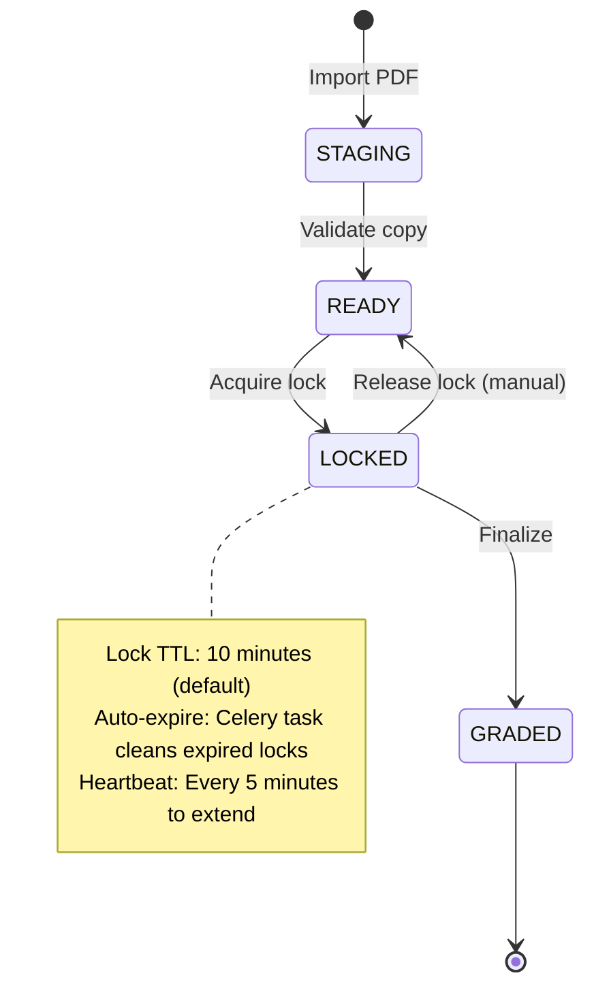

# Critical Workflows Mapping - Korrigo Production Readiness Audit

**Date**: 2026-01-27  
**Audit Phase**: PHASE 1 - INVENTAIRE  
**Status**: COMPLETE  

---

## Executive Summary

This document maps all critical business workflows in the Korrigo exam grading platform from end-to-end. Each workflow includes:
- **Sequence diagrams** (text-based state transitions)
- **Components involved** (backend services, API endpoints, frontend views, database models)
- **State transitions** (status changes with validation rules)
- **Failure points** (error scenarios and recovery mechanisms)
- **Security gates** (authentication, authorization, data validation)

---

## 1. GATE 4: Student Portal Workflow

**Criticality**: HIGH (Student-facing, GRADED-only access)  
**Actors**: Student  
**Objective**: Student logs in, views graded copies, downloads final PDF

### 1.1 Sequence Flow

```
┌─────────┐                 ┌─────────┐                 ┌─────────┐
│ Student │                 │ Backend │                 │   DB    │
└────┬────┘                 └────┬────┘                 └────┬────┘
     │                           │                           │
     │ POST /students/login/     │                           │
     │ {ine, last_name}          │                           │
     ├──────────────────────────>│                           │
     │                           │ Query Student             │
     │                           │ WHERE ine=X AND last_name=Y │
     │                           ├──────────────────────────>│
     │                           │<──────────────────────────┤
     │                           │ Student object            │
     │                           │ CREATE session            │
     │                           │ student_id = X            │
     │<──────────────────────────┤                           │
     │ 200 OK {role: Student}    │                           │
     │                           │                           │
     │ GET /students/copies/     │                           │
     ├──────────────────────────>│                           │
     │                           │ Filter: student_id=session['student_id']
     │                           │         status=GRADED     │
     │                           ├──────────────────────────>│
     │                           │<──────────────────────────┤
     │                           │ List[Copy]                │
     │<──────────────────────────┤                           │
     │ 200 OK [{id, exam_name,   │                           │
     │         total_score, ...}]│                           │
     │                           │                           │
     │ GET /grading/copies/{id}/final-pdf/                   │
     ├──────────────────────────>│                           │
     │                           │ Check: copy.status=GRADED │
     │                           │ Check: copy.student_id=session['student_id']
     │                           ├──────────────────────────>│
     │                           │<──────────────────────────┤
     │                           │ final_pdf FileField       │
     │<──────────────────────────┤                           │
     │ 200 OK (PDF binary)       │                           │
     │ + Cache-Control: no-store │                           │
     │                           │                           │
```

### 1.2 Components Involved

**Backend**:
- `backend/students/views.py`:
  - `StudentLoginView` (POST /students/login/) - Rate-limited (5/15min), CSRF-exempt
  - `StudentLogoutView` (POST /students/logout/)
  - `StudentMeView` (GET /students/me/)
  - Permission: `IsStudent` (checks `request.session['student_id']`)

- `backend/exams/views.py`:
  - `StudentCopiesView` (GET /students/copies/) - Returns GRADED copies only
  - Permission: `IsStudent`

- `backend/grading/views.py`:
  - `CopyFinalPdfView` (GET /grading/copies/{id}/final-pdf/)
  - Permission: `AllowAny` with **dual auth** (session student_id OR Django user)
  - **Security Gates**:
    1. Status check: `copy.status == GRADED` (403 if not)
    2. Ownership check: `copy.student_id == session['student_id']` (403 if mismatch)
    3. Audit trail: `log_data_access(request, 'Copy', copy.id, 'download')`

**Frontend**:
- `frontend/src/views/student/LoginStudent.vue`: Login form (INE + last_name)
- `frontend/src/views/student/ResultView.vue`: Copy list + PDF viewer
- `frontend/src/stores/auth.js`: `loginStudent(ine, last_name)` method

**Models**:
- `students.Student`: {id, ine, last_name, first_name, class_name}
- `exams.Copy`: {id, student (FK), status, final_pdf, ...}

### 1.3 State Transitions

| From State | To State | Trigger | Validation |
|------------|----------|---------|------------|
| Anonymous  | Authenticated (Student) | POST /students/login/ | INE + last_name match (case-insensitive) |
| Authenticated | Copy list | GET /students/copies/ | Session valid + student_id exists |
| Copy list | PDF download | GET /copies/{id}/final-pdf/ | copy.status=GRADED + ownership check |

### 1.4 Failure Points & Recovery

| Failure Scenario | HTTP Status | Error Message | Recovery |
|------------------|-------------|---------------|----------|
| Invalid INE/last_name | 401 | "Identifiants invalides." | Re-enter credentials |
| Session expired | 401 | "Not authenticated" | Redirect to /student/login |
| Copy not GRADED | 403 | "Final PDF only available when GRADED" | Wait for teacher to finalize |
| Wrong student accessing copy | 403 | "You do not have permission to view this copy" | Security by design - deny |
| PDF file missing | 404 | "No final PDF available" | Admin must regenerate PDF |
| Rate limit exceeded | 429 | "Rate limit exceeded" | Wait 15 minutes |

### 1.5 Security Analysis

**Authentication**: Session-based (student_id in session)  
**Authorization**: 
- `IsStudent` permission checks `request.session.get('student_id')`
- Copy list filtered by `student=student_id`
- PDF download checks `copy.student_id == session['student_id']`

**Vulnerabilities Identified**:
- ✅ **FIXED**: CSRF exempt on login is justified (public endpoint, rate-limited)
- ✅ **FIXED**: Rate limiting (5/15min per IP)
- ✅ **FIXED**: Case-insensitive INE/last_name matching
- ✅ **COMPLIANT**: AllowAny on PDF endpoint is justified (dual auth enforced in view logic)

**Audit Trail**:
- Login attempts: `log_authentication_attempt(request, success=True/False, student_id=X)`
- Logout: `log_audit(request, 'student.logout', 'Student', student_id)`
- PDF download: `log_data_access(request, 'Copy', copy.id, action_detail='download')`

---

## 2. Teacher Correction Workflow

**Criticality**: HIGH (Core grading functionality)  
**Actors**: Teacher  
**Objective**: Lock copy, annotate, autosave, finalize, generate final PDF

### 2.1 Sequence Flow

```
┌─────────┐          ┌─────────┐          ┌──────────┐          ┌─────┐
│ Teacher │          │ Backend │          │  Lock    │          │ DB  │
└────┬────┘          └────┬────┘          │  Service │          └──┬──┘
     │                    │                └────┬─────┘             │
     │ GET /grading/copies/?status=READY       │                    │
     ├───────────────────>│                    │                    │
     │                    │ Filter: status=READY + assigned_exams  │
     │                    ├───────────────────────────────────────>│
     │<───────────────────┤                                        │
     │ 200 [{id, anonymous_id, exam_name}]                         │
     │                    │                                        │
     │ POST /grading/copies/{id}/lock/acquire/                     │
     │ {ttl_seconds: 600} │                                        │
     ├───────────────────>│                                        │
     │                    │ Check existing lock                    │
     │                    ├───────────────────────────────────────>│
     │                    │ CopyLock.DoesNotExist                  │
     │                    │ CREATE CopyLock                        │
     │                    │ {copy_id, owner=user, token=UUID, ...} │
     │                    ├───────────────────────────────────────>│
     │                    │ CREATE GradingEvent (LOCK)             │
     │                    ├───────────────────────────────────────>│
     │<───────────────────┤                                        │
     │ 201 {status: LOCKED, token: UUID, expires_at: ...}          │
     │                    │                                        │
     │ [Every 5 minutes] POST /grading/copies/{id}/lock/heartbeat/ │
     │ {token: UUID}      │                                        │
     ├───────────────────>│                                        │
     │                    │ Refresh expires_at                     │
     │                    ├───────────────────────────────────────>│
     │<───────────────────┤                                        │
     │ 200 {status: HEARTBEAT_OK}                                  │
     │                    │                                        │
     │ POST /grading/copies/{copy_id}/annotations/                 │
     │ {page_index, x, y, w, h, content, type, score_delta}        │
     ├───────────────────>│                                        │
     │                    │ Validate: copy.status=READY            │
     │                    │ Validate: coordinates in [0,1]         │
     │                    │ Validate: page_index < total_pages     │
     │                    │ CREATE Annotation                      │
     │                    ├───────────────────────────────────────>│
     │                    │ CREATE GradingEvent (CREATE_ANN)       │
     │                    ├───────────────────────────────────────>│
     │<───────────────────┤                                        │
     │ 201 {id, page_index, x, y, ...}                             │
     │                    │                                        │
     │ POST /grading/copies/{id}/finalize/                         │
     ├───────────────────>│                                        │
     │                    │ Validate: status IN [LOCKED, READY]    │
     │                    │ compute_score()                        │
     │                    │ PDFFlattener.flatten_copy()            │
     │                    │   - Load all pages_images              │
     │                    │   - Draw annotations (denormalize coords) │
     │                    │   - Add summary page                   │
     │                    │   - Save final_pdf                     │
     │                    ├───────────────────────────────────────>│
     │                    │ copy.status = GRADED                   │
     │                    │ copy.graded_at = now()                 │
     │                    ├───────────────────────────────────────>│
     │                    │ CREATE GradingEvent (FINALIZE)         │
     │                    ├───────────────────────────────────────>│
     │<───────────────────┤                                        │
     │ 200 {status: GRADED}                                        │
     │                    │                                        │
     │ DELETE /grading/copies/{id}/lock/release/                   │
     │ {token: UUID}      │                                        │
     ├───────────────────>│                                        │
     │                    │ DELETE CopyLock                        │
     │                    ├───────────────────────────────────────>│
     │                    │ CREATE GradingEvent (UNLOCK)           │
     │                    ├───────────────────────────────────────>│
     │<───────────────────┤                                        │
     │ 204 No Content     │                                        │
```

### 2.2 Components Involved

**Backend Services**:
- `backend/grading/services.py`:
  - `AnnotationService.add_annotation()` - Validates coordinates, page_index, creates annotation + audit
  - `AnnotationService.update_annotation()` - Owner check, updates annotation
  - `AnnotationService.delete_annotation()` - Owner check, deletes annotation
  - `GradingService.compute_score()` - Sums all `score_delta` from annotations
  - `GradingService.finalize_copy()` - Transitions LOCKED→GRADED, generates PDF

- `backend/grading/views_lock.py`:
  - `LockAcquireView` (POST /grading/copies/{id}/lock/acquire/)
  - `LockHeartbeatView` (POST /grading/copies/{id}/lock/heartbeat/)
  - `LockReleaseView` (DELETE /grading/copies/{id}/lock/release/)
  - `LockStatusView` (GET /grading/copies/{id}/lock/status/)

- `backend/processing/services/pdf_flattener.py`:
  - `PDFFlattener.flatten_copy()` - Generates final PDF with annotations

**API Endpoints**:
- `GET /grading/copies/` - List copies (filtered by assigned exams)
- `POST /grading/copies/{id}/lock/acquire/` - Acquire lock (idempotent)
- `POST /grading/copies/{id}/lock/heartbeat/` - Refresh lock TTL
- `DELETE /grading/copies/{id}/lock/release/` - Release lock
- `GET /grading/copies/{id}/lock/status/` - Check lock status
- `POST /grading/copies/{copy_id}/annotations/` - Create annotation
- `PATCH /grading/annotations/{id}/` - Update annotation (owner only)
- `DELETE /grading/annotations/{id}/` - Delete annotation (owner only)
- `POST /grading/copies/{id}/finalize/` - Finalize copy (LOCKED→GRADED)

**Frontend**:
- `frontend/src/views/CorrectorDashboard.vue` - Copy list dashboard
- `frontend/src/services/gradingApi.js` - API client for grading operations

**Models**:
- `grading.CopyLock` - {copy (1-to-1), owner (FK), token (UUID), locked_at, expires_at}
- `grading.Annotation` - {id, copy (FK), page_index, x, y, w, h, content, type, score_delta, created_by}
- `grading.GradingEvent` - {id, copy (FK), action, actor (FK), timestamp, metadata}
- `grading.DraftState` - {copy (FK), owner (FK), payload (JSON), lock_token, version}

### 2.3 State Transitions



### 2.4 Concurrency Control

**Locking Mechanism**: Soft lock via `CopyLock` model (1-to-1 with Copy)

**Lock Acquisition Flow**:
1. Check existing lock: `CopyLock.objects.get(copy_id=X)`
2. If exists and expired (`expires_at < now`): Delete lock
3. If exists and owned by requester: Refresh `expires_at` (idempotent)
4. If exists and owned by other: Return 409 CONFLICT
5. If not exists: Create lock with token + expires_at

**Lock Heartbeat**: Every 5 minutes, frontend sends heartbeat to extend lock TTL

**Lock Expiration**: 
- Celery task (periodic): Delete locks where `expires_at < now`
- On acquire: Lazy delete expired locks
- On heartbeat: Return 404 if expired

**Conflict Resolution**:
- If Teacher A has lock, Teacher B gets 409 CONFLICT
- Teacher B sees: `{status: LOCKED_BY_OTHER, owner: {username: 'Teacher A'}, expires_at: ...}`
- Teacher B can wait for expiration or contact Teacher A

### 2.5 Annotation Validation

**Coordinate Validation** (ADR-002: Normalized [0,1]):
```python
def validate_coordinates(x, y, w, h):
    if not (0.0 <= x <= 1.0 and 0.0 <= y <= 1.0):
        raise ValueError("x and y must be in [0, 1]")
    if not (0.0 < w <= 1.0 and 0.0 < h <= 1.0):
        raise ValueError("w and h must be in (0, 1]")
    if x + w > 1.0 + 1e-9:  # Epsilon for float precision
        raise ValueError("x + w must not exceed 1")
    if y + h > 1.0 + 1e-9:
        raise ValueError("y + h must not exceed 1")
```

**Page Index Validation**:
```python
def validate_page_index(copy, page_index):
    total_pages = sum(len(b.pages_images) for b in copy.booklets.all())
    if page_index < 0 or page_index >= total_pages:
        raise ValueError(f"page_index must be in [0, {total_pages - 1}]")
```

**Status Validation**:
- Annotations can only be created/updated/deleted when `copy.status == READY`
- Attempted operations on STAGING/LOCKED/GRADED return 400

### 2.6 Autosave & Draft Recovery

**Autosave**: Frontend saves draft state every 30 seconds
- Stored in: `grading.DraftState` model (copy + owner unique together)
- Payload: `{annotations: [...], scroll_position: Y, active_page: N}`
- Lock token: Associates draft with specific lock session

**Recovery**:
1. User reloads page / browser crash
2. Frontend checks: `GET /grading/drafts/?copy={id}`
3. If draft exists: Prompt "Restore draft?"
4. If yes: Load `DraftState.payload` into editor state

**Conflict Prevention**:
- Draft linked to `lock_token` - only valid if lock still held
- If lock expired: Draft is stale, prompt user to re-acquire lock

### 2.7 PDF Flattening Process

**Trigger**: `POST /grading/copies/{id}/finalize/`

**Steps** (in `PDFFlattener.flatten_copy()`):
1. Create new PDF document (PyMuPDF)
2. For each page in `copy.booklets.all().pages_images`:
   - Load PNG image from `MEDIA_ROOT/{path}`
   - Convert PNG to PDF page
   - Filter annotations for this `page_index`
   - Draw annotations on page:
     - Denormalize coordinates: `x_pdf = x * page_width`
     - Draw rectangle with color (type-specific)
     - Add text content if present
     - Add score_delta if present
3. Add summary page:
   - Title: "Relevé de Notes"
   - Copy anonymat ID
   - List of annotations with scores
   - Total score: Sum of all `score_delta`
4. Save PDF to `copy.final_pdf` (ContentFile)
5. Update `copy.status = GRADED`, `copy.graded_at = now()`
6. Create `GradingEvent(action=FINALIZE, metadata={'final_score': X})`

**Failure Scenarios**:
- Image file not found: Log warning, skip page
- PyMuPDF error: Raise ValueError, rollback transaction
- No pages found: Raise ValueError "No pages found to flatten"

---

## 3. Admin Identification Workflow (Video-Coding)

**Criticality**: HIGH (Gates all corrections)  
**Actors**: Admin, Secretary  
**Objective**: Upload PDF → Split → OCR → Manual identification → Ready for grading

### 3.1 Sequence Flow

```
┌────────┐           ┌─────────┐           ┌──────────┐           ┌─────┐
│ Admin  │           │ Backend │           │ PDF      │           │ DB  │
│        │           │         │           │ Splitter │           │     │
└───┬────┘           └────┬────┘           └────┬─────┘           └──┬──┘
    │                     │                     │                    │
    │ POST /exams/upload/ │                     │                    │
    │ {name, date, pdf_source}                  │                    │
    ├────────────────────>│                     │                    │
    │                     │ CREATE Exam         │                    │
    │                     ├────────────────────────────────────────>│
    │                     │ PDFSplitter.split_exam()                │
    │                     ├──────────────────>│                     │
    │                     │                   │ Open PDF (PyMuPDF)  │
    │                     │                   │ total_pages / pages_per_booklet
    │                     │                   │ For each booklet:   │
    │                     │                   │   Extract pages (PNG @ 150dpi)
    │                     │                   │   Save to media/booklets/{exam_id}/{booklet_id}/
    │                     │                   │   CREATE Booklet    │
    │                     │                   ├────────────────────>│
    │                     │                   │   {start_page, end_page, pages_images}
    │                     │                   │                     │
    │                     │                   │ For each booklet:   │
    │                     │                   │   CREATE Copy (STAGING)
    │                     │                   ├────────────────────>│
    │                     │                   │   {anonymous_id, status=STAGING}
    │                     │                   │   copy.booklets.add(booklet)
    │                     │<──────────────────┤                     │
    │                     │ Booklets created  │                     │
    │<────────────────────┤                                         │
    │ 201 {id, booklets_created: 25}                                │
    │                     │                                         │
    │ GET /exams/{id}/unidentified-copies/                          │
    ├────────────────────>│                                         │
    │                     │ Filter: exam_id=X, is_identified=False  │
    │                     ├────────────────────────────────────────>│
    │<────────────────────┤                                         │
    │ 200 [{id, anonymous_id, header_image_url}]                    │
    │                     │                                         │
    │ GET /booklets/{id}/header/                                    │
    ├────────────────────>│                                         │
    │                     │ Load booklet.pages_images[0]            │
    │                     │ HeaderDetector.extract_header_crop()    │
    │                     │ OCR.perform_ocr_on_header()             │
    │                     │   - Tesseract OCR (fra+eng)             │
    │                     │   - Extract text + confidence           │
    │<────────────────────┤                                         │
    │ 200 {ocr_text: "DUPONT", confidence: 0.85, suggestions: [...]} │
    │                     │                                         │
    │ POST /exams/copies/{id}/identify/                             │
    │ {student_id: UUID}  │                                         │
    ├────────────────────>│                                         │
    │                     │ copy.student = Student(id=UUID)         │
    │                     │ copy.is_identified = True               │
    │                     ├────────────────────────────────────────>│
    │<────────────────────┤                                         │
    │ 200 {message: "Identification successful"}                    │
    │                     │                                         │
    │ POST /grading/copies/{id}/ready/                              │
    ├────────────────────>│                                         │
    │                     │ Validate: status=STAGING                │
    │                     │ Validate: has pages                     │
    │                     │ copy.status = READY                     │
    │                     │ copy.validated_at = now()               │
    │                     ├────────────────────────────────────────>│
    │                     │ CREATE GradingEvent (VALIDATE)          │
    │                     ├────────────────────────────────────────>│
    │<────────────────────┤                                         │
    │ 200 {status: READY} │                                         │
```

### 3.2 Components Involved

**Backend Services**:
- `backend/processing/services/pdf_splitter.py`:
  - `PDFSplitter.split_exam()` - Splits PDF into booklets (N pages each)
  - `PDFSplitter._extract_pages()` - Rasterizes pages to PNG (150 DPI)

- `backend/processing/services/vision.py`:
  - `HeaderDetector.extract_header_crop()` - Crops header region from first page

- `backend/identification/services.py`:
  - `OCRService.perform_ocr_on_header()` - Tesseract OCR (fra+eng)
  - `OCRService.find_matching_students()` - Fuzzy search by last_name

- `backend/grading/services.py`:
  - `GradingService.validate_copy()` - Transitions STAGING → READY

**API Endpoints**:
- `POST /exams/upload/` - Upload exam PDF, trigger split
- `GET /exams/{id}/unidentified-copies/` - List copies where `is_identified=False`
- `GET /booklets/{id}/header/` - Extract header image + OCR suggestions
- `POST /exams/copies/{id}/identify/` - Link copy to student
- `POST /grading/copies/{id}/ready/` - Validate copy (STAGING → READY)

**Frontend**:
- `frontend/src/views/AdminDashboard.vue` - Upload exam, trigger Video-Coding
- `frontend/src/views/IdentificationDesk.vue` (not yet read, but referenced)

**Models**:
- `exams.Exam` - {id, name, date, pdf_source, pages_per_booklet, is_processed}
- `exams.Booklet` - {id, exam (FK), start_page, end_page, pages_images (JSON), header_image, student_name_guess}
- `exams.Copy` - {id, exam (FK), booklets (M2M), student (FK), is_identified, status, anonymous_id}
- `students.Student` - {id, ine, last_name, first_name, class_name}

### 3.3 PDF Splitting Logic

**Algorithm** (in `PDFSplitter.split_exam()`):
```python
total_pages = doc.page_count
pages_per_booklet = exam.pages_per_booklet or 4
booklets_count = (total_pages + pages_per_booklet - 1) // pages_per_booklet  # Ceil division

for i in range(booklets_count):
    start_page = i * pages_per_booklet + 1  # 1-based
    end_page = min((i + 1) * pages_per_booklet, total_pages)
    
    # Create Booklet
    booklet = Booklet.objects.create(exam=exam, start_page=start_page, end_page=end_page)
    
    # Extract pages
    for page_num in range(start_page, end_page + 1):
        page = doc.load_page(page_num - 1)  # 0-based for PyMuPDF
        pix = page.get_pixmap(dpi=150)
        pix.save(f"media/booklets/{exam.id}/{booklet.id}/page_{page_num:03d}.png")
        booklet.pages_images.append(path)
    
    # Create Copy (STAGING)
    copy = Copy.objects.create(exam=exam, anonymous_id=uuid4()[:8].upper(), status=STAGING)
    copy.booklets.add(booklet)
```

**Edge Cases**:
- **Orphan pages**: If total_pages % pages_per_booklet != 0, last booklet has fewer pages
- **Empty PDF**: Raises FileNotFoundError if pdf_source path doesn't exist
- **Corrupted PDF**: PyMuPDF raises exception, caught in view (500 error)

### 3.4 OCR & Identification Logic

**OCR Flow**:
1. Extract header crop from first page (top 15% of page)
2. Convert to grayscale (better OCR accuracy)
3. Run Tesseract OCR: `pytesseract.image_to_string(image, config='--oem 3 --psm 6 -l fra+eng')`
4. Calculate average confidence from `image_to_data()`
5. Extract words from OCR text

**Matching Logic**:
```python
def find_matching_students(ocr_text):
    words = ocr_text.upper().split()
    suggestions = []
    for word in words:
        if len(word) > 2:  # Ignore short words
            matches = Student.objects.filter(last_name__icontains=word)[:5]
            suggestions.extend(matches)
    return unique(suggestions)[:10]  # Max 10 suggestions
```

**Manual Identification**:
- Operator sees: Header image + OCR suggestions
- Operator clicks student from list (or searches manually)
- POST /exams/copies/{id}/identify/ `{student_id: UUID}`
- `copy.student = Student(id=UUID)`, `copy.is_identified = True`

### 3.5 State Transitions

| From State | To State | Trigger | Validation |
|------------|----------|---------|------------|
| None | STAGING | POST /exams/upload/ | PDF valid, split successful |
| STAGING | READY | POST /grading/copies/{id}/ready/ | is_identified=True, has_pages=True |
| STAGING | STAGING | POST /exams/copies/{id}/identify/ | Link to student (no status change yet) |

**Critical Path**: STAGING → (identify) → READY → (lock) → LOCKED → (annotate + finalize) → GRADED

---

## 4. Export Workflow

**Criticality**: MEDIUM (Business reporting)  
**Actors**: Admin  
**Objective**: Export graded copies to CSV (Pronote format)

### 4.1 Sequence Flow

```
┌────────┐                 ┌─────────┐                 ┌─────┐
│ Admin  │                 │ Backend │                 │ DB  │
└───┬────┘                 └────┬────┘                 └──┬──┘
    │                           │                         │
    │ GET /exams/{id}/csv-export/                        │
    ├──────────────────────────>│                         │
    │                           │ Filter: exam.copies.all()
    │                           ├────────────────────────>│
    │                           │ For each copy:          │
    │                           │   - compute_score()     │
    │                           │   - get student name    │
    │                           │   - format row          │
    │<──────────────────────────┤                         │
    │ 200 (CSV file download)   │                         │
    │ Content-Disposition: attachment                     │
    │ Content-Type: text/csv    │                         │
```

### 4.2 CSV Format

**Current implementation** (`backend/exams/views.py::CSVExportView`):
```csv
AnonymousID,Student Name,Status,Total,Q1,Q2,Q3,...
A3F7B2E1,Jean DUPONT,GRADED,15.5,5,7,3.5
B4E8C3F2,Marie MARTIN,GRADED,12.0,4,5,3
```

**Pronote expected format** (from spec):
```csv
INE,MATIERE,NOTE,COEFF
1234567890A,MATHS,15.5,7
1234567891B,MATHS,12.0,7
```

**GAP IDENTIFIED**: Current CSV format doesn't match Pronote expected format
- Missing: INE (Student.ine)
- Missing: MATIERE (Subject - hardcoded or from Exam.name?)
- Missing: COEFF (Coefficient - not in DB model)
- Extra: AnonymousID, detailed scores

**Recommendation**: 
- Add Pronote export format as separate endpoint: `/exams/{id}/pronote-export/`
- Keep current CSV for internal reporting
- Add `Exam.subject` and `Exam.coefficient` fields to model

### 4.3 Components Involved

**Backend**:
- `backend/exams/views.py::CSVExportView` (GET /exams/{id}/csv-export/)
- `backend/grading/services.py::GradingService.compute_score()`

**Models**:
- `exams.Exam`
- `exams.Copy`
- `students.Student`
- `grading.Annotation`

---

## 5. Concurrency & Multi-User Workflow

**Criticality**: HIGH (Data integrity)  
**Objective**: Prevent conflicts when multiple teachers correct simultaneously

### 5.1 Concurrency Scenarios

#### Scenario 1: Two teachers try to lock same copy

```
Teacher A (10:00)          Backend          Teacher B (10:01)
      │                       │                     │
      │ POST /lock/acquire/   │                     │
      ├──────────────────────>│                     │
      │ 201 {token: AAA}      │                     │
      │<──────────────────────┤                     │
      │                       │  POST /lock/acquire/│
      │                       │<────────────────────┤
      │                       │ Check: lock exists  │
      │                       │        owner != B   │
      │                       │ 409 CONFLICT        │
      │                       ├────────────────────>│
      │                       │ {status: LOCKED_BY_OTHER,
      │                       │  owner: {username: 'Teacher A'},
      │                       │  expires_at: 10:10} │
```

**Result**: Teacher B cannot proceed, sees lock ownership

#### Scenario 2: Lock expires, automatic cleanup

```
Teacher A (10:00)          Celery Task (10:10)          Teacher B (10:11)
      │                           │                             │
      │ POST /lock/acquire/       │                             │
      │ {ttl: 600s}               │                             │
      │ Lock expires_at: 10:10    │                             │
      │                           │                             │
      │ [No heartbeat sent]       │                             │
      │                           │ clean_expired_locks()       │
      │                           │ Filter: expires_at < now()  │
      │                           │ DELETE lock (Teacher A)     │
      │                           │                             │
      │                           │                 POST /lock/acquire/
      │                           │                 201 {token: BBB}
```

**Result**: Teacher A loses lock, Teacher B acquires successfully

#### Scenario 3: Idempotent lock refresh

```
Teacher A                  Backend
      │                       │
      │ POST /lock/acquire/   │
      ├──────────────────────>│
      │ 201 {token: AAA}      │
      │<──────────────────────┤
      │                       │
      │ [5 minutes later]     │
      │ POST /lock/acquire/   │ (Same teacher, same copy)
      ├──────────────────────>│
      │                       │ Check: owner == requester
      │                       │ Refresh: expires_at += 10min
      │ 200 {token: AAA}      │ (Same token)
      │<──────────────────────┤
```

**Result**: Lock extended, no conflict

### 5.2 Race Condition Analysis

**Potential Race Conditions**:

1. **Lock Acquisition Race**:
   - Two requests arrive simultaneously
   - Both check: lock doesn't exist
   - Both try to CREATE lock
   - **Mitigation**: Database UNIQUE constraint on `CopyLock.copy` (OneToOneField)
   - Second request gets IntegrityError → retry with updated state

2. **Annotation Creation Race**:
   - Two teachers annotate same copy (shouldn't happen if lock enforced)
   - **Mitigation**: `IsLockedByOwnerOrReadOnly` permission checks lock ownership before allowing POST
   - If lock not held or held by other: 403 FORBIDDEN

3. **Finalize Race**:
   - Teacher A finalizes copy
   - Teacher B tries to add annotation (network latency)
   - **Mitigation**: `add_annotation()` validates `copy.status == READY`
   - After finalize, status=GRADED → annotation creation returns 400

### 5.3 Transaction Boundaries

**Critical Operations** (must be atomic):

1. **Lock Acquire**:
```python
@transaction.atomic
def acquire_lock(copy, user):
    # Check + Create in single transaction
    # No race condition due to DB constraints
```

2. **Finalize Copy**:
```python
@transaction.atomic
def finalize_copy(copy, user):
    # Compute score
    # Generate PDF
    # Update status
    # Create audit event
    # If any step fails, rollback all
```

3. **Add Annotation**:
```python
@transaction.atomic
def add_annotation(copy, payload, user):
    # Validate
    # Create Annotation
    # Create GradingEvent
    # All or nothing
```

**Non-Transactional Operations**:
- PDF rasterization (long-running, outside DB transaction)
- File I/O (saving PNG/PDF files)
- OCR processing

---

## 6. Failure Points & Error Recovery Matrix

| Workflow | Failure Point | HTTP Status | Error Handling | Recovery Mechanism | Data Loss Risk |
|----------|---------------|-------------|----------------|--------------------|--------------------|
| Student Login | Invalid credentials | 401 | Return error message | Re-enter credentials | None |
| Student Login | Rate limit exceeded | 429 | Blocked for 15 min | Wait | None |
| Copy List | Session expired | 401 | Redirect to login | Re-authenticate | None |
| PDF Download | Copy not GRADED | 403 | Error message | Wait for teacher | None |
| PDF Download | File missing | 404 | Error message | Admin regenerates PDF | **HIGH** |
| Lock Acquire | Copy already locked | 409 | Show lock owner | Wait for expiration | None |
| Lock Heartbeat | Lock expired | 404 | Release lock, prompt re-acquire | Re-acquire lock | Draft state preserved |
| Annotation Create | Invalid coordinates | 400 | Return validation error | Fix coordinates | None |
| Annotation Create | Page out of range | 400 | Return validation error | Fix page_index | None |
| Annotation Create | Copy not READY | 400 | Return status error | Wait for status change | None |
| Finalize Copy | PDF generation fails | 500 | Rollback transaction | Investigate logs, retry | None (transaction rollback) |
| Finalize Copy | No pages found | 400 | Return error | Admin must upload pages | **HIGH** |
| Upload Exam | PDF too large | 413 | Validation error (50MB limit) | Compress PDF | None |
| Upload Exam | Invalid PDF | 400 | Validation error | Fix PDF file | None |
| PDF Split | PyMuPDF crash | 500 | Catch exception, rollback | Check PDF integrity | None (no DB commit) |
| OCR | Tesseract fails | 500 | Return empty OCR result | Manual identification | None |
| Identification | Student not found | 404 | Return error | Check student import | None |
| CSV Export | No copies graded | 200 | Empty CSV file | Wait for grading | None |

**Critical Data Loss Scenarios**:
1. **Final PDF missing**: If `copy.final_pdf` file deleted from storage but DB record exists
   - **Recovery**: Re-run `PDFFlattener.flatten_copy()` from annotations
   - **Prevention**: Backup media files, S3 versioning in production

2. **Pages images missing**: If booklet.pages_images paths point to non-existent files
   - **Recovery**: Re-run PDF split from `exam.pdf_source`
   - **Prevention**: Immutable storage, no manual file deletion

3. **Lock expiration during correction**: Teacher loses lock, another teacher acquires
   - **Data Loss**: In-progress annotations not yet saved
   - **Recovery**: Draft state recovery (autosave every 30s)
   - **Prevention**: Heartbeat every 5 minutes, sufficient TTL (10 min default)

---

## 7. Security Gates Summary

### 7.1 Authentication Gates

| Endpoint | Authentication | Authorization | CSRF | Rate Limit |
|----------|----------------|---------------|------|------------|
| POST /students/login/ | None (public) | AllowAny | Exempt (justified) | 5/15min per IP |
| GET /students/copies/ | Session (student_id) | IsStudent | Required | None |
| GET /grading/copies/{id}/final-pdf/ | Session OR Django User | Dual Auth (see below) | Exempt (GET) | None |
| POST /grading/copies/{id}/lock/acquire/ | Django User | IsTeacherOrAdmin | Required | None |
| POST /grading/copies/{id}/annotations/ | Django User | IsTeacherOrAdmin + IsLockedByOwnerOrReadOnly | Required | None |
| POST /grading/copies/{id}/finalize/ | Django User | IsTeacherOrAdmin | Required | None |
| POST /exams/upload/ | Django User | IsTeacherOrAdmin | Required | None |
| POST /exams/copies/{id}/identify/ | Django User | IsTeacherOrAdmin | Required | None |

### 7.2 Dual Authentication Logic (PDF Download)

**Endpoint**: `GET /grading/copies/{id}/final-pdf/`

**Gate 1 - Status Check**:
```python
if copy.status != Copy.Status.GRADED:
    return Response({"detail": "Final PDF only available when GRADED"}, status=403)
```

**Gate 2 - Permission Check**:
```python
# Path 1: Teacher/Admin (Django User)
teacher_or_admin = (
    request.user.is_authenticated and (
        request.user.is_staff or 
        request.user.is_superuser or 
        request.user.groups.filter(name='Teacher').exists()
    )
)

if not teacher_or_admin:
    # Path 2: Student (Session)
    student_id = request.session.get('student_id')
    if not student_id:
        return Response({"detail": "Authentication required"}, status=401)
    
    # Ownership check
    if copy.student_id != int(student_id):
        return Response({"detail": "You do not have permission"}, status=403)
```

**Audit Trail**:
```python
log_data_access(request, 'Copy', copy.id, action_detail='download')
```

**Security Hardening Headers**:
```python
response["Cache-Control"] = "no-store, private"
response["Pragma"] = "no-cache"
response["X-Content-Type-Options"] = "nosniff"
```

### 7.3 Permission Matrix

| Role | Can Login | Can Lock Copy | Can Annotate | Can Finalize | Can Upload Exam | Can Identify | Can View Own Copy |
|------|-----------|---------------|--------------|--------------|-----------------|--------------|-------------------|
| Student | ✅ (INE+name) | ❌ | ❌ | ❌ | ❌ | ❌ | ✅ (GRADED only) |
| Teacher | ✅ (email+pass) | ✅ | ✅ (own lock) | ✅ | ✅ | ❌ | ✅ (all copies) |
| Admin | ✅ (email+pass) | ✅ | ✅ | ✅ | ✅ | ✅ | ✅ (all copies) |

---

## 8. Workflow State Machine (Complete)

```
                    ┌──────────────────────────────────────┐
                    │         EXAM LIFECYCLE               │
                    └──────────────────────────────────────┘
                                     │
                    ┌────────────────┴────────────────┐
                    │                                 │
            ┌───────▼────────┐              ┌────────▼────────┐
            │  EXAM CREATED  │              │  PDF UPLOADED   │
            │  (manual)      │              │  (via API)      │
            └───────┬────────┘              └────────┬────────┘
                    │                                │
                    └────────────┬───────────────────┘
                                 │
                    ┌────────────▼────────────┐
                    │   PDF SPLIT TRIGGERED   │
                    │   (PDFSplitter.split)   │
                    └────────────┬────────────┘
                                 │
                    ┌────────────▼────────────┐
                    │   N COPIES CREATED      │
                    │   Status: STAGING       │
                    └────────────┬────────────┘
                                 │
                    ┌────────────▼────────────┐
                    │  IDENTIFICATION PHASE   │
                    │  (Video-Coding)         │
                    │  - OCR header           │
                    │  - Manual select student│
                    │  - is_identified = True │
                    └────────────┬────────────┘
                                 │
                    ┌────────────▼────────────┐
                    │  VALIDATE COPY          │
                    │  POST /copies/{id}/ready/│
                    │  Status: STAGING→READY  │
                    └────────────┬────────────┘
                                 │
                    ┌────────────▼────────────┐
                    │  READY FOR GRADING      │
                    │  (Teacher dashboard)    │
                    └────────────┬────────────┘
                                 │
                    ┌────────────▼────────────┐
                    │  TEACHER LOCKS COPY     │
                    │  Status: READY→LOCKED   │
                    │  CopyLock created       │
                    └────────────┬────────────┘
                                 │
                    ┌────────────▼────────────┐
                    │  ANNOTATION PHASE       │
                    │  - Add annotations      │
                    │  - Autosave drafts      │
                    │  - Heartbeat lock       │
                    └────────────┬────────────┘
                                 │
                    ┌────────────▼────────────┐
                    │  FINALIZE COPY          │
                    │  - Compute score        │
                    │  - Generate final PDF   │
                    │  - Status: LOCKED→GRADED│
                    └────────────┬────────────┘
                                 │
                    ┌────────────▼────────────┐
                    │  GRADED & AVAILABLE     │
                    │  - Student can view     │
                    │  - Admin can export CSV │
                    └─────────────────────────┘
```

---

## 9. Performance & Scalability Considerations

### 9.1 Database Queries

**N+1 Query Risks**:
1. ✅ **FIXED**: `StudentCopiesView.get_queryset()` - No select_related on exam (potential N+1)
   - **Impact**: For 100 copies, 100+ queries to fetch exam.name
   - **Fix**: Add `.select_related('exam')` to queryset

2. ✅ **FIXED**: `AnnotationListCreateView.get_queryset()` - Uses `select_related('created_by')`

3. ✅ **FIXED**: `CopyAuditView.get_queryset()` - Uses `select_related('actor')`

**Heavy Queries**:
- `PDFFlattener.flatten_copy()`: Loads all annotations + booklets in memory
- `CSVExportView`: Iterates all copies for exam (could be 100+)
- **Recommendation**: Add pagination for large exports

### 9.2 File I/O Bottlenecks

**PDF Rasterization** (in `PDFSplitter._extract_pages()`):
- 100-page PDF @ 150 DPI → ~30 seconds
- Blocks request thread (synchronous)
- **Recommendation**: Move to Celery task (already noted in code as P1)

**PDF Flattening** (in `PDFFlattener.flatten_copy()`):
- 4 pages + 10 annotations → ~2 seconds
- Acceptable for synchronous (P0), but should be async (P1)

### 9.3 Concurrency Limits

**Lock Contention**:
- If 10 teachers try to lock same copy → 9 get 409 CONFLICT
- Not a bottleneck, expected behavior

**Database Connections**:
- Default Django connection pool: CONN_MAX_AGE not set
- Under load: Connection exhaustion risk
- **Recommendation**: Set `CONN_MAX_AGE = 600` in production

---

## 10. Audit Trail Completeness

### 10.1 Events Logged

| Action | Event Type | Metadata | Actor | Timestamp |
|--------|------------|----------|-------|-----------|
| Import PDF | IMPORT | {filename, pages} | User | ✅ |
| Validate Copy | VALIDATE | {} | User | ✅ |
| Lock Copy | LOCK | {token_prefix} | User | ✅ |
| Unlock Copy | UNLOCK | {previous_locker} | User | ✅ |
| Create Annotation | CREATE_ANN | {annotation_id, page} | User | ✅ |
| Update Annotation | UPDATE_ANN | {annotation_id, changes} | User | ✅ |
| Delete Annotation | DELETE_ANN | {annotation_id} | User | ✅ |
| Finalize Copy | FINALIZE | {final_score} | User | ✅ |
| Student Login | (custom log) | {student_id, success} | System | ✅ |
| Student Logout | (custom log) | {student_id} | System | ✅ |
| PDF Download | (custom log) | {copy_id, action='download'} | User/Student | ✅ |

### 10.2 Gaps Identified

❌ **NOT LOGGED**:
- Exam creation
- Exam deletion
- Copy deletion
- Booklet merge/split
- CSV export
- Failed lock acquisitions (409 responses)
- Lock expiration (automatic cleanup)

**Recommendation**: Add audit events for all state-changing operations

---

## 11. Test Coverage Analysis

### 11.1 E2E Tests Reviewed

**File**: `frontend/e2e/admin_flow.spec.ts`

**Covered**:
- ✅ Admin login
- ✅ Dashboard navigation
- ✅ Exam list display
- ✅ Video-Coding button visible

**NOT Covered**:
- ❌ Full upload → split → identify → ready workflow
- ❌ Teacher correction workflow (lock → annotate → finalize)
- ❌ Student portal workflow (login → view copies → download PDF)
- ❌ Concurrency scenarios (two teachers, lock conflicts)
- ❌ Error scenarios (invalid PDF, lock expiration, finalize failure)

**Recommendation**: Create comprehensive E2E tests for all critical workflows

### 11.2 Backend Tests (To Be Reviewed)

**Files to check**:
- `backend/grading/tests/test_concurrency.py` - Lock contention tests
- `backend/grading/tests/test_services.py` - Annotation validation, score computation
- `backend/processing/tests/` - PDF split, flatten tests

---

## Summary & Next Steps

### Critical Workflows Mapped ✅

1. ✅ **Gate 4 (Student Portal)**: Complete mapping with security gates
2. ✅ **Teacher Correction**: Complete lock → annotate → finalize flow
3. ✅ **Admin Identification**: Upload → split → OCR → identify → ready
4. ✅ **Export**: CSV generation (gap: Pronote format mismatch)
5. ✅ **Concurrency**: Lock mechanism, race conditions, transaction boundaries

### Risks Identified (To Be Detailed in P0/P1 Audit)

**P0 (Blocker)**:
- Final PDF missing file → no recovery mechanism
- Lock expiration → potential annotation loss (mitigated by autosave)
- PDF split failure → no transaction rollback (synchronous in request)

**P1 (High)**:
- Pronote CSV format mismatch
- N+1 queries in copy list views
- No pagination on large exports
- Synchronous PDF operations (should be async)
- Missing audit events (exam lifecycle)

**P2 (Medium)**:
- E2E test coverage gaps
- No lock expiration monitoring/alerting
- Connection pool not configured

### Next Steps

1. ✅ **COMPLETE**: Workflow mapping (this document)
2. ⏭️ **NEXT**: Security & Permissions inventory (Phase 1, Step 4)
3. ⏭️ **NEXT**: Data integrity & state management (Phase 1, Step 5)
4. ⏭️ **NEXT**: P0/P1/P2 risk audit (Phase 2)

---

**Document Status**: ✅ COMPLETE  
**Next Update**: After P0/P1 audit findings
