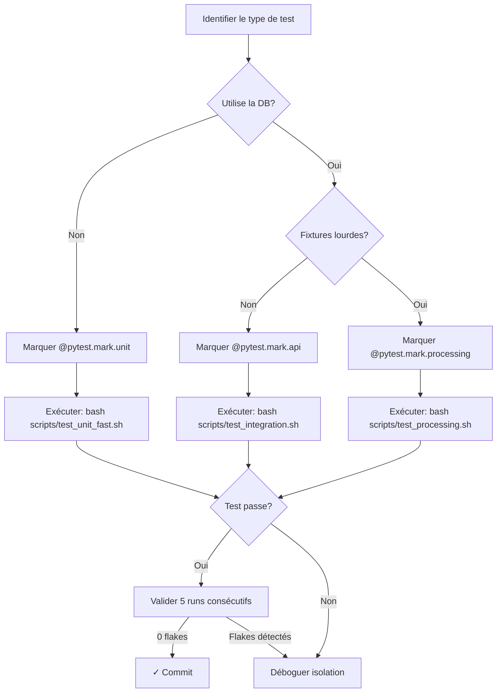

# Guide des Tests Parallèles - Korrigo PMF

> **Version**: 1.0  
> **Date**: Février 2026  
> **Public**: Développeurs contributeurs  

Ce guide explique comment travailler avec la suite de tests parallèles de Korrigo, comment ajouter de nouveaux tests sans compromettre la stabilité, et comment déboguer les tests instables.

---

## 📋 Table des Matières

1. [Vue d'Ensemble](#vue-densemble)
2. [Organisation des Suites de Tests](#organisation-des-suites-de-tests)
3. [Comment Ajouter un Test](#comment-ajouter-un-test)
4. [Meilleures Pratiques](#meilleures-pratiques)
5. [Isolation et Parallélisme](#isolation-et-parallélisme)
6. [Déboguer les Tests Flaky](#déboguer-les-tests-flaky)
7. [Exemples de Patterns Corrects](#exemples-de-patterns-corrects)
8. [Pièges Courants et Solutions](#pièges-courants-et-solutions)

---

## Vue d'Ensemble

### Architecture de Tests Parallèles

La suite de tests Korrigo est organisée en **4 suites indépendantes** exécutables en parallèle:

```
┌─────────────────────────────────────────────────────────────┐
│                  Parallel Test Execution                    │
├─────────────────────────────────────────────────────────────┤
│                                                             │
│  ┌──────────────┐  ┌──────────────┐  ┌──────────────┐     │
│  │ Suite 1:     │  │ Suite 2:     │  │ Suite 3:     │     │
│  │ Unit-Fast    │  │ Integration  │  │ Processing   │     │
│  │ (8 workers)  │  │ (4 workers)  │  │ (2 workers)  │     │
│  │              │  │              │  │              │     │
│  │ No DB        │  │ DB Isolated  │  │ DB + Media   │     │
│  │ <10s total   │  │ Per Worker   │  │ Isolated     │     │
│  └──────────────┘  └──────────────┘  └──────────────┘     │
│                                                             │
│  ┌─────────────────────────────────────────────────────┐   │
│  │ Suite 4: E2E (Playwright)                           │   │
│  │ Workers: 2-4 | Backend: Shared                     │   │
│  └─────────────────────────────────────────────────────┘   │
└─────────────────────────────────────────────────────────────┘
```

### Bénéfices

- ✅ **Feedback rapide**: Tests unitaires en <10s
- ✅ **Stabilité**: Isolation complète entre workers (DB, media, transactions)
- ✅ **Scalabilité**: Utilisation optimale des CPU multi-core
- ✅ **Zero flakes**: 0 test instable sur 5 runs consécutifs (validé)

### Technologies

- **Backend**: `pytest` + `pytest-xdist` (parallélisation) + `pytest-django` (isolation DB)
- **Frontend E2E**: Playwright (`fullyParallel: true`)
- **CI**: GitHub Actions avec matrices de jobs parallèles

---

## Organisation des Suites de Tests

### Suite 1: Unit-Fast (Backend)

**Critères d'inclusion:**
- Pas d'accès base de données (ou entièrement mocké)
- Pas d'I/O fichier (sauf `tempfile`)
- Tests de logique métier pure
- Exécution < 1s par fichier

**Marqueur pytest:**
```python
@pytest.mark.unit
def test_validation_logic():
    """Test pure business logic without external dependencies."""
    result = validate_grade_format("18.5/20")
    assert result == {"score": 18.5, "total": 20}
```

**Exécution:**
```bash
bash scripts/test_unit_fast.sh
# Équivalent à: pytest -n 8 -m unit --dist=loadscope -v
```

**Workers:** 8 (CPU-bound, pas de contention)  
**Durée cible:** <10s total

---

### Suite 2: Integration-API (Backend)

**Critères d'inclusion:**
- Tests utilisant la base de données Django
- Tests d'endpoints REST API (APIClient)
- Tests de workflows métier avec ORM
- **Pas** de fixtures PDF/images lourdes

**Marqueur pytest:**
```python
@pytest.mark.api
def test_create_exam_endpoint(authenticated_client, db):
    """Test API endpoint with database access."""
    payload = {"name": "Final Exam", "date": "2026-02-15"}
    response = authenticated_client.post("/api/exams/", payload)
    assert response.status_code == 201
    assert Exam.objects.filter(name="Final Exam").exists()
```

**Exécution:**
```bash
bash scripts/test_integration.sh
# Équivalent à: pytest -n 4 -m api --dist=loadscope -v
```

**Workers:** 4 (balance DB contention vs parallélisme)  
**Isolation:** Chaque worker a sa propre DB test (`test_viatique_gw0`, `test_viatique_gw1`, etc.)

---

### Suite 3: Processing (Backend)

**Critères d'inclusion:**
- Tests utilisant des fixtures PDF/images
- Traitement lourd (PyMuPDF, OpenCV, Tesseract OCR)
- I/O fichiers intensif
- Tests de validation de documents

**Marqueur pytest:**
```python
@pytest.mark.processing
def test_pdf_split_a3_to_a4(mock_media):
    """Test PDF processing with real fixtures."""
    input_pdf = Path("fixtures/sample_a3.pdf")
    output_dir = mock_media / "split"
    
    splitter = PDFSplitter()
    result = splitter.split_a3_to_a4(input_pdf, output_dir)
    
    assert len(result) == 4  # 2 pages A3 → 4 pages A4
    assert all(p.exists() for p in result)
```

**Exécution:**
```bash
bash scripts/test_processing.sh
# Équivalent à: pytest -n 2 -m processing --dist=loadscope -v
```

**Workers:** 2 (I/O bound, bénéfice limité du parallélisme)  
**Isolation:** DB + Media directory isolés par worker

---

### Suite 4: E2E (Playwright)

**Critères d'inclusion:**
- Tests full-stack avec navigateur
- Workflows utilisateur complets
- Dépendent de Docker Compose + seed data

**Fichiers:**
```typescript
// frontend/tests/e2e/student_flow.spec.ts
import { test, expect } from '@playwright/test';

test('Student can view their exam results', async ({ page }) => {
    await page.goto('/student/login');
    await page.fill('[name="identifier"]', 'S001');
    await page.click('button[type="submit"]');
    
    await expect(page.locator('.exam-result')).toBeVisible();
});
```

**Exécution:**
```bash
cd frontend
npx playwright test --workers=2
# Ou via Docker: bash tools/e2e.sh
```

**Workers:** 2 (local), 4 (CI)  
**Setup:** Global setup valide backend health + environnement

---

## Comment Ajouter un Test

### Workflow Recommandé



### Étapes Détaillées

#### 1. Choisir le Bon Marqueur

**Règle de décision:**

| Condition | Marqueur | Suite |
|-----------|----------|-------|
| Logique pure, pas de DB, pas d'I/O | `@pytest.mark.unit` | Unit-Fast |
| DB + API, pas de PDF/images | `@pytest.mark.api` | Integration-API |
| Fixtures PDF/images, traitement lourd | `@pytest.mark.processing` | Processing |
| PostgreSQL requis (concurrency, locks) | `@pytest.mark.postgres` | PostgreSQL |

**Exemple:**
```python
import pytest
from django.contrib.auth import get_user_model

@pytest.mark.api  # ✓ Utilise DB, teste endpoint API
def test_user_creation_endpoint(api_client, db):
    User = get_user_model()
    payload = {"username": "testuser", "password": "pass123"}
    response = api_client.post("/api/users/", payload)
    assert response.status_code == 201
    assert User.objects.filter(username="testuser").exists()
```

#### 2. Utiliser les Fixtures Appropriées

**Fixtures disponibles** (voir `backend/conftest.py`):

| Fixture | Usage | Isolation |
|---------|-------|-----------|
| `db` | Active accès base de données | ✅ Worker-safe (pytest-django) |
| `api_client` | Client DRF non authentifié | ✅ Instance par test |
| `authenticated_client` | Client authentifié (admin) | ✅ Instance par test |
| `teacher_client` | Client authentifié (teacher) | ✅ Instance par test |
| `admin_user` | Utilisateur admin | ✅ Créé par transaction |
| `teacher_user` | Utilisateur teacher | ✅ Créé par transaction |
| `mock_media` | Répertoire media temporaire | ✅ Isolé par worker (`autouse`) |

**Exemple correct:**
```python
@pytest.mark.api
def test_grading_workflow(authenticated_client, db, mock_media):
    # mock_media est automatiquement activé (autouse=True)
    # authenticated_client contient un admin_user déjà créé
    # db assure isolation transactionnelle
    
    exam = Exam.objects.create(name="Test Exam")
    response = authenticated_client.post(
        f"/api/exams/{exam.id}/grade/",
        {"score": 18}
    )
    assert response.status_code == 200
```

#### 3. Tester en Isolation

**Avant de commit, valider:**

```bash
# 1. Exécuter la suite appropriée
bash scripts/test_integration.sh  # Exemple pour test @pytest.mark.api

# 2. Valider 5 runs consécutifs sans flakes
for i in {1..5}; do
    echo "=== RUN $i ==="
    bash scripts/test_integration.sh
    if [ $? -ne 0 ]; then
        echo "❌ FAILURE in run $i"
        exit 1
    fi
done
echo "✅ 5 runs successful, 0 flakes"
```

#### 4. Vérifier la CI

Après push, surveiller GitHub Actions:
- Job `unit` exécute `pytest -n 4` en parallèle
- Job `integration` exécute tests workflow
- Pas de nouveaux échecs introduits

---

## Meilleures Pratiques

### ✅ DO: Utiliser les Fixtures Django

**Bon:**
```python
@pytest.mark.api
def test_copy_assignment(db, admin_user):
    exam = Exam.objects.create(name="Math Exam", created_by=admin_user)
    copy = Copy.objects.create(exam=exam, student_id="S001")
    assert copy.status == Copy.Status.PENDING
```

**Mauvais:**
```python
@pytest.mark.api
def test_copy_assignment():
    # ❌ Pas de fixture db → TransactionTestCase requis
    # ❌ Pas d'isolation garantie
    exam = Exam.objects.create(name="Math Exam")
    copy = Copy.objects.create(exam=exam, student_id="S001")
```

---

### ✅ DO: Isoler les Fichiers Media

**Bon:**
```python
@pytest.mark.processing
def test_pdf_upload(mock_media, api_client, db):
    # mock_media est un répertoire temporaire unique par worker
    pdf_path = mock_media / "test.pdf"
    with open(pdf_path, "wb") as f:
        f.write(b"%PDF-1.4 fake content")
    
    with open(pdf_path, "rb") as f:
        response = api_client.post("/api/upload/", {"file": f})
    
    assert response.status_code == 201
    # Cleanup automatique par fixture
```

**Mauvais:**
```python
@pytest.mark.processing
def test_pdf_upload_wrong(api_client, db):
    # ❌ Hardcoded path → conflits entre workers
    pdf_path = "/tmp/test.pdf"
    with open(pdf_path, "wb") as f:
        f.write(b"%PDF-1.4")
    
    # ❌ Pas de cleanup → pollution
    response = api_client.post("/api/upload/", {"file": open(pdf_path, "rb")})
```

---

### ✅ DO: Éviter les Singletons et État Global

**Bon:**
```python
@pytest.mark.unit
def test_configuration_parser():
    # ✓ Configuration locale au test
    config = ConfigParser({"debug": True, "timeout": 30})
    assert config.get("debug") is True
```

**Mauvais:**
```python
# ❌ Singleton global → état partagé entre tests
_GLOBAL_CONFIG = {"debug": False}

@pytest.mark.unit
def test_set_debug():
    _GLOBAL_CONFIG["debug"] = True  # ❌ Modifie état global
    assert _GLOBAL_CONFIG["debug"] is True

@pytest.mark.unit
def test_check_debug():
    # ❌ Ce test échoue si test_set_debug s'exécute avant
    assert _GLOBAL_CONFIG["debug"] is False
```

**Solution avec fixture:**
```python
@pytest.fixture
def app_config():
    """Fixture retournant une config isolée."""
    return {"debug": False, "timeout": 30}

@pytest.mark.unit
def test_with_config(app_config):
    app_config["debug"] = True  # ✓ Modifie copie locale
    assert app_config["debug"] is True
```

---

### ✅ DO: Nettoyer les Ressources

**Bon:**
```python
@pytest.mark.api
def test_with_cleanup(db, mock_media):
    # Créer ressources
    temp_file = mock_media / "temp.txt"
    temp_file.write_text("test data")
    
    # Tester
    assert temp_file.exists()
    
    # Cleanup automatique par fixture mock_media
    # Pas besoin de suppression manuelle
```

**Bon (cleanup manuel si nécessaire):**
```python
import tempfile
import shutil

@pytest.mark.processing
def test_custom_temp_dir(db):
    temp_dir = tempfile.mkdtemp(prefix="test_custom_")
    try:
        # Tester avec temp_dir
        result = process_files(temp_dir)
        assert result is not None
    finally:
        # ✓ Cleanup garanti même si assertion échoue
        shutil.rmtree(temp_dir, ignore_errors=True)
```

---

### ✅ DO: Marquer Tests Lents

**Bon:**
```python
@pytest.mark.processing
@pytest.mark.slow  # Marqueur additionnel pour tests >5s
def test_large_pdf_processing(mock_media):
    """Test processing a 100-page PDF document."""
    large_pdf = Path("fixtures/large_exam_100pages.pdf")
    result = PDFSplitter().split(large_pdf, mock_media / "output")
    assert len(result) == 100
```

Exécution:
```bash
# Exclure tests lents pendant développement
pytest -m "processing and not slow"

# Inclure tous les tests en CI
pytest -m processing
```

---

## Isolation et Parallélisme

### Isolation Base de Données (Backend)

**Mécanisme:** Chaque worker `pytest-xdist` reçoit une base de données test unique.

**Configuration** (`backend/core/settings_test.py`):
```python
import os

# Détection worker ID (gw0, gw1, gw2, gw3...)
DB_SUFFIX = os.environ.get("PYTEST_XDIST_WORKER", "master")

DATABASES['default']['TEST'] = {
    'NAME': f'test_viatique_{DB_SUFFIX}',  # test_viatique_gw0, test_viatique_gw1...
    'SERIALIZE': False,  # Permet parallélisation
}
```

**Vérification:**
```bash
# Lancer avec verbose logging
pytest -n 4 -v -s backend/grading/tests/test_workflow.py

# Observer logs:
# [DB Isolation] Worker: gw0 → DB: test_viatique_gw0
# [DB Isolation] Worker: gw1 → DB: test_viatique_gw1
# [DB Isolation] Worker: gw2 → DB: test_viatique_gw2
# [DB Isolation] Worker: gw3 → DB: test_viatique_gw3
```

**Transactions automatiques:**
- `pytest-django` enveloppe chaque test dans une transaction
- Rollback automatique après chaque test
- Pas de pollution entre tests même au sein d'un worker

---

### Isolation Media Files (Backend)

**Mécanisme:** Fixture `autouse` créant un répertoire temporaire unique par worker.

**Configuration** (`backend/conftest.py`):
```python
import os
import tempfile
import shutil

@pytest.fixture(autouse=True)
def mock_media(settings):
    """
    Automatically override MEDIA_ROOT for all tests.
    Worker isolation: each xdist worker gets its own media directory.
    """
    worker_id = os.environ.get("PYTEST_XDIST_WORKER", "master")
    temp_media_root = tempfile.mkdtemp(prefix=f"korrigo_test_media_{worker_id}_")
    settings.MEDIA_ROOT = temp_media_root
    
    yield temp_media_root
    
    # Cleanup automatique
    shutil.rmtree(temp_media_root, ignore_errors=True)
```

**Usage:**
```python
@pytest.mark.processing
def test_upload_pdf(mock_media, api_client):
    # mock_media est activé automatiquement (autouse=True)
    # Contient: /tmp/korrigo_test_media_gw0_a1b2c3d4/
    
    pdf_file = mock_media / "uploaded.pdf"
    # Tester upload...
```

**Vérification:**
```bash
# Pendant l'exécution, vérifier /tmp
ls -la /tmp/korrigo_test_media_*

# Exemple output:
# /tmp/korrigo_test_media_gw0_1a2b3c4d/
# /tmp/korrigo_test_media_gw1_5e6f7g8h/
# /tmp/korrigo_test_media_gw2_9i0j1k2l/
```

---

### Isolation Playwright (E2E)

**Mécanisme:** Chaque worker Playwright partage actuellement le même backend.

**Configuration** (`frontend/playwright.config.ts`):
```typescript
export default defineConfig({
    testDir: './tests/e2e',
    fullyParallel: true,  // Active parallélisme
    workers: process.env.CI ? 4 : 2,  // 4 en CI, 2 local
    
    globalSetup: './tests/e2e/global-setup-parallel.ts',
    
    use: {
        baseURL: process.env.E2E_BASE_URL || 'http://localhost:8088',
    },
});
```

**Global Setup** (`frontend/tests/e2e/global-setup-parallel.ts`):
```typescript
export default async function globalSetup() {
    const workerIndex = process.env.PLAYWRIGHT_WORKER_INDEX;
    const workerId = workerIndex !== undefined ? `worker-${workerIndex}` : 'main';
    
    console.log(`\n==> E2E Global Setup [${workerId}]: Starting...`);
    
    // Valider backend health
    await performHealthCheck(workerId);
    
    console.log(`  [${workerId}] ✓ Environment validation complete\n`);
}
```

**Limitations actuelles:**
- ⚠️ Workers partagent la même DB backend
- ⚠️ Seed data non isolé par worker
- ✅ Tests conçus pour être idempotents (lecture seule ou cleanup manuel)

**Future enhancement:**
- Isolation DB par worker (schémas PostgreSQL ou bases dédiées)
- Port backend dynamique par worker

---

## Déboguer les Tests Flaky

### Définition

**Test flaky:** Test qui passe/échoue de manière intermittente sans changement de code.

**Causes fréquentes:**
1. État partagé entre tests (singletons, DB non isolée)
2. Race conditions (async, threads, Celery tasks)
3. Timeouts insuffisants (réseau, I/O)
4. Dépendances externes (API tierces, fichiers locaux)

---

### Méthode de Diagnostic

#### 1. Reproduire le Flake

**Exécuter 20 fois le test suspect:**
```bash
# Test spécifique
for i in {1..20}; do
    echo "=== RUN $i ==="
    pytest backend/grading/tests/test_workflow.py::test_assign_copy -v
    if [ $? -ne 0 ]; then
        echo "❌ FAILURE in run $i"
        break
    fi
done
```

**Ou avec pytest-repeat:**
```bash
pip install pytest-repeat
pytest backend/grading/tests/test_workflow.py::test_assign_copy --count=20 -v
```

---

#### 2. Isoler le Test

**Exécuter seul vs avec autres tests:**
```bash
# Seul (isole problèmes de setup)
pytest backend/grading/tests/test_workflow.py::test_assign_copy -v

# Avec tout le fichier (détecte interdépendances)
pytest backend/grading/tests/test_workflow.py -v

# Ordre aléatoire (détecte dépendance sur ordre)
pytest backend/grading/tests/test_workflow.py --random-order -v
```

---

#### 3. Vérifier l'Isolation DB

**Ajouter logging pour vérifier DB utilisée:**
```python
import os
import pytest

@pytest.mark.api
def test_db_isolation(db):
    worker_id = os.environ.get("PYTEST_XDIST_WORKER", "master")
    db_name = settings.DATABASES['default']['TEST']['NAME']
    print(f"[DEBUG] Worker: {worker_id}, DB: {db_name}")
    
    # Tester...
```

**Vérifier logs:**
```bash
pytest -n 4 -v -s backend/grading/tests/test_workflow.py | grep DEBUG

# Output attendu:
# [DEBUG] Worker: gw0, DB: test_viatique_gw0
# [DEBUG] Worker: gw1, DB: test_viatique_gw1
# ...
```

---

#### 4. Inspecter État Global

**Chercher variables globales modifiées:**
```bash
# Grep pour patterns dangereux
cd backend
grep -r "^[A-Z_]* = " --include="*.py" | grep -v "class\|def"

# Exemples de patterns à risque:
# CACHE = {}              # ❌ Cache global mutable
# _INSTANCE = None        # ❌ Singleton
# RETRY_COUNT = 0         # ❌ Compteur global
```

**Refactorer en fixture:**
```python
# Avant (dangereux)
_CACHE = {}

def test_with_cache():
    _CACHE['key'] = 'value'

# Après (safe)
@pytest.fixture
def cache():
    return {}

def test_with_cache(cache):
    cache['key'] = 'value'  # Isolé par test
```

---

#### 5. Timeouts et Async

**Augmenter timeouts si tests I/O bound:**
```python
import pytest

@pytest.mark.processing
@pytest.mark.timeout(30)  # Timeout de 30s
def test_large_pdf_processing(mock_media):
    result = process_large_pdf()
    assert result is not None
```

**Async tests: utiliser pytest-asyncio:**
```python
import pytest

@pytest.mark.asyncio
@pytest.mark.api
async def test_async_endpoint(api_client, db):
    response = await async_api_call()
    assert response.status_code == 200
```

---

### Exemples de Fixes

#### Exemple 1: Singleton Global

**Problème:**
```python
# services.py
class GradingService:
    _instance = None  # ❌ Singleton global
    
    def __new__(cls):
        if cls._instance is None:
            cls._instance = super().__new__(cls)
        return cls._instance

# test.py
def test_grading_service():
    service = GradingService()
    service.set_config({"strict": True})  # ❌ Modifie singleton global

def test_grading_service_2():
    service = GradingService()
    # ❌ Hérite config du test précédent
    assert service.get_config() == {}  # FAIL intermittent
```

**Solution:**
```python
# services.py
class GradingService:
    def __init__(self, config=None):
        self.config = config or {}

# conftest.py
@pytest.fixture
def grading_service():
    return GradingService({"strict": False})

# test.py
def test_grading_service(grading_service):
    grading_service.set_config({"strict": True})  # ✓ Instance isolée

def test_grading_service_2(grading_service):
    assert grading_service.get_config() == {"strict": False}  # ✓ Pass
```

---

#### Exemple 2: Fichier Partagé

**Problème:**
```python
import shutil

def test_upload_pdf():
    # ❌ Hardcoded path → conflit si parallèle
    shutil.copy("fixtures/sample.pdf", "/tmp/upload.pdf")
    result = upload_file("/tmp/upload.pdf")
    assert result is not None

def test_process_pdf():
    # ❌ Lit le même fichier, peut être modifié par test_upload_pdf
    result = process_file("/tmp/upload.pdf")
    assert result is not None
```

**Solution:**
```python
@pytest.mark.processing
def test_upload_pdf(mock_media):
    # ✓ Utilise répertoire temporaire isolé
    upload_path = mock_media / "upload.pdf"
    shutil.copy("fixtures/sample.pdf", upload_path)
    result = upload_file(upload_path)
    assert result is not None

@pytest.mark.processing
def test_process_pdf(mock_media):
    # ✓ Copie indépendante dans mock_media isolé
    process_path = mock_media / "process.pdf"
    shutil.copy("fixtures/sample.pdf", process_path)
    result = process_file(process_path)
    assert result is not None
```

---

## Exemples de Patterns Corrects

### Test Unitaire Pure

```python
import pytest
from grading.validators import GradeValidator

@pytest.mark.unit
def test_grade_validation_valid():
    """Test grade validation with valid input."""
    validator = GradeValidator(max_score=20)
    result = validator.validate(18.5)
    
    assert result.is_valid is True
    assert result.score == 18.5
    assert result.errors == []

@pytest.mark.unit
def test_grade_validation_out_of_range():
    """Test grade validation rejects out-of-range values."""
    validator = GradeValidator(max_score=20)
    result = validator.validate(25)
    
    assert result.is_valid is False
    assert "out of range" in result.errors[0]
```

---

### Test d'Intégration API

```python
import pytest
from exams.models import Exam

@pytest.mark.api
def test_create_exam(authenticated_client, db, admin_user):
    """Test creating an exam via API endpoint."""
    payload = {
        "name": "Mathematics Final",
        "date": "2026-06-15",
        "total_points": 100
    }
    
    response = authenticated_client.post("/api/exams/", payload, format="json")
    
    assert response.status_code == 201
    assert response.data["name"] == "Mathematics Final"
    
    # Vérifier DB
    exam = Exam.objects.get(id=response.data["id"])
    assert exam.created_by == admin_user
    assert exam.total_points == 100

@pytest.mark.api
def test_update_exam_unauthorized(api_client, db, admin_user):
    """Test updating exam without authentication fails."""
    exam = Exam.objects.create(name="Test Exam", created_by=admin_user)
    
    response = api_client.patch(
        f"/api/exams/{exam.id}/",
        {"name": "Modified"},
        format="json"
    )
    
    assert response.status_code == 401  # Unauthorized
```

---

### Test Processing avec Fixtures

```python
import pytest
from pathlib import Path
from processing.services.pdf_splitter import PDFSplitter

@pytest.mark.processing
def test_split_a3_to_a4(mock_media):
    """Test splitting A3 PDF into A4 pages."""
    # Setup
    fixture_pdf = Path("backend/fixtures/sample_a3_2pages.pdf")
    output_dir = mock_media / "split_output"
    output_dir.mkdir(parents=True)
    
    # Execute
    splitter = PDFSplitter()
    result = splitter.split_a3_to_a4(fixture_pdf, output_dir)
    
    # Assert
    assert len(result) == 4  # 2 pages A3 → 4 pages A4
    assert all(p.exists() for p in result)
    assert all(p.suffix == ".pdf" for p in result)
    
    # Vérifier dimensions (optionnel)
    from PyMuPDF import open as pdf_open
    for pdf_path in result:
        doc = pdf_open(pdf_path)
        page = doc[0]
        # A4: 595 x 842 points
        assert abs(page.rect.width - 595) < 10
        assert abs(page.rect.height - 842) < 10
```

---

### Test E2E Playwright

```typescript
import { test, expect } from '@playwright/test';

test.describe('Corrector Grading Flow', () => {
    test.beforeEach(async ({ page }) => {
        // Login as corrector
        await page.goto('/login');
        await page.fill('[name="username"]', 'corrector1');
        await page.fill('[name="password"]', 'testpass123');
        await page.click('button[type="submit"]');
        await expect(page).toHaveURL('/dashboard');
    });

    test('should assign grade to copy', async ({ page }) => {
        // Navigate to exam
        await page.click('text=Mathematics Final');
        
        // Select first ungraded copy
        const copyRow = page.locator('.copy-list tr').first();
        await copyRow.click();
        
        // Enter grade
        await page.fill('[name="grade"]', '18.5');
        await page.fill('[name="comment"]', 'Excellent work');
        await page.click('button:has-text("Submit Grade")');
        
        // Verify success
        await expect(page.locator('.success-message')).toContainText('Grade saved');
        await expect(copyRow.locator('.status')).toContainText('Graded');
    });
});
```

---

## Pièges Courants et Solutions

### Piège 1: Oublier le Marqueur

**Problème:**
```python
# ❌ Pas de marqueur → test pas exécuté par les scripts
def test_important_workflow(db):
    assert True
```

**Solution:**
```python
@pytest.mark.api  # ✓ Marqueur approprié
def test_important_workflow(db):
    assert True
```

**Vérification:**
```bash
# Lister tous les tests sans marqueurs
pytest --collect-only -q | grep "test_" | grep -v "@"
```

---

### Piège 2: Fixture `db` Manquante

**Problème:**
```python
@pytest.mark.api
def test_create_user():
    # ❌ Pas de fixture db → TransactionTestCase requis ou erreur
    User.objects.create(username="test")
```

**Solution:**
```python
@pytest.mark.api
def test_create_user(db):  # ✓ Fixture db active accès DB
    User.objects.create(username="test")
```

---

### Piège 3: Hardcoded Paths

**Problème:**
```python
@pytest.mark.processing
def test_upload(db):
    # ❌ Path hardcodé → conflits entre workers
    with open("/tmp/upload.pdf", "wb") as f:
        f.write(b"content")
```

**Solution:**
```python
@pytest.mark.processing
def test_upload(db, mock_media):  # ✓ mock_media isolé
    upload_path = mock_media / "upload.pdf"
    with open(upload_path, "wb") as f:
        f.write(b"content")
```

---

### Piège 4: Tests Interdépendants

**Problème:**
```python
# ❌ test_b dépend de l'ordre d'exécution
def test_a_create_user(db):
    User.objects.create(username="shared_user")

def test_b_use_user(db):
    # ❌ Assume que test_a a créé l'utilisateur
    user = User.objects.get(username="shared_user")
```

**Solution:**
```python
@pytest.fixture
def shared_user(db):
    return User.objects.create(username="shared_user")

def test_a_create_user(shared_user):
    assert shared_user.username == "shared_user"

def test_b_use_user(shared_user):
    # ✓ Fixture crée l'utilisateur indépendamment
    assert shared_user.username == "shared_user"
```

---

### Piège 5: Celery Tasks Non Mockées

**Problème:**
```python
@pytest.mark.api
def test_trigger_async_task(authenticated_client, db):
    # ❌ Lance vraie tâche Celery → asynchrone, résultat indéterminé
    response = authenticated_client.post("/api/trigger-task/")
    assert response.status_code == 202
    
    # ❌ Tâche peut ne pas être terminée
    result = TaskResult.objects.get(task_id=response.data['task_id'])
    assert result.status == "SUCCESS"  # FLAKY
```

**Solution:**
```python
from unittest.mock import patch

@pytest.mark.api
@patch('grading.tasks.process_grading.delay')
def test_trigger_async_task(mock_task, authenticated_client, db):
    # ✓ Mock la tâche Celery
    mock_task.return_value.id = "fake-task-id-123"
    
    response = authenticated_client.post("/api/trigger-task/")
    
    assert response.status_code == 202
    assert response.data['task_id'] == "fake-task-id-123"
    mock_task.assert_called_once()
```

---

### Piège 6: Tests E2E Sans Idempotence

**Problème:**
```typescript
// ❌ Crée données sans cleanup → pollution DB
test('create new exam', async ({ page }) => {
    await page.goto('/admin/exams');
    await page.click('button:has-text("New Exam")');
    await page.fill('[name="name"]', 'Test Exam');  // ❌ Nom fixe → conflict si relancé
    await page.click('button:has-text("Save")');
    
    await expect(page.locator('.success')).toBeVisible();
});
```

**Solution:**
```typescript
// ✓ Nom unique par run ou cleanup manuel
test('create new exam', async ({ page }) => {
    const examName = `Test Exam ${Date.now()}`;  // ✓ Nom unique
    
    await page.goto('/admin/exams');
    await page.click('button:has-text("New Exam")');
    await page.fill('[name="name"]', examName);
    await page.click('button:has-text("Save")');
    
    await expect(page.locator('.success')).toBeVisible();
    
    // Cleanup (optionnel)
    // await page.goto(`/admin/exams/${examId}/delete`);
});
```

---

## Commandes de Référence Rapide

### Backend Tests

```bash
# Toutes les suites en parallèle
bash scripts/test_all_parallel.sh

# Suite unit (8 workers)
bash scripts/test_unit_fast.sh

# Suite integration (4 workers)
bash scripts/test_integration.sh

# Suite processing (2 workers)
bash scripts/test_processing.sh

# Tests PostgreSQL spécifiques (1 worker)
cd backend && pytest -m postgres -v

# Test spécifique avec debug
cd backend && pytest -n 0 -v -s grading/tests/test_workflow.py::test_assign_copy

# Coverage
cd backend && pytest --cov=. --cov-report=html
```

---

### Frontend E2E Tests

```bash
# Via Docker (recommandé)
bash tools/e2e.sh

# Local (nécessite backend running)
cd frontend
npx playwright test --workers=2

# UI Mode (debugging)
npx playwright test --ui

# Headed mode (voir navigateur)
npx playwright test --headed

# Test spécifique
npx playwright test tests/e2e/student_flow.spec.ts
```

---

### Validation Stabilité

```bash
# 5 runs consécutifs (backend)
for i in {1..5}; do
    echo "=== RUN $i ==="
    bash scripts/test_all_parallel.sh
done

# 5 runs consécutifs (E2E)
for i in {1..5}; do
    echo "=== RUN $i ==="
    cd frontend && npx playwright test --workers=2
done
```

---

## Ressources Additionnelles

### Documentation Externe

- **pytest-xdist**: https://pytest-xdist.readthedocs.io/
- **pytest-django**: https://pytest-django.readthedocs.io/
- **Playwright Parallelism**: https://playwright.dev/docs/test-parallel

### Documentation Interne

- `docs/development/DEVELOPMENT_GUIDE.md`: Guide développement général
- `docs/E2E_TESTING_CONTRACT.md`: Contrat tests E2E
- `backend/pytest.ini`: Configuration pytest centrale
- `frontend/playwright.config.ts`: Configuration Playwright

---

## Support

**Questions ou problèmes?**

1. Vérifier ce guide en premier
2. Consulter les exemples dans `backend/*/tests/`
3. Lancer validation: `bash scripts/test_all_parallel.sh`
4. Si flake persistant: ouvrir une issue avec logs de 5 runs consécutifs

**Maintainer:** Équipe Backend Korrigo  
**Dernière mise à jour:** Février 2026
