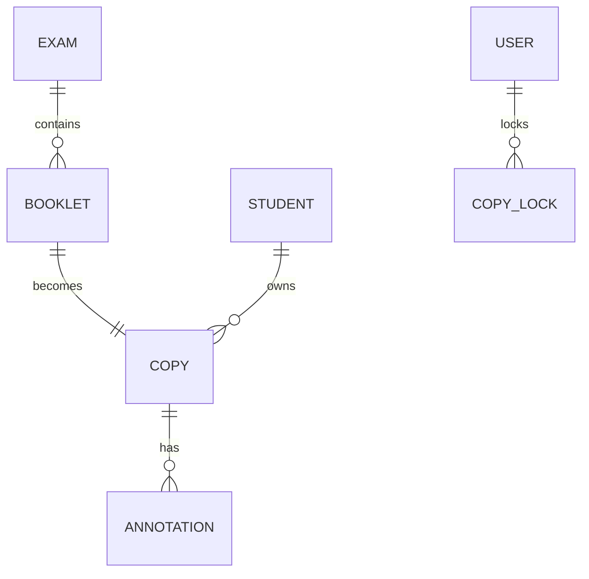

# Projet Korrigo PMF — Cahier des Charges

> **État**: Audit de Cohérence (26 Jan 2026)
> **Statut**: DÉPLOYABLE

## 1. Vue d'Ensemble
Plateforme de correction d'examens dématérialisée (Bac Blanc, E3C) pour le lycée PMF.
L'objectif est de scanner les copies, les anonymiser, les distribuer aux correcteurs via une interface web, et exporter les notes.

---

## 2. État Réel de l'Implémentation (Factuel)

### 2.1 Stack Technique (Strictement Vérifiée)
*   **Langage** : Python 3.9
*   **Framework** : Django 4.2 LTS (API REST)
*   **Frontend** : Vue.js 3 + Pinia + Vite
*   **Base de données** : PostgreSQL 15
*   **Async** : Celery + Redis (Traitement Images)
*   **OCR** : Tesseract / PyTesseract ( backend/identification)

### 2.2 Modules Implémentés
Les modules suivants sont présents dans le code (`backend/`) :

#### A. Module `exams`
*   Création d'examens (Nom, Date).
*   Upload de PDF source (Sujet/Modèle).
*   Génération de fascicules (Booklets).

#### B. Module `processing`
*   Découpage PDF (OpenCV/PyMuPDF).
*   Rasterization (PDF -> Images).
*   Alignement et redressement (Deskew).

#### C. Module `grading` (Correction)
*   Interface de correction vectorielle.
*   Annotations (Rouge).
*   Calcul des notes.
*   Statuts: `STAGING` -> `READY` -> `LOCKED` -> `GRADED`.

#### D. Module `identification`
*   Association Copie <-> Élève.
*   Support OCR (Tesseract).
*   Endpoint `POST /api/copies/{id}/identify/`.

#### E. Module `students`
*   Import CSV des élèves (Date de Naissance, Nom, Prénom, Classe).
*   Gestion de base des utilisateurs élèves.

### 2.3 Sécurité & Permissions (RBAC)
*   **Admin** : Accès total.
*   **Teacher** : Correction, Lock, Annotations.
*   **Student** : Consultation copies personnelles (Session Auth).

### 2.4 Infrastructure & Ops
*   **Docker** : Images `python:3.9-slim` (Backend) et `node` (Frontend).
*   **CI** : GitHub Actions (Lint, Unit, E2E, Security).
*   **Backup** : Commande `manage.py backup` / `restore` (Multi-pass).

---

## 3. Roadmap / Non Implémenté / Partiel

Les fonctionnalités suivantes sont prévues mais **NON** présentes ou **PARTIELLES** dans le code actuel :

*   **[MANQUANT] Triple Portail UI complet** : Les vues spécifiques "Tableau de bord Élève" ou "Tableau de bord Admin avancé" sont rudimentaires ou en cours côté Frontend.
*   **[MANQUANT] Video-Coding UI Avancé** : L'interface dédiée au "Video Coding" (validation humaine rapide des identifications douteuses) n'est pas finalisée côté Frontend, bien que l'API existe.
*   **[MANQUANT] Application Mobile** : Aucune trace de code React Native ou Flutter.
*   **[MANQUANT] Support Multi-établissement (SaaS)** : Le modèle de données est mono-tenant.

---

## 4. Architecture des Données (Actuelle)

---
**Note d'Audit** : Ce document reflète strictement le code présent dans le dépôt au 26 Janvier 2026.
