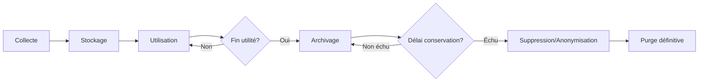

# Guide de Gestion du Cycle de Vie des Données
# Plateforme Korrigo PMF

> **Version**: 1.0.0  
> **Date**: 30 Janvier 2026  
> **Public**: Administrateurs techniques, DPO, Responsables données  
> **Classification**: Usage interne - Sensible  
> **Conformité**: RGPD (UE) 2016/679, CNIL

---

## 📋 Table des Matières

1. [Introduction](#introduction)
2. [Cycle de Vie des Données](#cycle-de-vie-des-données)
3. [Catégories de Données Personnelles](#catégories-de-données-personnelles)
4. [Stockage et Organisation](#stockage-et-organisation)
5. [Sauvegarde et Restauration](#sauvegarde-et-restauration)
6. [Politiques de Rétention](#politiques-de-rétention)
7. [Archivage des Données](#archivage-des-données)
8. [Suppression et Anonymisation](#suppression-et-anonymisation)
9. [Export des Données Personnelles](#export-des-données-personnelles)
10. [Procédures de Purge Automatique](#procédures-de-purge-automatique)
11. [Gestion des Données Sensibles](#gestion-des-données-sensibles)
12. [Minimisation des Données](#minimisation-des-données)
13. [Procédures de Migration](#procédures-de-migration)

---

## 1. Introduction

### 1.1 Objet

Ce guide définit les procédures opérationnelles pour la gestion du cycle de vie complet des données personnelles dans Korrigo PMF, de la collecte initiale à la suppression définitive.

### 1.2 Objectifs

- **Conformité RGPD** : Respecter les obligations de conservation et suppression
- **Sécurité** : Protéger les données tout au long de leur cycle de vie
- **Traçabilité** : Documenter toutes les opérations de gestion des données
- **Efficacité** : Optimiser le stockage et les performances
- **Minimisation** : Ne conserver que les données strictement nécessaires

### 1.3 Périmètre

**Données couvertes** :
- Données élèves (INE, nom, prénom, classe, email)
- Copies numérisées (PDF, images)
- Notes et annotations des enseignants
- Logs d'audit et d'accès
- Données utilisateurs (enseignants, admin)
- Métadonnées système

**Références techniques** :
- [DATABASE_SCHEMA.md](../DATABASE_SCHEMA.md) : Schéma base de données
- [POLITIQUE_RGPD.md](POLITIQUE_RGPD.md) : Politique de protection données
- [MANUEL_SECURITE.md](MANUEL_SECURITE.md) : Mesures de sécurité

---

## 2. Cycle de Vie des Données

### 2.1 Vue d'Ensemble



---

### 2.2 Phase 1 : Collecte

**Sources de données** :

| Source | Type de données | Mode de collecte | Fréquence |
|--------|----------------|------------------|-----------|
| **Import Pronote** | Élèves (INE, nom, classe) | CSV manuel | Début année + mise à jour trimestrielle |
| **Upload PDF** | Copies numérisées | Interface admin | Par examen |
| **Saisie manuelle** | Identification copies | Interface secrétariat | Après numérisation |
| **Correction** | Annotations, notes | Interface enseignant | Durant correction |
| **Connexion portail** | Logs d'accès élèves | Automatique | Temps réel |
| **Actions utilisateurs** | Logs d'audit (GradingEvent) | Automatique | Temps réel |

**Validation à la collecte** :
- ✅ Vérification format (CSV, PDF)
- ✅ Validation contraintes (INE unique, PDF valide)
- ✅ Journalisation de l'import (timestamp, acteur)

**Commande import élèves** :
```bash
python manage.py import_students students.csv

# Format CSV attendu
# ine,last_name,first_name,class_name,email
# 1234567890A,DUPONT,Jean,TG2,jean.dupont@lycee.fr
```

---

### 2.3 Phase 2 : Stockage Actif

**Durée** : Année scolaire en cours + période de correction

**Utilisation** :
- Correction des copies par les enseignants
- Consultation par les élèves (portail)
- Export notes vers Pronote
- Audit et traçabilité

**Mesures de sécurité** :
- Chiffrement base de données PostgreSQL au repos
- HTTPS/TLS pour transit
- Contrôle d'accès RBAC (Admin/Teacher/Student)
- Audit trail complet (GradingEvent)

**Référence** : [MANUEL_SECURITE.md](MANUEL_SECURITE.md) § "Sécurité des Données"

---

### 2.4 Phase 3 : Archivage

**Déclenchement** : Fin année scolaire ou 3 mois après dernier examen

**Objectif** : Conservation pour obligations légales (1 an) tout en réduisant l'accès

**Actions** :
1. Anonymisation des copies (masquage nom élève si non déjà fait)
2. Export PDF finaux vers stockage d'archivage
3. Restriction d'accès (Admin uniquement)
4. Marquage statut `ARCHIVED` en base de données
5. Journalisation de l'archivage

**Référence** : Section 7 (Archivage des Données)

---

### 2.5 Phase 4 : Suppression/Purge

**Déclenchement** : Fin délai de conservation légal (généralement 1 an)

**Méthodes** :
- **Suppression logique** : Marquage `deleted=true` (traçabilité)
- **Anonymisation** : Remplacement données par valeurs génériques
- **Suppression physique** : Suppression définitive de la base de données

**Protection** :
- ⚠️ **Vérification pré-suppression** : Confirmation des délais légaux
- ✅ **Audit** : Journalisation de toutes les suppressions
- ✅ **Sauvegarde** : Backup avant purge massive

**Référence** : Section 8 (Suppression et Anonymisation)

---

## 3. Catégories de Données Personnelles

### 3.1 Inventaire par Catégorie

| Catégorie | Tables DB | Sensibilité | Délai Rétention | Base Légale |
|-----------|-----------|-------------|-----------------|-------------|
| **Identité élève** | `students_student` | ⚠️ Moyenne | 1 an après départ | Mission intérêt public |
| **Copies examens** | `exams_copy`, `exams_booklet` | ⚠️ Moyenne | 1 an après examen | Mission intérêt public |
| **Fichiers PDF** | Stockage fichiers (`media/`) | ⚠️ Moyenne | 1 an après examen | Archivage pédagogique |
| **Notes et annotations** | `grading_annotation` | ⚠️ Moyenne | 1 an après examen | Évaluation pédagogique |
| **Logs d'audit** | `grading_gradingevent` | 🔒 Faible | 6 mois | Intérêt légitime (sécurité) |
| **Logs d'accès** | Logs serveur Nginx | 🔒 Faible | 3 mois | Intérêt légitime (sécurité) |
| **Sessions utilisateurs** | `django_session` | 🔒 Faible | 2 semaines | Nécessité technique |
| **Comptes enseignants** | `auth_user` | ⚠️ Moyenne | Actif + 1 an | Mission intérêt public |

---

### 3.2 Données Sensibles (Article 9 RGPD)

**Korrigo PMF ne collecte PAS de données sensibles** :
- ❌ Origine raciale ou ethnique
- ❌ Opinions politiques, convictions religieuses
- ❌ Données de santé
- ❌ Données biométriques
- ❌ Données génétiques
- ❌ Orientation sexuelle

**⚠️ Attention** : Si des copies d'élèves contiennent par erreur des mentions de santé (ex: aménagement d'épreuves), ces copies doivent être traitées avec précautions supplémentaires :
- Accès restreint Admin uniquement
- Suppression prioritaire après délai légal
- Pas d'archivage long terme

---

### 3.3 Métadonnées Système

| Type | Description | Rétention | Localisation |
|------|-------------|-----------|--------------|
| **Logs applicatifs** | Erreurs Django | 30 jours | `/var/log/korrigo/app.log` |
| **Logs Nginx** | Requêtes HTTP, IP | 3 mois | `/var/log/nginx/access.log` |
| **Logs PostgreSQL** | Requêtes SQL lentes | 7 jours | `/var/log/postgresql/` |
| **Logs Celery** | Tâches asynchrones | 30 jours | `/var/log/korrigo/celery.log` |
| **Sauvegardes DB** | Dumps PostgreSQL | 90 jours | `/backups/db/` |
| **Sauvegardes fichiers** | Media files | 90 jours | `/backups/media/` |

---

## 4. Stockage et Organisation

### 4.1 Architecture de Stockage

```
/opt/korrigo/
├── backend/                # Code application Django
├── frontend/               # Code application Vue.js
├── media/                  # Fichiers uploadés (RGPD sensible)
│   ├── exams/              # PDF source examens
│   ├── booklets/           # Images booklets (staging)
│   ├── copies/             # PDF copies individuelles
│   ├── final_pdfs/         # PDF finaux avec annotations
│   └── headers/            # Images en-têtes pour OCR
├── static/                 # Fichiers statiques (public)
└── backups/                # Sauvegardes (accès restreint)
    ├── db/                 # Dumps PostgreSQL
    └── media/              # Archives fichiers
```

**Permissions filesystem** :
```bash
# Media files (données personnelles)
chown -R www-data:www-data /opt/korrigo/media
chmod 750 /opt/korrigo/media          # rwxr-x---
chmod 640 /opt/korrigo/media/**/*     # rw-r-----

# Backups (admin uniquement)
chown -R root:root /opt/korrigo/backups
chmod 700 /opt/korrigo/backups        # rwx------
chmod 600 /opt/korrigo/backups/**/*   # rw-------
```

---

### 4.2 Base de Données PostgreSQL

**Configuration sécurisée** :
```bash
# /etc/postgresql/15/main/postgresql.conf

# Connexions locales uniquement (pas d'exposition réseau)
listen_addresses = 'localhost'

# Chiffrement SSL activé
ssl = on
ssl_cert_file = '/etc/ssl/certs/server.crt'
ssl_key_file = '/etc/ssl/private/server.key'

# Logs des connexions et erreurs
log_connections = on
log_disconnections = on
log_duration = on
log_statement = 'mod'  # Log toutes modif données

# Durée rétention WAL (Write-Ahead Logging)
wal_keep_size = 1GB
```

**Utilisateurs et permissions** :
```sql
-- Utilisateur applicatif (restreint)
CREATE USER korrigo_app WITH PASSWORD 'secure_password';
GRANT CONNECT ON DATABASE korrigo TO korrigo_app;
GRANT SELECT, INSERT, UPDATE, DELETE ON ALL TABLES IN SCHEMA public TO korrigo_app;

-- Utilisateur backup (lecture seule + dump)
CREATE USER korrigo_backup WITH PASSWORD 'backup_password';
GRANT CONNECT ON DATABASE korrigo TO korrigo_backup;
GRANT SELECT ON ALL TABLES IN SCHEMA public TO korrigo_backup;
```

---

### 4.3 Stockage Fichiers (Media)

**Types de fichiers** :

| Type | Extension | Taille Max | Validation | Localisation |
|------|-----------|------------|------------|--------------|
| **PDF examens** | `.pdf` | 50 MB | MIME type | `media/exams/` |
| **PDF copies** | `.pdf` | 10 MB | MIME type | `media/copies/` |
| **PDF finaux** | `.pdf` | 10 MB | MIME type | `media/final_pdfs/` |
| **Images booklets** | `.png`, `.jpg` | 5 MB | Image valide | `media/booklets/` |
| **Images en-têtes** | `.png`, `.jpg` | 1 MB | Image valide | `media/headers/` |

**Nommage des fichiers** :
```python
# Pattern : {type}/{exam_id}/{random_filename}.{ext}
# Exemple
media/exams/a3f7b2c1-4567-89ab-cdef-0123456789ab/exam_source_8a7f6e5d.pdf
media/copies/a3f7b2c1-4567-89ab-cdef-0123456789ab/copy_1a2b3c4d.pdf
media/final_pdfs/a3f7b2c1-4567-89ab-cdef-0123456789ab/final_5e6f7g8h.pdf
```

**Avantages** :
- ✅ Pas de conflit de noms (UUID + random)
- ✅ Organisation par examen
- ✅ Traçabilité via base de données

---

## 5. Sauvegarde et Restauration

### 5.1 Stratégie de Sauvegarde (3-2-1)

**Principe 3-2-1** :
- **3** copies des données (production + 2 sauvegardes)
- **2** supports différents (disque local + NAS réseau)
- **1** copie hors site (cloud ou site distant)

---

### 5.2 Sauvegarde Base de Données

**Fréquence** :
- **Quotidienne** : Dump complet PostgreSQL
- **Hebdomadaire** : Sauvegarde complète avec vérification
- **Mensuelle** : Archive long terme (90 jours)

**Script de sauvegarde** :
```bash
#!/bin/bash
# /opt/korrigo/scripts/backup_database.sh

DATE=$(date +%Y%m%d_%H%M%S)
BACKUP_DIR="/opt/korrigo/backups/db"
BACKUP_FILE="$BACKUP_DIR/korrigo_db_$DATE.sql.gz"
LOG_FILE="/var/log/korrigo/backup.log"

echo "[$(date)] Starting database backup..." >> "$LOG_FILE"

# Dump PostgreSQL avec compression
pg_dump -U korrigo_backup -h localhost korrigo | gzip > "$BACKUP_FILE"

if [ $? -eq 0 ]; then
    echo "[$(date)] Backup successful: $BACKUP_FILE" >> "$LOG_FILE"
    
    # Vérification intégrité
    gunzip -t "$BACKUP_FILE" && echo "[$(date)] Integrity check: OK" >> "$LOG_FILE"
    
    # Suppression sauvegardes > 90 jours
    find "$BACKUP_DIR" -name "korrigo_db_*.sql.gz" -mtime +90 -delete
    
    echo "[$(date)] Backup retention applied (90 days)" >> "$LOG_FILE"
else
    echo "[$(date)] ERROR: Backup failed!" >> "$LOG_FILE"
    # Alerte email admin
    echo "Database backup failed" | mail -s "KORRIGO BACKUP ALERT" admin@lycee.fr
fi
```

**Configuration cron** :
```cron
# Sauvegarde quotidienne à 2h du matin
0 2 * * * /opt/korrigo/scripts/backup_database.sh
```

---

### 5.3 Sauvegarde Fichiers (Media)

**Fréquence** :
- **Quotidienne** : Synchronisation incrémentale (rsync)
- **Hebdomadaire** : Snapshot complet

**Script rsync** :
```bash
#!/bin/bash
# /opt/korrigo/scripts/backup_media.sh

DATE=$(date +%Y%m%d)
SOURCE="/opt/korrigo/media"
BACKUP_DIR="/opt/korrigo/backups/media"
SNAPSHOT_DIR="$BACKUP_DIR/snapshot_$DATE"
LOG_FILE="/var/log/korrigo/backup_media.log"

echo "[$(date)] Starting media backup..." >> "$LOG_FILE"

# Rsync incrémental avec hard links (économie espace)
rsync -av --delete --link-dest="$BACKUP_DIR/latest" \
    "$SOURCE/" "$SNAPSHOT_DIR/" >> "$LOG_FILE" 2>&1

if [ $? -eq 0 ]; then
    # Mise à jour lien symbolique 'latest'
    rm -f "$BACKUP_DIR/latest"
    ln -s "$SNAPSHOT_DIR" "$BACKUP_DIR/latest"
    
    echo "[$(date)] Media backup successful: $SNAPSHOT_DIR" >> "$LOG_FILE"
    
    # Suppression snapshots > 90 jours
    find "$BACKUP_DIR" -maxdepth 1 -name "snapshot_*" -mtime +90 -exec rm -rf {} \;
    
else
    echo "[$(date)] ERROR: Media backup failed!" >> "$LOG_FILE"
fi
```

---

### 5.4 Test de Restauration

**Fréquence** : Trimestrielle (minimum)

**Procédure de test** :
```bash
# 1. Restauration DB sur environnement de test
gunzip -c /opt/korrigo/backups/db/korrigo_db_latest.sql.gz | \
    psql -U postgres -h localhost korrigo_test

# 2. Vérification intégrité données
python manage.py check --database=korrigo_test

# 3. Vérification comptage records
psql -U postgres korrigo_test -c "SELECT COUNT(*) FROM exams_exam;"
psql -U postgres korrigo_test -c "SELECT COUNT(*) FROM students_student;"

# 4. Test requête fonctionnelle
python manage.py shell --database=korrigo_test
>>> from exams.models import Exam
>>> Exam.objects.count()

# 5. Restauration fichiers media (échantillon)
rsync -av /opt/korrigo/backups/media/latest/copies/ /tmp/test_restore/
```

**Documentation** :
- ✅ Horodatage du test
- ✅ Résultat (succès/échec)
- ✅ Temps de restauration
- ✅ Problèmes rencontrés
- ✅ Actions correctives

---

### 5.5 Plan de Reprise d'Activité (PRA)

**RTO (Recovery Time Objective)** : 4 heures
**RPO (Recovery Point Objective)** : 24 heures max

**Scénario 1 : Corruption base de données** :
```
1. Arrêt application (Django + Celery)       [5 min]
2. Identification sauvegarde à restaurer     [10 min]
3. Restauration dump PostgreSQL              [30 min]
4. Vérification intégrité                    [15 min]
5. Redémarrage application                   [5 min]
6. Tests fonctionnels                        [30 min]
Total estimé: 1h35
```

**Scénario 2 : Perte fichiers media** :
```
1. Identification périmètre perdu            [15 min]
2. Restauration rsync depuis backup          [1-2h selon volume]
3. Vérification permissions filesystem       [10 min]
4. Tests téléchargement PDF                  [15 min]
Total estimé: 2-3h
```

**Scénario 3 : Défaillance serveur complète** :
```
1. Provisionnement nouveau serveur           [1h]
2. Installation dépendances                  [30 min]
3. Restauration DB + fichiers                [1-2h]
4. Configuration réseau/SSL                  [30 min]
5. Tests complets                            [1h]
Total estimé: 4-5h
```

**Référence** : [PROCEDURES_OPERATIONNELLES.md](../admin/PROCEDURES_OPERATIONNELLES.md) § "Plan de Continuité d'Activité"

---

## 6. Politiques de Rétention

### 6.1 Table de Rétention Complète

| Donnée | Durée Conservation Active | Durée Archive | Suppression | Base Légale | Méthode Purge |
|--------|--------------------------|---------------|-------------|-------------|---------------|
| **Élèves actifs** | Pendant scolarité | - | 1 an après départ | Code éducation | Suppression logique |
| **Élèves partis** | 1 an | - | Fin délai | Archivage admin | Anonymisation |
| **Copies examens (PDF)** | 1 an après examen | - | Fin délai | Archivage pédagogique | Suppression physique |
| **Annotations** | 1 an après examen | - | Fin délai | Lien copies | Suppression cascade |
| **Notes finales** | Exportées Pronote | Archivées Pronote | N/A | Système externe | - |
| **Logs audit (GradingEvent)** | 6 mois | - | Fin délai | CNIL recommandation | Suppression automatique |
| **Logs serveur (Nginx)** | 3 mois | - | Fin délai | Sécurité | Rotation logs |
| **Sessions Django** | 2 semaines | - | Expiration | Nécessité technique | `clearsessions` |
| **Booklets (staging)** | Jusqu'à validation | - | Après création Copy | Traçabilité | Suppression manuelle |
| **Sauvegardes DB** | 90 jours | - | Fin délai | Continuité activité | Suppression automatique |
| **Comptes enseignants** | Pendant activité | 1 an | Après 1 an inactivité | RH établissement | Désactivation puis suppression |

---

### 6.2 Conformité Légale

**Code de l'éducation** :
- **Article L. 131-1** : Obligation d'évaluation pédagogique
- **Archivage notes** : 1 an minimum (recommandation académie)

**CNIL Recommandations Éducation** :
- **Logs d'accès/audit** : 6 mois maximum (sauf incident)
- **Données élèves** : Suppression année N+1 après départ

**RGPD Article 5.1.e** : Limitation de la conservation
- Pas de conservation "au cas où"
- Justification écrite de toute prolongation

---

### 6.3 Calcul des Délais

**Élève quittant l'établissement** :
```python
# Date départ : 30 juin 2026
# Date suppression : 30 juin 2027 (1 an)

from datetime import datetime, timedelta

departure_date = datetime(2026, 6, 30)
retention_period = timedelta(days=365)
deletion_date = departure_date + retention_period
# deletion_date = 2027-06-30
```

**Examen archivé** :
```python
# Examen : "Bac Blanc Maths - 15 janvier 2026"
# Date examen : 15 janvier 2026
# Date suppression : 15 janvier 2027 (1 an)

exam_date = datetime(2026, 1, 15)
retention_period = timedelta(days=365)
deletion_date = exam_date + retention_period
# deletion_date = 2027-01-15
```

---

## 7. Archivage des Données

### 7.1 Procédure d'Archivage Fin d'Année

**Déclenchement** : 30 juin (fin année scolaire)

**Étapes** :

```bash
# 1. Export complet base de données (archive légale)
python manage.py dumpdata --indent=2 > archives/korrigo_2025-2026_$(date +%Y%m%d).json

# 2. Génération rapport activité
python manage.py generate_yearly_report --year=2025-2026 > archives/rapport_2025-2026.txt

# 3. Export PDF finaux (copie sécurité)
rsync -av /opt/korrigo/media/final_pdfs/ /archives/pdfs_2025-2026/

# 4. Anonymisation copies archivées (optionnel)
python manage.py anonymize_archived_copies --year=2025-2026

# 5. Compression archives
tar -czf archives/korrigo_archive_2025-2026.tar.gz archives/*2025-2026*

# 6. Vérification intégrité
sha256sum archives/korrigo_archive_2025-2026.tar.gz > archives/korrigo_archive_2025-2026.sha256

# 7. Stockage hors site (optionnel)
# rsync archives/korrigo_archive_2025-2026.tar.gz user@backup-server:/archives/
```

---

### 7.2 Commande Django d'Anonymisation

**Implémentation** :
```python
# backend/exams/management/commands/anonymize_archived_copies.py

from django.core.management.base import BaseCommand
from exams.models import Copy
from datetime import datetime, timedelta

class Command(BaseCommand):
    help = "Anonymise les copies archivées de plus de 1 an"
    
    def add_arguments(self, parser):
        parser.add_argument('--year', type=str, help='Année scolaire (ex: 2025-2026)')
        parser.add_argument('--dry-run', action='store_true', help='Simulation sans modification')
    
    def handle(self, *args, **options):
        cutoff_date = datetime.now() - timedelta(days=365)
        
        copies = Copy.objects.filter(
            exam__date__lt=cutoff_date,
            status='GRADED'
        ).select_related('student', 'exam')
        
        self.stdout.write(f"Copies à anonymiser: {copies.count()}")
        
        if not options['dry_run']:
            for copy in copies:
                # Anonymisation
                copy.student = None
                copy.is_identified = False
                copy.save(update_fields=['student', 'is_identified'])
                
                # Log événement
                GradingEvent.objects.create(
                    copy=copy,
                    action='ANONYMIZE',
                    actor=None,
                    metadata={'reason': 'archivage_1an'}
                )
            
            self.stdout.write(self.style.SUCCESS(f"Anonymisation terminée: {copies.count()} copies"))
        else:
            self.stdout.write(self.style.WARNING("Mode DRY-RUN - Aucune modification"))
```

**Exécution** :
```bash
# Simulation
python manage.py anonymize_archived_copies --dry-run

# Exécution réelle
python manage.py anonymize_archived_copies --year=2025-2026
```

---

## 8. Suppression et Anonymisation

### 8.1 Méthodes de Suppression

#### 8.1.1 Suppression Logique (Soft Delete)

**Principe** : Marquage `deleted=true` sans suppression physique

**Avantages** :
- ✅ Traçabilité conservée
- ✅ Récupération possible (erreur humaine)
- ✅ Conformité audit

**Inconvénients** :
- ⚠️ Espace disque non libéré
- ⚠️ Complexité requêtes (filtrage `deleted=false`)

**Implémentation Django** :
```python
# backend/core/models.py

class SoftDeleteManager(models.Manager):
    def get_queryset(self):
        return super().get_queryset().filter(deleted_at__isnull=True)

class SoftDeleteModel(models.Model):
    deleted_at = models.DateTimeField(null=True, blank=True)
    
    objects = SoftDeleteManager()  # Queryset par défaut (exclus deleted)
    all_objects = models.Manager()  # Queryset incluant deleted
    
    def delete(self, **kwargs):
        self.deleted_at = timezone.now()
        self.save(update_fields=['deleted_at'])
    
    def hard_delete(self):
        super().delete()
    
    class Meta:
        abstract = True
```

---

#### 8.1.2 Anonymisation

**Principe** : Remplacement données personnelles par valeurs génériques

**Cas d'usage** :
- Conservation copies pour statistiques pédagogiques
- Archivage obligatoire mais RGPD respecté

**Données à anonymiser** :
| Champ | Valeur originale | Valeur anonymisée |
|-------|-----------------|-------------------|
| `Student.ine` | `1234567890A` | `ANON_{timestamp}` |
| `Student.first_name` | `Jean` | `Élève` |
| `Student.last_name` | `DUPONT` | `Anonyme` |
| `Student.email` | `jean.dupont@lycee.fr` | NULL |
| `Copy.student_id` | UUID référence | NULL |

**Script anonymisation** :
```python
# backend/students/anonymize.py

def anonymize_student(student):
    """Anonymise un élève (irréversible)"""
    student.ine = f"ANON_{timezone.now().strftime('%Y%m%d%H%M%S')}"
    student.first_name = "Élève"
    student.last_name = "Anonyme"
    student.email = None
    student.save()
    
    # Dissocier toutes les copies
    student.copy_set.update(student=None, is_identified=False)
    
    # Log anonymisation
    logger.info(f"Élève anonymisé: ancien INE={student.ine} (avant anonymisation)")
```

---

#### 8.1.3 Suppression Physique (Hard Delete)

**Principe** : Suppression définitive en base de données

**⚠️ IRRÉVERSIBLE** : Données non récupérables

**Procédure sécurisée** :
```python
# backend/exams/management/commands/purge_expired_data.py

def purge_old_copies(dry_run=False):
    """Supprime physiquement les copies expirées"""
    cutoff_date = timezone.now() - timedelta(days=365)
    
    copies = Copy.objects.filter(
        exam__date__lt=cutoff_date,
        status='GRADED'
    )
    
    if dry_run:
        print(f"[DRY-RUN] Copies à supprimer: {copies.count()}")
        for copy in copies[:10]:  # Échantillon
            print(f"  - Copy {copy.id}, Exam: {copy.exam.name}, Date: {copy.exam.date}")
        return
    
    # Confirmation manuelle requise
    confirmation = input(f"ATTENTION: Suppression définitive de {copies.count()} copies. Confirmer (yes/no): ")
    if confirmation != 'yes':
        print("Annulation.")
        return
    
    # Sauvegarde avant suppression
    print("Création sauvegarde de sécurité...")
    backup_file = f"/backups/pre_purge_{timezone.now().strftime('%Y%m%d_%H%M%S')}.json"
    call_command('dumpdata', 'exams.Copy', output=backup_file, indent=2)
    
    # Suppression physique
    count_deleted = 0
    for copy in copies:
        # Suppression fichiers associés
        if copy.pdf_source:
            copy.pdf_source.delete(save=False)
        if copy.final_pdf:
            copy.final_pdf.delete(save=False)
        
        # Suppression cascade (annotations, events)
        copy.delete()  # Hard delete
        count_deleted += 1
    
    print(f"Suppression terminée: {count_deleted} copies purgées.")
    print(f"Sauvegarde sécurité: {backup_file}")
```

---

### 8.2 Suppression Sécurisée Fichiers

**Principe** : Écrasement données avant suppression (évite récupération forensique)

**Outil** : `shred` (Linux)

```bash
# Suppression sécurisée d'un fichier PDF
shred -vfz -n 3 /opt/korrigo/media/copies/copy_expired.pdf

# Options:
# -v: verbose
# -f: force permissions
# -z: écrasement final avec zéros
# -n 3: 3 passes d'écrasement (DoD 5220.22-M)
```

**Intégration Django** :
```python
import subprocess

def secure_delete_file(file_path):
    """Supprime de manière sécurisée un fichier"""
    if not os.path.exists(file_path):
        return
    
    # Écrasement sécurisé
    subprocess.run(['shred', '-vfz', '-n', '3', file_path], check=True)
    
    logger.info(f"Fichier supprimé de manière sécurisée: {file_path}")
```

---

## 9. Export des Données Personnelles

### 9.1 Droit à la Portabilité (Art. 20 RGPD)

**Commande Django** :
```python
# backend/students/management/commands/export_student_data.py

class Command(BaseCommand):
    help = "Exporte les données personnelles d'un élève (RGPD Art. 20)"
    
    def add_arguments(self, parser):
        parser.add_argument('--ine', type=str, required=True, help='INE de l\'élève')
        parser.add_argument('--format', choices=['json', 'pdf'], default='json')
    
    def handle(self, *args, **options):
        ine = options['ine']
        student = Student.objects.get(ine=ine)
        
        # Export données structurées
        data = {
            'student': {
                'ine': student.ine,
                'first_name': student.first_name,
                'last_name': student.last_name,
                'class_name': student.class_name,
                'email': student.email
            },
            'exams': []
        }
        
        # Export copies et notes
        for copy in student.copy_set.filter(status='GRADED'):
            exam_data = {
                'exam_name': copy.exam.name,
                'date': copy.exam.date.isoformat(),
                'anonymous_id': copy.anonymous_id,
                'score': copy.calculate_score(),
                'max_score': copy.exam.total_points,
                'annotations': [
                    {
                        'content': ann.content,
                        'score_delta': ann.score_delta,
                        'created_at': ann.created_at.isoformat()
                    }
                    for ann in copy.annotation_set.all()
                ],
                'final_pdf_url': copy.final_pdf.url if copy.final_pdf else None
            }
            data['exams'].append(exam_data)
        
        # Écriture fichier
        output_file = f'/tmp/student_data_{ine}_{timezone.now().strftime("%Y%m%d")}.json'
        with open(output_file, 'w', encoding='utf-8') as f:
            json.dump(data, f, indent=2, ensure_ascii=False)
        
        self.stdout.write(self.style.SUCCESS(f"Export terminé: {output_file}"))
```

**Exécution** :
```bash
python manage.py export_student_data --ine 1234567890A --format json

# Résultat: /tmp/student_data_1234567890A_20260130.json
```

---

### 9.2 Format Export JSON

**Structure complète** :
```json
{
  "export_date": "2026-01-30T10:30:00Z",
  "student": {
    "ine": "1234567890A",
    "first_name": "Jean",
    "last_name": "DUPONT",
    "class_name": "TG2",
    "email": "jean.dupont@lycee.fr"
  },
  "exams": [
    {
      "exam_name": "Bac Blanc Maths TG - Janvier 2026",
      "date": "2026-01-15",
      "anonymous_id": "COPY-A3F7B2C1",
      "score": 15.5,
      "max_score": 20,
      "annotations": [
        {
          "content": "Excellente démonstration",
          "score_delta": 2,
          "created_at": "2026-01-20T14:30:00Z"
        }
      ],
      "final_pdf_url": "/media/final_pdfs/.../final_xyz.pdf"
    }
  ],
  "access_logs": [
    {
      "timestamp": "2026-01-22T09:15:00Z",
      "action": "LOGIN",
      "ip_address": "192.168.1.100"
    },
    {
      "timestamp": "2026-01-22T09:16:23Z",
      "action": "DOWNLOAD_PDF",
      "copy_id": "a3f7b2c1-4567-89ab-cdef-0123456789ab"
    }
  ]
}
```

---

## 10. Procédures de Purge Automatique

### 10.1 Tâche Celery de Purge Quotidienne

**Configuration** :
```python
# backend/core/celery.py

@app.task(name='purge_expired_sessions')
def purge_expired_sessions():
    """Nettoie les sessions Django expirées"""
    call_command('clearsessions')
    logger.info("Sessions expirées purgées")

@app.task(name='purge_old_audit_logs')
def purge_old_audit_logs():
    """Supprime logs d'audit > 6 mois"""
    cutoff = timezone.now() - timedelta(days=180)  # 6 mois
    deleted_count = GradingEvent.objects.filter(timestamp__lt=cutoff).delete()[0]
    logger.info(f"Logs d'audit purgés: {deleted_count} événements")

@app.task(name='purge_expired_copy_locks')
def purge_expired_copy_locks():
    """Supprime verrous de copies expirés"""
    cutoff = timezone.now()
    deleted_count = CopyLock.objects.filter(expires_at__lt=cutoff).delete()[0]
    logger.info(f"Verrous expirés purgés: {deleted_count} locks")

# Planification (Celery Beat)
app.conf.beat_schedule = {
    'purge-sessions-daily': {
        'task': 'purge_expired_sessions',
        'schedule': crontab(hour=3, minute=0),  # 3h du matin
    },
    'purge-audit-logs-daily': {
        'task': 'purge_old_audit_logs',
        'schedule': crontab(hour=3, minute=30),
    },
    'purge-locks-hourly': {
        'task': 'purge_expired_copy_locks',
        'schedule': crontab(minute=0),  # Toutes les heures
    },
}
```

---

### 10.2 Cron de Purge Fichiers Logs

```cron
# /etc/cron.d/korrigo-logrotate

# Rotation logs Nginx (conservation 90 jours)
0 0 * * * root /usr/sbin/logrotate /etc/logrotate.d/nginx

# Purge logs applicatifs > 30 jours
0 4 * * * root find /var/log/korrigo/ -name "*.log" -mtime +30 -delete

# Purge sauvegardes > 90 jours
0 5 * * * root find /opt/korrigo/backups/ -mtime +90 -type f -delete
```

---

### 10.3 Notification Purge Critique

**Alerte avant suppression massive** :
```python
@app.task(name='check_purge_candidates')
def check_purge_candidates():
    """Alerte admin si beaucoup de données à purger"""
    cutoff = timezone.now() - timedelta(days=365)
    
    copies_to_purge = Copy.objects.filter(
        exam__date__lt=cutoff,
        status='GRADED'
    ).count()
    
    if copies_to_purge > 100:
        # Alerte email admin
        send_mail(
            subject='[KORRIGO] Purge automatique en attente',
            message=f'{copies_to_purge} copies dépassent le délai de rétention (1 an).\n'
                    f'Vérifier conformité avant purge automatique.',
            from_email='noreply@korrigo.lycee.fr',
            recipient_list=['admin@lycee.fr', 'dpo@lycee.fr'],
        )
        
        logger.warning(f"Purge critique: {copies_to_purge} copies candidates")
```

---

## 11. Gestion des Données Sensibles

### 11.1 Classification des Données

| Niveau | Exemples | Mesures Spécifiques |
|--------|----------|---------------------|
| **PUBLIC** | - Nom établissement<br>- Dates examens | Aucune restriction |
| **INTERNE** | - Liste classes<br>- Calendrier examens | Authentification requise |
| **CONFIDENTIEL** | - INE élèves<br>- Notes<br>- Annotations | RBAC + Chiffrement + Logs |
| **SENSIBLE (Art. 9)** | - Santé<br>- Origine<br>- Religion | ❌ Non collectées par Korrigo |

---

### 11.2 Traitement Aménagements d'Épreuves

**Problématique** : Les copies d'élèves en situation de handicap peuvent mentionner des données de santé

**Mesures spécifiques** :
1. **Anonymisation renforcée** : Masquage systématique mentions santé
2. **Accès restreint** : Admin NSI uniquement (pas Teacher)
3. **Suppression prioritaire** : Purge immédiate après délai légal (1 an)
4. **Pas d'archivage long terme**

**Détection automatique** :
```python
# backend/exams/validators.py

HEALTH_KEYWORDS = [
    'handicap', 'médical', 'santé', 'thérapeutique',
    'dyslexie', 'dyspraxie', 'TDAH', 'allergie'
]

def check_sensitive_content(pdf_text):
    """Détecte mentions potentielles de santé dans les copies"""
    text_lower = pdf_text.lower()
    for keyword in HEALTH_KEYWORDS:
        if keyword in text_lower:
            logger.warning(f"Mention sensible détectée: {keyword}")
            return True
    return False
```

---

### 11.3 Pseudonymisation des Logs

**Principe** : Remplacement IP complète par préfixe

**Implémentation** :
```python
# backend/core/middleware.py

def pseudonymize_ip(ip_address):
    """Pseudonymise une adresse IP (conservation préfixe réseau)"""
    if ':' in ip_address:  # IPv6
        return ip_address.split(':')[0] + ':xxxx:xxxx:xxxx:xxxx'
    else:  # IPv4
        parts = ip_address.split('.')
        return f"{parts[0]}.{parts[1]}.xxx.xxx"

# Exemple: 192.168.1.100 → 192.168.xxx.xxx
```

**Application Nginx** :
```nginx
# /etc/nginx/sites-available/korrigo

log_format pseudonymized '$remote_addr_pseudonymized $remote_user [$time_local] '
                         '"$request" $status $body_bytes_sent '
                         '"$http_referer" "$http_user_agent"';

# Remplacer dernier octet IP
map $remote_addr $remote_addr_pseudonymized {
    ~(?P<ip>\d+\.\d+\.\d+)\.\d+ $ip.xxx;
}

access_log /var/log/nginx/access.log pseudonymized;
```

---

## 12. Minimisation des Données

### 12.1 Principe Privacy by Design

**Collecter uniquement le strict nécessaire** :

| Donnée | Nécessaire ? | Justification | Décision |
|--------|-------------|---------------|----------|
| INE | ✅ Oui | Identifiant unique élève (EN obligatoire) | Collectée |
| Nom, Prénom | ✅ Oui | Identification copies | Collectée |
| Classe | ✅ Oui | Organisation pédagogique | Collectée |
| Email | ⚠️ Optionnel | Notifications (désactivable) | Collectée si fournie |
| Photo élève | ❌ Non | Pas nécessaire correction | ❌ Non collectée |
| Adresse postale | ❌ Non | Pas pertinente | ❌ Non collectée |
| Téléphone | ❌ Non | Pas nécessaire | ❌ Non collectée |
| Date de naissance | ❌ Non | Pas utilisée | ❌ Non collectée |

---

### 12.2 Vérification Minimisation

**Commande audit** :
```bash
python manage.py check_data_minimization

# Résultat exemple:
# ✅ Student model: 5 champs collectés / 5 nécessaires (100%)
# ⚠️ User model: 12 champs Django / 8 utilisés (67%)
# Recommandation: Masquer champs inutilisés (phone_number, address)
```

---

## 13. Procédures de Migration

### 13.1 Migration Vers Nouveau Serveur

**Étapes** :
```bash
# 1. Dump base de données (serveur source)
pg_dump -U korrigo -h localhost korrigo > korrigo_migration_$(date +%Y%m%d).sql

# 2. Archive fichiers media
tar -czf media_migration.tar.gz /opt/korrigo/media/

# 3. Transfert sécurisé (SSH)
scp korrigo_migration_*.sql admin@nouveau-serveur:/tmp/
scp media_migration.tar.gz admin@nouveau-serveur:/tmp/

# 4. Restauration (serveur destination)
psql -U korrigo -h localhost korrigo < /tmp/korrigo_migration_*.sql
tar -xzf /tmp/media_migration.tar.gz -C /opt/korrigo/

# 5. Vérification intégrité
python manage.py check --database=default
python manage.py migrate --fake-initial

# 6. Test fonctionnel
python manage.py test exams.tests
```

---

### 13.2 Migration Django (Évolution Modèles)

**Ajout champ RGPD-compliant** :
```python
# backend/students/models.py

class Student(models.Model):
    # ...champs existants
    
    # RGPD : Date de consentement portail élève
    consent_date = models.DateTimeField(null=True, blank=True,
        help_text="Date consentement accès portail (RGPD Art. 6.1.a)")
    
    # RGPD : Date de suppression programmée
    scheduled_deletion = models.DateField(null=True, blank=True,
        help_text="Date suppression automatique (si élève parti)")
```

**Migration** :
```bash
python manage.py makemigrations students
python manage.py migrate students
```

---

## 14. Annexes

### Annexe A : Checklist Gestion Données

**Quotidien** :
- [ ] Vérifier logs sauvegarde (`/var/log/korrigo/backup.log`)
- [ ] Vérifier espace disque (DB + media) : `df -h`
- [ ] Vérifier tâches Celery Beat : `celery -A core inspect active`

**Hebdomadaire** :
- [ ] Vérifier intégrité sauvegarde (test restauration échantillon)
- [ ] Revue logs d'erreur application : `tail -100 /var/log/korrigo/app.log | grep ERROR`
- [ ] Vérification purges automatiques (sessions, logs)

**Mensuel** :
- [ ] Test restauration complète (base de données)
- [ ] Audit espace disque (croissance anormale ?)
- [ ] Vérification conformité rétention (élèves partis)

**Trimestriel** :
- [ ] Test PRA complet (restauration serveur)
- [ ] Audit données (minimisation, exactitude)
- [ ] Revue calendrier purges

**Annuel** :
- [ ] Archivage fin d'année scolaire
- [ ] Purge données expirées (copies > 1 an)
- [ ] Audit conformité RGPD complet

---

### Annexe B : Contacts et Responsabilités

| Rôle | Responsable | Email | Téléphone | Responsabilité Données |
|------|------------|-------|-----------|------------------------|
| **DPO** | [Nom DPO] | dpo@lycee.fr | XX XX XX XX XX | - Conformité RGPD<br>- Validation purges<br>- Réponse demandes RGPD |
| **Admin NSI** | [Nom Admin] | admin.nsi@lycee.fr | XX XX XX XX XX | - Sauvegardes quotidiennes<br>- Restaurations<br>- Purges techniques |
| **DSI/RSSI** | [Nom DSI] | dsi@lycee.fr | XX XX XX XX XX | - Validation architecture stockage<br>- Audits sécurité données |
| **Proviseur** | [Nom Proviseur] | proviseur@lycee.fr | XX XX XX XX XX | - Validation décisions critiques<br>- Approbation purges massives |

---

### Annexe C : Outils et Commandes Utiles

**Vérification espace disque** :
```bash
# Espace global
df -h /opt/korrigo

# Taille base de données
sudo -u postgres psql -c "SELECT pg_size_pretty(pg_database_size('korrigo'));"

# Taille media files par type
du -sh /opt/korrigo/media/*

# Top 10 fichiers les plus volumineux
find /opt/korrigo/media -type f -exec du -h {} + | sort -rh | head -10
```

**Comptage records** :
```bash
# Élèves actifs
psql korrigo -c "SELECT COUNT(*) FROM students_student WHERE deleted_at IS NULL;"

# Copies par statut
psql korrigo -c "SELECT status, COUNT(*) FROM exams_copy GROUP BY status;"

# Logs d'audit (6 derniers mois)
psql korrigo -c "SELECT COUNT(*) FROM grading_gradingevent WHERE timestamp > NOW() - INTERVAL '6 months';"
```

---

## Conclusion

Ce guide fournit un cadre complet pour la gestion responsable et conforme du cycle de vie des données dans Korrigo PMF. Le respect rigoureux de ces procédures garantit :

1. **Conformité RGPD et CNIL** : Respect des délais de conservation et des droits des personnes
2. **Sécurité des données** : Protection tout au long du cycle de vie
3. **Continuité d'activité** : Sauvegardes régulières et procédures de restauration testées
4. **Traçabilité** : Documentation complète de toutes les opérations
5. **Efficacité opérationnelle** : Automatisation des tâches répétitives (purges, sauvegardes)

**Prochaines étapes** :
- Personnalisation des délais de rétention selon contexte établissement
- Configuration alertes automatiques (espace disque, échecs sauvegarde)
- Formation équipe aux procédures de gestion données

**Références** :
- [POLITIQUE_RGPD.md](POLITIQUE_RGPD.md) - Politique protection données
- [MANUEL_SECURITE.md](MANUEL_SECURITE.md) - Manuel sécurité technique
- [AUDIT_CONFORMITE.md](AUDIT_CONFORMITE.md) - Procédures audit
- [GUIDE_UTILISATEUR_ADMIN.md](../admin/GUIDE_UTILISATEUR_ADMIN.md) - Guide administrateur

---

**Document validé par** :  
- DPO : __________________ Date : __________  
- Admin NSI : __________________ Date : __________  
- Proviseur : __________________ Date : __________

---
