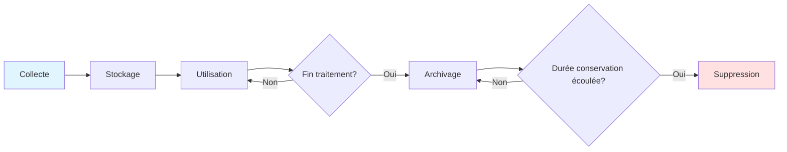

# Guide de Gestion des Données
# Plateforme Korrigo PMF

> **Version**: 1.0.0  
> **Date**: 30 Janvier 2026  
> **Public**: Administrateurs, DPO, Responsables traitement  
> **Conformité**: RGPD Art. 5, 17, 25, 32

---

## 📋 Table des Matières

1. [Introduction](#introduction)
2. [Cycle de Vie des Données](#cycle-de-vie-des-données)
3. [Collecte et Création](#collecte-et-création)
4. [Stockage et Organisation](#stockage-et-organisation)
5. [Conservation et Archivage](#conservation-et-archivage)
6. [Accès et Partage](#accès-et-partage)
7. [Modification et Mise à Jour](#modification-et-mise-à-jour)
8. [Suppression et Purge](#suppression-et-purge)
9. [Sauvegardes](#sauvegardes)
10. [Export et Portabilité](#export-et-portabilité)
11. [Procédures Opérationnelles](#procédures-opérationnelles)
12. [Conformité RGPD](#conformité-rgpd)

---

## 1. Introduction

### 1.1 Objet

Ce guide décrit les procédures de gestion des données dans Korrigo PMF, de la collecte à la suppression, en conformité avec le RGPD et les bonnes pratiques de sécurité.

### 1.2 Périmètre des Données

**Types de données traitées** :

| Catégorie | Exemples | Sensibilité | Volume Annuel Estimé |
|-----------|----------|-------------|---------------------|
| **Données élèves** | INE, nom, prénom, classe, email | Élevée (mineurs) | ~500 élèves/lycée |
| **Copies numérisées** | PDF scans, images pages | Moyenne | ~5 000 copies/an |
| **Annotations enseignants** | Commentaires, notes, corrections | Moyenne | ~50 000 annotations/an |
| **Notes et résultats** | Scores, barèmes, totaux | Élevée | ~5 000 notes/an |
| **Logs d'audit** | GradingEvent, accès, modifications | Faible | ~100 000 événements/an |
| **Données utilisateurs** | Comptes Admin/Teacher, emails | Moyenne | ~50 utilisateurs |

**Volume total estimé** : 50-100 GB/an (principalement PDFs)

---

### 1.3 Responsabilités

| Rôle | Responsabilité Gestion Données |
|------|-------------------------------|
| **DPO** | - Validation politique conservation<br>- Contrôle conformité RGPD<br>- Gestion demandes exercice droits |
| **Admin NSI** | - Exécution procédures techniques<br>- Sauvegardes et restauration<br>- Purges automatisées<br>- Exports données |
| **Proviseur** | - Approbation politique conservation<br>- Décisions cas exceptionnels (ex: contentieux) |
| **Enseignants** | - Qualité annotations<br>- Signalement erreurs données élèves |

---

## 2. Cycle de Vie des Données

### 2.1 Vue d'Ensemble



**Phases** :
1. **Collecte** : Import Pronote, upload PDFs, création annotations
2. **Stockage** : Base de données PostgreSQL, filesystem `/media/`
3. **Utilisation active** : Correction, consultation, export
4. **Archivage** : Export Pronote (notes), conservation copies (1 an)
5. **Suppression** : Purge automatique ou manuelle

---

### 2.2 Durées de Conservation (Synthèse)

| Type de données | Durée active | Archivage | Suppression | Base légale |
|----------------|--------------|-----------|-------------|-------------|
| **Données élèves** | Année scolaire | 1 an après fin scolarité | Auto | Code éducation |
| **Copies PDF** | Jusqu'à export final | 1 an après examen | Auto | Archivage pédagogique |
| **Notes/annotations** | 1 an après examen | Pronote (externe) | Auto | Code éducation |
| **Logs audit** | 6 mois | - | Auto | CNIL recommandation |
| **Comptes utilisateurs** | Durée fonction | 1 an après départ | Manuel | Gestion RH |
| **Sauvegardes** | 30 jours (quotidiennes) | 6 mois (hebdo) | Auto | Continuité activité |

**Référence complète** : `docs/security/POLITIQUE_RGPD.md § 8`

---

## 3. Collecte et Création

### 3.1 Import Données Élèves (Pronote)

**Source** : Export CSV Pronote (système officiel Éducation Nationale)

**Procédure** :
```bash
# 1. Export Pronote
# Menu Pronote : Fichier > Exporter > Élèves > CSV

# 2. Vérifier format CSV
head eleves_2026.csv
# Attendu : INE;Nom;Prénom;Classe;Email

# 3. Import Korrigo
python manage.py import_students eleves_2026.csv --class TG

# 4. Vérification
python manage.py shell
>>> from students.models import Student
>>> Student.objects.filter(class_name='TG').count()
120  # Attendu
```

**Format CSV requis** :
```csv
INE;Nom;Prénom;Classe;Email
1234567890A;DUPONT;Jean;TG2;jean.dupont@eleve.fr
0987654321B;MARTIN;Marie;TG4;marie.martin@eleve.fr
```

**Validations** :
- ✅ INE unique (clé primaire)
- ✅ Nom/Prénom non vides
- ✅ Classe valide (format : `[A-Z]{1,3}[0-9]{1,2}`)
- ⚠️ Email optionnel (validation format si présent)

**Traçabilité** :
```python
# Créer événement audit
AuditEvent.objects.create(
    action='IMPORT_STUDENTS',
    actor=request.user,
    metadata={'count': students_imported, 'source': 'pronote_2026.csv'}
)
```

---

### 3.2 Upload Copies (Examens)

**Workflow** :
1. **Scan physique** : Scanner A3 recto-verso → PDF massif
2. **Upload** : `POST /api/exams/upload/`
3. **Traitement asynchrone** (Celery) :
   - Split A3 → A4
   - Détection en-têtes
   - Création Booklets
   - OCR noms (optionnel)

**Contraintes techniques** :
```python
# backend/exams/validators.py
def validate_pdf_file(file):
    # Taille max : 50 MB
    if file.size > 50 * 1024 * 1024:
        raise ValidationError("PDF must be < 50 MB")
    
    # Extension
    if not file.name.endswith('.pdf'):
        raise ValidationError("File must be PDF")
    
    # MIME type
    if file.content_type != 'application/pdf':
        raise ValidationError("Invalid MIME type")
```

**Stockage** :
```python
# backend/exams/models.py
class Exam(models.Model):
    pdf_source = models.FileField(
        upload_to='exams/source/%Y/%m/',  # /media/exams/source/2026/01/exam.pdf
        validators=[validate_pdf_file]
    )
```

**Volumétrie** :
- Taille moyenne copie : 2-5 MB (4 pages A4 scannées)
- 100 copies/examen × 10 examens/an = 2-5 GB/an

---

### 3.3 Création Annotations

**Sources** :
- **Enseignants** : Correction manuelle via interface
- **Système** : Calcul automatique scores (somme `score_delta`)

**Données collectées** :
```python
# backend/grading/models.py
class Annotation(models.Model):
    copy = ForeignKey(Copy)
    page_index = IntegerField()  # 0-based
    x, y, w, h = FloatField()  # Coordonnées normalisées [0, 1]
    content = TextField(blank=True)  # Texte annotation
    type = CharField(choices=Type.choices)  # COMMENT, HIGHLIGHT, ERROR, BONUS
    score_delta = IntegerField(null=True)  # Points ajoutés/retirés
    created_by = ForeignKey(User)
    created_at = DateTimeField(auto_now_add=True)
```

**Minimisation des données** :
- ✅ Pas de données personnelles dans `content` (seulement feedback pédagogique)
- ✅ Coordonnées normalisées (indépendantes résolution PDF)
- ✅ Pas de stockage IP enseignant (seulement User ID)

---

## 4. Stockage et Organisation

### 4.1 Base de Données PostgreSQL

**Configuration** :
```yaml
# docker-compose.yml (production)
services:
  postgres:
    image: postgres:15-alpine
    environment:
      POSTGRES_DB: korrigo_db
      POSTGRES_USER: korrigo
      POSTGRES_PASSWORD: ${DB_PASSWORD}  # Depuis .env
    volumes:
      - postgres_data:/var/lib/postgresql/data
    networks:
      - backend_network  # Réseau isolé
```

**Sécurité** :
- ✅ Chiffrement connexions (SSL)
- ✅ Authentification par mot de passe fort
- ✅ Pas d'exposition publique (firewall)
- ✅ Sauvegardes quotidiennes chiffrées

**Organisation tables** :
```
korrigo_db
├── auth_user (Django users)
├── students_student (Élèves)
├── exams_exam (Examens)
├── exams_booklet (Fascicules)
├── exams_copy (Copies)
├── grading_annotation (Annotations)
├── grading_gradingevent (Audit trail)
├── grading_copylock (Verrous)
└── grading_draftstate (Brouillons)
```

**Volumétrie** :
- **Données structurées** : ~500 MB/an (tables métier)
- **Sessions Django** : ~10 MB (nettoyage quotidien)

---

### 4.2 Stockage Fichiers (Filesystem)

**Arborescence** :
```
/opt/korrigo/media/
├── exams/
│   └── source/
│       └── 2026/
│           ├── 01/  # Janvier
│           │   ├── bac_blanc_maths.pdf
│           │   └── ds_physique.pdf
│           └── 02/  # Février
├── copies/
│   └── source/
│       └── 2026/
│           └── 01/
│               ├── copy_uuid1.pdf
│               ├── copy_uuid2.pdf
│               └── ...
├── copies/
│   └── final/
│       └── 2026/
│           └── 01/
│               ├── copy_uuid1_final.pdf
│               └── copy_uuid2_final.pdf
└── booklets/
    ├── headers/
    │   └── header_uuid1.png
    └── pages/
        └── page_uuid1_p1.png
```

**Permissions** :
```bash
chown -R korrigo:korrigo /opt/korrigo/media
chmod -R 750 /opt/korrigo/media  # rwx r-x ---
```

**Volumétrie** :
- **Copies source** : 2-5 GB/an
- **Copies finales** : 2-5 GB/an (avec annotations aplaties)
- **Booklets (images)** : 5-10 GB/an (temporaire, supprimé après merge)
- **Total** : 10-20 GB/an

---

### 4.3 Cache Redis

**Usage** :
- Cache requêtes fréquentes (listes élèves, examens)
- Session storage (optionnel, par défaut DB)
- File d'attente Celery (tasks asynchrones)

**Configuration** :
```python
# backend/core/settings.py
CACHES = {
    'default': {
        'BACKEND': 'django_redis.cache.RedisCache',
        'LOCATION': 'redis://127.0.0.1:6379/1',
        'OPTIONS': {
            'CLIENT_CLASS': 'django_redis.client.DefaultClient',
            'PASSWORD': os.environ.get('REDIS_PASSWORD'),
        },
        'TIMEOUT': 300,  # 5 minutes par défaut
    }
}
```

**Expiration automatique** :
- Clés cache : 5 min (configurable par vue)
- Tasks Celery : Suppression après traitement

**Pas de données personnelles en cache** :
- ❌ Pas de copies PDF en Redis
- ✅ Uniquement métadonnées (IDs, counts)

---

## 5. Conservation et Archivage

### 5.1 Données Élèves

**Durée active** : Année scolaire en cours

**Archivage** : 1 an après fin scolarité dans l'établissement

**Justification** :
- Code de l'éducation (archivage dossiers scolaires)
- Gestion contentieux (recours notes)
- Export Pronote (archivage externe illimité)

**Procédure archivage** :
```python
# backend/students/management/commands/archive_students.py
from datetime import datetime, timedelta

# Élèves ayant quitté établissement > 1 an
threshold = datetime.now() - timedelta(days=365)
students_to_archive = Student.objects.filter(
    graduation_date__lt=threshold  # Champ à ajouter si nécessaire
)

# Export JSON avant suppression
archive_data = []
for student in students_to_archive:
    archive_data.append({
        'ine': student.ine,
        'name': f"{student.first_name} {student.last_name}",
        'class': student.class_name,
        'copies_count': student.copies.count(),
        'archived_at': datetime.now().isoformat()
    })

# Sauvegarder archive
with open(f'/archive/students_{datetime.now().year}.json', 'w') as f:
    json.dump(archive_data, f)

# Suppression (cf. section 8)
```

---

### 5.2 Copies et Annotations

**Durée conservation** : 1 an après date examen

**Justification** :
- Consultation élèves (année scolaire + été)
- Recours notes (délai légal 1 an)
- Archivage pédagogique (analyse progression)

**Suppression automatique** :
```python
# backend/core/tasks.py (Celery periodic task)
from celery import shared_task
from datetime import datetime, timedelta
from exams.models import Copy, Exam

@shared_task
def purge_old_copies():
    threshold = datetime.now() - timedelta(days=365)
    
    # Copies d'examens > 1 an
    old_exams = Exam.objects.filter(date__lt=threshold)
    
    for exam in old_exams:
        copies = Copy.objects.filter(exam=exam)
        
        for copy in copies:
            # Supprimer fichiers physiques
            if copy.pdf_source:
                copy.pdf_source.delete(save=False)
            if copy.final_pdf:
                copy.final_pdf.delete(save=False)
            
            # Supprimer annotations (cascade automatique)
            # Supprimer événements audit (cascade automatique)
            copy.delete()
        
        # Supprimer examen
        if exam.pdf_source:
            exam.pdf_source.delete(save=False)
        exam.delete()
    
    # Logger action
    logger.info(f"Purged {old_exams.count()} exams older than 1 year")
```

**Planification** :
```python
# backend/core/celerybeat_schedule.py
CELERYBEAT_SCHEDULE = {
    'purge-old-copies': {
        'task': 'core.tasks.purge_old_copies',
        'schedule': crontab(hour=2, minute=0, day_of_week=1),  # Lundi 2h
    },
}
```

---

### 5.3 Logs d'Audit

**Durée conservation** : 6 mois (CNIL recommandation)

**Table** : `grading_gradingevent`

**Suppression automatique** :
```python
@shared_task
def purge_old_audit_logs():
    threshold = datetime.now() - timedelta(days=180)  # 6 mois
    
    deleted_count, _ = GradingEvent.objects.filter(
        timestamp__lt=threshold
    ).delete()
    
    logger.info(f"Purged {deleted_count} audit events older than 6 months")
```

**Exception** : Conservation prolongée si contentieux en cours (gel légal)

---

## 6. Accès et Partage

### 6.1 Matrice d'Accès

| Données | Admin | Teacher | Student | Secrétariat |
|---------|-------|---------|---------|-------------|
| **Données élèves (tous)** | ✅ Lecture/Écriture | ✅ Lecture | ❌ | ✅ Lecture/Écriture |
| **Copies (toutes)** | ✅ R/W | ✅ R/W | ❌ | ✅ Lecture |
| **Copies (élève spécifique)** | ✅ R/W | ✅ R/W | ✅ Lecture (si GRADED) | ✅ Lecture |
| **Annotations** | ✅ R/W | ✅ R/W (si owner) | ❌ | ❌ |
| **Logs audit** | ✅ Lecture | ❌ | ❌ | ❌ |
| **Comptes utilisateurs** | ✅ R/W | ❌ | ❌ | ❌ |

**Référence** : `SECURITY_PERMISSIONS_INVENTORY.md`

---

### 6.2 Partage Interne (Enseignants)

**Autorisé** :
- ✅ Consultation copies via plateforme (logs tracés)
- ✅ Export CSV notes pour commission harmonisation
- ✅ Partage barème examen (pas de données élèves)

**Interdit** :
- ❌ Copie PDF copies sur clés USB personnelles
- ❌ Envoi copies par email non chiffré
- ❌ Impression copies papier (sauf autorisation Proviseur)

**Charte d'utilisation** (à signer) :
```
Je m'engage à :
- Accéder uniquement aux copies qui me sont attribuées
- Ne pas diffuser copies ou notes hors plateforme
- Signaler toute anomalie au DPO
- Respecter confidentialité données élèves
```

---

### 6.3 Export Externe (Pronote)

**Finalité** : Intégration notes dans logiciel de gestion scolaire

**Format** : CSV anonymisé (pas de noms, uniquement INE)
```csv
INE,Matiere,Note,Coefficient
1234567890A,Mathématiques,15.5,5
0987654321B,Mathématiques,12.0,5
```

**Procédure** :
```bash
# 1. Export CSV
GET /api/exams/{exam_id}/export_csv/
# Téléchargement : bac_blanc_maths_notes.csv

# 2. Import Pronote
# Menu Pronote : Notes > Importer > CSV

# 3. Vérification
# Contrôler que toutes notes sont importées correctement

# 4. Archive export
cp bac_blanc_maths_notes.csv /archive/exports/2026/
```

**Traçabilité** :
```python
# Créer événement audit
GradingEvent.objects.create(
    copy=None,  # Export global
    action='EXPORT_CSV',
    actor=request.user,
    metadata={'exam_id': exam.id, 'format': 'CSV', 'destination': 'Pronote'}
)
```

---

## 7. Modification et Mise à Jour

### 7.1 Modification Données Élèves

**Cas d'usage** :
- Correction erreur saisie (nom mal orthographié)
- Changement classe (redoublement, réorientation)
- Mise à jour email

**Procédure** :
```python
# Via interface Admin Django
# URL : /admin/students/student/{id}/change/

# Ou commande
python manage.py shell
>>> student = Student.objects.get(ine='1234567890A')
>>> student.last_name = 'DUPONT'  # Correction
>>> student.save()
```

**Traçabilité** :
- Django Admin log (automatique)
- Notification DPO si modification sensible (INE)

---

### 7.2 Modification Annotations

**Règle** : Seul le créateur peut modifier (object-level permission)

**Vérification** :
```python
# backend/grading/permissions.py
def has_object_permission(self, request, view, obj):
    if request.method in ['PUT', 'PATCH', 'DELETE']:
        # Vérifier créateur
        if obj.created_by != request.user:
            return False
        
        # Vérifier verrou actif
        lock = CopyLock.objects.filter(copy=obj.copy).first()
        if not lock or lock.owner != request.user:
            return False
        
        return True
    return True  # Lecture autorisée
```

**Audit** :
```python
# Signal Django (auto-triggered)
@receiver(post_save, sender=Annotation)
def log_annotation_change(sender, instance, created, **kwargs):
    GradingEvent.objects.create(
        copy=instance.copy,
        action='CREATE_ANN' if created else 'UPDATE_ANN',
        actor=instance.created_by,
        metadata={'annotation_id': str(instance.id), 'type': instance.type}
    )
```

---

### 7.3 Modification Notes (Recours)

**Procédure académique** (hors Korrigo) :
1. Élève dépose recours (formulaire académie)
2. Commission examine copie
3. Si modification validée → Admin Korrigo corrige manuellement
4. Export nouveau CSV vers Pronote

**Traçabilité renforcée** :
```python
# Modification note nécessite justification
GradingEvent.objects.create(
    copy=copy,
    action='SCORE_CORRECTION',
    actor=admin_user,
    metadata={
        'old_score': 12.0,
        'new_score': 14.5,
        'reason': 'Recours commission - Erreur comptage points Q3',
        'approval_doc': 'recours_2026_001.pdf'
    }
)
```

---

## 8. Suppression et Purge

### 8.1 Suppression Logique vs Physique

**Suppression logique** (soft delete) :
- Marquage `is_deleted=True` ou `deleted_at=timestamp`
- Données masquées mais récupérables
- **Usage** : Comptes utilisateurs (audit trail)

**Suppression physique** (hard delete) :
- Suppression définitive base de données
- Écrasement fichiers (cf. `MANUEL_SECURITE.md § 5.5`)
- **Usage** : Données expirées, exercice droit à l'effacement

---

### 8.2 Purge Automatisée

**Tâches Celery** (récapitulatif) :

| Tâche | Fréquence | Données ciblées | Méthode |
|-------|-----------|-----------------|---------|
| `purge_old_copies` | Hebdomadaire | Copies > 1 an | Hard delete + fichiers |
| `purge_old_audit_logs` | Hebdomadaire | Logs > 6 mois | Hard delete |
| `clean_expired_sessions` | Quotidien | Sessions expirées | Django `clearsessions` |
| `clean_orphaned_files` | Mensuel | Fichiers sans DB entry | Suppression filesystem |

**Configuration** :
```python
# backend/core/celerybeat_schedule.py
from celery.schedules import crontab

CELERYBEAT_SCHEDULE = {
    'purge-old-copies': {
        'task': 'core.tasks.purge_old_copies',
        'schedule': crontab(hour=2, minute=0, day_of_week=1),  # Lundi 2h
    },
    'purge-old-audit-logs': {
        'task': 'core.tasks.purge_old_audit_logs',
        'schedule': crontab(hour=3, minute=0, day_of_week=1),
    },
    'clean-expired-sessions': {
        'task': 'core.tasks.clean_sessions',
        'schedule': crontab(hour=4, minute=0),  # Quotidien 4h
    },
    'clean-orphaned-files': {
        'task': 'core.tasks.clean_orphaned_files',
        'schedule': crontab(hour=5, minute=0, day_of_month=1),  # 1er du mois
    },
}
```

**Logs purge** :
```bash
# Vérifier exécution
tail -f /var/log/korrigo/celery.log | grep purge

# Exemple sortie
[2026-01-27 02:00:15] INFO: Purged 15 exams older than 1 year
[2026-01-27 03:00:10] INFO: Purged 23456 audit events older than 6 months
```

---

### 8.3 Suppression sur Demande (RGPD)

**Cas d'usage** :
- Droit à l'effacement (Art. 17 RGPD)
- Élève quittant établissement
- Retrait consentement portail élève

**Procédure** :
```bash
# 1. Vérifier éligibilité (DPO valide)
# - Pas d'obligation légale conservation
# - Pas de contentieux en cours

# 2. Export archive (traçabilité)
python manage.py export_student_data --ine 1234567890A > archive_student.json

# 3. Suppression
python manage.py delete_student_data --ine 1234567890A --confirm

# 4. Vérification
python manage.py shell
>>> Student.objects.filter(ine='1234567890A').exists()
False
```

**Commande `delete_student_data`** :
```python
# backend/students/management/commands/delete_student_data.py
class Command(BaseCommand):
    def handle(self, *args, **options):
        ine = options['ine']
        confirm = options.get('confirm', False)
        
        if not confirm:
            self.stdout.write("Dry run mode. Use --confirm to delete.")
            return
        
        student = Student.objects.get(ine=ine)
        
        # Supprimer copies liées
        copies = Copy.objects.filter(student=student)
        for copy in copies:
            # Fichiers
            if copy.pdf_source:
                secure_delete_file(copy.pdf_source.path)
            if copy.final_pdf:
                secure_delete_file(copy.final_pdf.path)
            
            # Annotations (cascade automatique)
            copy.delete()
        
        # Supprimer élève
        student.delete()
        
        # Logger
        logger.info(f"Deleted student {ine} and {copies.count()} copies (RGPD request)")
        self.stdout.write(self.style.SUCCESS(f"Student {ine} deleted successfully"))
```

---

### 8.4 Nettoyage Fichiers Orphelins

**Problème** : Fichiers sur disque sans entrée DB (upload échoué, bug)

**Détection** :
```python
@shared_task
def clean_orphaned_files():
    media_root = settings.MEDIA_ROOT
    
    # Scanner filesystem
    all_files = set()
    for root, dirs, files in os.walk(media_root):
        for file in files:
            all_files.add(os.path.join(root, file))
    
    # Fichiers référencés en DB
    referenced_files = set()
    for exam in Exam.objects.all():
        if exam.pdf_source:
            referenced_files.add(exam.pdf_source.path)
    
    for copy in Copy.objects.all():
        if copy.pdf_source:
            referenced_files.add(copy.pdf_source.path)
        if copy.final_pdf:
            referenced_files.add(copy.final_pdf.path)
    
    # Orphelins = Tous - Référencés
    orphaned = all_files - referenced_files
    
    # Supprimer (avec confirmation)
    for file_path in orphaned:
        os.remove(file_path)
        logger.info(f"Deleted orphaned file: {file_path}")
    
    return len(orphaned)
```

---

## 9. Sauvegardes

### 9.1 Stratégie 3-2-1

**Principe** :
- **3 copies** : Production + Sauvegarde locale + Sauvegarde distante
- **2 supports** : Disque dur + NAS/Cloud
- **1 hors site** : Datacenter secondaire ou cloud sécurisé

---

### 9.2 Sauvegardes Base de Données

**Fréquence** :
- **Quotidiennes** : Complètes (full backup)
- **Hebdomadaires** : Archivage long terme (6 mois)

**Script** :
```bash
#!/bin/bash
# /opt/korrigo/scripts/backup_db.sh

DATE=$(date +%Y%m%d_%H%M%S)
BACKUP_DIR="/backup/korrigo/db"
DB_NAME="korrigo_db"
DB_USER="korrigo"

# Backup PostgreSQL (format custom, compressé)
pg_dump -U $DB_USER -Fc -f "$BACKUP_DIR/db_$DATE.dump" $DB_NAME

# Chiffrement GPG
gpg --encrypt --recipient backup@lycee-exemple.fr "$BACKUP_DIR/db_$DATE.dump"

# Suppression fichier non chiffré
rm "$BACKUP_DIR/db_$DATE.dump"

# Vérification intégrité
gpg --verify "$BACKUP_DIR/db_$DATE.dump.gpg"

# Copie distante (optionnel)
rsync -avz "$BACKUP_DIR/db_$DATE.dump.gpg" backup-server:/backups/korrigo/

# Rétention : 30 jours quotidiennes
find $BACKUP_DIR -name "db_*.dump.gpg" -mtime +30 -delete

echo "[$(date)] Backup completed: db_$DATE.dump.gpg"
```

**Cron** :
```cron
0 1 * * * /opt/korrigo/scripts/backup_db.sh >> /var/log/korrigo/backup.log 2>&1
```

---

### 9.3 Sauvegardes Fichiers Média

**Script** :
```bash
#!/bin/bash
# /opt/korrigo/scripts/backup_media.sh

DATE=$(date +%Y%m%d_%H%M%S)
BACKUP_DIR="/backup/korrigo/media"
MEDIA_ROOT="/opt/korrigo/media"

# Archive tar compressée
tar -czf "$BACKUP_DIR/media_$DATE.tar.gz" $MEDIA_ROOT

# Chiffrement
gpg --encrypt --recipient backup@lycee-exemple.fr "$BACKUP_DIR/media_$DATE.tar.gz"
rm "$BACKUP_DIR/media_$DATE.tar.gz"

# Copie distante
rsync -avz "$BACKUP_DIR/media_$DATE.tar.gz.gpg" backup-server:/backups/korrigo/

# Rétention : 30 jours quotidiennes, 6 mois hebdomadaires
find $BACKUP_DIR -name "media_*.tar.gz.gpg" -mtime +30 -delete

echo "[$(date)] Media backup completed"
```

**Fréquence** : Hebdomadaire (dimanche 1h)

---

### 9.4 Restauration

**Restauration base de données** :
```bash
# 1. Déchiffrer
gpg --decrypt /backup/korrigo/db/db_20260130_010000.dump.gpg > db.dump

# 2. Arrêter application
systemctl stop korrigo-backend korrigo-celery

# 3. Restaurer
pg_restore -U korrigo -d korrigo_db --clean --if-exists db.dump

# 4. Redémarrer
systemctl start korrigo-backend korrigo-celery

# 5. Vérifier
python manage.py check
curl https://korrigo.lycee-exemple.fr/api/exams/
```

**Restauration fichiers média** :
```bash
# 1. Déchiffrer
gpg --decrypt /backup/korrigo/media/media_20260126_010000.tar.gz.gpg > media.tar.gz

# 2. Extraire
tar -xzf media.tar.gz -C /opt/korrigo/

# 3. Permissions
chown -R korrigo:korrigo /opt/korrigo/media
chmod -R 750 /opt/korrigo/media
```

---

### 9.5 Test de Restauration

**Fréquence** : Trimestriel

**Procédure** :
1. Créer environnement staging (VM ou Docker)
2. Restaurer dernière sauvegarde
3. Vérifier intégrité données
4. Tester fonctionnalités critiques
5. Documenter résultats

**Checklist** :
- [ ] Base de données restaurée sans erreur
- [ ] Toutes tables présentes et cohérentes
- [ ] Fichiers média accessibles
- [ ] Connexion utilisateur fonctionnelle
- [ ] Consultation copies OK
- [ ] Temps de restauration < RTO (4h)

---

## 10. Export et Portabilité

### 10.1 Export Données Élève (RGPD Art. 20)

**Commande** :
```bash
python manage.py export_student_data --ine 1234567890A --format json
```

**Format JSON** :
```json
{
  "student": {
    "ine": "1234567890A",
    "first_name": "Jean",
    "last_name": "DUPONT",
    "class_name": "TG2",
    "email": "jean.dupont@eleve.fr"
  },
  "exams": [
    {
      "exam_name": "Bac Blanc Maths TG - Janvier 2026",
      "exam_date": "2026-01-15",
      "anonymous_id": "A3F7B2E1",
      "status": "GRADED",
      "score": 15.5,
      "max_score": 20,
      "graded_at": "2026-01-20T14:32:15Z",
      "annotations": [
        {
          "page": 1,
          "type": "COMMENT",
          "content": "Bonne réponse, démarche claire",
          "score_delta": 3
        },
        {
          "page": 2,
          "type": "ERROR",
          "content": "Erreur de calcul",
          "score_delta": -2
        }
      ]
    }
  ],
  "access_logs": [
    {
      "action": "LOGIN_PORTAL",
      "timestamp": "2026-01-25T10:15:00Z",
      "ip_hash": "a3f7b2e1c4d5..."
    },
    {
      "action": "DOWNLOAD_PDF",
      "copy_id": "copy_uuid1",
      "timestamp": "2026-01-25T10:17:32Z"
    }
  ],
  "export_metadata": {
    "export_date": "2026-01-30T08:00:00Z",
    "format": "JSON",
    "version": "1.0"
  }
}
```

**Format PDF** (copies finales) :
```bash
# Télécharger toutes copies élève
python manage.py export_student_data --ine 1234567890A --format pdf --output /tmp/student_copies/
# Génère : /tmp/student_copies/copy1.pdf, copy2.pdf, ...
```

---

### 10.2 Export Global (Administration)

**Cas d'usage** :
- Migration vers nouveau système
- Audit externe
- Backup archive

**Commandes** :
```bash
# Export base complète (SQL)
pg_dump -U korrigo korrigo_db > korrigo_full_export.sql

# Export données structurées (JSON)
python manage.py dumpdata --indent 2 > korrigo_data.json

# Export sélectif (élèves uniquement)
python manage.py dumpdata students --indent 2 > students_export.json

# Export avec fixtures (pour tests)
python manage.py dumpdata students exams grading --indent 2 > fixtures.json
```

---

## 11. Procédures Opérationnelles

### 11.1 Fin d'Année Scolaire

**Checklist** (Juin-Juillet) :

```
[ ] 1. Vérifier tous examens exportés vers Pronote
[ ] 2. Sauvegarder complète avant purge
[ ] 3. Archiver données année N-2 (si > 1 an)
[ ] 4. Purger copies > 1 an (automatique)
[ ] 5. Désactiver comptes élèves diplômés/partis
[ ] 6. Nettoyer comptes enseignants partis
[ ] 7. Audit permissions utilisateurs
[ ] 8. Test restauration sauvegarde
[ ] 9. Rapport volumétrie (espace disque restant)
[ ] 10. Validation DPO conformité RGPD
```

---

### 11.2 Rentrée Scolaire

**Checklist** (Août-Septembre) :

```
[ ] 1. Import nouveaux élèves (Pronote)
[ ] 2. Création comptes enseignants nouveaux arrivants
[ ] 3. Mise à jour classes (TG → Diplômés, 1G → TG)
[ ] 4. Vérification espace disque (> 20% libre)
[ ] 5. Test connexions authentification
[ ] 6. Formation nouveaux enseignants (2h)
[ ] 7. Distribution chartes utilisation
[ ] 8. Test upload/traitement PDF (examen blanc)
```

---

### 11.3 Incident Données

**Procédure d'urgence** :

```
1. DÉTECTION
   - Anomalie détectée (logs, alerte, signalement)
   - Notification Admin NSI + DPO (< 1h)

2. ÉVALUATION
   - Type incident (accès non autorisé, perte, corruption)
   - Volume données affectées
   - Classification criticité (P0-P3)

3. CONFINEMENT
   - Isoler système si nécessaire
   - Bloquer comptes compromis
   - Préserver logs et preuves

4. NOTIFICATION CNIL (si violation RGPD)
   - Délai : < 72h après prise de connaissance
   - Formulaire : https://www.cnil.fr/notifications
   - Informations : nature, volume, mesures prises

5. RÉCUPÉRATION
   - Restaurer depuis sauvegarde saine
   - Vérifier intégrité
   - Surveillance accrue (72h)

6. POST-MORTEM
   - Rapport incident (causes, impact, leçons)
   - Amélioration procédures
   - Formation équipe
```

**Référence** : `docs/security/MANUEL_SECURITE.md § 9`

---

## 12. Conformité RGPD

### 12.1 Principes Appliqués

| Principe RGPD | Application Korrigo |
|---------------|---------------------|
| **Minimisation** | Collecte uniquement INE, nom, classe (pas adresse, téléphone) |
| **Limitation finalités** | Correction examens uniquement (pas marketing, profilage) |
| **Exactitude** | Import Pronote (source référence), procédure correction |
| **Limitation conservation** | Suppression auto 1 an après examen |
| **Intégrité/confidentialité** | HTTPS, RBAC, chiffrement, audit trail |
| **Accountability** | Registre traitements, AIPD, documentation complète |

---

### 12.2 Droits Personnes Concernées

**Exercice simplifié** :

| Droit | Procédure | Délai | Outil |
|-------|-----------|-------|-------|
| **Accès** | Email DPO + pièce identité | 1 mois | `export_student_data` |
| **Rectification** | Demande + justification | 7 jours | Interface Admin |
| **Effacement** | Demande + validation DPO | 1 mois | `delete_student_data` |
| **Portabilité** | Email DPO | 1 mois | `export_student_data --format json` |
| **Opposition** | Retrait consentement portail | Immédiat | Désactivation accès |

**Référence** : `docs/security/POLITIQUE_RGPD.md § 6`

---

### 12.3 Registre des Traitements

**Mise à jour** : Annuelle ou si modification traitement

**Contenu** (extrait pour Korrigo) :
```
Traitement : Correction Numérique Examens
- Responsable : Proviseur Lycée [NOM]
- Finalité : Numérisation copies, correction, calcul notes
- Base légale : Mission d'intérêt public (Code éducation)
- Données : Copies PDF, annotations, notes, INE, noms
- Destinataires : Enseignants, élèves (portail), Pronote
- Transferts hors UE : Non
- Durée conservation : 1 an après examen
- Mesures sécurité : HTTPS, RBAC, audit trail, anonymisation
- Sous-traitant : [Si hébergement externe]
```

**Document** : `docs/security/REGISTRE_TRAITEMENTS_RGPD.xlsx`

---

## Annexes

### Annexe A : Commandes Gestion Données

```bash
# Import élèves
python manage.py import_students eleves.csv --class TG

# Export données élève (RGPD)
python manage.py export_student_data --ine 1234567890A --format json

# Suppression élève (RGPD)
python manage.py delete_student_data --ine 1234567890A --confirm

# Purge données expirées
python manage.py purge_old_copies --dry-run  # Simulation
python manage.py purge_old_copies --confirm  # Exécution

# Nettoyage sessions
python manage.py clearsessions

# Audit permissions
python manage.py audit_permissions

# Statistiques stockage
du -sh /opt/korrigo/media/*
psql -U korrigo -c "SELECT pg_size_pretty(pg_database_size('korrigo_db'));"
```

---

### Annexe B : Volumétrie Prévisionnelle

**Hypothèses** :
- 500 élèves
- 10 examens/an
- 5 000 copies/an
- 5 ans conservation

| Année | DB (GB) | Fichiers (GB) | Total (GB) | Cumul (GB) |
|-------|---------|---------------|-----------|-----------|
| An 1  | 0.5 | 15 | 15.5 | 15.5 |
| An 2  | 0.5 | 15 | 15.5 | 31 |
| An 3  | 0.5 | 15 | 15.5 | 46.5 |
| An 4  | 0.5 | 15 | 15.5 | 62 |
| An 5  | 0.5 | 15 | 15.5 | 77.5 |

**Avec purge annuelle** : ~15-20 GB stable

---

### Annexe C : Contacts

| Rôle | Contact |
|------|---------|
| **DPO Établissement** | dpo@lycee-exemple.fr |
| **Admin NSI** | admin.nsi@lycee-exemple.fr |
| **CNIL** | https://www.cnil.fr/plainte |

---

**Document approuvé par** :
- DPO : _______________
- Admin NSI : _______________
- Proviseur : _______________
- Date : 30 Janvier 2026
