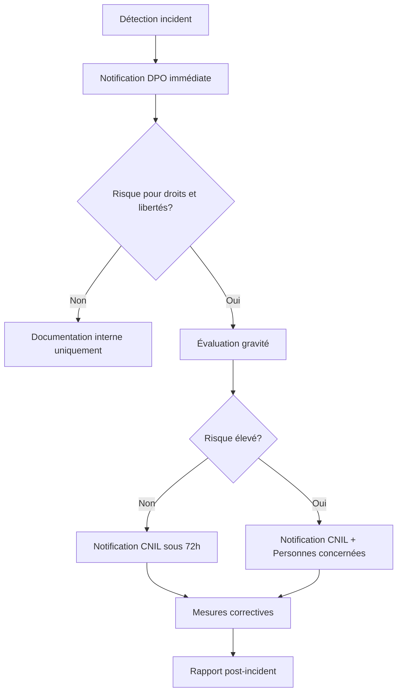

# Politique de Protection des Données Personnelles (RGPD)
# Plateforme Korrigo PMF

> **Version**: 1.0.0  
> **Date**: 30 Janvier 2026  
> **Public**: Responsables d'établissement, DPO, Chefs d'établissement  
> **Conformité**: RGPD (UE) 2016/679, Loi Informatique et Libertés (France)  
> **Autorité de contrôle**: CNIL (Commission Nationale de l'Informatique et des Libertés)

---

## 📋 Table des Matières

1. [Introduction](#introduction)
2. [Cadre Juridique](#cadre-juridique)
3. [Responsabilités et Rôles](#responsabilités-et-rôles)
4. [Inventaire des Traitements de Données](#inventaire-des-traitements-de-données)
5. [Principes de Protection des Données](#principes-de-protection-des-données)
6. [Droits des Personnes Concernées](#droits-des-personnes-concernées)
7. [Mesures de Sécurité](#mesures-de-sécurité)
8. [Conservation et Suppression des Données](#conservation-et-suppression-des-données)
9. [Transferts de Données](#transferts-de-données)
10. [Violations de Données](#violations-de-données)
11. [Analyse d'Impact (AIPD)](#analyse-dimpact-aipd)
12. [Conformité CNIL](#conformité-cnil)
13. [Documentation et Registre](#documentation-et-registre)
14. [Annexes](#annexes)

---

## 1. Introduction

### 1.1 Objet du Document

La présente politique définit les règles de protection des données personnelles applicables à la plateforme **Korrigo PMF**, un système de correction numérique de copies d'examens destiné aux lycées français.

### 1.2 Périmètre

Cette politique s'applique à :
- **L'établissement scolaire** (lycée) utilisant Korrigo PMF
- **Les utilisateurs** : enseignants, personnel administratif, élèves
- **Les données traitées** : informations élèves, copies numérisées, notes, annotations
- **Les infrastructures** : serveurs, bases de données, sauvegardes

### 1.3 Objectifs

- **Conformité légale** : Respecter le RGPD et la législation française
- **Protection des mineurs** : Garantir la sécurité des données des élèves
- **Transparence** : Informer les personnes concernées de leurs droits
- **Responsabilité** : Établir les rôles et responsabilités
- **Sécurité** : Mettre en œuvre des mesures techniques et organisationnelles

---

## 2. Cadre Juridique

### 2.1 Textes Applicables

| Texte | Référence | Portée |
|-------|-----------|--------|
| **RGPD** | Règlement (UE) 2016/679 | Protection données UE |
| **Loi Informatique et Libertés** | Loi n° 78-17 du 6 janvier 1978 (modifiée) | Droit français |
| **Code de l'éducation** | Articles L. 131-1 et suivants | Données éducatives |
| **Décret n° 2019-536** | 24 mai 2019 | CNIL - Éducation nationale |
| **Référentiel CNIL Éducation** | Juillet 2020 | Bonnes pratiques sectorielles |

### 2.2 Base Légale du Traitement

**Article 6.1 RGPD** : Le traitement des données par Korrigo PMF repose sur :
- **6.1.e - Mission d'intérêt public** : Évaluation pédagogique (article L. 131-1 du Code de l'éducation)
- **6.1.a - Consentement** (optionnel) : Portail élève (consultation notes)

**Article 9 RGPD** : Aucune donnée sensible (santé, origine, religion) n'est collectée.

### 2.3 Mineurs et Consentement

**Article 8 RGPD** : Les élèves mineurs (< 18 ans) nécessitent :
- **Autorisation parentale** pour l'accès au portail numérique
- **Information claire** des finalités du traitement
- **Possibilité de retrait** du consentement à tout moment

---

## 3. Responsabilités et Rôles

### 3.1 Matrice de Responsabilités RGPD

| Rôle RGPD | Entité | Responsabilités |
|-----------|--------|----------------|
| **Responsable de traitement** | Établissement scolaire (Proviseur) | - Définir finalités et moyens<br>- Garantir conformité RGPD<br>- Désigner DPO si nécessaire<br>- Tenir registre des traitements |
| **Sous-traitant** | Korrigo PMF (si déployé en SaaS) | - Traiter données selon instructions<br>- Garantir sécurité technique<br>- Aider au respect des droits<br>- Notifier violations |
| **Délégué à la Protection des Données (DPO)** | DPO académie ou établissement | - Conseiller sur conformité<br>- Contrôler application politique<br>- Point de contact CNIL<br>- Sensibiliser utilisateurs |
| **Administrateur technique** | Admin NSI ou DSI | - Gérer accès et permissions<br>- Appliquer mesures sécurité<br>- Effectuer sauvegardes<br>- Journaliser actions critiques |
| **Utilisateurs finaux** | Enseignants, Secrétariat, Élèves | - Respecter charte utilisation<br>- Signaler incidents sécurité<br>- Exercer droits RGPD |

### 3.2 Accord de Sous-Traitance (DPA)

**Si Korrigo PMF est hébergé par un tiers** :
- Conclure un **Data Processing Agreement** conforme à l'article 28 RGPD
- Vérifier les certifications du prestataire (ISO 27001, HDS si données sensibles)
- Documenter les mesures de sécurité du sous-traitant

**Référence** : `docs/legal/ACCORD_TRAITEMENT_DONNEES.md`

---

## 4. Inventaire des Traitements de Données

### 4.1 Traitement 1 : Gestion des Élèves

| Critère | Détail |
|---------|--------|
| **Finalité** | Identification élèves, liaison copies-élèves |
| **Catégories de données** | - INE (Identifiant National Élève)<br>- Nom, prénom<br>- Classe<br>- Email (optionnel) |
| **Personnes concernées** | Élèves du lycée (mineurs et majeurs) |
| **Base légale** | Mission d'intérêt public (art. 6.1.e RGPD) |
| **Durée conservation** | 1 an après fin scolarité dans l'établissement |
| **Destinataires** | Enseignants, Secrétariat, Admin |
| **Transferts hors UE** | Non |
| **Mesures sécurité** | - Authentification enseignants<br>- Logs d'accès<br>- Chiffrement base de données |

**Table DB** : `students_student` (cf. `docs/DATABASE_SCHEMA.md`)

---

### 4.2 Traitement 2 : Correction de Copies Numérisées

| Critère | Détail |
|---------|--------|
| **Finalité** | - Numérisation copies examens<br>- Correction numérique<br>- Calcul notes<br>- Export vers Pronote |
| **Catégories de données** | - Copies numérisées (PDF/images)<br>- Numéro d'anonymat<br>- Annotations enseignants<br>- Notes obtenues<br>- Métadonnées (date, examen, classe) |
| **Personnes concernées** | Élèves du lycée |
| **Base légale** | Mission d'intérêt public (évaluation pédagogique) |
| **Durée conservation** | - **Copies numérisées** : 1 an après examen<br>- **Notes** : 1 an (archivage Pronote)<br>- **Annotations** : 1 an après examen |
| **Destinataires** | - Enseignants correcteurs<br>- Élève concerné (portail)<br>- Export Pronote (notes uniquement) |
| **Transferts hors UE** | Non |
| **Mesures sécurité** | - Anonymisation copies (masquage nom)<br>- Verrouillage copies (anti-concurrence)<br>- Audit trail (GradingEvent)<br>- Accès basé rôles (RBAC) |

**Tables DB** : `exams_exam`, `exams_copy`, `grading_annotation`, `grading_gradingevent`

---

### 4.3 Traitement 3 : Portail Élève (Consultation Notes)

| Critère | Détail |
|---------|--------|
| **Finalité** | Consultation copies corrigées par les élèves |
| **Catégories de données** | - INE + Nom (authentification)<br>- Copies finales PDF<br>- Notes obtenues |
| **Personnes concernées** | Élèves ayant consenti (optionnel) |
| **Base légale** | **Consentement éclairé** (art. 6.1.a RGPD)<br>+ Autorisation parentale si mineur |
| **Durée conservation** | Accès désactivé 1 mois après fin année scolaire |
| **Destinataires** | Élève concerné uniquement (isolation des données) |
| **Transferts hors UE** | Non |
| **Mesures sécurité** | - Authentification INE + Nom de famille<br>- Session sécurisée (SameSite, expiration)<br>- Filtrage strict (queryset student_id)<br>- Logs téléchargements |

**Endpoint critique** : `/api/grading/copies/<id>/final-pdf/` (cf. `SECURITY_PERMISSIONS_INVENTORY.md`)

---

### 4.4 Traitement 4 : Audit et Traçabilité

| Critère | Détail |
|---------|--------|
| **Finalité** | - Détection anomalies<br>- Conformité RGPD<br>- Résolution litiges |
| **Catégories de données** | - Logs d'actions utilisateurs<br>- Adresses IP (optionnel)<br>- Timestamps<br>- Actions effectuées |
| **Personnes concernées** | Enseignants, Admin, Élèves |
| **Base légale** | Intérêt légitime (art. 6.1.f RGPD) - sécurité système |
| **Durée conservation** | 6 mois (CNIL recommandation) |
| **Destinataires** | Administrateur technique, DPO |
| **Transferts hors UE** | Non |
| **Mesures sécurité** | - Pseudonymisation IP<br>- Accès restreint Admin<br>- Suppression automatique après 6 mois |

**Table DB** : `grading_gradingevent`

---

## 5. Principes de Protection des Données

### 5.1 Licéité, Loyauté, Transparence

**Mesures appliquées** :
- ✅ **Information préalable** : Politique de confidentialité accessible (`docs/legal/POLITIQUE_CONFIDENTIALITE.md`)
- ✅ **Finalités explicites** : Correction examens, consultation notes
- ✅ **Pas de traitement caché** : Aucune collecte non documentée

### 5.2 Limitation des Finalités

**Principe** : Les données ne peuvent être utilisées que pour les finalités déclarées.

**Application** :
- ❌ **Interdit** : Utiliser copies pour entraîner IA sans consentement
- ❌ **Interdit** : Revendre données à tiers commerciaux
- ✅ **Autorisé** : Export notes vers Pronote (finalité compatible)

### 5.3 Minimisation des Données

**Principe** : Collecter uniquement les données nécessaires.

**Application** :
| Donnée | Nécessité | Justification |
|--------|-----------|---------------|
| INE | ✅ Oui | Identifiant unique élève (obligation EN) |
| Nom, Prénom | ✅ Oui | Identification copies |
| Email | ⚠️ Optionnel | Notifications (désactivable) |
| Photo élève | ❌ Non | Non collectée |
| Adresse postale | ❌ Non | Non pertinente |
| Numéro téléphone | ❌ Non | Non collectée |

### 5.4 Exactitude

**Mesures** :
- Import élèves depuis **Pronote** (source de référence)
- Procédure de correction en cas d'erreur (cf. section 6.5)
- Validation manuelle lors de l'identification copies

### 5.5 Limitation de la Conservation

**Référence** : Section 8 (Conservation et Suppression)

| Type de données | Durée | Base légale |
|----------------|-------|-------------|
| Données élèves (INE, nom, classe) | 1 an après fin scolarité | Code de l'éducation |
| Copies numérisées (PDF) | 1 an après examen | Archivage pédagogique |
| Notes et annotations | 1 an après examen | Export Pronote (archivage externe) |
| Logs d'audit | 6 mois | Recommandation CNIL |

### 5.6 Intégrité et Confidentialité

**Mesures techniques** (cf. `docs/security/MANUEL_SECURITE.md`) :
- ✅ Chiffrement base de données au repos (PostgreSQL)
- ✅ HTTPS obligatoire (TLS 1.2+, HSTS)
- ✅ Authentification forte (rate limiting, sessions sécurisées)
- ✅ Contrôle d'accès basé rôles (RBAC)
- ✅ Audit trail complet (GradingEvent)

### 5.7 Responsabilité (Accountability)

**Mesures organisationnelles** :
- ✅ Documentation complète (registre des traitements)
- ✅ Politique RGPD formalisée (ce document)
- ✅ Procédures d'exercice des droits (section 6)
- ✅ Analyse d'impact (AIPD) réalisée (section 11)
- ✅ Formation utilisateurs (charte d'utilisation)

---

## 6. Droits des Personnes Concernées

### 6.1 Vue d'Ensemble

Les personnes concernées (élèves, enseignants) disposent des droits suivants :

| Droit | Article RGPD | Applicable | Délai Réponse |
|-------|-------------|-----------|---------------|
| **Droit d'accès** | Art. 15 | ✅ Oui | 1 mois |
| **Droit de rectification** | Art. 16 | ✅ Oui | 1 mois |
| **Droit à l'effacement** | Art. 17 | ⚠️ Limité* | 1 mois |
| **Droit à la limitation** | Art. 18 | ⚠️ Limité* | 1 mois |
| **Droit à la portabilité** | Art. 20 | ✅ Oui | 1 mois |
| **Droit d'opposition** | Art. 21 | ⚠️ Limité** | 1 mois |
| **Droits relatifs aux décisions automatisées** | Art. 22 | ❌ Non*** | - |

**Notes** :
- \* Limité par obligations légales (archivage notes, Code de l'éducation)
- \*\* Opposition possible sauf mission d'intérêt public (évaluation)
- \*\*\* Aucune décision automatisée (pas d'IA de notation)

### 6.2 Droit d'Accès (Art. 15 RGPD)

**Procédure** :
1. **Demande** : Email à `dpo@lycee-exemple.fr` ou courrier postal
2. **Vérification identité** : Copie pièce d'identité (mineur : représentant légal)
3. **Extraction données** :
   ```sql
   -- Exemple requête SQL (exécutée par Admin)
   SELECT s.ine, s.first_name, s.last_name, s.class_name, s.email,
          c.anonymous_id, c.status, c.graded_at, a.content, a.score_delta
   FROM students_student s
   LEFT JOIN exams_copy c ON c.student_id = s.id
   LEFT JOIN grading_annotation a ON a.copy_id = c.id
   WHERE s.ine = 'INE_ELEVE';
   ```
4. **Fourniture** : PDF récapitulatif + copies finales
5. **Délai** : 1 mois (prolongeable 2 mois si complexité)

**Données fournies** :
- Informations élève (INE, nom, prénom, classe, email)
- Liste examens et notes obtenues
- Copies numérisées finales (PDF)
- Annotations enseignants
- Logs d'accès au portail (si demandé)

**Outil** : Commande Django `export_student_data --ine <INE>`

---

### 6.3 Droit de Rectification (Art. 16 RGPD)

**Cas d'usage** :
- Nom/prénom mal orthographié
- Classe erronée
- Email incorrect

**Procédure** :
1. Demande motivée (erreur matérielle vs contestation note)
2. Validation par Proviseur adjoint
3. Correction en base de données (Admin)
4. Notification élève de la modification

**Limite** : Les **notes** ne peuvent être modifiées via ce droit (procédure académique de contestation applicable).

---

### 6.4 Droit à l'Effacement (Art. 17 RGPD)

**Limitations légales** :
- ❌ **Impossible pendant année scolaire** : Mission d'intérêt public
- ❌ **Impossible pour notes archivées** : Obligation Code de l'éducation (conservation 1 an)
- ✅ **Possible après durée conservation** : Suppression automatique (cf. section 8)

**Cas d'effacement anticipé** :
- Retrait consentement portail élève → Désactivation accès (notes conservées)
- Élève quittant établissement → Suppression 1 mois après départ (sauf notes exportées Pronote)

---

### 6.5 Droit de Rectification (Art. 16 RGPD)

**Procédure simplifiée** :

**Pour les élèves** :
```
Étape 1 : Contact secrétariat ou DPO
Étape 2 : Vérification identité
Étape 3 : Correction base de données
Étape 4 : Confirmation sous 7 jours
```

**Pour les enseignants** :
- Auto-correction possible via interface Admin (champs nom, email)

---

### 6.6 Droit à la Portabilité (Art. 20 RGPD)

**Applicable** : Copies finales et notes (traitement basé sur consentement ou contrat)

**Format fourni** :
- **JSON structuré** :
  ```json
  {
    "student": {
      "ine": "1234567890A",
      "name": "DUPONT Jean",
      "class": "TG2"
    },
    "exams": [
      {
        "exam_name": "Bac Blanc Maths TG - Janvier 2026",
        "date": "2026-01-15",
        "score": 15.5,
        "max_score": 20,
        "annotations": [...]
      }
    ]
  }
  ```
- **PDF** : Copies finales annotées

**Délai** : 1 mois

---

### 6.7 Formulaires de Demande

**Référence** : `docs/legal/FORMULAIRES_CONSENTEMENT.md`

Formulaires types :
- Demande d'accès (Art. 15)
- Demande de rectification (Art. 16)
- Demande d'effacement (Art. 17)
- Retrait consentement portail élève

---

## 7. Mesures de Sécurité

**Référence technique complète** : `docs/security/MANUEL_SECURITE.md`

### 7.1 Mesures Techniques

| Catégorie | Mesures Implémentées | Niveau |
|-----------|---------------------|--------|
| **Authentification** | - Sessions Django sécurisées<br>- Rate limiting (5 tentatives/15min)<br>- Authentification double (User + Student session)<br>- Pas de mot de passe faible autorisé (min 6 car.) | ⚠️ Moyen |
| **Contrôle d'accès** | - RBAC (Admin/Teacher/Student)<br>- Permission classes DRF<br>- Queryset filtering (élèves voient leurs données uniquement)<br>- Object-level permissions (annotations) | ✅ Fort |
| **Chiffrement** | - HTTPS obligatoire (TLS 1.2+)<br>- HSTS (1 an, includeSubDomains, preload)<br>- Cookies sécurisés (SameSite=Lax)<br>- Base de données au repos (PostgreSQL) | ✅ Fort |
| **Intégrité** | - CSRF protection (tokens)<br>- CORS strict (origines explicites)<br>- CSP (Content Security Policy) | ✅ Fort |
| **Audit** | - Logs GradingEvent (tous événements correction)<br>- Logs téléchargements PDF<br>- Conservation 6 mois | ✅ Fort |
| **Anonymisation** | - Masquage nom élève sur copies (STAGING→READY)<br>- Numéro anonymat unique (UUID) | ✅ Fort |

**Amélioration recommandée** :
- ⚠️ Augmenter mot de passe minimum à 12 caractères
- ⚠️ Implémenter 2FA pour Admins
- ⚠️ Étendre rate limiting à tous endpoints critiques

---

### 7.2 Mesures Organisationnelles

| Mesure | Description | Responsable |
|--------|-------------|-------------|
| **Charte d'utilisation** | Signature obligatoire enseignants/admin | Chef d'établissement |
| **Formation RGPD** | Session annuelle (2h) | DPO |
| **Gestion des accès** | Revue trimestrielle, désactivation comptes inactifs | Admin NSI |
| **Sauvegardes** | Quotidiennes (rétention 30 jours), hebdomadaires (6 mois) | Admin NSI |
| **Plan de continuité** | Procédure de restauration documentée (RPO 24h, RTO 4h) | DSI/Admin |
| **Gestion incidents** | Procédure de notification CNIL (<72h si violation) | Proviseur + DPO |

---

### 7.3 Sécurité Physique

**Si serveur hébergé dans l'établissement** :
- 🔒 Salle serveur fermée à clé (accès restreint)
- 📹 Vidéosurveillance (optionnel)
- 🔥 Système anti-incendie
- ⚡ Onduleur (UPS) pour coupures électriques
- 🌡️ Climatisation régulée

**Si hébergement externe** :
- Datacenter certifié Tier III minimum
- ISO 27001, SOC 2 Type II
- Clause contractuelle DPA (Art. 28 RGPD)

---

## 8. Conservation et Suppression des Données

**Référence détaillée** : `docs/security/GESTION_DONNEES.md`

### 8.1 Durées de Conservation

| Type de données | Durée active | Durée archivage | Suppression finale | Base légale |
|----------------|--------------|-----------------|-------------------|-------------|
| **Données élèves (INE, nom, classe)** | Année scolaire | 1 an après fin scolarité | Suppression définitive | Code de l'éducation |
| **Copies numérisées (PDF)** | 1 an après examen | - | Suppression automatique | Archivage pédagogique |
| **Notes et annotations** | 1 an après examen | Export Pronote (archivage externe) | Suppression Korrigo | Code de l'éducation |
| **Logs d'audit (GradingEvent)** | 6 mois | - | Suppression automatique | Recommandation CNIL |
| **Sessions utilisateurs** | 2 semaines (inactivité) | - | Expiration automatique | Sécurité technique |
| **Brouillons (DraftState)** | 30 jours après finalisation copie | - | Suppression automatique | Optimisation stockage |

---

### 8.2 Procédures de Suppression

**Suppression automatisée** (tâches Celery) :
```python
# Exemple tâche Django (backend/core/tasks.py)
@periodic_task(run_every=crontab(hour=2, minute=0))  # 2h du matin
def purge_expired_data():
    # Suppression copies > 1 an après examen
    threshold = timezone.now() - timedelta(days=365)
    Copy.objects.filter(exam__date__lt=threshold).delete()
    
    # Suppression logs > 6 mois
    log_threshold = timezone.now() - timedelta(days=180)
    GradingEvent.objects.filter(timestamp__lt=log_threshold).delete()
    
    # Suppression sessions expirées
    engine = import_module(settings.SESSION_ENGINE)
    engine.SessionStore.clear_expired()
```

**Suppression manuelle** (sur demande DPO) :
```bash
# Commande Django
python manage.py delete_student_data --ine <INE> --confirm
```

**Vérification** :
- Logs de suppression (AuditEvent)
- Rapport mensuel au DPO (nombre suppressions)

---

### 8.3 Archivage Externe (Pronote)

**Processus** :
1. Export CSV notes (`/api/exams/{id}/export_csv/`)
2. Import dans Pronote (responsabilité établissement)
3. Pronote devient responsable archivage long terme
4. Korrigo PMF peut supprimer après export

**Clause de responsabilité** :
> L'établissement est responsable de l'archivage réglementaire des notes via Pronote. Korrigo PMF n'assure qu'un archivage temporaire (1 an).

---

## 9. Transferts de Données

### 9.1 Transferts Hors UE

**Statut actuel** : ❌ **AUCUN TRANSFERT HORS UE**

**Raisons** :
- Serveurs hébergés en France (ou UE)
- Aucun sous-traitant hors UE
- Pas de cloud public (AWS, Google Cloud) sans garanties

**Si transfert futur nécessaire** :
- ✅ Clauses contractuelles types (CCT) de la Commission Européenne
- ✅ Analyse des lois du pays tiers (Schrems II)
- ✅ Mesures supplémentaires (chiffrement bout en bout)

---

### 9.2 Transferts Internes (Établissement)

**Export Pronote** :
- ✅ **Légitime** : Système de gestion scolaire officiel
- ✅ **Minimisation** : Export notes uniquement (pas de copies PDF)
- ✅ **Sécurité** : CSV chiffré ou transfert SFTP

**Partage entre enseignants** :
- ⚠️ **Interdit** : Copier PDF copies sur clés USB personnelles
- ✅ **Autorisé** : Consultation via plateforme (logs tracés)

---

## 10. Violations de Données

### 10.1 Définition

**Violation de données personnelles** (Art. 33-34 RGPD) :
> Violation de la sécurité entraînant de manière accidentelle ou illicite la destruction, la perte, l'altération, la divulgation non autorisée de données ou l'accès non autorisé à des données.

**Exemples** :
- 🚨 Piratage du serveur (exfiltration base de données)
- 🚨 Copie sauvegarde volée (absence de chiffrement)
- 🚨 Enseignant partage accès avec tiers
- 🚨 Bug logiciel exposant données élèves d'autres classes

---

### 10.2 Procédure de Notification CNIL

**Délai** : **72 heures** après prise de connaissance (Art. 33 RGPD)

**Processus** :


**Contact CNIL** :
- Téléservice : https://www.cnil.fr/notifications
- Formulaire en ligne (certificat électronique ou FranceConnect)

---

### 10.3 Notification des Personnes Concernées

**Obligation si risque élevé** (Art. 34 RGPD) :
- **Quand** : Risque préjudice important (usurpation identité, discrimination)
- **Comment** : Email, courrier postal, affichage établissement
- **Contenu** :
  - Nature de la violation
  - Point de contact (DPO)
  - Conséquences probables
  - Mesures prises et recommandations (ex: changer mot de passe)

**Exemples de risque élevé** :
- ✅ Notification requise : Fuite base données élèves (INE + noms + classes)
- ❌ Notification non requise : Logs techniques anonymisés

---

### 10.4 Registre des Violations

**Documentation obligatoire** (Art. 33.5 RGPD) :
- Date et heure de la violation
- Faits (ce qui s'est passé)
- Données concernées (volume, types)
- Conséquences (avérées ou potentielles)
- Mesures prises (correction, prévention récurrence)
- Notification CNIL/personnes (oui/non, justification)

**Outil** : Feuille de calcul DPO ou module Django `SecurityIncident`

---

## 11. Analyse d'Impact (AIPD)

### 11.1 Nécessité

**Critères CNIL** (Art. 35 RGPD) - AIPD obligatoire si :
- ✅ Traitement à grande échelle de données personnelles
- ⚠️ Traitement de données de mineurs (élèves)
- ❌ Profilage ou décision automatisée (Korrigo n'en fait pas)
- ❌ Données sensibles (santé, origine) - **Non concerné**

**Verdict** : ⚠️ **AIPD RECOMMANDÉE** (non strictement obligatoire mais bonne pratique)

---

### 11.2 Résumé AIPD Korrigo PMF

**Date réalisation** : Janvier 2026  
**Responsable** : DPO Académie + Proviseur

#### Risques Identifiés

| Risque | Gravité | Vraisemblance | Niveau | Mesures d'atténuation |
|--------|---------|---------------|--------|----------------------|
| **Accès non autorisé base données** | Élevée | Faible | **Moyen** | - Authentification forte<br>- Pare-feu<br>- Logs d'accès<br>- Chiffrement DB |
| **Divulgation notes élèves** | Élevée | Faible | **Moyen** | - Queryset filtering strict<br>- Permission classes<br>- Audit trail |
| **Fuite données via portail élève** | Moyenne | Très faible | **Faible** | - Authentification INE+Nom<br>- Session expiration<br>- Logs téléchargements |
| **Perte données (crash serveur)** | Élevée | Faible | **Moyen** | - Sauvegardes quotidiennes<br>- Plan de continuité<br>- Rétention 30j+6mois |
| **Réidentification copies anonymes** | Moyenne | Très faible | **Faible** | - Numéro anonymat UUID<br>- Masquage nom automatique<br>- Séparation données |
| **Utilisation détournée annotations** | Faible | Très faible | **Faible** | - Limitation finalités<br>- Charte utilisation<br>- Formation enseignants |

**Niveau de risque résiduel** : **ACCEPTABLE** (avec mesures en place)

---

### 11.3 Validation

**Consultation DPO** : ✅ Effectuée  
**Avis représentants du personnel** : ✅ Effectué (réunion CSA du 12/01/2026)  
**Révision** : Annuelle ou si modification majeure traitement

---

## 12. Conformité CNIL

### 12.1 Obligations Spécifiques Éducation Nationale

**Référentiel CNIL Éducation** (Juillet 2020) - Points de contrôle :

| Exigence | Statut Korrigo | Preuve |
|----------|---------------|--------|
| **Consentement éclairé mineur** | ✅ Conforme | Formulaire autorisation parentale portail élève |
| **Limitation accès données élèves** | ✅ Conforme | RBAC + queryset filtering |
| **Sécurité accès réseau** | ✅ Conforme | HTTPS obligatoire, HSTS, authentification |
| **Conservation limitée** | ✅ Conforme | Suppression automatique 1 an après examen |
| **Droit d'accès facilité** | ✅ Conforme | Procédure documentée + commande export |
| **Information transparente** | ✅ Conforme | Politique confidentialité en français simple |
| **Pas de profilage élèves** | ✅ Conforme | Aucun traitement automatisé de décision |

---

### 12.2 Dispenses et Simplifications

**Pas de déclaration CNIL requise** (depuis RGPD 2018) :
- ❌ Plus de déclaration préalable
- ✅ Registre des traitements interne suffit

**Pas de DPO obligatoire** (sauf si > 250 employés OU traitement grande échelle sensible) :
- ⚠️ Recommandé pour établissement : DPO académique mutualisé

---

### 12.3 Contacts et Ressources

**CNIL Éducation** :
- Email : education@cnil.fr
- Téléphone : 01 53 73 22 22
- Site : https://www.cnil.fr/fr/education

**DPO Académie** :
- Rectorat : dpd@ac-exemple.fr
- Référent établissement : dpo.lycee@ac-exemple.fr

---

## 13. Documentation et Registre

### 13.1 Registre des Activités de Traitement

**Obligation Art. 30 RGPD** : Tenir un registre à jour de tous les traitements.

**Contenu minimal** :
- Nom et coordonnées responsable de traitement (Proviseur)
- Finalités du traitement
- Catégories de personnes concernées et de données
- Destinataires des données
- Transferts hors UE (le cas échéant)
- Durées de conservation
- Mesures de sécurité techniques et organisationnelles

**Emplacement** : `docs/security/REGISTRE_TRAITEMENTS_RGPD.xlsx`

**Exemple entrée** :
```
Traitement n°1 : Correction de Copies Numérisées
- Responsable : M. Proviseur, Lycée Exemple
- Finalité : Numérisation copies examens, correction numérique, calcul notes
- Personnes concernées : Élèves (mineurs et majeurs)
- Données : Copies PDF, numéro anonymat, annotations, notes
- Base légale : Mission d'intérêt public (Code de l'éducation)
- Destinataires : Enseignants, élèves (portail), Pronote
- Conservation : 1 an après examen
- Mesures sécurité : HTTPS, RBAC, audit trail, anonymisation
- Sous-traitant : Aucun (hébergement interne)
- Transfert hors UE : Non
```

---

### 13.2 Documentation Associée

**Documents de référence** :
- `docs/security/POLITIQUE_RGPD.md` (ce document)
- `docs/security/MANUEL_SECURITE.md`
- `docs/security/GESTION_DONNEES.md`
- `docs/legal/POLITIQUE_CONFIDENTIALITE.md`
- `docs/legal/ACCORD_TRAITEMENT_DONNEES.md`
- `docs/legal/FORMULAIRES_CONSENTEMENT.md`

**Versions et historique** :
- Versionnement Git (toutes modifications tracées)
- Revue annuelle obligatoire (Proviseur + DPO)

---

### 13.3 Preuves de Conformité (Accountability)

**À conserver** :
- ✅ Registre des traitements
- ✅ AIPD (si réalisée)
- ✅ Contrats DPA (sous-traitants)
- ✅ Procès-verbaux formation RGPD
- ✅ Demandes d'exercice de droits (registre)
- ✅ Registre des violations de données
- ✅ Logs d'audit (6 mois)
- ✅ Chartes d'utilisation signées

**Conservation** : 5 ans (prescription CNIL)

---

## 14. Annexes

### Annexe A : Glossaire RGPD

| Terme | Définition |
|-------|------------|
| **RGPD** | Règlement Général sur la Protection des Données (UE 2016/679) |
| **CNIL** | Commission Nationale de l'Informatique et des Libertés |
| **DPO (DPD)** | Délégué à la Protection des Données (Data Protection Officer) |
| **Responsable de traitement** | Entité qui détermine finalités et moyens du traitement (ici : l'établissement) |
| **Sous-traitant** | Entité qui traite les données pour le compte du responsable |
| **Personne concernée** | Individu dont les données sont traitées (élève, enseignant) |
| **INE** | Identifiant National Élève (numéro unique attribué par l'Éducation Nationale) |
| **AIPD** | Analyse d'Impact relative à la Protection des Données (PIA en anglais) |
| **DPA** | Data Processing Agreement (Accord de Traitement de Données) |

---

### Annexe B : Modèle de Demande d'Exercice de Droits

**Formulaire type** (disponible secrétariat et site web lycée) :

```
DEMANDE D'EXERCICE DE DROITS RGPD
Plateforme Korrigo PMF - Lycée [NOM]

Je soussigné(e) : _________________________________
Nom : ______________ Prénom : ______________
INE (si élève) : ______________
Qualité : ☐ Élève ☐ Représentant légal ☐ Enseignant

Demande l'exercice du droit suivant :
☐ Droit d'accès (Art. 15 RGPD)
☐ Droit de rectification (Art. 16 RGPD)
☐ Droit à l'effacement (Art. 17 RGPD)
☐ Droit à la portabilité (Art. 20 RGPD)
☐ Retrait de consentement (portail élève)

Motif de la demande :
_______________________________________________
_______________________________________________

Date : __________  Signature : __________

Réponse du lycée (réservé administration) :
Réception : __________ Traitement : __________
Réponse fournie : ☐ Oui ☐ Non
Justification si refus : _________________________
```

**Envoi** : dpo@lycee-exemple.fr ou secrétariat

---

### Annexe C : Contacts

| Rôle | Contact | Email | Téléphone |
|------|---------|-------|-----------|
| **Responsable de traitement** | M./Mme Proviseur | proviseur@lycee-exemple.fr | 01 23 45 67 89 |
| **DPO Établissement** | M./Mme DPO | dpo@lycee-exemple.fr | 01 23 45 67 90 |
| **DPO Académie** | Rectorat | dpd@ac-exemple.fr | 01 23 45 67 91 |
| **Administrateur technique** | Admin NSI | admin.nsi@lycee-exemple.fr | Interne |
| **CNIL** | Commission | https://www.cnil.fr/plainte | 01 53 73 22 22 |

---

### Annexe D : Références Légales

**Textes de loi** :
- [RGPD (EUR-Lex)](https://eur-lex.europa.eu/eli/reg/2016/679/oj)
- [Loi Informatique et Libertés (Légifrance)](https://www.legifrance.gouv.fr/loda/id/JORFTEXT000000886460)
- [Code de l'éducation (Légifrance)](https://www.legifrance.gouv.fr/codes/id/LEGITEXT000006071191/)

**Guides CNIL** :
- [Référentiel Éducation (2020)](https://www.cnil.fr/fr/education-referentiel)
- [Guide du sous-traitant](https://www.cnil.fr/fr/sous-traitance-referentiel)
- [AIPD - Outils et modèles](https://www.cnil.fr/fr/outils-pia)

---

## 🔄 Suivi et Révision

**Révision annuelle** : Janvier de chaque année  
**Responsable** : DPO + Proviseur  
**Prochaine révision** : Janvier 2027

**Modifications** :
- Toute modification majeure du traitement nécessite une mise à jour
- Changement législatif (nouveaux décrets CNIL) : révision sous 3 mois
- Incidents sécurité majeurs : révision immédiate

---

**Document approuvé par** :
- M./Mme [PROVISEUR], Responsable de traitement  
- M./Mme [DPO], Délégué à la Protection des Données  
- Date : 30 Janvier 2026

**Signature** : ______________________
