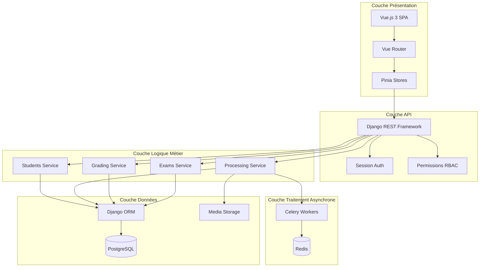
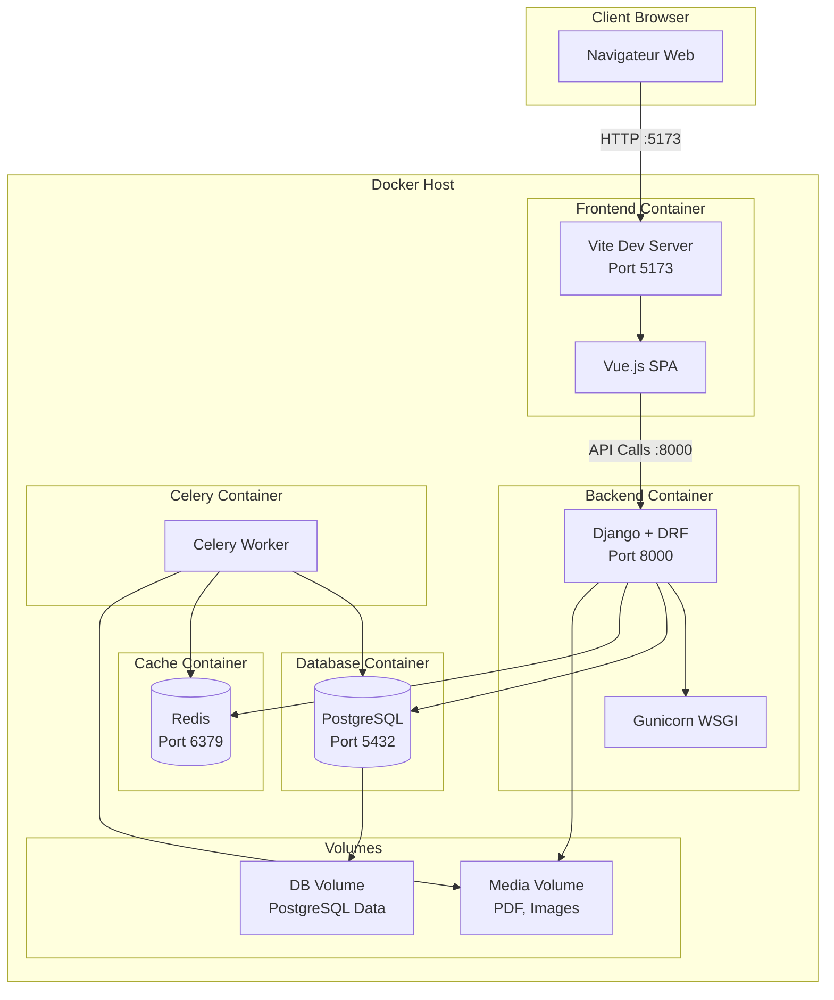
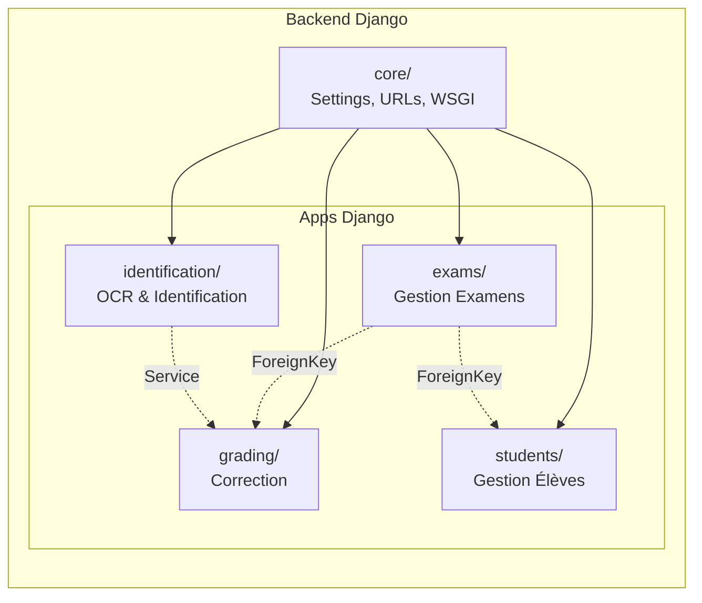
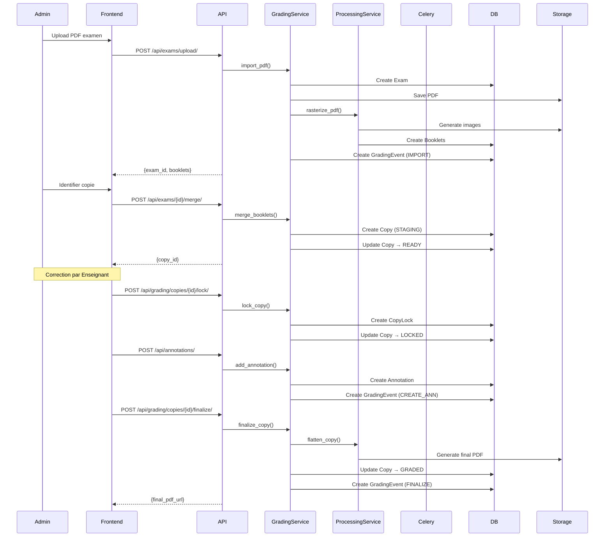
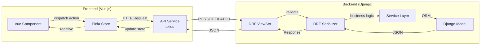

# Architecture Korrigo PMF

> **Version**: 2.0.0  
> **Date**: Février 2026  
> **Public**: Développeurs, Architectes, DevOps

Ce document décrit l'architecture complète de la plateforme Korrigo PMF, une solution de correction numérique d'examens scannés pour établissements scolaires.

---

## 📋 Table des Matières

1. [Vue d'Ensemble](#vue-densemble)
2. [Stack Technique](#stack-technique)
3. [Architecture en Couches](#architecture-en-couches)
4. [Diagramme d'Architecture](#diagramme-darchitecture)
5. [Flux de Données](#flux-de-données)
6. [Infrastructure Docker](#infrastructure-docker)
7. [Patterns et Principes](#patterns-et-principes)
8. [Justifications Techniques](#justifications-techniques)

---

## Vue d'Ensemble

### Contexte

Korrigo PMF est une plateforme locale de correction dématérialisée pour examens internes (Bac Blanc, contrôles). Elle permet de:
- Numériser des copies d'examens scannées en masse
- Identifier les copies via OCR assisté
- Corriger numériquement avec annotations vectorielles
- Exporter les résultats vers Pronote
- Permettre aux élèves de consulter leurs copies corrigées

### Contraintes Spécifiques

- **Sans QR Code**: Identification semi-automatique (OCR + validation humaine)
- **Déploiement Local**: Serveur interne ou cloud privé (pas de SaaS)
- **Workflow Pédagogique**: Double finalité administrative (notes) et pédagogique (consultation élève)
- **Architecture Locale**: Stockage fichiers en local (NAS/Volume Docker)

---

## Stack Technique

### Backend

| Composant | Version | Rôle |
|-----------|---------|------|
| **Python** | 3.9 | Langage principal |
| **Django** | 4.2 (LTS) | Framework web, ORM, Admin |
| **Django REST Framework** | 3.16+ | API REST |
| **PostgreSQL** | 15+ | Base de données relationnelle |
| **Redis** | 7+ | Cache, broker Celery |
| **Celery** | 5+ | Traitement asynchrone |
| **PyMuPDF (fitz)** | 1.23.26 | Manipulation PDF |
| **OpenCV** | 4.8.0 | Traitement d'images |
| **pdf2image** | - | Conversion PDF → Images |
| **Gunicorn** | - | Serveur WSGI (production) |

### Frontend

| Composant | Version | Rôle |
|-----------|---------|------|
| **Vue.js** | 3.4+ | Framework UI (Composition API) |
| **Pinia** | 2.1+ | State management |
| **Vue Router** | 4.2+ | Routing SPA |
| **Axios** | 1.13+ | Client HTTP |
| **PDF.js** | 4.0+ | Visualisation PDF |
| **Vite** | 5.1+ | Build tool, dev server |
| **TypeScript** | 5.9+ | Typage statique |

### Infrastructure

| Composant | Version | Rôle |
|-----------|---------|------|
| **Docker** | 20+ | Conteneurisation |
| **Docker Compose** | 2+ | Orchestration locale |
| **Nginx** | 1.25+ | Reverse proxy, serving static |

---

## Architecture en Couches



### Séparation des Responsabilités

#### 1. Couche Présentation (Frontend)
- **Responsabilité**: Interface utilisateur, interactions, routing
- **Technologies**: Vue.js 3, Pinia, Vue Router
- **Principe**: Composants réutilisables, state management centralisé

#### 2. Couche API (Backend - Interface)
- **Responsabilité**: Exposition des endpoints REST, authentification, permissions
- **Technologies**: Django REST Framework
- **Principe**: API-first, session-based auth, RBAC via `UserRole` (Admin, Teacher, Student)

#### 3. Couche Logique Métier (Backend - Services)
- **Responsabilité**: Logique applicative, règles métier, workflows
- **Technologies**: Services Python, transactions atomiques
- **Principe**: Service Layer Pattern, séparation concerns

#### 4. Couche Données (Backend - Persistance)
- **Responsabilité**: Accès données, persistance, intégrité
- **Technologies**: Django ORM, PostgreSQL
- **Principe**: Repository Pattern via ORM, migrations versionnées

#### 5. Couche Traitement Asynchrone
- **Responsabilité**: Tâches longues (rasterization, PDF generation)
- **Technologies**: Celery, Redis
- **Principe**: Fire-and-forget, retry logic

---

## Diagramme d'Architecture

### Architecture Globale



### Architecture Modules Backend



---

## Flux de Données

### Workflow Correction Complet



### Communication Frontend ↔ Backend



---

## Infrastructure Docker

### Services Docker Compose

Le projet utilise plusieurs configurations Docker Compose selon l'environnement:

#### 1. `docker-compose.yml` (Développement)

```yaml
services:
  - db: PostgreSQL 15 (port 5435)
  - redis: Redis 7 (port 6385)
  - backend: Django runserver (port 8088)
  - celery: Celery worker
  - frontend: Vite dev server (port 5173)
```

**Caractéristiques**:
- Hot reload activé (volumes montés)
- DEBUG=true
- CORS permissif
- Pas de SSL

#### 2. `docker-compose.prod.yml` (Production)

```yaml
services:
  - db: PostgreSQL 15 (interne)
  - redis: Redis 7 (interne)
  - backend: Gunicorn (interne)
  - celery: Celery worker
  - nginx: Reverse proxy + static serving (port 80/443)
```

**Caractéristiques**:
- DEBUG=false
- SSL activé
- CORS strict
- Static files servis par Nginx
- Logs persistants

#### 3. `docker-compose.prodlike.yml` (Tests Prod-like)

Configuration identique à prod mais:
- SSL_ENABLED=false (HTTP pour tests E2E)
- Ports exposés pour debugging

#### 4. `docker-compose.e2e.yml` (Tests E2E)

Configuration minimale pour tests Playwright:
- Backend + DB + Redis
- Seed data automatique
- Rate limiting désactivé

### Volumes Persistants

| Volume | Montage | Contenu | Criticité |
|--------|---------|---------|-----------|
| `postgres_data` | `/var/lib/postgresql/data` | Base de données | **CRITIQUE** |
| `media_volume` | `/app/media` | PDF, images, copies | **CRITIQUE** |
| `static_volume` | `/app/staticfiles` | CSS, JS, admin | Moyen |

> [!WARNING]
> **Ne JAMAIS exécuter** `docker-compose down -v` en production ! Cela détruit les volumes et toutes les données.

---

## Patterns et Principes

### 1. Service Layer Pattern

**Principe**: Séparer la logique métier des views/controllers.

**Implémentation**:
```python
# backend/grading/services.py
class GradingService:
    @staticmethod
    @transaction.atomic
    def finalize_copy(copy: Copy, user):
        # Logique métier complexe
        # Validation, calculs, transitions d'état
        # Génération PDF, audit trail
        pass
```

**Avantages**:
- Testabilité (unit tests sans HTTP)
- Réutilisabilité (plusieurs views peuvent appeler le même service)
- Transactions atomiques centralisées

### 2. Repository Pattern (via ORM)

**Principe**: Abstraction de l'accès aux données.

**Implémentation**: Django ORM agit comme repository
```python
# Accès données via ORM (repository implicite)
copies = Copy.objects.filter(status=Copy.Status.READY)
```

### 3. State Machine Pattern

**Principe**: Gestion des transitions d'état avec validation.

**Implémentation**: Statuts Copy
```
STAGING → READY → LOCKED → GRADED
```

Chaque transition est validée et auditée via `GradingEvent`.

### 4. Audit Trail Pattern

**Principe**: Traçabilité complète des actions.

**Implémentation**: Modèle `GradingEvent`
```python
GradingEvent.objects.create(
    copy=copy,
    action=GradingEvent.Action.FINALIZE,
    actor=user,
    metadata={'score': final_score}
)
```

### 5. Optimistic Locking

**Principe**: Gestion de la concurrence sans blocage DB.

**Implémentation**: `CopyLock` avec token et expiration
```python
class CopyLock(models.Model):
    copy = OneToOneField(Copy)
    owner = ForeignKey(User)
    token = UUIDField()
    expires_at = DateTimeField()
```

### 6. Normalized Coordinates

**Principe**: Coordonnées indépendantes de la résolution.

**Implémentation**: Annotations en [0, 1]
```python
class Annotation(models.Model):
    x = FloatField()  # 0.0 à 1.0
    y = FloatField()  # 0.0 à 1.0
    w = FloatField()  # 0.0 à 1.0
    h = FloatField()  # 0.0 à 1.0
```

**Avantage**: Annotations valides quelle que soit la taille d'affichage.

---

## Justifications Techniques

### Pourquoi Django ?

✅ **ORM puissant**: Gestion complexe des relations (Exam → Booklet → Copy → Annotation)  
✅ **Admin intégré**: Interface d'administration prête pour le staff  
✅ **Écosystème mature**: DRF, Celery, nombreux packages  
✅ **Sécurité**: CSRF, XSS, SQL injection protégés par défaut  
✅ **Migrations**: Gestion versionnée du schéma DB

### Pourquoi Vue.js 3 ?

✅ **Composition API**: Logique réutilisable, meilleure organisation  
✅ **Réactivité**: Mise à jour UI automatique (annotations temps réel)  
✅ **Écosystème**: Pinia (state), Vue Router (routing), Vite (build)  
✅ **Performance**: Virtual DOM, lazy loading  
✅ **TypeScript**: Typage statique pour robustesse

### Pourquoi PostgreSQL ?

✅ **ACID**: Transactions atomiques critiques (annotations + audit)  
✅ **JSON**: Support natif JSONField (grading_structure, annotations)  
✅ **Performance**: Index, requêtes complexes  
✅ **Fiabilité**: Production-ready, backup/restore robustes

### Pourquoi Celery + Redis ?

✅ **Asynchrone**: Traitement PDF long (rasterization, flattening)  
✅ **Retry**: Gestion automatique des échecs  
✅ **Scalabilité**: Ajout de workers facile  
✅ **Monitoring**: Flower pour supervision

### Pourquoi Docker ?

✅ **Reproductibilité**: Même environnement dev/prod  
✅ **Isolation**: Pas de conflits de dépendances  
✅ **Déploiement**: `docker-compose up` suffit  
✅ **Portabilité**: Fonctionne sur Linux/Mac/Windows

### Pourquoi Session-based Auth (pas JWT) ?

✅ **Sécurité**: Cookies httpOnly (pas de XSS)  
✅ **Révocation**: Déconnexion immédiate (pas de token valide après logout)  
✅ **Simplicité**: Intégré Django, pas de gestion token côté client  
✅ **CSRF**: Protection native Django

---

## Évolutions Futures

### Court Terme (v1.3)
- [ ] Intégration Tesseract/EasyOCR pour identification automatique
- [ ] Module d'export avancé (statistiques par question)
- [ ] Amélioration UI mobile (responsive)

### Moyen Terme (v2.0)
- [ ] Support multi-établissements (SaaS)
- [ ] API publique pour intégrations tierces
- [ ] Tableau de bord analytics (Power BI / Metabase)

### Long Terme (v3.0)
- [ ] IA de correction automatique (suggestions)
- [ ] Reconnaissance écriture manuscrite (ML)
- [ ] Application mobile native (React Native)

---

## Références

- [SPEC.md](file:///home/alaeddine/viatique__PMF/docs/SPEC.md) - Cahier des charges
- [TECHNICAL_MANUAL.md](file:///home/alaeddine/viatique__PMF/docs/TECHNICAL_MANUAL.md) - Manuel technique
- [DATABASE_SCHEMA.md](file:///home/alaeddine/viatique__PMF/docs/DATABASE_SCHEMA.md) - Schéma base de données
- [DEPLOYMENT_GUIDE.md](file:///home/alaeddine/viatique__PMF/docs/DEPLOYMENT_GUIDE.md) - Guide déploiement

---

**Dernière mise à jour**: 25 janvier 2026  
**Auteur**: Aleddine BEN RHOUMA  
**Licence**: Propriétaire - AEFE/Éducation Nationale
