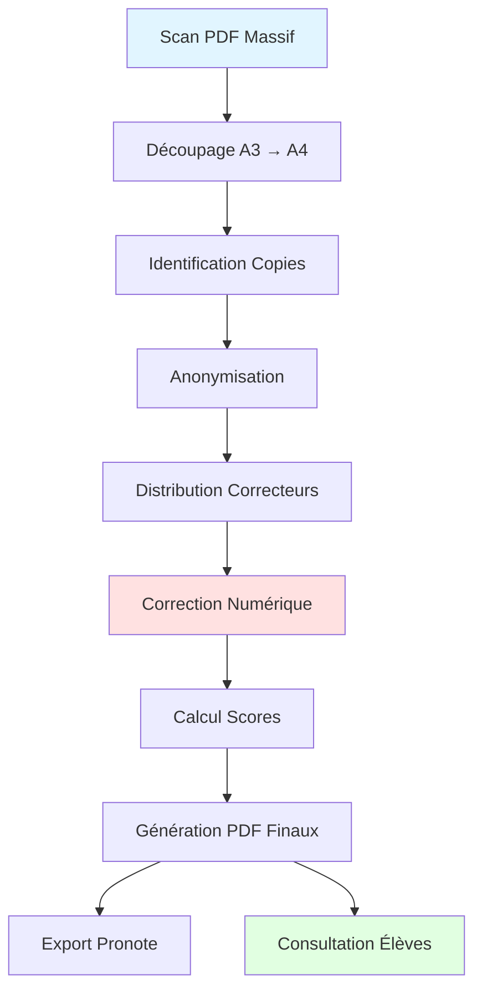
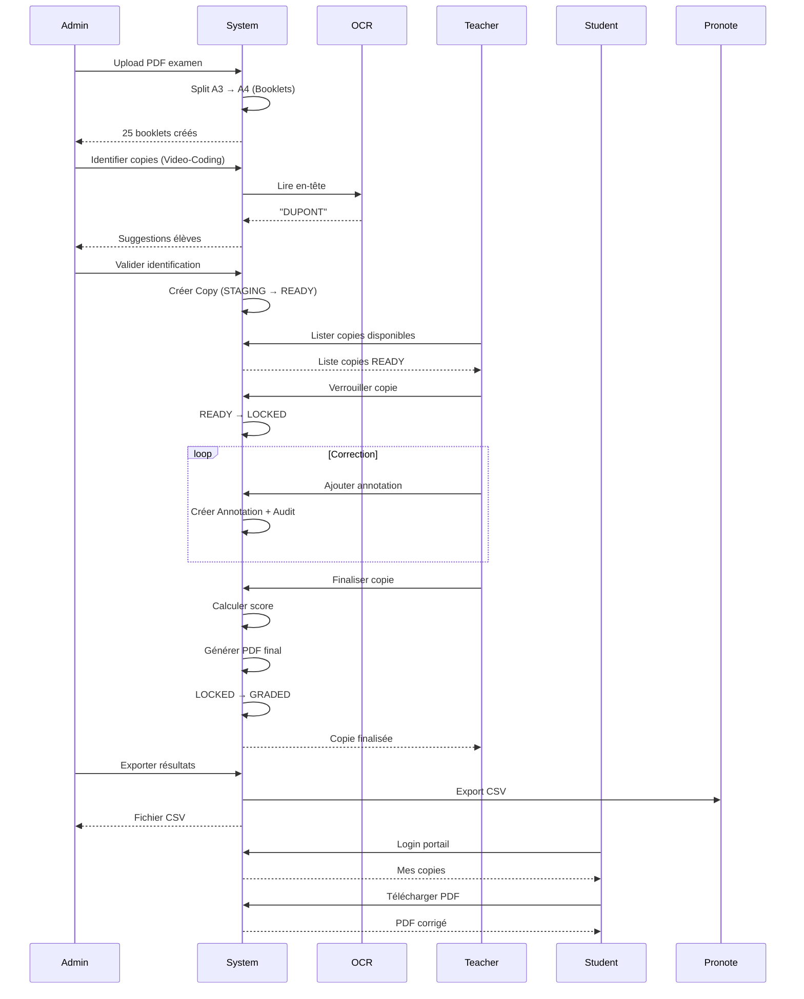
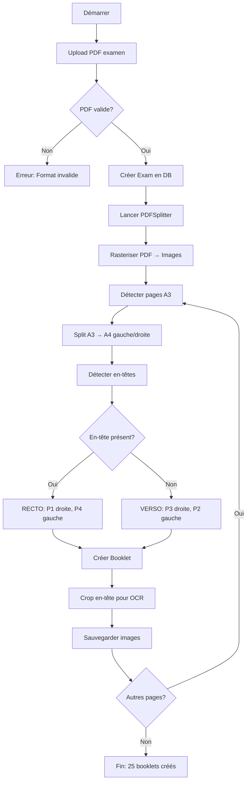
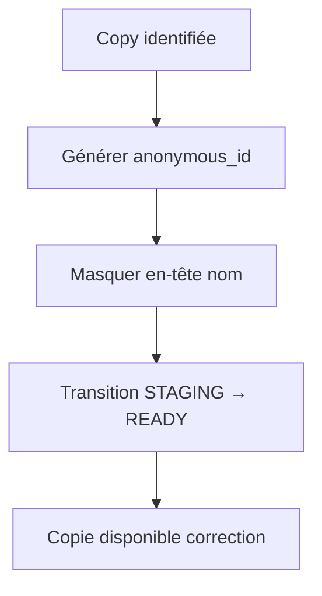
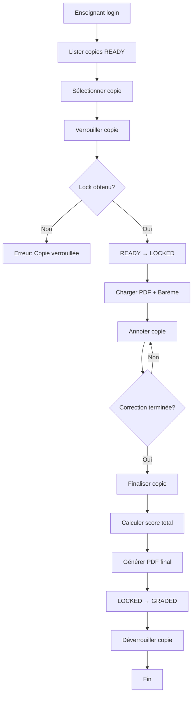
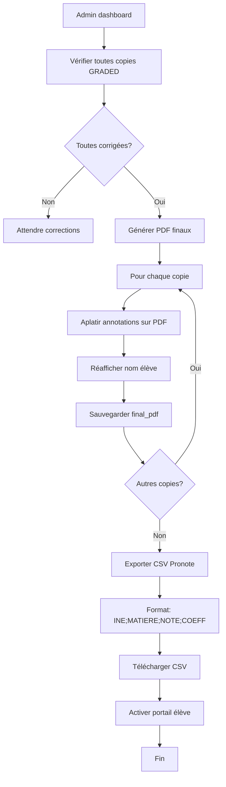
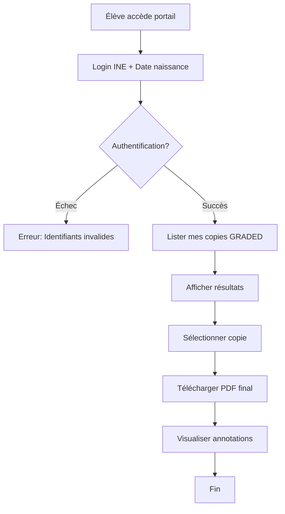
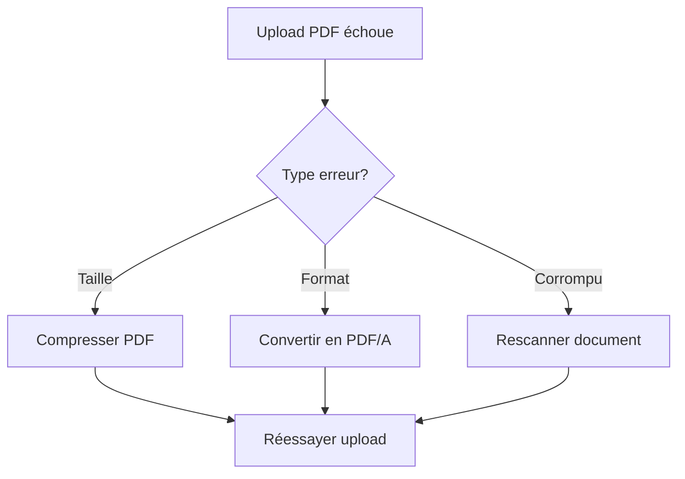
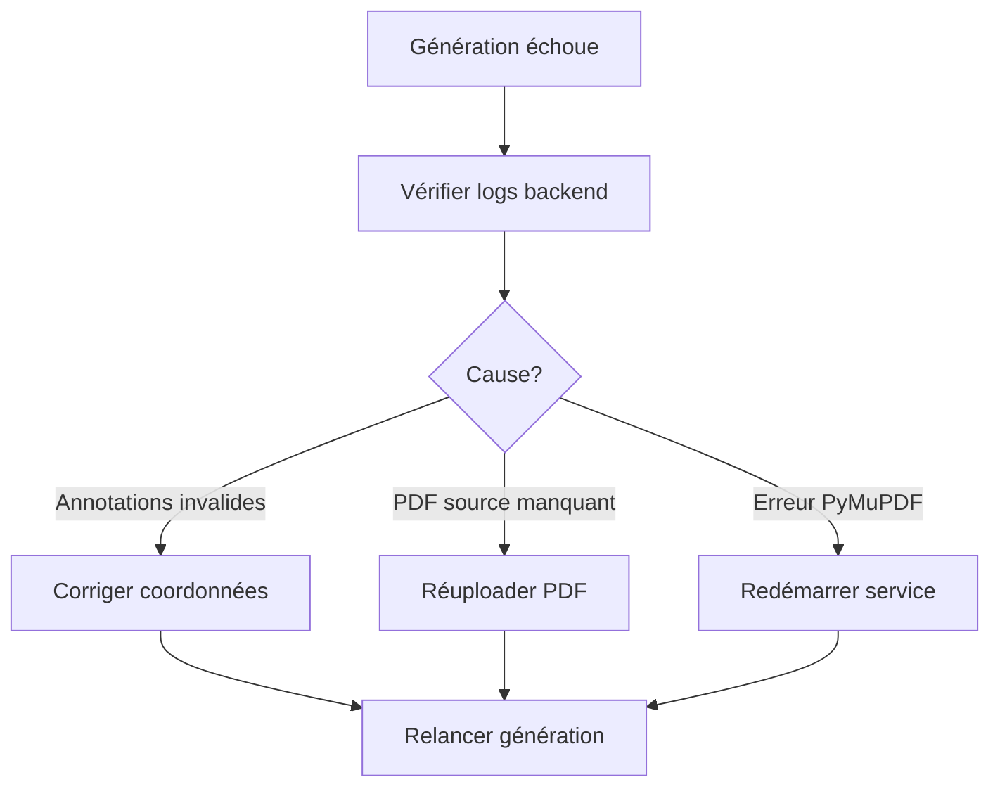

# Workflows Métier - Korrigo PMF

> **Version**: 1.2.0  
> **Date**: Janvier 2026  
> **Public**: Product Owners, Développeurs, Utilisateurs

Documentation complète des workflows métier de la plateforme Korrigo PMF, du scan des copies à la consultation par les élèves.

---

## 📋 Table des Matières

1. [Vue d'Ensemble](#vue-densemble)
2. [Workflow Complet de Correction](#workflow-complet-de-correction)
3. [Rôles et Permissions](#rôles-et-permissions)
4. [Workflows Détaillés par Phase](#workflows-détaillés-par-phase)
5. [Cas d'Usage](#cas-dusage)
6. [Gestion des Erreurs](#gestion-des-erreurs)

---

## Vue d'Ensemble

### Objectif

Korrigo PMF automatise le processus de correction d'examens papier, de la numérisation à la restitution des résultats.

### Workflow Global



### Phases Principales

| Phase | Acteur | Durée Estimée | Criticité |
|-------|--------|---------------|-----------|
| **1. Ingestion** | Admin | 10 min | Haute |
| **2. Identification** | Secrétariat | 2h (100 copies) | Haute |
| **3. Anonymisation** | Système | Automatique | Moyenne |
| **4. Distribution** | Admin | 15 min | Moyenne |
| **5. Correction** | Enseignants | 3-5 jours | Haute |
| **6. Finalisation** | Système | 30 min | Haute |
| **7. Export** | Admin | 10 min | Haute |
| **8. Consultation** | Élèves | Permanent | Basse |

---

## Workflow Complet de Correction

### Diagramme de Séquence



---

## Rôles et Permissions

### Matrice de Permissions

| Action | Admin | Teacher | Student |
|--------|-------|---------|---------|
| **Upload PDF examen** | ✅ | ✅ | ❌ |
| **Identifier copies** | ✅ | ❌ | ❌ |
| **Valider copies** | ✅ | ❌ | ❌ |
| **Lister copies disponibles** | ✅ | ✅ | ❌ |
| **Verrouiller copie** | ✅ | ✅ | ❌ |
| **Annoter copie** | ✅ | ✅ (si owner) | ❌ |
| **Finaliser copie** | ✅ | ✅ (si owner) | ❌ |
| **Exporter CSV** | ✅ | ❌ | ❌ |
| **Consulter sa copie** | ❌ | ❌ | ✅ |
| **Télécharger PDF final** | ✅ | ✅ | ✅ (sa copie) |

### Descriptions des Rôles

#### Admin
- **Responsabilité**: Gestion globale, configuration, exports
- **Accès**: Tous les endpoints
- **Exemples**: Proviseur adjoint, Secrétariat, Admin NSI

#### Teacher (Enseignant)
- **Responsabilité**: Correction des copies
- **Accès**: Copies, annotations, finalisation
- **Restrictions**: Ne peut modifier que ses propres annotations

#### Student (Élève)
- **Responsabilité**: Consultation résultats
- **Accès**: Ses propres copies (GRADED uniquement)
- **Restrictions**: Lecture seule

---

## Workflows Détaillés par Phase

### Phase 1: Ingestion et Découpage

**Acteur**: Admin  
**Durée**: 10 minutes  
**Objectif**: Transformer un PDF massif en fascicules individuels

#### Étapes



#### Exemple

**Input**: `Scan_Salle_B202.pdf` (100 pages A3)  
**Output**: 25 Booklets (4 pages A4 chacun)

```
Booklet 1: Pages 1-4 (P1, P2, P3, P4)
Booklet 2: Pages 5-8 (P1, P2, P3, P4)
...
Booklet 25: Pages 97-100 (P1, P2, P3, P4)
```

#### Validations

- ✅ PDF < 50 MB
- ✅ Extension `.pdf`
- ✅ MIME type `application/pdf`
- ✅ Nombre de pages multiple de 4 (si A3 recto-verso)

---

### Phase 2: Identification (Video-Coding)

**Acteur**: Secrétariat  
**Durée**: 2 heures (100 copies)  
**Objectif**: Lier chaque copie à un élève

#### Workflow

```mermaid
flowchart TD
    A[Démarrer] --> B[Lister copies non identifiées]
    B --> C[Afficher en-tête copie]
    C --> D[OCR lit nom]
    D --> E{OCR confiant?}
    E -->|Oui| F[Proposer élèves "DUPONT"]
    E -->|Non| G[Saisie manuelle]
    F --> H[Opérateur sélectionne élève]
    G --> H
    H --> I[Valider identification]
    I --> J[Lier Copy ↔ Student]
    J --> K[Marquer is_identified = true]
    K --> L{Autres copies?}
    L -->|Oui| C
    L -->|Non| M[Fin: Toutes copies identifiées]
```

#### Interface

**Vue "Identification Desk"**:
```
┌─────────────────────────────────────────┐
│ Copie 1/25 - Anonymat: A3F7B2E1         │
├─────────────────────────────────────────┤
│                                         │
│  [Image en-tête avec nom manuscrit]    │
│                                         │
│  OCR détecté: "DUPONT"                  │
│                                         │
│  Suggestions:                           │
│  ○ Jean DUPONT - TG2                    │
│  ○ Marie DUPONT - TG4                   │
│  ○ Pierre DUPOND - TG2                  │
│                                         │
│  [Valider]  [Passer]  [Saisie manuelle]│
└─────────────────────────────────────────┘
```

#### Cas Particuliers

**1. Nom illisible**:
- OCR échoue → Saisie manuelle
- Recherche par classe + numéro

**2. Copie incomplète**:
- Fascicules manquants → Agrafage manuel
- Fusion de booklets supplémentaires

**3. Doublon**:
- Même élève, 2 copies → Marquer "Copie de remplacement"

---

### Phase 3: Anonymisation et Distribution

**Acteur**: Système (automatique)  
**Durée**: Instantané  
**Objectif**: Masquer identité élève pour correction impartiale

#### Workflow



#### Anonymisation

**Avant**:
```
┌─────────────────────┐
│ Nom: Jean DUPONT    │
│ Classe: TG2         │
│ Date: 15/01/2026    │
├─────────────────────┤
│ [Contenu copie...]  │
```

**Après**:
```
┌─────────────────────┐
│ Anonymat: A3F7B2E1  │
│ [Bandeau blanc]     │
│ Date: 15/01/2026    │
├─────────────────────┤
│ [Contenu copie...]  │
```

---

### Phase 4: Correction Numérique

**Acteur**: Enseignant  
**Durée**: 15-20 min/copie  
**Objectif**: Annoter et noter la copie

#### Workflow



#### Interface Correction

```
┌─────────────────────────────────────────────────────────────┐
│ Copie A3F7B2E1 - Bac Blanc Maths TG                         │
├──────────────────────────┬──────────────────────────────────┤
│                          │  Barème                          │
│  [PDF Viewer]            │  ┌────────────────────────────┐  │
│                          │  │ ☑ Ex1 (10 pts)             │  │
│  Page 1/4                │  │   ☑ Q1.a (3 pts) [3/3]     │  │
│                          │  │   ☐ Q1.b (7 pts) [  /7]    │  │
│  [Outils]                │  │ ☐ Ex2 (8 pts)              │  │
│  ✏️ Stylo rouge           │  │   ☐ Q2.a (4 pts) [  /4]    │  │
│  💬 Commentaire          │  │   ☐ Q2.b (4 pts) [  /4]    │  │
│  ⭐ Bonus                 │  │ ☐ Ex3 (2 pts)              │  │
│  ❌ Erreur                │  │                            │  │
│                          │  │ Total: 3/20                │  │
│                          │  └────────────────────────────┘  │
│                          │                                  │
│                          │  [Sauvegarder] [Finaliser]       │
└──────────────────────────┴──────────────────────────────────┘
```

#### Types d'Annotations

| Type | Icône | Usage | Score Delta |
|------|-------|-------|-------------|
| **COMMENT** | 💬 | Commentaire textuel | Variable |
| **HIGHLIGHT** | 🟨 | Surligné | 0 |
| **ERROR** | ❌ | Erreur détectée | Négatif |
| **BONUS** | ⭐ | Bonus | Positif |

#### Autosave

- **Fréquence**: 2s server + 300ms localStorage (dual-layer)
- **Stockage**: `DraftState` en DB + `localStorage`
- **Récupération**: Automatique au rechargement page

---

### Phase 5: Finalisation et Export

**Acteur**: Admin  
**Durée**: 30 minutes  
**Objectif**: Générer PDF finaux et exporter vers Pronote

#### Workflow



#### Format Export CSV

```csv
INE,MATIERE,NOTE,COEFF
1234567890A,MATHS,15.5,7
1234567891B,MATHS,12.0,7
1234567892C,MATHS,18.5,7
```

**Import dans Pronote**:
1. Ouvrir Pronote
2. Notes → Importer → CSV
3. Sélectionner fichier
4. Mapper colonnes
5. Valider import

---

### Phase 6: Consultation Élève

**Acteur**: Élève  
**Durée**: Permanent (après activation)  
**Objectif**: Consulter copie corrigée et résultats

#### Workflow



#### Interface Portail Élève

```
┌─────────────────────────────────────────┐
│ Portail Élève - Jean DUPONT (TG2)       │
├─────────────────────────────────────────┤
│ Mes Copies Corrigées                    │
│                                         │
│ ┌─────────────────────────────────────┐ │
│ │ Bac Blanc Maths TG - 15/01/2026     │ │
│ │ Note: 15.5/20                       │ │
│ │ [Télécharger PDF] [Voir détails]   │ │
│ └─────────────────────────────────────┘ │
│                                         │
│ ┌─────────────────────────────────────┐ │
│ │ Contrôle Physique - 10/01/2026      │ │
│ │ Note: 12.0/20                       │ │
│ │ [Télécharger PDF] [Voir détails]   │ │
│ └─────────────────────────────────────┘ │
└─────────────────────────────────────────┘
```

---

## Cas d'Usage

### Cas 1: Correction Standard

**Scénario**: Enseignant corrige une copie de bout en bout

**Acteurs**: Teacher  
**Prérequis**: Copie en statut READY

**Étapes**:
1. Login enseignant
2. Lister copies disponibles
3. Sélectionner copie A3F7B2E1
4. Verrouiller copie (READY → LOCKED)
5. Annoter question 1: +3 points
6. Annoter question 2: -1 point (erreur)
7. Annoter question 3: +2 points (bonus)
8. Finaliser copie
9. Système calcule score: 15.5/20
10. Système génère PDF final
11. Copie passe en GRADED

**Résultat**: Copie corrigée, PDF disponible

---

### Cas 2: Correction Interrompue

**Scénario**: Enseignant commence correction mais doit s'arrêter

**Acteurs**: Teacher  
**Prérequis**: Copie verrouillée

**Étapes**:
1. Enseignant annote 2 questions
2. Ferme navigateur (panne, fin de session)
3. **Autosave** a sauvegardé brouillon
4. Enseignant revient plus tard
5. Système détecte brouillon existant
6. Propose de restaurer
7. Enseignant continue correction

**Résultat**: Pas de perte de données

---

### Cas 3: Copie Verrouillée par Autre Enseignant

**Scénario**: Deux enseignants tentent de corriger la même copie

**Acteurs**: Teacher1, Teacher2  
**Prérequis**: Copie en READY

**Étapes**:
1. Teacher1 verrouille copie (10:00)
2. Copie passe en LOCKED (expires_at: 10:30)
3. Teacher2 tente de verrouiller (10:15)
4. **Système refuse**: "Copie verrouillée par Teacher1 jusqu'à 10:30"
5. Teacher2 attend ou choisit autre copie
6. Teacher1 finalise (10:25)
7. Copie passe en GRADED
8. Teacher2 peut maintenant voir résultat

**Résultat**: Pas de conflit, intégrité préservée

---

### Cas 4: Verrou Expiré

**Scénario**: Enseignant verrouille copie mais ne finalise pas

**Acteurs**: Teacher1, System  
**Prérequis**: Copie verrouillée

**Étapes**:
1. Teacher1 verrouille copie (10:00, expires_at: 10:30)
2. Teacher1 oublie de finaliser
3. **10:30**: Verrou expire automatiquement
4. Tâche Celery nettoie verrous expirés
5. Copie repasse en READY
6. Brouillon Teacher1 reste en DB
7. Autre enseignant peut verrouiller

**Résultat**: Copie libérée, pas de blocage permanent

---

## Gestion des Erreurs

### Erreurs Courantes

| Erreur | Cause | Solution |
|--------|-------|----------|
| **PDF invalide** | Format corrompu | Vérifier PDF avec Adobe Reader |
| **Copie déjà verrouillée** | Autre enseignant corrige | Attendre expiration verrou |
| **Identification impossible** | Nom illisible | Saisie manuelle |
| **Score incohérent** | Barème mal configuré | Vérifier grading_structure |
| **PDF final vide** | Erreur génération | Relancer export |

### Workflows de Récupération

#### Erreur Upload PDF



#### Erreur Génération PDF Final



---

## Métriques et KPIs

### Métriques Opérationnelles

| Métrique | Cible | Mesure |
|----------|-------|--------|
| **Temps identification** | < 1 min/copie | Moyenne temps entre affichage et validation |
| **Temps correction** | 15-20 min/copie | Moyenne temps LOCKED → GRADED |
| **Taux OCR succès** | > 80% | % noms correctement détectés |
| **Taux finalisation** | > 95% | % copies GRADED / total |

### Métriques Qualité

| Métrique | Cible | Mesure |
|----------|-------|--------|
| **Erreurs identification** | < 2% | % copies mal identifiées |
| **Conflits verrouillage** | < 1% | % tentatives verrouillage échouées |
| **Pertes données** | 0% | % brouillons perdus |

---

## Références

- [ARCHITECTURE.md](file:///home/alaeddine/viatique__PMF/docs/ARCHITECTURE.md) - Architecture globale
- [API_REFERENCE.md](file:///home/alaeddine/viatique__PMF/docs/API_REFERENCE.md) - Documentation API
- [DATABASE_SCHEMA.md](file:///home/alaeddine/viatique__PMF/docs/DATABASE_SCHEMA.md) - Schéma base de données
- [SPEC.md](file:///home/alaeddine/viatique__PMF/docs/SPEC.md) - Cahier des charges

---

**Dernière mise à jour**: 25 janvier 2026  
**Auteur**: Aleddine BEN RHOUMA  
**Licence**: Propriétaire - AEFE/Éducation Nationale
