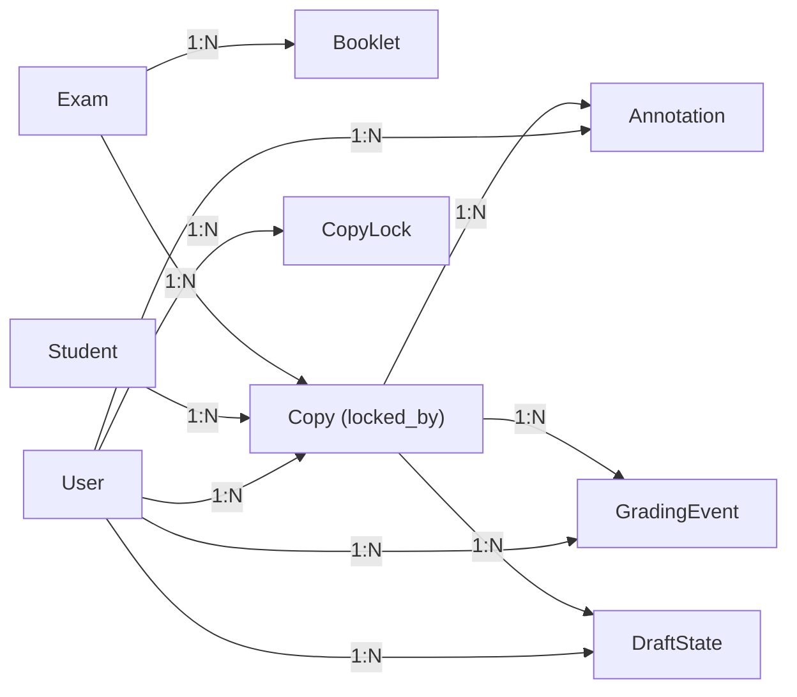
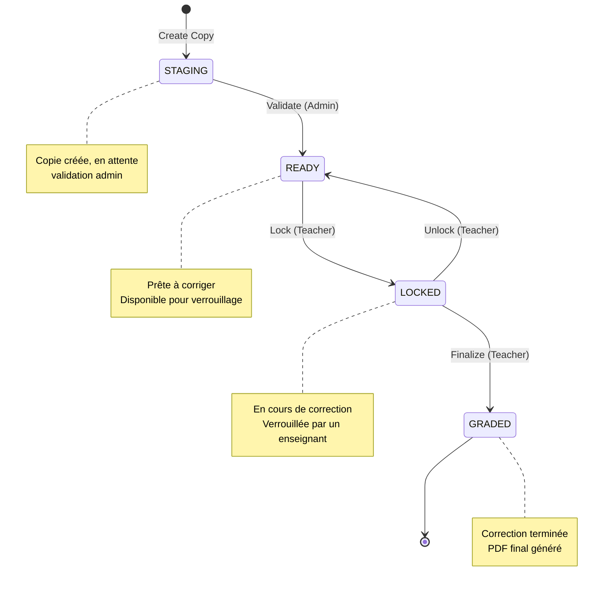

# Schéma Base de Données - Korrigo PMF

> **Version**: 1.2.0  
> **Date**: Janvier 2026  
> **SGBD**: PostgreSQL 15+  
> **ORM**: Django 4.2 LTS

Ce document décrit le schéma complet de la base de données du projet Korrigo PMF, incluant tous les modèles, leurs relations, contraintes et workflows d'états.

---

## 📋 Table des Matières

1. [Vue d'Ensemble](#vue-densemble)
2. [Diagramme ERD Complet](#diagramme-erd-complet)
3. [Modèles Détaillés](#modèles-détaillés)
4. [Relations et Cardinalités](#relations-et-cardinalités)
5. [Machine à États](#machine-à-états)
6. [Index et Performances](#index-et-performances)
7. [Migrations Importantes](#migrations-importantes)

---

## Vue d'Ensemble

### Modules de Données

Le schéma est organisé en 4 modules Django:

| Module | Tables | Responsabilité |
|--------|--------|----------------|
| **exams** | `Exam`, `Booklet`, `Copy`, `ExamPDF`, `ExamDocumentSet`, `ExamDocument` | Gestion examens et documents |
| **grading** | `Annotation`, `GradingEvent`, `CopyLock`, `DraftState`, `Score`, `QuestionRemark` | Correction et audit |
| **students** | `Student` | Gestion élèves |
| **identification** | `OCRResult` | Identification automatique |
| **auth** | `User`, `Group`, `Permission` | Authentification (Django) |

### Statistiques

- **8 modèles métier** (hors auth Django)
- **12 relations ForeignKey**
- **1 relation ManyToMany**
- **1 relation OneToOne**
- **6 index personnalisés**

---

## Diagramme ERD Complet

```mermaid
erDiagram
    User ||--o{ Copy : "locked_by"
    User ||--o{ Annotation : "created_by"
    User ||--o{ GradingEvent : "actor"
    User ||--o{ CopyLock : "owner"
    User ||--o{ DraftState : "owner"
    
    Exam ||--o{ Booklet : "has"
    Exam ||--o{ Copy : "has"
    
    Booklet }o--o{ Copy : "assigned_copy (M2M)"
    
    Student ||--o{ Copy : "owns"
    
    Copy ||--o{ Annotation : "has"
    Copy ||--o{ GradingEvent : "has"
    Copy ||--|| CopyLock : "has"
    Copy ||--o{ DraftState : "has"
    
    Exam {
        uuid id PK
        string name
        date date
        file pdf_source
        json grading_structure
        boolean is_processed
    }
    
    Booklet {
        uuid id PK
        uuid exam_id FK
        int start_page
        int end_page
        image header_image
        string student_name_guess
        json pages_images
    }
    
    Copy {
        uuid id PK
        uuid exam_id FK
        uuid student_id FK "nullable"
        string anonymous_id UK
        file pdf_source
        file final_pdf
        string status
        boolean is_identified
        datetime validated_at
        datetime locked_at
        uuid locked_by_id FK "nullable"
        datetime graded_at
    }
    
    Student {
        int id PK
        date date_naissance
        string first_name
        string last_name
        string class_name
        string email
        int user_id FK "nullable"
    }
    
    Annotation {
        uuid id PK
        uuid copy_id FK
        int page_index
        float x
        float y
        float w
        float h
        text content
        string type
        int score_delta "nullable"
        uuid created_by_id FK
        datetime created_at
        datetime updated_at
    }
    
    GradingEvent {
        uuid id PK
        uuid copy_id FK
        string action
        uuid actor_id FK
        datetime timestamp
        json metadata
    }
    
    CopyLock {
        int id PK
        uuid copy_id FK UK
        uuid owner_id FK
        uuid token
        datetime locked_at
        datetime expires_at
    }
    
    DraftState {
        uuid id PK
        uuid copy_id FK
        uuid owner_id FK
        json payload
        uuid lock_token "nullable"
        uuid client_id "nullable"
        int version
        datetime updated_at
    }
```

---

## Modèles Détaillés

### 1. Exam (exams.Exam)

**Responsabilité**: Représente un examen (ex: "Bac Blanc Maths TG - Janvier 2026")

| Champ | Type | Contraintes | Description |
|-------|------|-------------|-------------|
| `id` | UUID | PK | Identifiant unique |
| `name` | VARCHAR(255) | NOT NULL | Nom de l'examen |
| `date` | DATE | NOT NULL | Date de l'examen |
| `upload_mode` | VARCHAR(20) | DEFAULT 'BATCH_A3' | Mode: BATCH_A3 ou INDIVIDUAL_A4 |
| `students_csv` | FILE | NULLABLE | Fichier CSV élèves |
| `pdf_source` | FILE | NULLABLE | PDF source (Legacy/Batch) |
| `grading_structure` | JSON | DEFAULT [] | Barème hiérarchique |
| `is_processed` | BOOLEAN | DEFAULT false | PDF traité ? |
| `pages_per_booklet` | INT | DEFAULT 4 | Pages par copie |
| `results_released_at` | DATETIME | NULLABLE | Date publication résultats |

**Validations**:
- `pdf_source`: Extension `.pdf`, taille max 50 MB, MIME type `application/pdf`
- `grading_structure`: Structure JSON validée (exercices → questions → points)

**Exemple grading_structure**:
```json
[
  {
    "id": "ex1",
    "label": "Exercice 1",
    "points": 10,
    "children": [
      {"id": "ex1_q1", "label": "Question 1.a", "points": 3},
      {"id": "ex1_q2", "label": "Question 1.b", "points": 7}
    ]
  }
]
```

---

### 2. Booklet (exams.Booklet)

**Responsabilité**: Fascicule détecté automatiquement lors du split A3 → A4 (entité de staging)

| Champ | Type | Contraintes | Description |
|-------|------|-------------|-------------|
| `id` | UUID | PK | Identifiant unique |
| `exam_id` | UUID | FK → Exam | Examen parent |
| `start_page` | INT | NOT NULL | Page de début (1-indexed) |
| `end_page` | INT | NOT NULL | Page de fin (1-indexed) |
| `header_image` | IMAGE | NULLABLE | Crop de l'en-tête pour OCR |
| `student_name_guess` | VARCHAR(255) | NULLABLE | Nom détecté par OCR |
| `pages_images` | JSON | DEFAULT [] | Liste chemins images [P1, P2, P3, P4] |

**Workflow**:
1. Upload PDF → Split automatique → Création Booklets
2. Admin valide/fusionne Booklets → Création Copy
3. Booklets restent en DB pour traçabilité

---

### 3. Copy (exams.Copy)

**Responsabilité**: Copie validée d'un élève (entité finale de correction)

| Champ | Type | Contraintes | Description |
|-------|------|-------------|-------------|
| `id` | UUID | PK | Identifiant unique |
| `exam_id` | UUID | FK → Exam | Examen parent |
| `student_id` | UUID | FK → Student, NULLABLE | Élève identifié |
| `anonymous_id` | VARCHAR(50) | UNIQUE | Numéro d'anonymat |
| `pdf_source` | FILE | NULLABLE | PDF source de la copie |
| `final_pdf` | FILE | NULLABLE | PDF final avec annotations |
| `status` | VARCHAR(20) | CHOICES | Statut workflow |
| `is_identified` | BOOLEAN | DEFAULT false | Copie liée à un élève ? |
| `assigned_corrector_id` | UUID | FK → User, NULLABLE | Correcteur assigné |
| `subject_variant` | VARCHAR(1) | NULLABLE | Variante sujet (A/B) |
| `global_appreciation` | TEXT | NULLABLE | Appréciation globale |
| `validated_at` | DATETIME | NULLABLE | Timestamp STAGING → READY |
| `locked_at` | DATETIME | NULLABLE | Timestamp READY → LOCKED |
| `locked_by_id` | UUID | FK → User, NULLABLE | Correcteur ayant verrouillé |
| `graded_at` | DATETIME | NULLABLE | Timestamp LOCKED → GRADED |

**Statuts possibles** (Enum `Copy.Status`):
- `STAGING`: Copie créée, en attente validation
- `READY`: Prête à corriger
- `LOCKED`: En cours de correction (verrouillée)
- `GRADED`: Correction terminée

**Relation ManyToMany**:
- `booklets`: Booklets composant cette copie (traçabilité)

---

### 4. ExamPDF (exams.ExamPDF)

**Responsabilité**: Fichier PDF individuel (mode INDIVIDUAL_A4).

| Champ | Type | Contraintes | Description |
|-------|------|-------------|-------------|
| `id` | UUID | PK | Identifiant unique |
| `exam_id` | UUID | FK → Exam | Examen parent |
| `pdf_file` | FILE | NOT NULL | Fichier PDF |
| `student_identifier` | VARCHAR(255) | NULLABLE | ID extrait du nom de fichier |
| `uploaded_at` | DATETIME | AUTO | Date d'upload |

---

### 5. ExamDocumentSet (exams.ExamDocumentSet)

**Responsabilité**: Lot documentaire versionné (Sujet, Corrigé, Barème).

| Champ | Type | Contraintes | Description |
|-------|------|-------------|-------------|
| `id` | UUID | PK | Identifiant unique |
| `exam_id` | UUID | FK → Exam | Examen parent |
| `version` | INT | NOT NULL | Numéro de version |
| `is_active` | BOOLEAN | DEFAULT true | Version active ? |

---

### 6. ExamDocument (exams.ExamDocument)

**Responsabilité**: Document PDF unique dans un lot.

| Champ | Type | Contraintes | Description |
|-------|------|-------------|-------------|
| `id` | UUID | PK | Identifiant unique |
| `document_set_id` | UUID | FK → ExamDocumentSet | Lot parent |
| `doc_type` | VARCHAR(20) | CHOICES | SUJET, CORRIGE, BAREME |
| `sha256` | VARCHAR(64) | NOT NULL | Hash pour intégrité |

---

### 7. Student (students.Student)

**Responsabilité**: Élève de l'établissement

| Champ | Type | Contraintes | Description |
|-------|------|-------------|-------------|
| `id` | INT | PK | Identifiant auto-incrémenté |
| `date_naissance` | DATE | NOT NULL | Date de naissance (Identification) |
| `first_name` | VARCHAR(100) | NOT NULL | Prénom |
| `last_name` | VARCHAR(100) | NOT NULL | Nom |
| `class_name` | VARCHAR(50) | NOT NULL | Classe (ex: "TG2") |
| `email` | EMAIL | NULLABLE | Email élève |
| `user_id` | INT | FK → User, NULLABLE | Compte utilisateur associé (OneToOne) |

**Import**: CSV Pronote via commande Django `import_students`

---

### 5. Annotation (grading.Annotation)

**Responsabilité**: Annotation vectorielle sur une copie (dessin, commentaire, note)

| Champ | Type | Contraintes | Description |
|-------|------|-------------|-------------|
| `id` | UUID | PK | Identifiant unique |
| `copy_id` | UUID | FK → Copy | Copie annotée |
| `page_index` | INT | NOT NULL | Index page (0-based) |
| `x` | FLOAT | NOT NULL | Position X normalisée [0, 1] |
| `y` | FLOAT | NOT NULL | Position Y normalisée [0, 1] |
| `w` | FLOAT | NOT NULL | Largeur normalisée [0, 1] |
| `h` | FLOAT | NOT NULL | Hauteur normalisée [0, 1] |
| `content` | TEXT | NULLABLE | Texte ou JSON de l'annotation |
| `type` | VARCHAR(20) | CHOICES | Type d'annotation |
| `score_delta` | INT | NULLABLE | Points ajoutés/retirés |
| `created_by_id` | UUID | FK → User | Correcteur |
| `created_at` | DATETIME | AUTO | Date création |
| `updated_at` | DATETIME | AUTO | Date modification |

**Types possibles** (Enum `Annotation.Type`):
- `COMMENT`: Commentaire textuel
- `HIGHLIGHT`: Surligné
- `ERROR`: Erreur détectée
- `BONUS`: Bonus

**Index**:
- `(copy_id, page_index)`: Requêtes fréquentes par page

**Coordonnées normalisées**:
```
x_pdf = x * page_width
y_pdf = y * page_height
```

---

### 6. GradingEvent (grading.GradingEvent)

**Responsabilité**: Journal d'audit des événements de correction (traçabilité complète)

| Champ | Type | Contraintes | Description |
|-------|------|-------------|-------------|
| `id` | UUID | PK | Identifiant unique |
| `copy_id` | UUID | FK → Copy | Copie concernée |
| `action` | VARCHAR(20) | CHOICES | Type d'action |
| `actor_id` | UUID | FK → User | Utilisateur |
| `timestamp` | DATETIME | AUTO | Horodatage |
| `metadata` | JSON | DEFAULT {} | Données contextuelles |

**Actions possibles** (Enum `GradingEvent.Action`):
- `IMPORT`: Import copie
- `VALIDATE`: Validation STAGING → READY
- `LOCK`: Verrouillage READY → LOCKED
- `UNLOCK`: Déverrouillage LOCKED → READY
- `CREATE_ANN`: Création annotation
- `UPDATE_ANN`: Modification annotation
- `DELETE_ANN`: Suppression annotation
- `FINALIZE`: Finalisation LOCKED → GRADED
- `EXPORT`: Export PDF

**Index**:
- `(copy_id, timestamp)`: Historique par copie

**Exemple metadata**:
```json
{
  "score": 15.5,
  "annotation_id": "uuid-...",
  "reason": "Correction terminée"
}
```

---

### 7. CopyLock (grading.CopyLock)

**Responsabilité**: Verrou de copie pour édition concurrente (soft lock)

| Champ | Type | Contraintes | Description |
|-------|------|-------------|-------------|
| `id` | INT | PK | Identifiant auto-incrémenté |
| `copy_id` | UUID | FK → Copy, UNIQUE | Copie verrouillée |
| `owner_id` | UUID | FK → User | Propriétaire du verrou |
| `token` | UUID | NOT NULL | Token de session |
| `locked_at` | DATETIME | AUTO | Date verrouillage |
| `expires_at` | DATETIME | NOT NULL, INDEX | Date expiration |

**Logique**:
- Un seul verrou par copie (OneToOne)
- Expiration automatique après 30 minutes
- Token requis pour toute modification

**Nettoyage**: Tâche Celery périodique supprime les verrous expirés

---

### 8. DraftState (grading.DraftState)

**Responsabilité**: État brouillon (autosave) d'une copie en cours de correction

| Champ | Type | Contraintes | Description |
|-------|------|-------------|-------------|
| `id` | UUID | PK | Identifiant unique |
| `copy_id` | UUID | FK → Copy | Copie concernée |
| `owner_id` | UUID | FK → User | Propriétaire du brouillon |
| `payload` | JSON | DEFAULT {} | État complet éditeur |
| `lock_token` | UUID | NULLABLE | Token verrou associé |
| `client_id` | UUID | NULLABLE | ID client (anti-écrasement) |
| `version` | INT | DEFAULT 1 | Numéro de version |
| `updated_at` | DATETIME | AUTO | Date mise à jour |

**Contrainte unique**: `(copy_id, owner_id)` → Un seul brouillon par utilisateur/copie

**Exemple payload**:
```json
{
  "annotations": [...],
  "scroll_position": 0.5,
  "active_page": 2,
  "unsaved_text": "Bonne réponse mais..."
}
```

---

### 11. QuestionRemark (grading.QuestionRemark)

**Responsabilité**: Remarque sur une question spécifique.

| Champ | Type | Contraintes | Description |
|-------|------|-------------|-------------|
| `id` | UUID | PK | Identifiant unique |
| `copy_id` | UUID | FK → Copy | Copie concernée |
| `question_id` | VARCHAR(255) | NOT NULL | ID question (barème) |
| `remark` | TEXT | NULLABLE | Contenu remarque |

---

### 12. Score (grading.Score)

**Responsabilité**: Détail des notes json.

| Champ | Type | Contraintes | Description |
|-------|------|-------------|-------------|
| `id` | UUID | PK | Identifiant unique |
| `copy_id` | UUID | FK → Copy | Copie concernée |
| `scores_data` | JSON | NOT NULL | Détail notes par question |

---

### 13. AnnotationTemplate (grading.AnnotationTemplate)

**Responsabilité**: Banque d'annotations partagées/officielles.

| Champ | Type | Contraintes | Description |
|-------|------|-------------|-------------|
| `id` | UUID | PK | Identifiant unique |
| `exam_id` | UUID | FK → Exam | Examen parent |
| `text` | TEXT | NOT NULL | Contenu annotation |
| `criterion_type` | VARCHAR | CHOICES | Méthode, Résultat, etc. |

---

### 14. UserAnnotation (grading.UserAnnotation)

**Responsabilité**: Annotations personnelles du correcteur.

| Champ | Type | Contraintes | Description |
|-------|------|-------------|-------------|
| `id` | UUID | PK | Identifiant unique |
| `user_id` | UUID | FK → User | Correcteur propriétaire |
| `text` | TEXT | NOT NULL | Contenu annotation |
| `usage_count` | INT | DEFAULT 0 | Fréquence d'utilisation |

---

### 15. OCRResult (identification.OCRResult)

**Responsabilité**: Résultat de l'identification automatique.

| Champ | Type | Contraintes | Description |
|-------|------|-------------|-------------|
| `id` | UUID | PK | Identifiant unique |
| `copy_id` | UUID | FK → Copy (OneToOne) | Copie identifiée |
| `detected_text` | TEXT | NOT NULL | Texte brut OCR |
| `confidence` | FLOAT | NOT NULL | Score confiance (0-1) |

---

## Relations et Cardinalités

### Relations ForeignKey



### Relation ManyToMany

```
Copy ←→ Booklet (via table intermédiaire `exams_copy_booklets`)
```

**Justification**: Une copie peut être composée de plusieurs fascicules fusionnés.

### Relation OneToOne

```
Copy ←→ CopyLock
```

**Justification**: Une copie ne peut avoir qu'un seul verrou actif.

---

## Machine à États

### Workflow Copy.status



### Transitions Validées

Chaque transition est:
1. **Validée** par le service layer
2. **Auditée** via `GradingEvent`
3. **Horodatée** (`validated_at`, `locked_at`, `graded_at`)

**Exemple**:
```python
# Transition READY → LOCKED
if copy.status != Copy.Status.READY:
    raise ValueError("Cannot lock copy not in READY status")

copy.status = Copy.Status.LOCKED
copy.locked_at = timezone.now()
copy.locked_by = user
copy.save()

GradingEvent.objects.create(
    copy=copy,
    action=GradingEvent.Action.LOCK,
    actor=user
)
```

---

## Index et Performances

### Index Automatiques (Django)

- **Primary Keys**: Index automatique sur tous les `id`
- **Foreign Keys**: Index automatique sur tous les `*_id`
- **Unique**: Index automatique sur `Copy.anonymous_id`

### Index Personnalisés

| Table | Champs | Type | Justification |
|-------|--------|------|---------------|
| `Annotation` | `(copy_id, page_index)` | Composite | Requêtes fréquentes par page |
| `GradingEvent` | `(copy_id, timestamp)` | Composite | Historique chronologique |
| `CopyLock` | `expires_at` | Simple | Nettoyage verrous expirés |

**Déclaration Django**:
```python
class Annotation(models.Model):
    # ...
    class Meta:
        indexes = [
            models.Index(fields=['copy_id', 'page_index']),
        ]
```

### Optimisations Requêtes

**Problème N+1**: Évité via `select_related` et `prefetch_related`

```python
# ❌ Mauvais (N+1 queries)
copies = Copy.objects.all()
for copy in copies:
    print(copy.exam.name)  # 1 query par copie

# ✅ Bon (2 queries)
copies = Copy.objects.select_related('exam').all()
for copy in copies:
    print(copy.exam.name)
```

---

## Migrations Importantes

### Migration Initiale (0001_initial)

Création des tables:
- `exams_exam`
- `exams_booklet`
- `exams_copy`
- `students_student`

### Migration Grading (grading/0001_initial)

Création des tables:
- `grading_annotation`
- `grading_gradingevent`
- `grading_copylock`
- `grading_draftstate`

### Migration Validation PDF (exams/0002_add_validators)

Ajout validators sur `Exam.pdf_source` et `Copy.pdf_source`:
- `FileExtensionValidator(['pdf'])`
- `validate_pdf_size` (50 MB max)
- `validate_pdf_mime_type`
- `validate_pdf_integrity`

### Migration Traçabilité (exams/0003_add_timestamps)

Ajout champs:
- `Copy.validated_at`
- `Copy.locked_at`
- `Copy.graded_at`

---

## Contraintes d'Intégrité

### Contraintes Métier

1. **Copy.anonymous_id**: Unique, généré automatiquement
2. **Student (Nom, Prénom, Date)**: Triplet unique (contrainte `unique_together`)
3. **CopyLock.copy_id**: Unique (OneToOne)
4. **DraftState (copy_id, owner_id)**: Unique ensemble

### Contraintes de Suppression

| Relation | ON DELETE | Justification |
|----------|-----------|---------------|
| `Exam → Booklet` | CASCADE | Suppression examen → suppression fascicules |
| `Exam → Copy` | CASCADE | Suppression examen → suppression copies |
| `Copy → Annotation` | CASCADE | Suppression copie → suppression annotations |
| `Copy → GradingEvent` | CASCADE | Suppression copie → suppression événements |
| `Student → Copy` | SET_NULL | Suppression élève → copie reste (anonyme) |
| `User → Annotation` | PROTECT | Empêche suppression user avec annotations |
| `User → GradingEvent` | PROTECT | Empêche suppression user avec événements |

---

## Volumétrie Estimée

### Hypothèses (Lycée 1000 élèves, 10 examens/an)

| Table | Lignes/an | Taille estimée |
|-------|-----------|----------------|
| `Exam` | 10 | < 1 MB |
| `Booklet` | 10,000 | 50 MB |
| `Copy` | 10,000 | 100 MB |
| `Student` | 1,000 | 1 MB |
| `Annotation` | 100,000 | 50 MB |
| `GradingEvent` | 50,000 | 20 MB |
| `CopyLock` | 100 (actifs) | < 1 MB |
| `DraftState` | 500 (actifs) | 5 MB |

**Total estimé**: ~230 MB/an (hors fichiers media)

**Fichiers media** (PDF, images): ~50 GB/an

---

## Backup et Restauration

### Backup PostgreSQL

```bash
# Dump complet
docker-compose exec db pg_dump -U viatique_user viatique > backup.sql

# Dump avec compression
docker-compose exec db pg_dump -U viatique_user viatique | gzip > backup.sql.gz
```

### Restauration

```bash
# Restauration
docker-compose exec -T db psql -U viatique_user viatique < backup.sql

# Avec compression
gunzip -c backup.sql.gz | docker-compose exec -T db psql -U viatique_user viatique
```

### Stratégie Recommandée

- **Backup quotidien**: Automatisé via cron
- **Rétention**: 30 jours
- **Stockage**: NAS + cloud (S3/Backblaze)

---

## Références

- [ARCHITECTURE.md](file:///home/alaeddine/viatique__PMF/docs/ARCHITECTURE.md) - Architecture globale
- [TECHNICAL_MANUAL.md](file:///home/alaeddine/viatique__PMF/docs/TECHNICAL_MANUAL.md) - Manuel technique
- [API_REFERENCE.md](file:///home/alaeddine/viatique__PMF/docs/API_REFERENCE.md) - Documentation API
- [backend/exams/models.py](file:///home/alaeddine/viatique__PMF/backend/exams/models.py) - Code source modèles exams
- [backend/grading/models.py](file:///home/alaeddine/viatique__PMF/backend/grading/models.py) - Code source modèles grading

---

**Dernière mise à jour**: 25 janvier 2026  
**Auteur**: Aleddine BEN RHOUMA  
**Licence**: Propriétaire - AEFE/Éducation Nationale
