# Korrigo — README technique complet, architecture production et audit global

> **Version documentaire** : 1.0
> **Date d'audit** : 2026-06-25
> **Plateforme** : `korrigo.labomaths.tn` (alias `korrigo.nexusreussite.academy`)
> **Serveur** : `korrigo` (88.99.254.59)
> **Branche source auditée** : `wip/worktree-20260620` — HEAD `036e52f`
> **Audience** : développeur, architecte, DPO, administrateur système, exploitant
> **Statut** : FAIT VÉRIFIÉ sauf mentions `À VÉRIFIER`

---

## Table des matières

1. [Résumé exécutif](#1-résumé-exécutif)
2. [État actuel de la production](#2-état-actuel-de-la-production)
3. [Architecture générale](#3-architecture-générale)
4. [Arborescence du projet](#4-arborescence-du-projet)
5. [Stack technique](#5-stack-technique)
6. [Docker et services production](#6-docker-et-services-production)
7. [Nginx et routage HTTP](#7-nginx-et-routage-http)
8. [Backend Django](#8-backend-django)
9. [Base de données PostgreSQL](#9-base-de-données-postgresql)
10. [Redis, Celery et tâches planifiées](#10-redis-celery-et-tâches-planifiées)
11. [Frontend Vue](#11-frontend-vue)
12. [Rôles, profils et workflows](#12-rôles-profils-et-workflows)
13. [API et routage frontend/backend](#13-api-et-routage-frontendbackend)
14. [Logique métier](#14-logique-métier)
15. [Sécurité et RGPD](#15-sécurité-et-rgpd)
16. [Backups, StorageBox et PRA](#16-backups-storagebox-et-pra)
17. [Tests, qualité et CI locale](#17-tests-qualité-et-ci-locale)
18. [Déploiement local](#18-déploiement-local)
19. [Déploiement serveur](#19-déploiement-serveur)
20. [Runbook d'exploitation production](#20-runbook-dexploitation-production)
21. [Monitoring et signaux d'alerte](#21-monitoring-et-signaux-dalerte)
22. [Incidents récents et portes de stabilisation](#22-incidents-récents-et-portes-de-stabilisation)
23. [Dettes restantes et limites connues](#23-dettes-restantes-et-limites-connues)
24. [Annexes](#24-annexes)

---

## 1. Résumé exécutif

**Korrigo** est une plateforme de correction numérique d'examens scannés de bout en bout, déployée en production pour un lycée français. Elle couvre le cycle complet :

1. **Ingestion** — Upload de PDF scannés (lots A3 ou fichiers individuels A4)
2. **Anonymisation** — Attribution d'identifiants anonymes séquentiels (ex : `0F8E-001`)
3. **Identification** — OCR assisté (GPT-4o-mini Vision / Tesseract fallback) + validation humaine (vidéo-codage)
4. **Dispatch** — Répartition équitable des copies entre correcteurs (round-robin, contraintes)
5. **Correction annotée** — Interface web avec annotations vectorielles, barème interactif, appréciation globale, auto-save
6. **Finalisation** — Génération du PDF aplati (copie + annotations fusionnées)
7. **Bilans IA** — Génération de bilans personnalisés par LLM (provider OpenAI-compatible, RAG, Ollama fallback)
8. **Publication élèves** — Portail sécurisé pour consulter copie corrigée et bilan

### Chiffres clés production (2026-06-25)

| Métrique | Valeur |
|----------|--------|
| Utilisateurs (auth.User) | 771 |
| Élèves (students.Student) | 759 |
| Examens | 8 |
| Types d'examen | 5 |
| Copies | 733 |
| Annotations | 12 102 |
| Événements de correction | 36 425 |
| Scores | 731 |
| Entrées d'audit | 33 501 |
| Sessions actives | 4 026 |
| Bilans générés | 2 |

### Santé observée

```json
{"status":"healthy","database":"connected"}
```

Tous les 6 services Docker sont UP et healthy. Disque serveur à 78 % (201 Go disponibles).

---

## 2. État actuel de la production

### 2.1 Serveur

| Attribut | Valeur |
|----------|--------|
| Hostname | `korrigo` |
| IP | 88.99.254.59 |
| OS | Linux (Hetzner dédié) |
| Disque `/` | 929 Go total, 682 Go utilisés (78 %), 201 Go disponibles |
| Heure audit | 2026-06-25 02:28 UTC |

### 2.2 Containers Korrigo actifs

| Container | Image | Statut | Port |
|-----------|-------|--------|------|
| `docker-nginx-1` | `korrigo-nginx:korrigo-direct-ac5487c` | Up 5h (healthy) | 127.0.0.1:8088→80 |
| `docker-backend-1` | `korrigo-backend:korrigo-direct-c38a586` | Up 14h (healthy) | 8000 (interne) |
| `docker-celery-1` | `korrigo-backend:korrigo-direct-c38a586` | Up 14h (healthy) | — |
| `docker-celery-beat-1` | `korrigo-backend:korrigo-direct-c38a586` | Up 14h (healthy) | — |
| `docker-redis-1` | `redis:7-alpine` | Up 3 jours (healthy) | 6379 (interne) |
| `docker-db-1` | `postgres:15-alpine` | Up 5 semaines (healthy) | 127.0.0.1:5432→5432 |

### 2.3 Compose

- Fichier : `infra/docker/docker-compose.prod.yml`
- Projet Docker Compose : `docker`
- `.env` : `/var/www/labomaths/korrigo/.env` (contenu non affiché)
- Validation config : `COMPOSE_CONFIG_VALID=YES`

### 2.4 Volumes Docker Korrigo

| Volume nommé | Rôle |
|--------------|------|
| `docker_postgres_data` / `korrigo_postgres_data` | Données PostgreSQL |
| `docker_media_volume` / `korrigo_media_volume` | PDF sources, images, PDF finaux |
| `docker_static_volume` / `korrigo_static_volume` | Fichiers statiques Django |
| `docker_ocr_cache` / `korrigo_ocr_cache` | Cache OCR |
| `docker_backup_volume` / `korrigo_backup_volume` | Backups locaux |
| `docker_seed_data_v2` | Données de seed |

### 2.5 Réseau Docker

Korrigo utilise le réseau bridge `docker_default`. Un réseau externe `compose_rag_ui_net` est connecté pour l'accès au service RAG (ingestor).

### 2.6 Migrations

Toutes les migrations sont appliquées (`[X]`) pour les 8 apps :
- `admin` (3), `auth` (12), `bilan` (2), `contenttypes` (2), `core` (6), `exams` (43+merges), `grading` (28+merges), `identification` (1), `sessions` (1), `students` (9)

### 2.7 Tâches périodiques actives

Observées dans les logs Celery Beat :

| Tâche | Fréquence | Dernière exécution |
|-------|-----------|-------------------|
| `update-copy-status-metrics` | Chaque minute | 2026-06-25 02:27 UTC |
| `cleanup-expired-locks` | Toutes les 5 minutes | 2026-06-25 02:24 UTC |
| `run-copy-integrity-audit` | Toutes les 15 minutes | 2026-06-25 02:24 UTC |

Résultats observés :
- Métriques : `{IN_PROGRESS: 1, FINALIZED: 731, READY: 1}`
- Verrous expirés nettoyés : 0
- Audit d'intégrité : `scanned=733 issues=0 repaired=0`

### 2.8 Backups

- Script actif : `/usr/local/bin/korrigo_backup_encrypted_v2.sh`
- Fréquence : toutes les 6 heures (`17 */6 * * *`)
- Sync StorageBox : `/usr/local/bin/korrigo_sync_storagebox_v2.sh` (`47 */6 * * *`)
- 9 backups récents observés (du 23 au 24 juin 2026)
- Ancien cron 30 min suspendu (`SUSPENDED_KORRIGO_BASCULE_20260621`)
- Audit quotidien : `0 6 * * *` via `/var/www/labomaths/korrigo/scripts/daily_audit.sh`

---

## 3. Architecture générale

### 3.1 Diagramme d'architecture

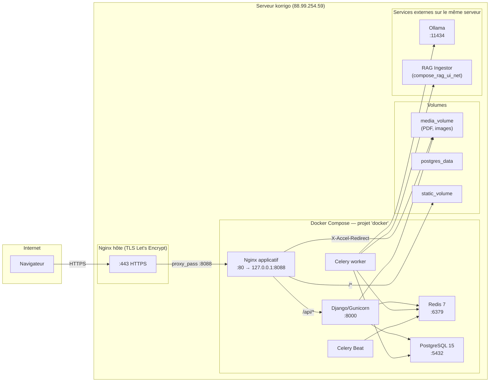

### 3.2 Flux HTTP

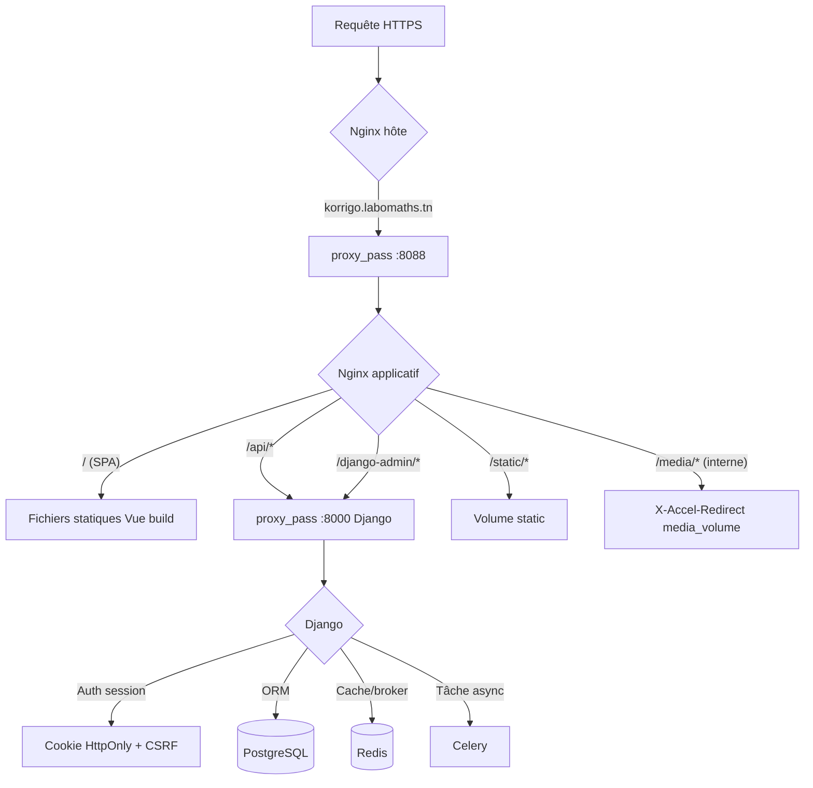

### 3.3 Architecture en couches

```
┌─────────────────────────────────────────────────────────────────────┐
│                    COUCHE PRÉSENTATION (Frontend)                    │
│  Vue 3.4 SPA  │  Pinia Stores  │  Vue Router  │  PDF.js  │  Axios   │
└────────────────────────────┬────────────────────────────────────────┘
                             │ HTTPS / JSON (session cookie)
┌────────────────────────────▼────────────────────────────────────────┐
│                     COUCHE API (Django REST Framework)               │
│  ViewSets  │  Serializers  │  Permissions RBAC  │  Session Auth      │
│  Rate limiting  │  CSP  │  CORS  │  OpenAPI (DRF Spectacular)       │
└────────────────────────────┬────────────────────────────────────────┘
                             │
┌────────────────────────────▼────────────────────────────────────────┐
│                  COUCHE LOGIQUE MÉTIER (Services Layer)              │
│  GradingService  │  AnnotationService  │  PDFFlattener               │
│  OCR Pipeline  │  LLM Bilan  │  Dispatch Service                    │
│  Transactions atomiques  │  Audit Trail  │  LockConflictError        │
└────────────────────────────┬────────────────────────────────────────┘
                             │
┌────────────────────────────▼────────────────────────────────────────┐
│                   COUCHE DONNÉES (Django ORM + PostgreSQL 15)        │
│  Modèles  │  Migrations  │  Index composites  │  Contraintes DB      │
│  JSONField (barème, coordonnées)  │  FileField (PDF, images)         │
└────────────────────────────┬────────────────────────────────────────┘
                             │
┌────────────────────────────▼────────────────────────────────────────┐
│              COUCHE TRAITEMENT ASYNCHRONE (Celery + Redis)           │
│  flatten_copy  │  OCR pipeline  │  Bilans LLM  │  Celery Beat       │
└─────────────────────────────────────────────────────────────────────┘
```

---

## 4. Arborescence du projet

```
korrigo_v2_improved/
├── backend/                    # Django 4.2 + DRF + Python 3.11
│   ├── core/                   # Authentification, audit, profils, middlewares
│   ├── exams/                  # Gestion examens, copies, PDF, dispatch
│   ├── grading/                # Correction, annotations, scores, verrous
│   ├── processing/             # Services techniques PDF (split, flatten, headers)
│   ├── students/               # Gestion élèves, portail élève
│   ├── identification/         # OCR, vidéo-codage
│   ├── bilan/                  # Bilans IA, RAG, orchestrateurs
│   ├── manage.py
│   ├── requirements.txt
│   ├── Dockerfile
│   └── entrypoint.sh
├── frontend/                   # Vue 3.4 + Vite 5 + TailwindCSS 4
│   ├── src/
│   │   ├── views/              # Pages par rôle (admin, teacher, student, public)
│   │   ├── components/         # Composants réutilisables
│   │   ├── stores/             # Pinia stores (auth, exam)
│   │   ├── services/           # API client (axios), services métier
│   │   ├── router/             # Vue Router + guards
│   │   ├── composables/        # Hooks réutilisables
│   │   └── assets/             # CSS, images
│   ├── public/                 # Assets statiques
│   ├── package.json
│   ├── vite.config.js
│   └── tailwind.config.js
├── infra/
│   ├── docker/
│   │   ├── docker-compose.prod.yml    # Production
│   │   ├── docker-compose.yml         # Développement
│   │   ├── docker-compose.staging.yml
│   │   └── docker-compose.prod-like.yml
│   └── nginx/
│       ├── nginx.conf                 # Config Nginx applicatif
│       └── Dockerfile
├── scripts/
│   ├── release/                # Scripts de release gate
│   ├── backup/                 # Scripts de backup/sync
│   ├── deploy/                 # Scripts de déploiement
│   └── *.sh                    # Utilitaires divers
├── docs/                       # Documentation technique complète
│   ├── technical/              # Architecture, API, DB, frontend, audits
│   ├── deployment/             # Guides déploiement, runbooks
│   ├── security/               # RGPD, conformité, permissions
│   ├── admin/                  # Guides administrateur
│   ├── users/                  # Guides enseignant, élève, secrétariat
│   ├── legal/                  # Politique confidentialité, CGU
│   ├── decisions/              # ADR (Architecture Decision Records)
│   └── support/                # FAQ, dépannage
├── overlay/                    # Hotfixes production montés en overlay
├── ops/                        # Artefacts d'exploitation
├── proofs/                     # Preuves d'audit
├── .env.example                # Variables d'environnement (sans valeurs)
├── .env.prod.example           # Variables production (sans valeurs)
├── Makefile                    # Cibles de développement
├── README.md                   # README principal
├── CHANGELOG.md                # Journal des modifications
├── REGISTRE_TRAITEMENTS_RGPD.md
└── .gitignore
```

**Comptages approximatifs** : 2 088 fichiers inventoriés (hors `.git`, `node_modules`, `.venv`), 193 répertoires.

---

## 5. Stack technique

### 5.1 Backend

| Composant | Version | Rôle |
|-----------|---------|------|
| Python | 3.11 | Langage principal |
| Django | 4.2 LTS (4.2.30 observé en prod) | Framework web, ORM, Admin |
| Django REST Framework | 3.x | API REST |
| Gunicorn | — | Serveur WSGI (3 workers, timeout 120s) |
| PostgreSQL | 15 (alpine) | Base de données relationnelle |
| Redis | 7 (alpine) | Cache, broker Celery, backend résultats, sessions |
| Celery | 5.x | Traitement asynchrone |
| Celery Beat | — | Planificateur de tâches périodiques |
| PyMuPDF (fitz) | 1.23.26 | Manipulation PDF (rasterisation, aplatissement) |
| OpenCV headless | 4.8.0 | Traitement d'images (détection en-têtes) |
| Pillow | 12.1+ | Traitement images (crop en-tête pour OCR) |
| Tesseract OCR | — | OCR fallback (fra+eng) |
| OpenAI GPT-4o-mini | Vision | OCR principal (écriture manuscrite) |
| Ollama | qwen2.5:32b / llama3.2 | LLM local pour bilans pédagogiques |
| pdf2image | — | Conversion PDF → images PNG |
| python-magic | 0.4.27 | Validation type MIME |
| django-ratelimit | 4.1.0 | Protection brute force |
| django-csp | 3.8 | Content Security Policy |
| prometheus-client | 0.19.0 | Métriques monitoring |
| DRF Spectacular | 0.27.1 | Documentation OpenAPI 3.0 |

### 5.2 Frontend

| Composant | Version | Rôle |
|-----------|---------|------|
| Vue.js | 3.4 | Framework UI (Composition API) |
| Pinia | 2.1 | State management |
| Vue Router | 4.2+ | Routing SPA |
| Axios | 1.13 | Client HTTP |
| PDF.js | 4.0 | Rendu PDF dans le navigateur |
| Vite | 5.1 | Build tool, dev server HMR |
| TypeScript | 5.9+ | Typage statique |
| TailwindCSS | 4.1 | Framework CSS utilitaire |
| Lucide Vue Next | — | Icônes |
| DOMPurify | — | Sanitisation HTML |
| Vitest | — | Tests unitaires |
| Playwright | — | Tests E2E |
| Vue Test Utils | — | Tests composants |

### 5.3 Infrastructure

| Composant | Version | Rôle |
|-----------|---------|------|
| Docker | 20+ | Conteneurisation |
| Docker Compose | v2 | Orchestration |
| Nginx | 1.25+ | Reverse proxy applicatif (conteneur) |
| Nginx hôte | — | TLS termination (Let's Encrypt) |
| Hetzner StorageBox | — | Backup distant chiffré SSH |

---

## 6. Docker et services production

### 6.1 Services Docker Compose

Le fichier `infra/docker/docker-compose.prod.yml` définit 6 services :

| Service | Image | Port | Rôle | Healthcheck | Restart |
|---------|-------|------|------|-------------|---------|
| `backend` | Build local Python 3.11 | 8000 (interne) | Django/Gunicorn — serveur applicatif principal | `curl /api/health/` | `unless-stopped` |
| `db` | `postgres:15-alpine` | 5432 (127.0.0.1) | Base de données PostgreSQL | `pg_isready` | `unless-stopped` |
| `redis` | `redis:7-alpine` | 6379 (interne) | Broker Celery + cache + sessions | `redis-cli ping` | `unless-stopped` |
| `celery` | Même image backend | — | Worker Celery (tâches async) | Custom healthcheck | `unless-stopped` |
| `celery-beat` | Même image backend | — | Planificateur tâches périodiques | Custom healthcheck | `unless-stopped` |
| `nginx` | Build local Nginx 1.25 | 80 → 127.0.0.1:8088 | Reverse proxy, serving static/media | `curl -f localhost` | `unless-stopped` |

### 6.2 Volumes persistants

| Volume | Point de montage | Contenu | Criticité |
|--------|-----------------|---------|-----------|
| `postgres_data` | `/var/lib/postgresql/data` | Base de données PostgreSQL | **CRITIQUE** |
| `media_volume` | `/app/media` | PDF sources, images rasterisées, PDF finaux | **CRITIQUE** |
| `static_volume` | `/app/staticfiles` | CSS, JS compilés, Django admin | Moyen |
| `ocr_cache` | `/app/ocr_cache` | Cache résultats OCR | Faible |
| `backup_volume` | `/app/backups` | Backups locaux temporaires | Moyen |

> **AVERTISSEMENT** : Ne **JAMAIS** exécuter `docker compose down -v` en production. Cela détruirait les volumes et toutes les données.

### 6.3 Réseaux

- `docker_default` : réseau bridge interne Korrigo
- `compose_rag_ui_net` : réseau externe pour accès au service RAG (ingestor)

### 6.4 Dépendances entre services

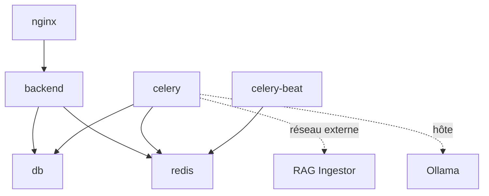

### 6.5 Stratégie de build

La production utilise des images construites localement avec un tag basé sur le SHA Git :
- Backend : `korrigo-backend:korrigo-direct-<sha>`
- Nginx : `korrigo-nginx:korrigo-direct-<sha>`

Le tag réellement déployé est défini par `KORRIGO_SHA` dans le `.env` serveur.

Le mécanisme `overlay/` permet de monter des fichiers hotfix en production sans reconstruire l'image. Ce mécanisme est opérationnel mais augmente le risque d'écart entre l'image construite et le code réellement exécuté.

---

## 7. Nginx et routage HTTP

### 7.1 Architecture double Nginx

1. **Nginx hôte** : gère la terminaison TLS (Let's Encrypt), écoute sur `:443` et `:80`, fait un `proxy_pass` vers `127.0.0.1:8088`
2. **Nginx applicatif** (conteneur `docker-nginx-1`) : écoute sur `:80` (mappé vers `:8088`), route vers les différents backends

### 7.2 Routage Nginx applicatif

| Location | Destination | Description |
|----------|-------------|-------------|
| `/` | Fichiers statiques Vue build | SPA — `try_files $uri $uri/ /index.html` |
| `/api/` | `proxy_pass http://backend:8000` | API Django REST |
| `/django-admin/` | `proxy_pass http://backend:8000` | Interface admin Django |
| `/static/` | Volume `static_volume` | Fichiers statiques Django |
| `/media/` (interne) | Volume `media_volume` | Servi via `X-Accel-Redirect` (pas d'accès direct) |
| `/metrics` | `proxy_pass http://backend:8000` | Endpoint Prometheus |

### 7.3 Headers de sécurité

Configurés dans le Nginx applicatif :

| Header | Valeur |
|--------|--------|
| `X-Content-Type-Options` | `nosniff` |
| `X-Frame-Options` | `DENY` (sauf endpoints PDF qui autorisent `SAMEORIGIN`) |
| `X-XSS-Protection` | `1; mode=block` |
| `Referrer-Policy` | `strict-origin-when-cross-origin` |
| `Content-Security-Policy` | Géré par `django-csp` côté backend |
| `Strict-Transport-Security` | Configuré en production si SSL activé |

### 7.4 Absence de source maps

Les bundles frontend en production ne contiennent **pas** de source maps (`.map` files). La config Vite de build production les exclut.

### 7.5 Cache

- Fichiers statiques (`/static/`) : cache navigateur configuré (expiration longue)
- Assets Vue (avec hash dans le nom) : cache agressif possible
- API : pas de cache HTTP côté Nginx (délégué à Django/Redis)

### 7.6 Gestion des assets

Les fichiers média (PDF, images) sont servis via un endpoint Django protégé (`/api/media/<path>`) qui vérifie les permissions puis utilise `X-Accel-Redirect` vers une location Nginx interne. Le navigateur n'accède jamais directement au volume media.

---

## 8. Backend Django

### 8.1 Applications Django

Le backend est organisé en **7 applications Django** :

| App | Responsabilité |
|-----|---------------|
| `core` | Authentification, audit RGPD, profils utilisateurs, middlewares, settings globaux |
| `exams` | Cycle de vie examens et copies, upload PDF, découpage, dispatch |
| `grading` | Correction, annotations, scores, verrouillage, finalisation, audit correction |
| `processing` | Services techniques PDF (split, flatten, headers) — pas de modèles propres |
| `students` | Référentiel élèves, portail élève, authentification élève |
| `identification` | Pipeline OCR, vidéo-codage, identification des copies |
| `bilan` | Bilans IA, orchestrateurs LLM, RAG, PDF builder |

Apps tierces installées : `rest_framework`, `drf_spectacular`, `corsheaders`, `csp`.

### 8.2 Configuration Django (settings)

**Configuration DRF** :
- Permission par défaut : `IsAuthenticated`
- Authentification : `SessionAuthentication` uniquement (pas de BasicAuth, pas de JWT)
- Pagination : `PageNumberPagination`, `PAGE_SIZE=50`
- Schema : `drf_spectacular.openapi.AutoSchema`

**Sécurité settings** :
- `SECRET_KEY` obligatoire en production
- `DEBUG=True` interdit si `DJANGO_ENV=production` (crash au démarrage)
- `ALLOWED_HOSTS` ne peut pas contenir `*` en production
- `SESSION_COOKIE_SECURE=True` et `CSRF_COOKIE_SECURE=True` forcés en production
- `CSRF_COOKIE_HTTPONLY=False` (nécessaire pour que la SPA lise le token CSRF)
- HSTS activé en production si SSL
- `METRICS_TOKEN` requis en production
- Sessions : `cached_db` (Redis + DB fallback), durée 8h en production, `SESSION_SAVE_EVERY_REQUEST=True`
- PostgreSQL timeouts : `lock_timeout=5000ms`, `statement_timeout=30000ms`, `idle_in_transaction=60000ms`
- Logs : JSON structuré en production, fichiers `django.log` + `audit.log` + console

**Middleware stack** (ordre) :
1. Request ID
2. Metrics (Prometheus)
3. CSP (Content Security Policy)
4. SecurityMiddleware
5. Sessions
6. CORS
7. Common
8. CSRF
9. Authentication
10. Messages
11. Clickjacking

### 8.3 Modèles principaux

#### core

| Modèle | Description |
|--------|-------------|
| `GlobalSettings` | Singleton de paramétrage institutionnel (nom, thème, durée par défaut, notifications) |
| `AuditLog` | Journal d'audit RGPD centralisé — horodaté, utilisateur/élève, action, ressource, IP, UA, metadata |
| `UserProfile` | Extension `OneToOne` de `User` — `must_change_password` |

#### exams

| Modèle | Description |
|--------|-------------|
| `ExamType` | Catalogue de types d'examen (code, nom, couleur, icône, actif) |
| `Exam` | Examen concret — barème JSON, correcteurs M2M, mode upload, dates, résultats publiés |
| `Booklet` | Fascicule extrait d'un PDF batch (pages, en-tête, images) |
| `Copy` | **Entité centrale** — copie d'un élève, statut, PDF source/final, anonymous_id, LLM summary |
| `ExamPDF` | Fichier PDF individuel source (mode INDIVIDUAL_A4) |
| `ExamDocumentSet` | Ensemble de documents pédagogiques (sujet, corrigé, barème) |
| `ExamDocument` | Document individuel versionné |
| `DocumentTextExtraction`, `DocumentPage`, `DocumentChunk` | Pipeline extraction texte pour RAG |
| `JuryReport` | Rapport de jury par type d'examen |
| `CopyConstraint` | Contraintes de non-correction par correcteur |
| `TeacherGroupAssignment` | Affectation enseignant/groupe/niveau |

#### grading

| Modèle | Description |
|--------|-------------|
| `Annotation` | Annotation vectorielle — coordonnées normalisées [0,1], type, contenu, delta points, version optimiste |
| `GradingEvent` | Journal d'audit de correction immutable — chaque transition, annotation CRUD |
| `Score` | Notes JSON par question — contrainte unicité 1 Score par Copy (niveau DB) |
| `CopyLock` | Verrou transitoire par copie (nettoyage périodique) |
| `DraftState` | Auto-save de l'état éditeur (anti-perte de données) |
| `QuestionRemark` | Remarque libre par question du barème |
| `AnnotationTemplate` | Banque d'annotations officielles (123 templates en prod) |
| `UserAnnotation` | Annotations personnelles du correcteur avec compteur d'usage |
| `QuestionnaireResponse` | Réponses aux questionnaires de satisfaction enseignant |
| `PeerReviewCorrection`, `PeerReviewAnnotation`, `PeerReviewQuestionRemark`, `PeerReviewEvent` | Correction participative supervisée (0 en prod) |

#### students

| Modèle | Description |
|--------|-------------|
| `Student` | Prénom, nom, date de naissance, email (unique), classe, groupe, lien `OneToOne` → `User` |

#### identification

| Modèle | Description |
|--------|-------------|
| `OCRResult` | Résultat OCR — `OneToOne` → `Copy`, texte détecté, confiance, suggestions élèves |

#### bilan

| Modèle | Description |
|--------|-------------|
| `BilanReport` | Rapport bilan — type examen, périmètre, générateur, statut, JSON, PDF, modèle LLM |
| `BilanSection` | Sections JSON ordonnées avec indicateur RAG |

### 8.4 URLs et endpoints API

**Routes racine backend** :

| Préfixe | App | Description |
|---------|-----|-------------|
| `/django-admin/` | Django Admin | Interface admin Django native |
| `/api/exams/` | exams | CRUD examens, upload, dispatch, export |
| `/api/copies/` | exams | Accès direct aux copies |
| `/api/grading/` | grading | Annotations, scores, finalisation, verrous |
| `/api/students/` | students | Gestion élèves, portail, login élève |
| `/api/identification/` | identification | OCR, vidéo-codage |
| `/api/bilan/` | bilan | Génération et consultation bilans IA |
| `/api/csrf/` | core | Token CSRF pour SPA |
| `/api/login/` | core | Authentification enseignant/admin |
| `/api/logout/` | core | Déconnexion |
| `/api/me/` | core | Profil utilisateur courant |
| `/api/auth/status/` | core | État d'authentification |
| `/api/settings/` | core | Settings globaux |
| `/api/change-password/` | core | Changement de mot de passe |
| `/api/password-reset/` | core | Reset mot de passe |
| `/api/users/` | core | Gestion utilisateurs (admin) |
| `/api/media/<path>` | core | Fichiers média protégés (X-Accel-Redirect) |
| `/api/health/` | core | Healthcheck (public) |
| `/api/health/live/` | core | Liveness probe |
| `/api/health/ready/` | core | Readiness probe |
| `/metrics` | core | Prometheus (protégé par token) |
| `/api/platform-stats/` | core | Statistiques plateforme |
| `/api/schema/` | DRF Spectacular | Schéma OpenAPI (debug uniquement) |

### 8.5 Authentification et autorisation

**Mécanisme** : Session cookie Django (pas JWT)
- Cookie `HttpOnly` : inaccessible au JavaScript (protection XSS)
- Cookie `Secure` en production : HTTPS uniquement
- Révocation immédiate côté serveur
- Protection CSRF native Django

**Rôles** :

| Rôle | Conditions Django | Accès |
|------|-------------------|-------|
| Admin | `is_superuser=True` + groupe ADMIN | Accès total |
| Correcteur/Enseignant | `is_staff=True` + groupe TEACHER | Copies assignées uniquement |
| Élève | `is_active=True` + groupe STUDENT | Portail élève — ses propres copies finalisées |
| Direction/Proviseur | `is_staff=True` + groupe DIRECTION | Dashboard direction, statistiques globales |
| Secrétariat | `is_staff=True` + groupe TEACHER | Interface vidéo-codage OCR |

**Rate limiting** (django-ratelimit 4.1) :
- `/api/login/` : 5 tentatives / 15 min / IP
- `/api/students/login/` : 30 tentatives / 15 min / IP
- Désactivé en mode test E2E (`KORRIGO_DISABLE_RATELIMIT=1`)

### 8.6 Tâches Celery

| Tâche | Type | Description |
|-------|------|-------------|
| `update_copy_status_metrics` | Périodique (1 min) | Met à jour les métriques de statut des copies dans Redis |
| `cleanup_expired_locks` | Périodique (5 min) | Nettoie les verrous `CopyLock` expirés |
| `run_copy_integrity_audit` | Périodique (15 min) | Audit d'intégrité — vérifie cohérence copies/annotations/scores |
| `async_finalize_copy` | À la demande | Aplatissement PDF + finalisation copie |
| `generate_bilan` | À la demande | Génération bilan IA via LLM |
| `perform_ocr` | À la demande | Pipeline OCR sur une copie |

### 8.7 Services métier

| Service | Fichier | Rôle |
|---------|---------|------|
| `GradingService` | `grading/services.py` | Finalisation, verrouillage, réouverture |
| `AnnotationService` | `grading/services.py` | CRUD annotations avec audit trail |
| `PDFSplitter` | `processing/` | Découpage PDF A3 en fascicules |
| `HeaderDetector` | `processing/` | Détection zone en-tête pour OCR |
| `PDFFlattener` | `processing/` | Fusion annotations dans PDF final |
| `BilanOrchestrator` | `bilan/services/` | Orchestration bilans IA (DNB/BB) |
| `EamBilanOrchestrator` | `bilan/services/` | Orchestration bilans EAM |
| `RAGRetriever` | `bilan/services/` | Récupération contexte RAG |
| `BilanPDFBuilder` | `bilan/services/` | Génération PDF bilan |

---

## 9. Base de données PostgreSQL

### 9.1 Caractéristiques

- **SGBD** : PostgreSQL 15 (image `postgres:15-alpine`)
- **Clés primaires** : UUID pour les entités métier (sauf `Student` qui utilise AutoField entier, `ExamType` entier)
- **Coordonnées** : normalisées `[0,1]` (ADR-002)
- **Statuts Copy** : machine à 3 états (ADR-003)
- **JSON** : `jsonb` pour barème (`grading_structure`), notes (`scores_data`), pages images

### 9.2 Compteurs production (2026-06-25)

| Table | Nombre d'enregistrements |
|-------|-------------------------|
| auth.User | 771 |
| auth.Group | 16 |
| auth.Permission | 156 |
| core.AuditLog | 33 501 |
| core.UserProfile | 771 |
| core.GlobalSettings | 1 |
| exams.ExamType | 5 |
| exams.Exam | 8 |
| exams.Booklet | 733 |
| exams.Copy | 733 |
| exams.ExamPDF | 329 |
| exams.ExamDocumentSet | 2 |
| exams.ExamDocument | 4 |
| exams.DocumentTextExtraction | 4 |
| exams.DocumentPage | 18 |
| exams.DocumentChunk | 153 |
| exams.CopyConstraint | 3 |
| exams.TeacherGroupAssignment | 25 |
| grading.Annotation | 12 102 |
| grading.GradingEvent | 36 425 |
| grading.Score | 731 |
| grading.CopyLock | 0 |
| grading.DraftState | 296 |
| grading.QuestionRemark | 4 999 |
| grading.AnnotationTemplate | 123 |
| grading.QuestionnaireResponse | 8 |
| students.Student | 759 |
| bilan.BilanReport | 2 |
| sessions.Session | 4 026 |

### 9.3 Diagramme ER simplifié

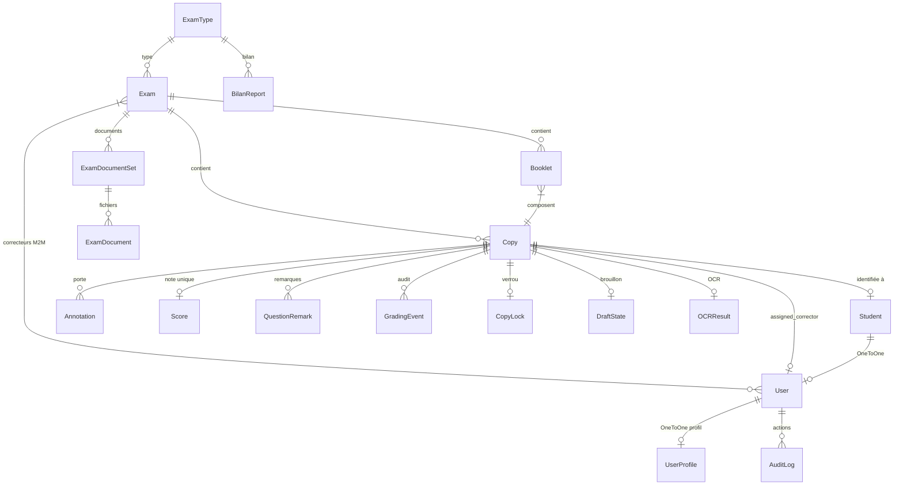

### 9.4 Machine à états Copy

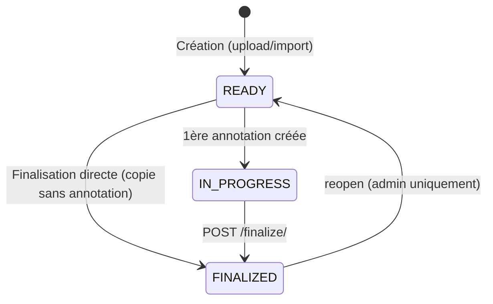

Transitions autorisées :

| Source | Déclencheur | Cible | Acteur | Effet |
|--------|-------------|-------|--------|-------|
| `READY` | 1ère annotation | `IN_PROGRESS` | Correcteur | Automatique |
| `IN_PROGRESS` | `POST finalize` | `FINALIZED` | Correcteur | PDF aplati généré, `graded_at=now()` |
| `READY` | `POST finalize` | `FINALIZED` | Correcteur | Idem (copie sans annotation) |
| `FINALIZED` | `reopen` | `READY` | Admin/superuser | `final_pdf` supprimé, `graded_at=None` |

### 9.5 Invariants métier

1. **Unicité Score** : 1 seul `Score` par `Copy` (contrainte DB)
2. **Unicité anonymous_id** : unique par examen (contrainte DB via index unique)
3. **Statut Copy** : contraint par `CHECK` DB aux valeurs `READY`, `IN_PROGRESS`, `FINALIZED`
4. **Concurrence finalisation** : `select_for_update(nowait=True)` + mise à jour atomique
5. **Re-upload bloqué** : si au moins une copie est `IN_PROGRESS` ou `FINALIZED`
6. **Audit trail** : chaque transition génère un `GradingEvent` immutable

### 9.6 Sauvegarde et restauration

- **Dump** : `pg_dump` via script backup chiffré (toutes les 6h)
- **Restauration** : `pg_restore` dans un container neuf — **ne jamais restaurer sur la prod active sans plan validé**
- **Rétention** : backup local temporaire + sync StorageBox
- **À ne jamais faire** : `DROP TABLE`, `TRUNCATE`, migration destructive, `docker compose down -v`

---

## 10. Redis, Celery et tâches planifiées

### 10.1 Redis

**Rôle** : multi-usage
- **Broker Celery** : file d'attente des tâches asynchrones
- **Result backend Celery** : stockage des résultats des tâches
- **Cache Django** : cache applicatif
- **Sessions** : backend `cached_db` (Redis + DB fallback)
- **Rate limiting** : compteurs django-ratelimit

**Configuration** : `redis:7-alpine`, port 6379 (interne au réseau Docker uniquement)

### 10.2 Celery

**Worker** : `docker-celery-1` — même image que le backend, commande Celery worker
- Pool : prefork (ForkPoolWorker observé)
- Concurrence : 14 workers observés

### 10.3 Celery Beat

**Planificateur** : `docker-celery-beat-1`
- Tâches périodiques définies dans la configuration Django
- Pas de planificateur base de données (django-celery-beat non observé)

### 10.4 Tâches périodiques observées

| Tâche | Intervalle | Description | Résultat type |
|-------|-----------|-------------|---------------|
| `update-copy-status-metrics` | 60s | Compte les copies par statut, publie dans Redis/Prometheus | `{IN_PROGRESS: 1, FINALIZED: 731, READY: 1}` |
| `cleanup-expired-locks` | 300s | Supprime les `CopyLock` expirés | `{deleted: 0}` |
| `run-copy-integrity-audit` | 900s | Vérifie la cohérence des copies (annotations orphelines, scores manquants, etc.) | `{status: ok, scanned: 733, issues: 0}` |

### 10.5 Signaux normaux vs alertes

**Normal** :
- `Task ... succeeded in 0.01s` dans les logs Celery
- `Scheduler: Sending due task` dans les logs Beat
- `issues=0` dans l'audit d'intégrité

**Alerte** :
- `issues > 0` dans l'audit d'intégrité → investiguer immédiatement
- `deleted > 100` dans cleanup locks → possible fuite de verrous
- Worker qui crash/restart en boucle
- Absence de logs Beat pendant > 5 minutes

---

## 11. Frontend Vue

### 11.1 Structure

```
frontend/src/
├── views/
│   ├── admin/          # Dashboard admin, gestion examens, utilisateurs
│   ├── teacher/        # Dashboard correcteur, desk correction
│   ├── student/        # Portail élève, résultats
│   ├── direction/      # Dashboard direction/proviseur
│   ├── peer/           # Correction participative
│   ├── public/         # Pages publiques, guides
│   └── auth/           # Login, password reset
├── components/
│   ├── correction/     # PDFViewer, CanvasLayer, GradingSidebar
│   ├── common/         # Composants réutilisables
│   └── layout/         # Layouts, navigation
├── stores/
│   ├── auth.js         # Authentification, session
│   └── exam.js         # Examen courant
├── services/
│   ├── api.js          # Client Axios configuré
│   └── peerReviewApi.js
├── router/
│   └── index.js        # Routes + guards
├── composables/        # Hooks réutilisables
└── assets/             # CSS, images
```

### 11.2 Client API

`frontend/src/services/api.js` :
- `baseURL` : `VITE_API_URL` ou `/api` par défaut
- `withCredentials: true` (cookies de session)
- Timeout : 30s (120s pour uploads)
- Intercepteur CSRF : lit le cookie `csrftoken` et l'envoie dans le header `X-CSRFToken`
- Retry : 3 tentatives sur GET et endpoints idempotents
- Redirection vers `/` sur 401/403 non attendu

### 11.3 Stores Pinia

**`auth.js`** :
- État : `user`, `lastError`, `isAuthenticated`, `mustChangePassword`, `isChecking`
- Login admin/teacher : `POST /api/login/`
- Login élève : `POST /api/students/login/`
- Bootstrap : `GET /api/auth/status/` → `GET /api/me/` ou `GET /api/students/me/`
- Logout selon rôle

**`exam.js`** :
- État : `currentExamTypeId`, `currentExamId`, libellés
- Persistance dans `localStorage`

### 11.4 Routes et guards

**Routes publiques** (pas d'authentification requise) :
- `/` — Page d'accueil Korrigo
- `/korrigo` — Landing page
- `/admin/login`, `/teacher/login`, `/student/login` — Pages de connexion par rôle
- Guides enseignant, élève, direction

**Routes protégées admin** :
- `/admin/dashboard` — Dashboard administrateur
- `/admin/exams/*` — Gestion examens, copies, correcteurs, barème, résultats
- `/admin/users` — Gestion utilisateurs
- `/admin/identification/*` — Interface vidéo-codage
- `/admin/bilans/*` — Gestion bilans IA

**Routes protégées correcteur** :
- `/teacher/dashboard` — Dashboard correcteur
- `/teacher/correction/:id` — Desk de correction
- `/teacher/my-students` — Mes élèves
- `/teacher/bilans/*` — Bilans élèves

**Routes protégées direction** :
- `/direction/dashboard` — Dashboard proviseur

**Routes protégées élève** :
- `/student/dashboard` — Dashboard élève
- `/student/results/:id` — Résultat copie corrigée

**Guards** : le router Vue vérifie `meta.requiresAuth` et `meta.role` avant chaque navigation. Si non authentifié ou mauvais rôle, redirection vers la page de login appropriée.

### 11.5 Build et déploiement

- Build : `vite build` → output dans `dist/`
- Pas de source maps en production
- Les fichiers buildés sont servis par Nginx applicatif (SPA avec fallback `index.html`)
- Assets hashés pour cache-busting automatique

---

## 12. Rôles, profils et workflows

### 12.1 Parcours Enseignant/Correcteur

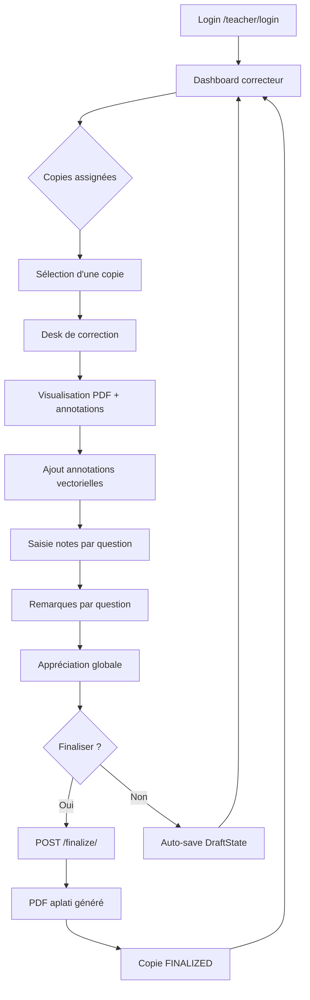

### 12.2 Parcours Élève

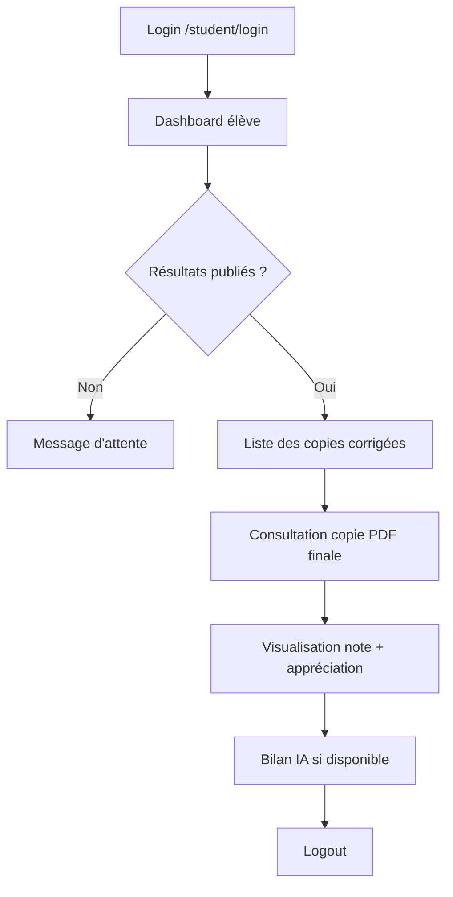

### 12.3 Parcours Admin

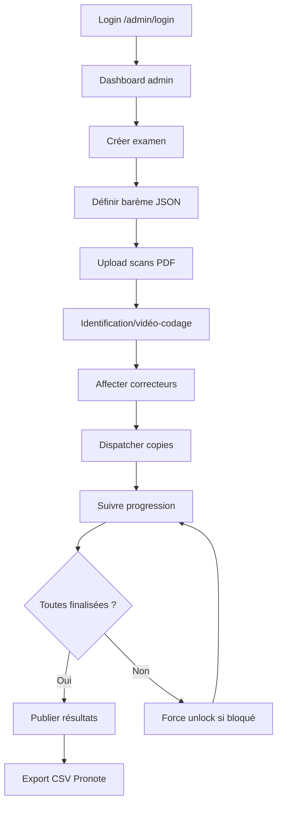

### 12.4 Parcours Direction/Proviseur

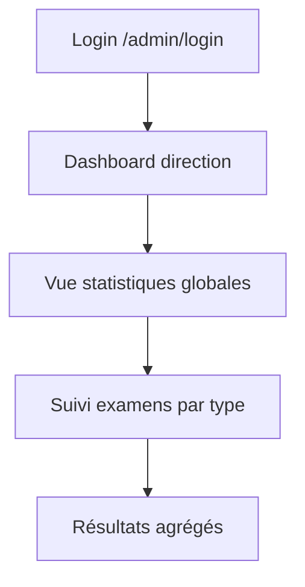

---

## 13. API et routage frontend/backend

### 13.1 Routes publiques

| Endpoint | Méthode | Description | Auth |
|----------|---------|-------------|------|
| `/api/health/` | GET | Healthcheck — `{"status":"healthy","database":"connected"}` | Non |
| `/api/health/live/` | GET | Liveness probe | Non |
| `/api/health/ready/` | GET | Readiness probe | Non |
| `/api/csrf/` | GET | Obtenir le token CSRF | Non |

### 13.2 Routes d'authentification

| Endpoint | Méthode | Description | Auth |
|----------|---------|-------------|------|
| `/api/login/` | POST | Login enseignant/admin (username + password) | Non |
| `/api/logout/` | POST | Déconnexion | Oui |
| `/api/me/` | GET | Profil utilisateur courant | Oui |
| `/api/auth/status/` | GET | État d'authentification + rôle | Oui |
| `/api/students/login/` | POST | Login élève (email + password) | Non |
| `/api/students/logout/` | POST | Déconnexion élève | Oui |
| `/api/students/me/` | GET | Profil élève courant | Oui (élève) |
| `/api/change-password/` | POST | Changement mot de passe | Oui |
| `/api/password-reset/` | POST | Demande reset mot de passe | Non |

### 13.3 Routes examens (admin)

| Endpoint | Méthode | Description |
|----------|---------|-------------|
| `/api/exams/` | GET, POST | Liste/création examens |
| `/api/exams/<id>/` | GET, PATCH, DELETE | Détail/modification examen |
| `/api/exams/upload/` | POST | Upload scans batch A3 |
| `/api/exams/<id>/upload/` | POST | Upload PDF sur un examen existant |
| `/api/exams/<exam_id>/copies/` | GET | Copies d'un examen |
| `/api/exams/<exam_id>/copies/import/` | POST | Import copies individuelles |
| `/api/exams/<exam_id>/upload-individual-pdfs/` | POST | Upload PDF individuels A4 |
| `/api/exams/<exam_id>/dispatch/` | POST | Dispatcher copies aux correcteurs |
| `/api/exams/<exam_id>/validate-all/` | POST | Valider toutes les copies |
| `/api/exams/<exam_id>/student-list/` | GET | Liste élèves de l'examen |
| `/api/exams/<exam_id>/export-csv/` | GET | Export CSV notes |
| `/api/exams/<exam_id>/export-pronote/` | GET | Export Pronote |

### 13.4 Routes correction (enseignant)

| Endpoint | Méthode | Description |
|----------|---------|-------------|
| `/api/grading/copies/<id>/annotations/` | GET, POST | Annotations d'une copie |
| `/api/grading/annotations/<id>/` | PATCH, DELETE | Modification/suppression annotation |
| `/api/grading/copies/<id>/lock/` | POST | Prendre le verrou |
| `/api/grading/copies/<id>/unlock/` | POST | Libérer le verrou |
| `/api/grading/copies/<id>/finalize/` | POST | Finaliser copie |
| `/api/grading/copies/<id>/final-pdf/` | GET | Télécharger PDF final |
| `/api/grading/copies/<id>/scores/` | GET, PUT | Scores par question |
| `/api/grading/copies/<id>/global-appreciation/` | PUT | Appréciation globale |
| `/api/grading/copies/<id>/draft/` | GET, PUT | Auto-save brouillon |
| `/api/grading/copies/<id>/remarks/` | GET, POST | Remarques par question |
| `/api/grading/copies/<id>/generate-summary/` | POST | Générer bilan LLM |
| `/api/grading/annotation-templates/` | GET, POST | Banque d'annotations |
| `/api/grading/copies/<id>/force-unlock/` | POST | Force unlock (admin) |
| `/api/grading/copies/<id>/reopen/` | POST | Réouverture (admin) |
| `/api/grading/copies/<id>/regenerate-final-pdf/` | POST | Régénérer PDF final |

### 13.5 Routes élèves

| Endpoint | Méthode | Description |
|----------|---------|-------------|
| `/api/students/` | GET | Liste élèves |
| `/api/students/import/` | POST | Import CSV élèves |
| `/api/students/copies/` | GET | Copies corrigées de l'élève connecté |

### 13.6 Routes identification

| Endpoint | Méthode | Description |
|----------|---------|-------------|
| `/api/identification/desk/` | GET | Desk d'identification |
| `/api/identification/identify/<copy_id>/` | POST | Identification manuelle |
| `/api/identification/ocr-identify/<copy_id>/` | POST | Identification semi-auto OCR |
| `/api/identification/perform-ocr/<copy_id>/` | POST | Lancer OCR sur une copie |

### 13.7 Routes bilan

| Endpoint | Méthode | Description |
|----------|---------|-------------|
| `/api/bilan/` | GET | Liste bilans |
| `/api/bilan/generate/` | POST | Générer un bilan |
| `/api/bilan/<id>/` | GET | Détail bilan |
| `/api/bilan/<id>/pdf/` | GET | PDF bilan |
| `/api/bilan/stats/` | GET | Statistiques bilans |

### 13.8 Routes monitoring

| Endpoint | Méthode | Description | Auth |
|----------|---------|-------------|------|
| `/metrics` | GET | Métriques Prometheus | Token `X-Metrics-Token` |
| `/api/platform-stats/` | GET | Statistiques plateforme | Oui (admin) |

---

## 14. Logique métier

### 14.1 Ingestion PDF batch A3

1. L'admin uploade un PDF contenant plusieurs copies scannées en recto-verso A3
2. Validation : extension `.pdf`, taille ≤ 50 Mo, MIME `application/pdf`, intégrité PyMuPDF
3. `PDFSplitter` découpe le PDF en fascicules selon `pages_per_booklet`
4. Rasterisation des pages en images PNG
5. Extraction de l'image d'en-tête pour OCR
6. Création de `Booklet` et `Copy` avec statut `READY`
7. Attribution d'un `anonymous_id` séquentiel unique par examen

### 14.2 Ingestion PDF individuel A4

1. Upload d'un ou plusieurs PDF individuels (1 PDF = 1 copie)
2. Identification optionnelle via le nom de fichier : `NOM_PRENOM_DDMMYYYY.pdf`
3. Création de `ExamPDF`, `Booklet`, `Copy`

### 14.3 Identification OCR

1. Extraction de la zone d'en-tête de la copie (crop via OpenCV/Pillow)
2. Envoi à GPT-4o-mini Vision (principal) ou Tesseract (fallback fra+eng)
3. Matching flou avec la base `Student` (nom, prénom, date de naissance)
4. Retour de suggestions ordonnées par confiance
5. Validation humaine par l'opérateur (vidéo-codage)
6. Mise à jour `copy.student`, `copy.is_identified`

### 14.4 Dispatch

1. L'admin sélectionne les correcteurs et lance le dispatch
2. Répartition round-robin avec prise en compte des `CopyConstraint` et `TeacherGroupAssignment`
3. Attribution de `assigned_corrector`, `dispatch_run_id`, `assigned_at`

### 14.5 Correction

1. Le correcteur accède à ses copies via le dashboard
2. Prise du verrou (`CopyLock`) pour exclusion mutuelle
3. Visualisation PDF via PDF.js avec couche canvas pour annotations
4. Ajout d'annotations vectorielles (coordonnées normalisées [0,1])
5. Types d'annotations : `COMMENT`, `HIGHLIGHT`, `ERROR`, `BONUS`, `VRAI`, `FAUX`
6. Saisie des notes par question (`Score.scores_data`)
7. Remarques par question (`QuestionRemark`)
8. Appréciation globale (`Copy.global_appreciation`)
9. Auto-save via `DraftState`
10. Chaque action significative génère un `GradingEvent`

### 14.6 Finalisation

1. `POST /api/grading/copies/<id>/finalize/`
2. Vérification permissions (correcteur assigné ou admin)
3. `select_for_update(nowait=True)` — exclusion mutuelle
4. Vérification statut `READY` ou `IN_PROGRESS`
5. Mise à jour atomique : `status=FINALIZED`, `graded_at=now()`
6. Aplatissement PDF : fusion annotations vectorielles dans le PDF source via PyMuPDF
7. Stockage `Copy.final_pdf`
8. En cas de race condition : `LockConflictError` (HTTP 409)

### 14.7 Publication résultats

1. L'admin publie les résultats : `POST /api/exams/<id>/release-results/`
2. Mise à jour `Exam.results_released_at`
3. Les élèves peuvent désormais voir leurs copies finalisées via le portail
4. Annulation possible : `POST /api/exams/<id>/unrelease-results/`

### 14.8 Bilans IA

1. L'enseignant ou l'admin déclenche la génération de bilan
2. L'orchestrateur collecte les données de la copie (notes, remarques, appréciation)
3. Récupération du contexte RAG (documents pédagogiques, barème)
4. Envoi au LLM (provider OpenAI-compatible / Ollama fallback)
5. Génération d'un bilan personnalisé (tutoie l'élève, analyse points forts/faibles)
6. Stockage dans `BilanReport` + génération PDF optionnel
7. Affiché dans le portail élève

---

## 15. Sécurité et RGPD

### 15.1 Données personnelles traitées

| Catégorie | Données | Personnes concernées | Base légale |
|-----------|---------|---------------------|-------------|
| Identité | Nom, prénom, date de naissance | Élèves | Mission de service public |
| Contact | Email | Élèves, enseignants | Consentement / obligation contractuelle |
| Scolaire | Classe, groupe, notes, copies scannées, annotations, appréciations | Élèves | Mission de service public |
| Professionnel | Nom d'utilisateur, actions de correction | Enseignants | Obligation contractuelle |
| Technique | IP, user-agent, horodatage connexion | Tous | Intérêt légitime (sécurité) |
| IA | Résumés LLM, bilans pédagogiques | Élèves | Consentement `À VÉRIFIER` |

### 15.2 Mesures de protection

| Mesure | Statut | Détail |
|--------|--------|--------|
| **Authentification session cookie** | Actif | `HttpOnly`, `Secure`, CSRF natif Django |
| **Séparation des rôles (RBAC)** | Actif | Admin, Enseignant, Élève, Direction via groupes Django |
| **Anonymisation correction** | Actif | Correcteurs voient `anonymous_id`, pas le nom de l'élève |
| **Rate limiting** | Actif | 5/15min login admin, 30/15min login élève |
| **Audit trail** | Actif | 33 501 entrées `AuditLog` — IP, UA, action, horodatage |
| **HTTPS/TLS** | Actif | Let's Encrypt via Nginx hôte, HSTS |
| **CSP** | Actif | `django-csp` 3.8 |
| **Headers sécurité** | Actif | `X-Content-Type-Options`, `X-Frame-Options`, `X-XSS-Protection` |
| **Media protégé** | Actif | `/api/media/` avec vérification permissions + `X-Accel-Redirect` |
| **Pas de source maps** | Actif | Build production sans `.map` |
| **Secrets hors dépôt** | Actif | `.env` dans `.gitignore` |
| **Backup chiffré transit** | Actif | SSH vers StorageBox |
| **PostgreSQL timeouts** | Actif | lock 5s, statement 30s, idle 60s |
| **Verrouillage optimiste** | Actif | Champ `version` sur `Annotation` |
| **Audit d'intégrité** | Actif | Tâche périodique (15 min) — 0 issue observée |
| **Permissions backup** | Actif | Scripts `rwxr-x---` (root) |

### 15.3 Dettes RGPD et sécurité

| Risque | Sévérité | Description | Statut |
|--------|----------|-------------|--------|
| **Backup chiffrement au repos** | Important | Les dumps DB et archives media sur le StorageBox ne sont pas chiffrés au repos par l'application. Le script v2 utilise GPG si `BACKUP_GPG_PASSPHRASE` est défini — `À VÉRIFIER` si activé en production | À vérifier |
| **Consentement LLM** | Important | Le transfert de données élèves vers un LLM externe nécessite information + consentement documenté | À vérifier |
| **Localisation LLM** | Suivi | Vérifier la localisation et la politique de conservation du provider LLM configuré | À vérifier |
| **Purge sessions** | Suivi | 4 026 sessions actives — vérifier la purge des sessions expirées | À vérifier |
| **Politique de rétention** | Suivi | Durée de conservation des copies, annotations et audit logs à documenter formellement | Documenté partiellement dans `POLITIQUE_RGPD.md` |
| **DPIA** | Suivi | Analyse d'impact formelle à compléter pour le traitement LLM/OCR externe | À vérifier |
| **Noms dans scans** | Accepté | Les en-têtes de copies scannées contiennent les noms manuscrits des élèves — risque inhérent au processus papier | Accepté |
| **Overlay production** | Important | Le mécanisme overlay augmente le risque d'écart entre code source et code exécuté | Opérationnel |

### 15.4 Exposition publique

| Élément | Accessible publiquement | Protection |
|---------|------------------------|------------|
| Pages SPA publiques | Oui | Pas de données sensibles |
| API `/api/health/` | Oui | Pas de données sensibles |
| API `/api/csrf/` | Oui | Token CSRF uniquement |
| API `/api/login/` | Oui | Rate limiting |
| Bundles JS frontend | Oui | Pas de source maps, pas de secrets |
| Media (PDF, images) | Non | X-Accel-Redirect + permissions Django |
| `/metrics` | Non | Protégé par `X-Metrics-Token` |
| API données | Non | `IsAuthenticated` par défaut |
| Admin Django | Non | Login requis (`/django-admin/`) |

---

## 16. Backups, StorageBox et PRA

### 16.1 Architecture backup

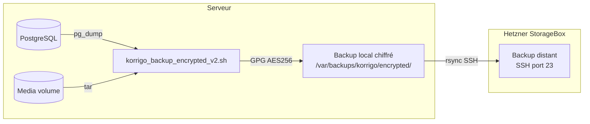

### 16.2 Scripts actifs en production

| Script | Emplacement | Cron | Description |
|--------|-------------|------|-------------|
| `korrigo_backup_encrypted_v2.sh` | `/usr/local/bin/` | `17 */6 * * *` | Backup chiffré local (DB + media + JSON) |
| `korrigo_sync_storagebox_v2.sh` | `/usr/local/bin/` | `47 */6 * * *` | Sync vers StorageBox Hetzner |
| `daily_audit.sh` | `/var/www/labomaths/korrigo/scripts/` | `0 6 * * *` | Audit quotidien |

### 16.3 Contenu du backup

- Dump PostgreSQL complet (`pg_dump`)
- Export JSON pseudonymisé des corrections
- Archive complète du volume media Docker (PDF sources, images, PDF finaux)
- Chiffrement GPG AES256 si `BACKUP_GPG_PASSPHRASE` défini

### 16.4 Fréquence et rétention

- Backup local : toutes les 6 heures
- Sync distante : toutes les 6 heures (30 min après le backup)
- Rétention locale : derniers backups conservés
- Rétention distante : `À VÉRIFIER` (historiquement 24h documenté pour l'ancien script)

### 16.5 Ancien script (suspendu)

L'ancien script `korrigo_backup.sh` (toutes les 30 min) a été suspendu le 2026-06-21 (`SUSPENDED_KORRIGO_BASCULE_20260621`). Le nouveau script v2 chiffré le remplace.

### 16.6 Backups récents observés

9 backups datés du 23-24 juin 2026, nommés par timestamp UTC :
- `20260623T045552Z` → `20260624T221702Z`

### 16.7 Plan de Reprise d'Activité (PRA)

**En cas d'incident majeur** :

1. **Ne pas paniquer**
2. Vérifier la nature de l'incident (DB, media, réseau, disque, certificat)
3. Vérifier le dernier backup disponible (local puis StorageBox)
4. Pour une restauration DB :
   - Provisionner un nouveau container PostgreSQL
   - Restaurer depuis le dump `pg_restore`
   - Vérifier la cohérence avec `python manage.py check`
5. Pour une restauration media :
   - Extraire l'archive tar dans le volume media
6. **Ne jamais restaurer directement sur la production active sans validation**
7. Tester la restauration sur un environnement isolé d'abord

**Ce qu'il ne faut JAMAIS faire** :
- `docker compose down -v` (détruit les volumes)
- `DROP TABLE` / `TRUNCATE` en production
- Migration destructive sans backup préalable
- Restaurer un backup non vérifié sur la prod active
- Supprimer les backups locaux avant de vérifier le StorageBox

---

## 17. Tests, qualité et CI locale

### 17.1 Tests backend

- Framework : `pytest` + `Django TestCase`
- Couverture : modèles, vues, serializers, services, permissions
- Nombre approximatif : 110 fichiers de test (backend)
- Exécution : `cd backend && pytest`
- Fixtures : `conftest.py` dans chaque app

### 17.2 Tests frontend

- Framework : Vitest (unitaires) + Playwright (E2E)
- Nombre approximatif : 47 fichiers de test (frontend)
- Tests unitaires : `cd frontend && npm run test`
- Tests E2E : `cd frontend && npx playwright test`

### 17.3 Contracts et audits automatisés

| Vérification | Description |
|--------------|-------------|
| Release gate | `scripts/release/local_release_check.sh` — vérifie migrations, tests, lint, contracts |
| Compose contract | Validation de la config Docker Compose |
| Nginx contract | Vérification de la config Nginx |
| Route guard contract | Vérification que toutes les routes protégées ont des guards |
| HMAC gate | Validation de l'intégrité des fichiers critiques |
| E2E production | Tests Playwright contre la production (smoke tests) |
| Audit intégrité | Tâche Celery périodique — 733 copies scannées, 0 issue |

### 17.4 Lint

- **Python** : Ruff
- **JavaScript/Vue** : ESLint

### 17.5 Limitations

- Pas de CI/CD automatisée sur un serveur distant (pas de GitHub Actions actif en continu)
- Les tests E2E complets nécessitent un environnement Docker local fonctionnel
- Les tests de production authentifiée nécessitent un compte test

```
NON TESTÉ EN PRODUCTION AUTHENTIFIÉE — couvert par E2E local uniquement.
```

---

## 18. Déploiement local

### 18.1 Prérequis système

- Docker 20+ et Docker Compose v2
- Node.js 18+ (pour le frontend)
- Python 3.11+ (pour le développement backend hors Docker)
- 8 Go RAM minimum (pour Ollama/OCR)
- Git

### 18.2 Variables d'environnement

Copier `.env.example` vers `.env` et remplir les variables obligatoires :

| Variable | Description | Obligatoire |
|----------|-------------|-------------|
| `SECRET_KEY` | Clé secrète Django | Oui |
| `DJANGO_ENV` | `development` ou `production` | Oui |
| `DEBUG` | `True` ou `False` | Oui |
| `POSTGRES_DB` | Nom de la base | Oui |
| `POSTGRES_USER` | Utilisateur PostgreSQL | Oui |
| `POSTGRES_PASSWORD` | Mot de passe PostgreSQL | Oui |
| `OPENAI_API_KEY` | Clé API OpenAI (OCR Vision) | Pour OCR |
| `METRICS_TOKEN` | Token Prometheus | Prod uniquement |
| `BACKUP_GPG_PASSPHRASE` | Passphrase chiffrement backup | Recommandé |

```
Ne jamais utiliser les secrets de production en local.
Ne jamais copier la DB production sans anonymisation et autorisation.
```

### 18.3 Lancement avec Docker Compose (développement)

```bash
# Cloner le dépôt
git clone <repo-url> && cd korrigo_v2_improved

# Copier et configurer .env
cp .env.example .env
# Éditer .env avec vos valeurs locales

# Lancer les services
make up
# ou : docker compose up -d

# Créer l'admin
make superuser
# ou : docker compose exec backend python manage.py createsuperuser

# Appliquer les migrations
docker compose exec backend python manage.py migrate
```

### 18.4 Accès local

| Service | URL |
|---------|-----|
| Frontend | http://localhost:5173 |
| API / Swagger | http://localhost:8000/api/schema/swagger-ui/ |
| Django Admin | http://localhost:8000/django-admin/ |
| PostgreSQL | localhost:5435 |
| Redis | localhost:6385 |

### 18.5 Sans Docker (développement)

```bash
# Backend
cd backend
python -m venv .venv
source .venv/bin/activate
pip install -r requirements.txt
python manage.py migrate
python manage.py runserver

# Frontend (terminal séparé)
cd frontend
npm install
npm run dev

# Celery (terminal séparé)
cd backend
celery -A core worker -l INFO

# Celery Beat (terminal séparé)
cd backend
celery -A core beat -l INFO
```

### 18.6 Erreurs fréquentes

| Erreur | Solution |
|--------|----------|
| `SECRET_KEY` vide | Générer avec `python -c "from django.core.management.utils import get_random_secret_key; print(get_random_secret_key())"` |
| `DEBUG=True` en `DJANGO_ENV=production` | Crash volontaire — mettre `DJANGO_ENV=development` |
| PostgreSQL refuse la connexion | Vérifier `POSTGRES_USER`, `POSTGRES_PASSWORD`, port mapping |
| Redis indisponible | Vérifier que le service Redis est démarré |
| Frontend CORS bloqué | Vérifier `CORS_ALLOWED_ORIGINS` dans `.env` |
| OCR échoue | Vérifier `OPENAI_API_KEY` ou installer Tesseract en local |

---

## 19. Déploiement serveur

### 19.1 Architecture serveur

- Serveur dédié Hetzner
- OS : Linux
- Docker et Docker Compose installés
- Nginx hôte pour TLS (Let's Encrypt)
- Répertoire de déploiement : `/var/www/labomaths/korrigo`
- Fichier compose production : `infra/docker/docker-compose.prod.yml`
- `.env` production : `/var/www/labomaths/korrigo/.env` (ne jamais exposer)

### 19.2 Procédure de déploiement

```bash
# 1. Se connecter au serveur
ssh nexus-prod
cd /var/www/labomaths/korrigo_release

# 2. Vérifier le tag actuel
grep '^KORRIGO_SHA=' /var/www/labomaths/korrigo/.env

# 3. Construire les images (si build local)
docker compose --env-file /var/www/labomaths/korrigo/.env \
  -f infra/docker/docker-compose.prod.yml \
  build

# 4. Appliquer les migrations
docker compose -p docker --env-file /var/www/labomaths/korrigo/.env \
  -f infra/docker/docker-compose.prod.yml \
  run --rm -T --user root backend python manage.py migrate

# 5. Relancer les services
docker compose -p docker --env-file /var/www/labomaths/korrigo/.env \
  -f infra/docker/docker-compose.prod.yml \
  up -d --wait --wait-timeout 180

# 6. Recréer Nginx (évite les 502)
docker compose -p docker --env-file /var/www/labomaths/korrigo/.env \
  -f infra/docker/docker-compose.prod.yml \
  up -d --force-recreate nginx

# 7. Vérifier
curl -fsS https://korrigo.labomaths.tn/api/health/
docker ps --format "table {{.Names}}\t{{.Status}}"
```

### 19.3 Déploiement Nginx-only

Pour mettre à jour la config Nginx sans toucher au backend :

```bash
docker compose -p docker --env-file /var/www/labomaths/korrigo/.env \
  -f infra/docker/docker-compose.prod.yml \
  up -d --force-recreate nginx
```

### 19.4 Rollback

```bash
# Identifier l'image précédente
docker images | grep korrigo

# Mettre à jour KORRIGO_SHA dans .env avec le tag précédent
# Relancer les services
docker compose -p docker --env-file /var/www/labomaths/korrigo/.env \
  -f infra/docker/docker-compose.prod.yml \
  up -d --wait
```

---

## 20. Runbook d'exploitation production

### 20.1 Vérifications quotidiennes

```bash
# Health check
curl -fsS https://korrigo.labomaths.tn/api/health/

# Services Docker
docker ps --format "table {{.Names}}\t{{.Status}}" | grep docker-

# Logs Celery (dernières 5 min)
docker logs --since 5m docker-celery-beat-1 | tail -20

# Disque
df -h /

# Backups
ls -lt /var/backups/korrigo/encrypted/ | head -5
```

### 20.2 Incidents et résolutions

| Incident | Diagnostic | Action |
|----------|-----------|--------|
| API non accessible | Vérifier `docker-nginx-1` et `docker-backend-1` | `docker restart docker-nginx-1` puis vérifier |
| `docker-celery-beat-1` down | `docker logs docker-celery-beat-1` | `docker restart docker-celery-beat-1` |
| Copie bloquée `IN_PROGRESS` | Vérifier les logs du correcteur | `docker exec docker-backend-1 python manage.py recover_stuck_copies` |
| Erreur 502 après redéploiement | Upstream Docker périmé | `docker compose ... up -d --force-recreate nginx` |
| Disque plein | `df -h /`, `docker system df` | Nettoyer les images Docker non utilisées (avec précaution) |
| Échec backup | `/var/log/korrigo_backup_encrypted_v2.log` | Vérifier accès StorageBox, espace disque |
| Certificat TLS expiré | `curl -vI https://korrigo.labomaths.tn/` | Renouveler via Let's Encrypt (Nginx hôte) |
| Redis down | `docker logs docker-redis-1` | `docker restart docker-redis-1` (sessions perdues = reconnexion) |
| PostgreSQL lent | Vérifier locks, connections | `docker exec docker-db-1 psql -U korrigo_user -d korrigo_db -c "SELECT * FROM pg_stat_activity WHERE state != 'idle'"` |

### 20.3 Procédure « ne pas paniquer »

1. **Constater** : quel service est en erreur ? (health check, docker ps, logs)
2. **Isoler** : le problème est-il réseau, disque, applicatif, ou DB ?
3. **Documenter** : noter l'heure, les symptômes, les logs
4. **Agir** : restart du service concerné en premier recours
5. **Vérifier** : health check + docker ps + curl
6. **Escalader** : si le problème persiste après 2 restarts, contacter l'administrateur

---

## 21. Monitoring et signaux d'alerte

### 21.1 Endpoints de monitoring

| Endpoint | Usage | Protection |
|----------|-------|------------|
| `/api/health/` | Healthcheck principal — DB connectivity | Public |
| `/api/health/live/` | Liveness (le processus tourne) | Public |
| `/api/health/ready/` | Readiness (prêt à servir) | Public |
| `/metrics` | Prometheus — compteurs, histogrammes | Token `X-Metrics-Token` |

### 21.2 Métriques Prometheus

Exposées via `prometheus-client 0.19.0` :
- Compteurs HTTP (requêtes par endpoint, statut)
- Métriques de statut des copies (mis à jour chaque minute par Celery)
- Histogramme de temps de réponse

### 21.3 Signaux d'alerte

| Signal | Seuil | Action |
|--------|-------|--------|
| Health check échoue | 1 échec | Vérifier services Docker immédiatement |
| Disque > 90 % | 90 % utilisé | Nettoyer images Docker, vérifier backups |
| Audit d'intégrité `issues > 0` | > 0 | Investigation immédiate |
| Celery Beat silencieux > 5 min | Pas de log Beat | Restart `docker-celery-beat-1` |
| Logs `ERROR` en cascade | > 10/min | Investigation applicative |
| Backup échoue 2 fois de suite | 2 échecs | Vérifier StorageBox, disque, script |

### 21.4 Logs structurés

En production, Django produit des logs JSON structurés :
- `django.log` : logs applicatifs généraux
- `audit.log` : logs d'audit RGPD
- Console (capturée par Docker) : accessible via `docker logs`

---

## 22. Incidents récents et portes de stabilisation

### 22.1 Historique des portes de stabilisation

Le projet a traversé plusieurs portes de stabilisation documentées dans `docs/` :

| Porte | Date | Contenu |
|-------|------|---------|
| Release Go/No-Go | 2026-02-08 | Validation initiale pour mise en production |
| Audit P0/P1/P2 | 2026-05-14 | Hardening sécurité, SSL, overlays sync |
| Audit global | 2026-06-20 | Audit technique complet, classification worktree |
| Reconciliation migrations | 2026-06-20 | Décision sur les migrations exams 0039-0042 |

### 22.2 Corrections récentes majeures

Extraites du `git log` :

- **Password change button** : ajout bouton changement mot de passe au dashboard Direction
- **Bilan detail** : accepte integer ID ou exam UUID
- **DIRECTION_GROUPS** : correction ImportError + fallback real-IP rate limiter
- **Double-submit login** : guard contre le triple POST 401
- **Merge migration** : résolution conflit graphe migrations exams
- **Full-stack audit** : hardening sécurité P0/P1/P2
- **Tests stabilisation** : 952/952 tests passants
- **Direction dashboard** : redesign premium + accès proviseur

### 22.3 État worktree actuel

Branche `wip/worktree-20260620`, fichier modifié non commité : `ASSAINISSEMENT_KORRIGO.md`.

---

## 23. Dettes restantes et limites connues

### 23.1 Dettes techniques

| Dette | Sévérité | Description |
|-------|----------|-------------|
| **Overlay production** | Important | Le mécanisme de montage de fichiers hotfix crée un écart entre le code source et le code exécuté. Risque de régression non détectée. |
| **Disque serveur 78 %** | Suivi | 201 Go disponibles. Surveiller la croissance (backups, images Docker, media). |
| **Sessions non purgées** | Suivi | 4 026 sessions en base. Vérifier si `clearsessions` est planifié. |
| **Peer review inutilisée** | Suivi | 4 modèles, 0 enregistrement en prod. Code déployé mais jamais activé. |
| **JuryReport vide** | Suivi | 0 enregistrement. Feature potentiellement non utilisée. |
| **Worktree local sale** | Suivi | `ASSAINISSEMENT_KORRIGO.md` modifié, branche non main. |
| **2 copies non finalisées** | Suivi | 1 IN_PROGRESS + 1 READY sur 733 copies. Potentiellement intentionnel (test). |
| **admin.LogEntry vide** | Suivi | 0 entrées dans le log admin Django natif (compensé par `AuditLog` custom). |

### 23.2 Dettes RGPD

| Dette | Sévérité | Description |
|-------|----------|-------------|
| **Chiffrement backup au repos** | Important | `À VÉRIFIER` si `BACKUP_GPG_PASSPHRASE` est configuré en production. Sans cela, les dumps DB sur StorageBox sont en clair. |
| **Information élèves LLM** | Important | Le transfert de données vers un LLM externe (OCR Vision, bilans) nécessite une information formelle des personnes concernées. |
| **DPIA LLM/OCR** | Suivi | Analyse d'impact formelle pour les traitements IA à compléter. |
| **Politique de rétention** | Suivi | Durées de conservation à formaliser pour chaque catégorie de données. |

### 23.3 Dettes admin externe

| Dette | Sévérité | Dépendance |
|-------|----------|------------|
| **Renouvellement certificat TLS** | Admin externe | Let's Encrypt / Nginx hôte — à vérifier périodiquement |
| **Mise à jour Ollama/modèles** | Admin externe | Serveur hôte — hors périmètre Docker Korrigo |
| **Contrat provider LLM** | Admin externe | Vérifier conditions de conservation des données envoyées |

---

## 24. Annexes

### 24.1 Tableau des services Docker

| Service | Image | Rôle | Port | Healthcheck | Volume principal |
|---------|-------|------|------|-------------|-----------------|
| backend | Python 3.11 + Django | API REST | 8000 | `/api/health/` | media, static |
| db | postgres:15-alpine | BDD | 5432 | pg_isready | postgres_data |
| redis | redis:7-alpine | Cache/broker | 6379 | redis-cli ping | — |
| celery | Même image backend | Worker async | — | Custom | media |
| celery-beat | Même image backend | Planificateur | — | Custom | — |
| nginx | Nginx 1.25 | Reverse proxy | 80→8088 | curl localhost | static, media |

### 24.2 Tableau des volumes

| Volume | Criticité | Sauvegardé | Contenu |
|--------|-----------|-----------|---------|
| postgres_data | CRITIQUE | Oui (pg_dump) | Base de données |
| media_volume | CRITIQUE | Oui (tar) | PDF, images |
| static_volume | Moyen | Non (rebuild) | CSS, JS Django |
| ocr_cache | Faible | Non | Cache OCR |
| backup_volume | Moyen | Non | Backups temporaires |

### 24.3 Variables d'environnement (clés sans valeurs)

```
# Obligatoires
SECRET_KEY
DJANGO_ENV
DEBUG
POSTGRES_DB
POSTGRES_USER
POSTGRES_PASSWORD
ALLOWED_HOSTS
CORS_ALLOWED_ORIGINS
CSRF_TRUSTED_ORIGINS

# Monitoring (obligatoire en prod)
METRICS_TOKEN

# LLM / IA (optionnel)
OPENAI_API_KEY
OPENAI_BASE_URL
OPENAI_MODEL
AI_PROVIDER_URL
AI_PROVIDER_KEY
AI_MODEL_NAME
BILAN_LLM_DEFAULT
BILAN_LLM_PREMIUM
BILAN_REQUIRE_RAG
RAG_URL
RAG_TOKEN
RAG_DOCKER_NETWORK

# Backup (recommandé)
BACKUP_GPG_PASSPHRASE

# Docker / CI
GITHUB_REPOSITORY_OWNER
KORRIGO_SHA
SEED_DATA_HOST_PATH
SEED_ON_START

# Provisionnement
DEFAULT_PASSWORD
ADMIN_PASSWORD
TEACHER_PASSWORD

# Redis
REDIS_HOST

# TLS
SSL_ENABLED

# Email (optionnel)
# ADMIN_EMAIL, EMAIL_HOST, EMAIL_PORT, EMAIL_USE_TLS
# EMAIL_HOST_USER, EMAIL_HOST_PASSWORD, SERVER_EMAIL

# Sentry (optionnel)
# SENTRY_DSN
```

### 24.4 Workflow de déploiement

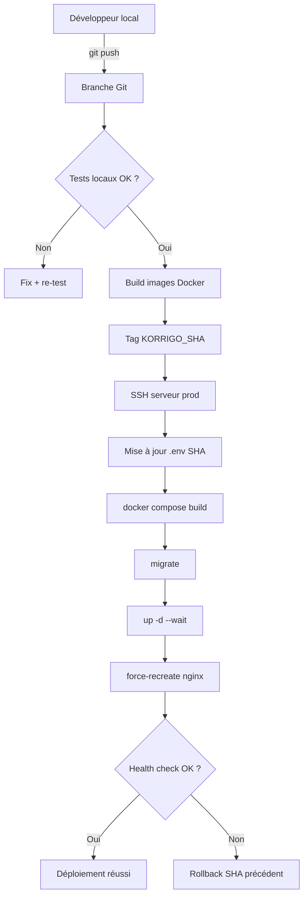

### 24.5 Workflow backup/sync

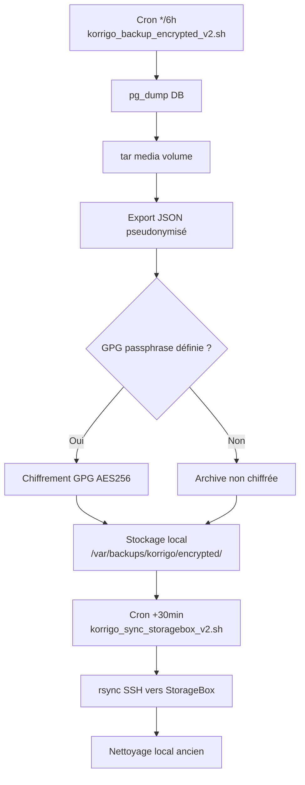

### 24.6 ADR (Architecture Decision Records)

| ADR | Titre | Statut |
|-----|-------|--------|
| ADR-001 | Student Authentication Model | Accepté |
| ADR-002 | PDF Coordinate Normalization [0,1] | Accepté |
| ADR-003 | Copy Status State Machine (3 états) | Accepté |

### 24.7 Documentation existante

Le projet dispose d'une documentation riche dans `docs/` (101 fichiers) organisée par thème :

- **technical/** : Architecture, API, DB, frontend, audits, PDF processing
- **deployment/** : Guides déploiement, runbooks production/staging
- **security/** : RGPD, conformité, permissions, audit sécurité
- **admin/** : Guides administrateur, procédures opérationnelles
- **users/** : Guides enseignant, élève, secrétariat
- **legal/** : Politique confidentialité, CGU, charte, formulaires consentement
- **decisions/** : ADR architecture
- **support/** : FAQ, dépannage
- **quality/** : CI, plans de test, audit DNB

L'index principal est dans `docs/INDEX.md`.

---

## Historique du document

| Date | Version | Auteur | Description |
|------|---------|--------|-------------|
| 2026-06-25 | 1.0 | Audit automatisé (DOC-1) | Création initiale — audit complet production |

---

*Ce document a été généré par un audit en lecture seule de la production et du dépôt local. Aucun build, déploiement, restart, SQL d'écriture, migration ou modification n'a été effectué. Les données personnelles (noms, emails, anonymous_id réels) n'ont pas été affichées.*
