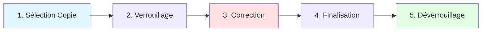

# Guide Utilisateur Enseignant - Korrigo PMF

> **Version** : 1.0.0  
> **Date** : 30 Janvier 2026  
> **Public** : Enseignants (Professeurs)  
> **Type** : Manuel Utilisateur

---

## 📋 Table des Matières

1. [Introduction](#introduction)
2. [Premiers Pas](#premiers-pas)
3. [Workflow de Correction](#workflow-de-correction)
4. [Interface de Correction](#interface-de-correction)
5. [Les Annotations](#les-annotations)
6. [La Barre de Notation](#la-barre-de-notation)
7. [Finalisation des Copies](#finalisation-des-copies)
8. [Bonnes Pratiques](#bonnes-pratiques)
9. [Résolution des Problèmes](#résolution-des-problèmes)
10. [Support et Assistance](#support-et-assistance)

---

## Introduction

### Qu'est-ce que Korrigo PMF ?

**Korrigo PMF** est une plateforme de correction numérique d'examens qui permet aux enseignants de :
- **Corriger les copies numériquement** sans impression
- **Annoter directement sur les PDF** avec des outils vectoriels
- **Noter selon un barème préétabli** avec calcul automatique du total
- **Sauvegarder automatiquement** leur travail
- **Générer des PDF finaux** pour les élèves

### Avantages de la Correction Numérique

✅ **Gain de temps** : Plus besoin de gérer les copies papier  
✅ **Flexibilité** : Corriger depuis n'importe quel ordinateur connecté  
✅ **Traçabilité** : Toutes les actions sont enregistrées  
✅ **Qualité** : Annotations claires et professionnelles  
✅ **Écologie** : Réduction de l'usage du papier

### Prérequis

Pour utiliser Korrigo PMF, vous devez :
- Disposer d'un compte enseignant (fourni par l'administration)
- Utiliser un navigateur moderne (Chrome, Firefox, Edge recommandés)
- Disposer d'une connexion internet stable
- Idéalement utiliser une souris pour plus de précision

---

## Premiers Pas

### Accès à la Plateforme

#### Étape 1 : Connexion

1. Ouvrez votre navigateur web
2. Accédez à l'URL de la plateforme (fournie par votre lycée)
   - **Exemple local** : `http://localhost:8088`
   - **Exemple production** : `https://korrigo.votre-lycee.fr`

3. Sur la page de connexion, entrez vos identifiants :
   - **Nom d'utilisateur** : fourni par l'administration (ex: `dupont.marie`)
   - **Mot de passe** : défini lors de la création de votre compte

4. Cliquez sur **« Se connecter »**

> 💡 **Astuce** : Si vous avez oublié votre mot de passe, contactez l'administrateur système de votre lycée.

#### Étape 2 : Tableau de Bord

Une fois connecté, vous accédez à votre **tableau de bord enseignant** qui affiche :

```
┌─────────────────────────────────────────────────────────────┐
│ 🏠 Tableau de Bord - Professeur M. DUPONT                    │
├─────────────────────────────────────────────────────────────┤
│                                                              │
│  Mes Examens                                                │
│  ┌─────────────────────────────────────────────────────┐   │
│  │ 📝 Bac Blanc Mathématiques TG - Janvier 2026        │   │
│  │    Copies à corriger : 12/25                        │   │
│  │    Copies finalisées : 13/25                        │   │
│  │    [Accéder aux copies]                             │   │
│  └─────────────────────────────────────────────────────┘   │
│                                                              │
│  ┌─────────────────────────────────────────────────────┐   │
│  │ 📝 Contrôle Continu Physique 1ère - Janvier 2026    │   │
│  │    Copies à corriger : 0/30                         │   │
│  │    Copies finalisées : 30/30                        │   │
│  │    [Accéder aux copies]                             │   │
│  └─────────────────────────────────────────────────────┘   │
│                                                              │
└──────────────────────────────────────────────────────────────┘
```

### Navigation Principale

Les éléments de navigation disponibles :

| Élément | Description |
|---------|-------------|
| **🏠 Accueil** | Retour au tableau de bord |
| **📝 Examens** | Liste de tous vos examens |
| **👤 Mon Profil** | Informations personnelles |
| **⚙️ Paramètres** | Préférences utilisateur |
| **🚪 Déconnexion** | Sortie sécurisée |

---

## Workflow de Correction

### Vue d'Ensemble du Processus

Le processus de correction se déroule en **5 étapes** :



### Étape 1 : Sélection de la Copie

#### Accéder aux Copies

1. Depuis votre **tableau de bord**, cliquez sur **« Accéder aux copies »** pour l'examen souhaité
2. Vous voyez la liste des copies avec leur statut :

| Statut | Signification | Action Possible |
|--------|---------------|-----------------|
| **🟢 PRÊT** | Copie identifiée, prête à corriger | Verrouiller et corriger |
| **🔒 VERROUILLÉE** | En cours de correction par vous | Continuer la correction |
| **🔴 VERROUILLÉE (autre)** | En cours de correction par un collègue | Attendre |
| **✅ CORRIGÉE** | Correction terminée | Consultation uniquement |

#### Liste des Copies

```
┌──────────────────────────────────────────────────────────────┐
│ Copies - Bac Blanc Mathématiques TG - Janvier 2026          │
├──────────────────────────────────────────────────────────────┤
│                                                              │
│  Filtre : [ Toutes ▼ ]  [ PRÊT ▼ ]  [ VERROUILLÉE ▼ ]      │
│                                                              │
│  ┌────────────────────────────────────────────────────┐     │
│  │ 📄 Copie A3F7B2E1                                   │     │
│  │    Statut : 🟢 PRÊT                                │     │
│  │    Pages : 4                                       │     │
│  │    [Verrouiller et corriger]                       │     │
│  └────────────────────────────────────────────────────┘     │
│                                                              │
│  ┌────────────────────────────────────────────────────┐     │
│  │ 📄 Copie B4C8D3F2                                   │     │
│  │    Statut : 🔒 VERROUILLÉE par vous                │     │
│  │    Annotations : 12                                │     │
│  │    Score : 12.5/20                                 │     │
│  │    [Continuer la correction]                       │     │
│  └────────────────────────────────────────────────────┘     │
│                                                              │
└──────────────────────────────────────────────────────────────┘
```

### Étape 2 : Verrouillage de la Copie

#### Pourquoi le Verrouillage ?

Le système de **verrouillage** (lock) garantit qu'**une seule personne** corrige une copie à la fois, évitant :
- ❌ Les conflits de correction
- ❌ La perte de données
- ❌ Les duplications de travail

#### Comment Verrouiller une Copie ?

1. Cliquez sur **« Verrouiller et corriger »** sur une copie **PRÊT**
2. Le système vérifie la disponibilité :
   - ✅ **Succès** : La copie passe en statut **VERROUILLÉE par vous**
   - ❌ **Échec** : Message « Copie déjà verrouillée par [Nom] »

3. Vous êtes automatiquement redirigé vers l'**interface de correction**

> ⚠️ **Important** : Le verrouillage expire après **30 minutes d'inactivité**. Un mécanisme de "heartbeat" prolonge automatiquement le verrouillage tant que vous travaillez.

#### Verrouillage Déjà Actif

Si vous fermez votre navigateur puis revenez, vous pouvez **reprendre** votre correction :
- Cliquez sur **« Continuer la correction »**
- Vos annotations sont **automatiquement restaurées**

---

## Interface de Correction

### Vue Générale

L'interface de correction est divisée en **deux zones principales** :

```
┌──────────────────────────────────────────────────────────────┐
│ Copie A3F7B2E1 - Bac Blanc Maths TG                         │
├────────────────────────────┬─────────────────────────────────┤
│                            │                                 │
│                            │  📊 Barème                      │
│   📄 Visualiseur PDF       │  ┌────────────────────────┐    │
│                            │  │ ☐ Ex1 (10 pts)         │    │
│   [PDF de la copie]        │  │   ☐ Q1.a (3 pts) [/3]  │    │
│                            │  │   ☐ Q1.b (7 pts) [/7]  │    │
│   Page 1/4                 │  │                        │    │
│                            │  │ ☐ Ex2 (8 pts)          │    │
│   🛠️ Outils                 │  │   ☐ Q2.a (4 pts) [/4]  │    │
│   ✏️ Commentaire            │  │   ☐ Q2.b (4 pts) [/4]  │    │
│   🟨 Surligner             │  │                        │    │
│   ❌ Erreur                 │  │ ☐ Ex3 (2 pts)          │    │
│   ⭐ Bonus                  │  │                        │    │
│                            │  │ Total: 0/20            │    │
│                            │  └────────────────────────┘    │
│                            │                                 │
│                            │  [💾 Sauvegarder] [✅ Finaliser]│
│                            │                                 │
└────────────────────────────┴─────────────────────────────────┘
```

### Zone de Gauche : Visualiseur PDF

#### Fonctionnalités

| Fonction | Description | Raccourci |
|----------|-------------|-----------|
| **Zoom** | Ajuster la taille d'affichage | `Ctrl + / Ctrl -` |
| **Navigation** | Passer à la page suivante/précédente | `← →` |
| **Défilement** | Faire défiler la page | `Molette` |
| **Rotation** | Faire pivoter le PDF (si besoin) | Bouton rotation |

#### Navigation entre Pages

```
┌──────────────────────────────────────┐
│  ◀️ Précédent   Page 1/4   Suivant ▶️ │
└──────────────────────────────────────┘
```

> 💡 **Astuce** : Utilisez les **flèches du clavier** pour naviguer rapidement entre les pages.

### Zone de Droite : Barre de Notation

La barre de notation affiche :
1. **Le barème** : Structure hiérarchique des exercices et questions
2. **Les cases à cocher** : Pour marquer les questions traitées
3. **Les champs de score** : Pour saisir les points obtenus
4. **Le total** : Calcul automatique de la note finale

Voir section [La Barre de Notation](#la-barre-de-notation) pour plus de détails.

---

## Les Annotations

### Types d'Annotations Disponibles

Korrigo PMF propose **4 types d'annotations** :

| Type | Icône | Couleur | Usage | Score |
|------|-------|---------|-------|-------|
| **Commentaire** | 💬 | Rouge | Remarque générale, explication | Variable |
| **Surligner** | 🟨 | Jaune | Mettre en évidence un passage | 0 |
| **Erreur** | ❌ | Rouge | Signaler une erreur | Négatif |
| **Bonus** | ⭐ | Vert | Récompenser un bonus | Positif |

### 1. Annotation « Commentaire »

#### Usage

Utilisée pour :
- Ajouter des remarques pédagogiques
- Expliquer une erreur
- Féliciter un raisonnement
- Donner des conseils

#### Comment l'Utiliser

1. Cliquez sur **✏️ Commentaire** dans la barre d'outils
2. Cliquez sur le PDF à l'endroit souhaité
3. Une zone de texte apparaît :

```
┌──────────────────────────────────────┐
│ 💬 Commentaire                        │
├──────────────────────────────────────┤
│ [Saisissez votre commentaire ici]    │
│                                      │
│                                      │
│ Points : [___] (optionnel)           │
│                                      │
│ [Annuler]  [Valider]                 │
└──────────────────────────────────────┘
```

4. Rédigez votre commentaire
5. (Optionnel) Saisissez des **points** (positifs ou négatifs)
6. Cliquez sur **Valider**

#### Exemples

| Situation | Commentaire | Points |
|-----------|-------------|--------|
| Erreur de calcul | "Erreur de signe à la ligne 3" | -0.5 |
| Bonne méthode | "Excellent raisonnement !" | +0.5 |
| Rappel | "Attention aux unités" | 0 |

### 2. Annotation « Surligner »

#### Usage

Utilisée pour :
- Mettre en évidence un passage important
- Signaler une partie à relire
- Marquer une zone problématique

#### Comment l'Utiliser

1. Cliquez sur **🟨 Surligner**
2. Cliquez et **maintenez** le bouton de la souris
3. **Faites glisser** pour dessiner la zone de surlignage
4. Relâchez le bouton
5. L'annotation est créée automatiquement

> 💡 **Astuce** : Le surlignage n'affecte pas le score (0 points par défaut).

### 3. Annotation « Erreur »

#### Usage

Utilisée pour :
- Signaler une erreur factuelle
- Retirer des points pour une faute
- Marquer un passage incorrect

#### Comment l'Utiliser

1. Cliquez sur **❌ Erreur**
2. Cliquez sur le PDF à l'emplacement de l'erreur
3. Une boîte de dialogue apparaît :

```
┌──────────────────────────────────────┐
│ ❌ Erreur                              │
├──────────────────────────────────────┤
│ Commentaire (optionnel) :            │
│ [Erreur de méthode]                  │
│                                      │
│ Points retirés : [-1.0]              │
│                                      │
│ [Annuler]  [Valider]                 │
└──────────────────────────────────────┘
```

4. (Optionnel) Ajoutez un commentaire explicatif
5. Saisissez les **points retirés** (nombre négatif)
6. Cliquez sur **Valider**

> ⚠️ **Attention** : Les points doivent être **négatifs** (ex: `-1`, `-0.5`).

### 4. Annotation « Bonus »

#### Usage

Utilisée pour :
- Récompenser une initiative
- Ajouter des points bonus
- Valoriser une réponse exceptionnelle

#### Comment l'Utiliser

1. Cliquez sur **⭐ Bonus**
2. Cliquez sur le PDF à l'emplacement du bonus
3. Une boîte de dialogue apparaît :

```
┌──────────────────────────────────────┐
│ ⭐ Bonus                               │
├──────────────────────────────────────┤
│ Commentaire (optionnel) :            │
│ [Excellente initiative !]            │
│                                      │
│ Points bonus : [+0.5]                │
│                                      │
│ [Annuler]  [Valider]                 │
└──────────────────────────────────────┘
```

4. (Optionnel) Ajoutez un commentaire
5. Saisissez les **points bonus** (nombre positif)
6. Cliquez sur **Valider**

> 💡 **Astuce** : Utilisez les bonus avec parcimonie pour valoriser l'excellence.

### Modification et Suppression d'Annotations

#### Modifier une Annotation

1. Cliquez sur l'annotation dans le PDF
2. La boîte de dialogue se rouvre avec les valeurs actuelles
3. Modifiez le texte ou les points
4. Cliquez sur **Valider**

#### Supprimer une Annotation

1. Cliquez sur l'annotation dans le PDF
2. Cliquez sur **🗑️ Supprimer** dans la boîte de dialogue
3. Confirmez la suppression

> ⚠️ **Attention** : La suppression est **immédiate** et ne peut pas être annulée (mais la copie est sauvegardée régulièrement).

### Banque de Commentaires Personnelle

Pour gagner du temps, Korrigo PMF enregistre automatiquement vos commentaires fréquents.

#### Fonctionnement

- Chaque commentaire saisi est ajouté à votre **banque personnelle**.
- Lors de la création d'un nouveau commentaire, l'auto-complétion vous propose vos textes existants.
- Les commentaires sont classés par fréquence d'utilisation.

#### Réutiliser un Commentaire

1. Commencez à taper un texte (ex: "Att...").
2. Une liste de suggestions apparaît (ex: "Attention aux unités", "Attention à la rédaction").
3. Cliquez sur la suggestion ou utilisez les flèches pour sélectionner.
4. Le texte et la note associée (s'il y en a une) sont remplis automatiquement.

---

---

## La Barre de Notation

### Structure du Barème

Le barème est organisé de manière **hiérarchique** :

```
📊 Barème Total (20 points)
├── 📝 Exercice 1 (10 points)
│   ├── 🔹 Question 1.a (3 points)
│   └── 🔹 Question 1.b (7 points)
├── 📝 Exercice 2 (8 points)
│   ├── 🔹 Question 2.a (4 points)
│   └── 🔹 Question 2.b (4 points)
└── 📝 Exercice 3 (2 points)
```

### Attribution des Points

#### Méthode 1 : Attribution Directe

Pour chaque question :
1. Cliquez sur le **champ de score** à droite (ex: `[/3]`)
2. Saisissez le score obtenu par l'élève (ex: `2.5`)
3. Appuyez sur **Entrée** pour valider
4. Le total se met à jour automatiquement

#### Méthode 2 : Cases à Cocher (Tout ou Rien)

Pour une question à points entiers :
1. Cochez ☑️ la case si la question est **entièrement juste**
2. Le score maximum est automatiquement attribué
3. Décochez ☐ pour retirer les points

#### Exemple d'Utilisation

```
☑️ Ex1 (10 pts) [10.0/10]
  ☑️ Q1.a (3 pts) [3.0/3]    ← Coché = 3/3
  ☐  Q1.b (7 pts) [7.0/7]    ← Coché = 7/7
  
☐ Ex2 (8 pts) [4.5/8]
  ☑️ Q2.a (4 pts) [4.0/4]    ← Coché = 4/4
  ☐  Q2.b (4 pts) [0.5/4]    ← Saisie manuelle = 0.5/4

Total: 14.5/20
```

### Calcul Automatique du Total

Le système calcule automatiquement :
- **Score par exercice** : Somme des scores des questions
- **Score total** : Somme des scores de tous les exercices
- **Bonus/Malus** : Ajoutés au total final

> ✅ **Bénéfice** : Aucun risque d'erreur de calcul !

### Ajout de Bonus/Malus Global

Pour ajouter un ajustement global (non lié à une question spécifique) :
1. Utilisez une annotation **Bonus** ⭐ ou **Erreur** ❌
2. Placez-la n'importe où sur le PDF
3. Le score sera ajouté/retiré du total final

---

## Finalisation des Copies

### Pourquoi Finaliser ?

La **finalisation** d'une copie :
- ✅ **Verrouille définitivement** la correction
- ✅ **Génère le PDF final** avec toutes les annotations
- ✅ **Rend la copie accessible** aux élèves
- ✅ **Libère le verrouillage** pour vous permettre de corriger une autre copie

> ⚠️ **Attention** : Une fois finalisée, la copie **ne peut plus être modifiée** facilement (nécessite l'intervention d'un administrateur).

### Avant de Finaliser : Vérifications

Avant de cliquer sur **« Finaliser »**, assurez-vous :

| Vérification | ✓ |
|-------------|---|
| Toutes les questions du barème sont notées | ☐ |
| Les annotations sont claires et compréhensibles | ☐ |
| Le score total est cohérent | ☐ |
| Les commentaires sont professionnels | ☐ |
| Aucune annotation n'est en dehors du PDF | ☐ |

### Processus de Finalisation

#### Étape 1 : Cliquer sur « Finaliser »

1. Dans l'interface de correction, cliquez sur **✅ Finaliser** (en bas à droite)

#### Étape 2 : Confirmation

Une boîte de dialogue de confirmation apparaît :

```
┌────────────────────────────────────────────────┐
│ ⚠️ Confirmation de Finalisation                 │
├────────────────────────────────────────────────┤
│                                                │
│ Êtes-vous sûr de vouloir finaliser cette      │
│ copie ?                                       │
│                                                │
│ Score total : 14.5/20                          │
│ Annotations : 8                                │
│                                                │
│ ⚠️ Cette action ne peut pas être annulée       │
│ facilement.                                    │
│                                                │
│ [Annuler]  [Confirmer la finalisation]         │
└────────────────────────────────────────────────┘
```

#### Étape 3 : Génération du PDF

Si vous confirmez :
1. Le système calcule le **score final**
2. Les annotations sont **aplaties** sur le PDF (intégrées définitivement)
3. Un **PDF final** est généré
4. La copie passe en statut **✅ CORRIGÉE**
5. Le **verrouillage est libéré**

#### Étape 4 : Retour à la Liste

Vous êtes redirigé vers la **liste des copies**.

### Retour en Brouillon (Draft)

Si vous avez finalisé une copie par erreur, un **administrateur** peut :
- Remettre la copie en statut **BROUILLON**
- Vous permettre de la modifier à nouveau

> 📞 **Contact** : Demandez à l'administrateur système de votre lycée.

---

## Bonnes Pratiques

### Conseils de Correction

#### 1. Organisation

- ✅ **Corrigez par blocs** : Terminez toutes les copies d'un même exercice avant de passer au suivant
- ✅ **Planifiez votre temps** : Estimez 15-20 minutes par copie
- ✅ **Faites des pauses** : Toutes les 5-10 copies pour garder votre concentration

#### 2. Qualité des Annotations

- ✅ **Soyez précis** : « Erreur de signe ligne 3 » plutôt que « Erreur »
- ✅ **Soyez constructif** : « Méthode correcte, attention aux calculs » plutôt que « Faux »
- ✅ **Valorisez** : N'hésitez pas à encourager (« Bien ! », « Excellent raisonnement »)
- ❌ **Évitez** : Les annotations ambiguës ou trop courtes

#### 3. Notation

- ✅ **Cohérence** : Appliquez les mêmes critères pour toutes les copies
- ✅ **Transparence** : Expliquez les retraits de points
- ✅ **Bonus** : Récompensez les initiatives et démarches originales

#### 4. Utilisation du Système

- ✅ **Sauvegarde automatique** : Activée par défaut toutes les 30 secondes
- ✅ **Vérifiez votre connexion** : Avant de commencer une longue session
- ✅ **Déconnexion** : Pensez à vous déconnecter après utilisation

### Sauvegardes

#### Autosave Automatique

Le système **sauvegarde automatiquement** votre travail :
- ⏱️ **Fréquence** : Toutes les 30 secondes
- 💾 **Stockage** : Base de données + Navigateur (`localStorage`)
- ✅ **Indicateur** : Icône ☁️ en haut à droite

```
☁️ Dernière sauvegarde : il y a 12 secondes
```

#### Sauvegardes Manuelles

Vous pouvez forcer une sauvegarde manuelle :
1. Cliquez sur **💾 Sauvegarder** en bas de l'interface
2. Un message de confirmation apparaît : **« ✅ Sauvegardé avec succès »**

> 💡 **Astuce** : Sauvegardez manuellement avant de fermer votre navigateur ou de passer à une autre copie.

### Gestion des Interruptions

#### Fermeture Accidentelle du Navigateur

Si vous fermez accidentellement votre navigateur :
1. Reconnectez-vous à la plateforme
2. Accédez à la liste des copies
3. Cliquez sur **« Continuer la correction »** sur votre copie verrouillée
4. Vos annotations sont **automatiquement restaurées**

#### Perte de Connexion Internet

En cas de perte de connexion :
- ⚠️ **Alerte** : Un message s'affiche : « ⚠️ Connexion perdue »
- 💾 **Sauvegarde locale** : Vos annotations sont conservées dans le navigateur
- 🔄 **Reconnexion** : Une fois la connexion rétablie, cliquez sur **« Synchroniser »**

> 🔒 **Sécurité** : Le verrouillage est maintenu pendant **30 minutes** d'inactivité.

### Raccourcis Clavier

| Raccourci | Action |
|-----------|--------|
| `Ctrl + S` | Sauvegarde manuelle |
| `←` | Page précédente |
| `→` | Page suivante |
| `Ctrl + +` | Zoom avant |
| `Ctrl + -` | Zoom arrière |
| `Ctrl + 0` | Réinitialiser le zoom |
| `Échap` | Annuler l'annotation en cours |

---

## Résolution des Problèmes

### Problèmes de Connexion

#### « Nom d'utilisateur ou mot de passe incorrect »

**Causes possibles** :
- Identifiants erronés
- Majuscules/minuscules incorrectes
- Compte non créé

**Solutions** :
1. Vérifiez vos identifiants (attention à la casse)
2. Contactez l'administrateur système pour réinitialiser votre mot de passe
3. Vérifiez que votre compte a bien été créé

#### « Trop de tentatives de connexion »

**Cause** : Protection contre les attaques par force brute (5 tentatives en 15 minutes)

**Solution** :
- Attendez **15 minutes** avant de réessayer
- Contactez l'administrateur si le problème persiste

### Problèmes de Verrouillage

#### « Copie déjà verrouillée par [Nom] »

**Cause** : Un autre enseignant corrige actuellement cette copie.

**Solutions** :
1. Attendez que le collègue libère la copie
2. Si le verrouillage est bloqué (collègue parti sans finaliser) :
   - Contactez l'administrateur
   - Le verrouillage expire automatiquement après **30 minutes** d'inactivité

#### « Votre verrouillage a expiré »

**Cause** : Inactivité pendant plus de 30 minutes.

**Solutions** :
1. Cliquez sur **« Reverrouiller la copie »** si elle est toujours disponible
2. Si la copie a été verrouillée par quelqu'un d'autre, attendez qu'elle soit libérée
3. Vos annotations sont conservées et seront restaurées

### Problèmes d'Annotations

#### « Annotation non sauvegardée »

**Cause** : Perte de connexion pendant la création de l'annotation.

**Solution** :
1. Vérifiez votre connexion internet
2. Recréez l'annotation
3. Cliquez sur **💾 Sauvegarder** manuellement

#### « Le PDF ne s'affiche pas »

**Causes possibles** :
- Problème de navigateur
- PDF corrompu
- Connexion lente

**Solutions** :
1. Actualisez la page (`F5` ou `Ctrl + R`)
2. Videz le cache du navigateur
3. Essayez un autre navigateur (Chrome recommandé)
4. Contactez l'administrateur si le problème persiste

#### « Impossible de supprimer une annotation »

**Cause** : Permissions insuffisantes ou bug temporaire.

**Solutions** :
1. Vérifiez que vous êtes bien le **créateur** de l'annotation
2. Actualisez la page et réessayez
3. Contactez l'administrateur si le problème persiste

### Problèmes de Calcul de Score

#### « Le total ne se met pas à jour »

**Cause** : Bug temporaire de l'interface.

**Solutions** :
1. Actualisez la page (`F5`)
2. Vérifiez que tous les champs de score sont bien remplis
3. Sauvegardez manuellement (`Ctrl + S`)

#### « Score négatif ou incohérent »

**Cause** : Erreur de saisie ou annotations avec points négatifs excessifs.

**Solutions** :
1. Vérifiez les annotations de type **Erreur** ❌
2. Recalculez mentalement le score pour identifier l'erreur
3. Modifiez les annotations incorrectes

### Problèmes de Finalisation

#### « Impossible de finaliser la copie »

**Causes possibles** :
- Tous les champs du barème ne sont pas remplis
- Erreur serveur

**Solutions** :
1. Vérifiez que **toutes les questions** du barème ont un score
2. Sauvegardez manuellement avant de finaliser
3. Actualisez la page et réessayez
4. Contactez l'administrateur si le problème persiste

#### « PDF final non généré »

**Cause** : Erreur serveur lors de la génération du PDF.

**Solution** :
- Contactez immédiatement l'administrateur
- Ne finalisez pas d'autres copies tant que le problème n'est pas résolu

### Problèmes de Navigateur

#### Navigateurs Recommandés

| Navigateur | Version Minimum | Support |
|------------|----------------|---------|
| **Google Chrome** | 90+ | ✅ Recommandé |
| **Mozilla Firefox** | 88+ | ✅ Recommandé |
| **Microsoft Edge** | 90+ | ✅ Recommandé |
| **Safari** | 14+ | ⚠️ Partiel |
| **Internet Explorer** | Toutes | ❌ Non supporté |

#### Problèmes Connus

- **Safari** : Problèmes occasionnels avec les annotations SVG
- **Firefox** : Performances réduites sur les PDF de grande taille

**Solution** : Utilisez **Google Chrome** pour une expérience optimale.

---

## Support et Assistance

### Ressources Disponibles

#### Documentation Complémentaire

- 📄 **[Navigation UI](NAVIGATION_UI.md)** : Guide complet de l'interface
- 📄 **[FAQ](../support/FAQ.md)** : Questions fréquentes
- 📄 **[Dépannage](../support/DEPANNAGE.md)** : Guide de résolution des problèmes

#### Contact Support

**Administrateur Système du Lycée** :
- 📧 Email : `support.korrigo@votre-lycee.fr` (exemple)
- 📞 Téléphone : Extension interne (ex: 1234)
- 🏢 Bureau : Salle informatique

**Horaires d'Assistance** :
- Du lundi au vendredi : 8h00 - 18h00
- Samedi : 9h00 - 12h00 (si applicable)

### Signalement de Bugs

Si vous rencontrez un bug :

1. **Notez les détails** :
   - Date et heure
   - Action effectuée avant le bug
   - Message d'erreur (capture d'écran si possible)
   - Navigateur utilisé

2. **Signalez le bug** :
   - Par email à l'administrateur
   - Indiquez « [BUG] » dans l'objet du mail

3. **Exemple de rapport** :
```
Objet : [BUG] Annotation non sauvegardée

Bonjour,

Date : 30/01/2026 à 14h30
Navigateur : Chrome 120
Copie : A3F7B2E1 (Bac Blanc Maths)

Description :
Lors de l'ajout d'une annotation "Commentaire", j'ai cliqué sur
Valider mais l'annotation n'est pas apparue sur le PDF. Après
actualisation de la page, l'annotation n'était toujours pas présente.

Merci de votre aide.
```

### Formation et Tutoriels

**Formations Disponibles** :
- 🎓 **Session d'initiation** : 1h, organisée en début d'année
- 🎓 **Ateliers pratiques** : Sessions de 30 minutes (sur demande)
- 🎥 **Tutoriels vidéo** : Disponibles sur l'intranet du lycée (si applicable)

**Contact pour Formation** :
- Référent pédagogique : [Nom du référent]
- Email : `formation.korrigo@votre-lycee.fr` (exemple)

---

## Annexes

### Glossaire

| Terme | Définition |
|-------|------------|
| **Annotation** | Marquage vectoriel ajouté sur le PDF (commentaire, surlignage, etc.) |
| **Autosave** | Sauvegarde automatique du travail toutes les 30 secondes |
| **Barème** | Structure hiérarchique des exercices et questions avec leurs points |
| **Copie** | Examen numérisé d'un élève |
| **Finalisation** | Action de verrouiller définitivement la correction et générer le PDF final |
| **Heartbeat** | Mécanisme de maintien du verrouillage (signal envoyé toutes les 2 minutes) |
| **Lock (Verrouillage)** | Mécanisme garantissant qu'une seule personne corrige une copie à la fois |
| **PDF Final** | PDF généré après finalisation, avec annotations intégrées |
| **Score** | Note attribuée à une question, un exercice ou une copie |
| **Statut** | État de la copie (PRÊT, VERROUILLÉE, CORRIGÉE) |

### Changelog

| Version | Date | Changements |
|---------|------|-------------|
| **1.0.0** | 30/01/2026 | Version initiale du guide enseignant |

---

**© 2026 Korrigo PMF - Plateforme de Correction Numérique pour Lycées**

> 📧 **Contact** : Pour toute question, contactez l'administrateur système de votre lycée.
