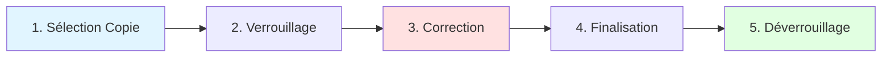

# Guide Utilisateur Enseignant - Korrigo

> **Version** : 2.1.0
> **Date** : 29 Mars 2026
> **Public** : Enseignants (Professeurs)  
> **Type** : Manuel Utilisateur

---

## 📋 Table des Matières

1. [Introduction](#introduction)
2. [Premiers Pas](#premiers-pas)
3. [Workflow de Correction](#workflow-de-correction)
4. [Interface de Correction](#interface-de-correction)
5. [Les Annotations](#les-annotations)
6. [Outil Tampon Vrai/Faux](#tampon-vraifaux-vx)
7. [La Barre de Notation](#la-barre-de-notation)
8. [Vue Scindée (Split View)](#vue-scindée-split-view)
9. [Indicateur de Progression](#indicateur-de-progression)
10. [Finalisation des Copies](#finalisation-des-copies)
11. [Correction sur Tablette (iPad / Android)](#correction-sur-tablette-ipad--android)
12. [Bonnes Pratiques](#bonnes-pratiques)
13. [Résolution des Problèmes](#résolution-des-problèmes)
14. [Support et Assistance](#support-et-assistance)

---

## Introduction

### Qu'est-ce que Korrigo ?

**Korrigo PMF** est une plateforme de correction numérique d'examens qui permet aux enseignants de :
- **Corriger les copies numériquement** sans impression
- **Annoter directement sur les PDF** avec des outils vectoriels
- **Noter selon un barème préétabli** avec calcul automatique du total
- **Sauvegarder automatiquement** leur travail
- **Tamponner rapidement** les réponses avec l'outil Vrai/Faux
- **Afficher le barème en permanence** grâce à la vue scindée
- **Générer des PDF finaux** pour les élèves

### Avantages de la Correction Numérique

✅ **Gain de temps** : Plus besoin de gérer les copies papier  
✅ **Flexibilité** : Corriger depuis n'importe quel ordinateur connecté  
✅ **Traçabilité** : Toutes les actions sont enregistrées  
✅ **Qualité** : Annotations claires et professionnelles  
✅ **Écologie** : Réduction de l'usage du papier

### Prérequis

Pour utiliser Korrigo, vous devez :
- Disposer d'un compte enseignant (fourni par l'administration)
- Utiliser un navigateur moderne (Chrome, Firefox, Edge recommandés)
- Disposer d'une connexion internet stable
- Idéalement utiliser une souris pour plus de précision (sur ordinateur)
- **Tablette** : iPad (Safari ou Chrome) ou tablette Android (Chrome) — voir [section 11](#correction-sur-tablette-ipad--android)

---

## Premiers Pas

### Accès à la Plateforme

#### Étape 1 : Connexion

1. Ouvrez votre navigateur web
2. Accédez à l'URL de la plateforme (fournie par votre lycée)
   - **Exemple local** : `http://localhost:8088`
   - **Exemple production** : `https://korrigo.votre-lycee.fr`

3. Sur la page de connexion, entrez vos identifiants :
   - **Nom d'utilisateur** : fourni par l'administration (ex: `dupont.marie`)
   - **Mot de passe** : défini lors de la création de votre compte

4. Cliquez sur **« Se connecter »**

> 💡 **Astuce** : Si vous avez oublié votre mot de passe, contactez l'administrateur système de votre lycée.

#### Étape 2 : Tableau de Bord

Une fois connecté, vous accédez à votre **tableau de bord enseignant** qui affiche :

```
┌─────────────────────────────────────────────────────────────┐
│ 🏠 Tableau de Bord - Professeur M. DUPONT                    │
├─────────────────────────────────────────────────────────────┤
│                                                              │
│  Mes Examens                                                │
│  ┌─────────────────────────────────────────────────────┐   │
│  │ 📝 Bac Blanc Mathématiques TG - Janvier 2026        │   │
│  │    Copies à corriger : 12/25                        │   │
│  │    Copies finalisées : 13/25                        │   │
│  │    [Accéder aux copies]                             │   │
│  └─────────────────────────────────────────────────────┘   │
│                                                              │
│  ┌─────────────────────────────────────────────────────┐   │
│  │ 📝 Contrôle Continu Physique 1ère - Janvier 2026    │   │
│  │    Copies à corriger : 0/30                         │   │
│  │    Copies finalisées : 30/30                        │   │
│  │    [Accéder aux copies]                             │   │
│  └─────────────────────────────────────────────────────┘   │
│                                                              │
└──────────────────────────────────────────────────────────────┘
```

### Navigation Principale

Les éléments de navigation disponibles :

| Élément | Description |
|---------|-------------|
| **🏠 Accueil** | Retour au tableau de bord |
| **📝 Examens** | Liste de tous vos examens |
| **👤 Mon Profil** | Informations personnelles |
| **⚙️ Paramètres** | Préférences utilisateur |
| **🚪 Déconnexion** | Sortie sécurisée |

---

## Workflow de Correction

### Vue d'Ensemble du Processus

Le processus de correction se déroule en **5 étapes** :


```mermaid
graph LR
    A[1. Sélection Copie] --> B[2. Verrouillage]
    B --> C[3. Correction]
    C --> D[4. Finalisation]
    D --> E[5. Déverrouillage]
    
    style A fill:#e1f5ff
    style C fill:#ffe1e1
    style E fill:#e1ffe1
```

### Étape 1 : Sélection de la Copie

#### Accéder aux Copies

1. Depuis votre **tableau de bord**, cliquez sur **« Accéder aux copies »** pour l'examen souhaité
2. Vous voyez la liste des copies avec leur statut :

| Statut | Signification | Action Possible |
|--------|---------------|-----------------|
| **🟢 PRÊT** | Copie identifiée, prête à corriger | Verrouiller et corriger |
| **🔒 VERROUILLÉE** | En cours de correction par vous | Continuer la correction |
| **🔴 VERROUILLÉE (autre)** | En cours de correction par un collègue | Attendre |
| **✅ CORRIGÉE** | Correction terminée | Consultation uniquement |

#### Liste des Copies

```
┌──────────────────────────────────────────────────────────────┐
│ Copies - Bac Blanc Mathématiques TG - Janvier 2026          │
├──────────────────────────────────────────────────────────────┤
│                                                              │
│  Filtre : [ Toutes ▼ ]  [ PRÊT ▼ ]  [ VERROUILLÉE ▼ ]      │
│                                                              │
│  ┌────────────────────────────────────────────────────┐     │
│  │ 📄 Copie A3F7B2E1                                   │     │
│  │    Statut : 🟢 PRÊT                                │     │
│  │    Pages : 4                                       │     │
│  │    [Verrouiller et corriger]                       │     │
│  └────────────────────────────────────────────────────┘     │
│                                                              │
│  ┌────────────────────────────────────────────────────┐     │
│  │ 📄 Copie B4C8D3F2                                   │     │
│  │    Statut : 🔒 VERROUILLÉE par vous                │     │
│  │    Annotations : 12                                │     │
│  │    Score : 12.5/20                                 │     │
│  │    [Continuer la correction]                       │     │
│  └────────────────────────────────────────────────────┘     │
│                                                              │
└──────────────────────────────────────────────────────────────┘
```

### Étape 2 : Verrouillage de la Copie

#### Pourquoi le Verrouillage ?

Le système de **verrouillage** (lock) garantit qu'**une seule personne** corrige une copie à la fois, évitant :
- ❌ Les conflits de correction
- ❌ La perte de données
- ❌ Les duplications de travail

#### Comment Verrouiller une Copie ?

1. Cliquez sur **« Verrouiller et corriger »** sur une copie **PRÊT**
2. Le système vérifie la disponibilité :
   - ✅ **Succès** : La copie passe en statut **VERROUILLÉE par vous**
   - ❌ **Échec** : Message « Copie déjà verrouillée par [Nom] »

3. Vous êtes automatiquement redirigé vers l'**interface de correction**

> ⚠️ **Important** : Le verrouillage expire après **30 minutes d'inactivité**. Un mécanisme de "heartbeat" prolonge automatiquement le verrouillage tant que vous travaillez.

#### Verrouillage Déjà Actif

Si vous fermez votre navigateur puis revenez, vous pouvez **reprendre** votre correction :
- Cliquez sur **« Continuer la correction »**
- Vos annotations sont **automatiquement restaurées**

---

## Interface de Correction

### Vue Générale

L'interface de correction est divisée en **deux zones principales** :

```
┌──────────────────────────────────────────────────────────────────┐
│ Barre d'outils : [← Préc.] Page 1/4 [Suiv. →] [✓V] [✗F] [◫ Split] │
├────────────────────────────┬─────────────────────────────────────┤
│                            │                                     │
│                            │  📊 Barème                          │
│   📄 Visualiseur PDF       │  ┌────────────────────────┐        │
│                            │  │ ☐ Ex1 (10 pts)         │        │
│   [PDF de la copie]        │  │   ☐ Q1.a (3 pts) [/3]  │        │
│                            │  │   ☐ Q1.b (7 pts) [/7]  │        │
│   🛠️ Outils                │  │                        │        │
│   ✏️ Commentaire            │  │ ☐ Ex2 (8 pts)          │        │
│   🟨 Surligner             │  │   ☐ Q2.a (4 pts) [/4]  │        │
│   ❌ Erreur                │  │   ☐ Q2.b (4 pts) [/4]  │        │
│   ⭐ Bonus                 │  │                        │        │
│   ✓ Vrai / ✗ Faux         │  │ ☐ Ex3 (2 pts)          │        │
│                            │  │                        │        │
│                            │  │ Total: 0/20            │        │
│                            │  └────────────────────────┘        │
│                            │                                     │
│                            │  [💾 Sauvegarder] [✅ Finaliser]    │
│                            │                                     │
└────────────────────────────┴─────────────────────────────────────┘
```

### Zone de Gauche : Visualiseur PDF

#### Fonctionnalités

| Fonction | Description | Raccourci |
|----------|-------------|-----------|
| **Zoom** | Ajuster la taille d'affichage | `Ctrl + / Ctrl -` |
| **Navigation** | Passer à la page suivante/précédente | `← →` ou `PageUp/PageDown` |
| **Défilement** | Faire défiler la page | `Molette` |
| **Rotation** | Faire pivoter le PDF (si besoin) | Bouton rotation |
| **Tampon V/X** | Marquer Vrai (✓) ou Faux (✗) rapidement | Boutons `[✓V]` `[✗F]` dans la barre d'outils |

#### Navigation entre Pages

```
┌──────────────────────────────────────┐
│  ◀️ Précédent   Page 1/4   Suivant ▶️ │
└──────────────────────────────────────┘
```

> 💡 **Astuce** : Utilisez les **flèches du clavier** pour naviguer rapidement entre les pages.

### Zone de Droite : Barre de Notation

La barre de notation affiche :
1. **Le barème** : Structure hiérarchique des exercices et questions
2. **Les cases à cocher** : Pour marquer les questions traitées
3. **Les champs de score** : Pour saisir les points obtenus
4. **Le total** : Calcul automatique de la note finale

Voir section [La Barre de Notation](#la-barre-de-notation) pour plus de détails.

---

## Les Annotations

### Types d'Annotations Disponibles

Korrigo PMF propose **6 types d'annotations** :

| Type | Icône | Couleur | Usage | Score |
|------|-------|---------|-------|-------|
| **Commentaire** | 💬 | Rouge | Remarque générale, explication | Variable |
| **Surligner** | 🟨 | Jaune | Mettre en évidence un passage | 0 |
| **Erreur** | ❌ | Rouge | Signaler une erreur | Négatif |
| **Bonus** | ⭐ | Vert | Récompenser un bonus | Positif |
| **Vrai (✓)** | ✓ | Vert | Marquer une réponse correcte | 0 |
| **Faux (✗)** | ✗ | Rouge | Marquer une réponse incorrecte | 0 |

### 1. Annotation « Commentaire »

#### Usage

Utilisée pour :
- Ajouter des remarques pédagogiques
- Expliquer une erreur
- Féliciter un raisonnement
- Donner des conseils

#### Comment l'Utiliser

1. Cliquez sur **✏️ Commentaire** dans la barre d'outils
2. Cliquez sur le PDF à l'endroit souhaité
3. Une zone de texte apparaît :

```
┌──────────────────────────────────────┐
│ 💬 Commentaire                        │
├──────────────────────────────────────┤
│ [Saisissez votre commentaire ici]    │
│                                      │
│                                      │
│ Points : [___] (optionnel)           │
│                                      │
│ [Annuler]  [Valider]                 │
└──────────────────────────────────────┘
```

4. Rédigez votre commentaire
5. (Optionnel) Saisissez des **points** (positifs ou négatifs)
6. Cliquez sur **Valider**

#### Exemples

| Situation | Commentaire | Points |
|-----------|-------------|--------|
| Erreur de calcul | "Erreur de signe à la ligne 3" | -0.5 |
| Bonne méthode | "Excellent raisonnement !" | +0.5 |
| Rappel | "Attention aux unités" | 0 |

### 2. Annotation « Surligner »

#### Usage

Utilisée pour :
- Mettre en évidence un passage important
- Signaler une partie à relire
- Marquer une zone problématique

#### Comment l'Utiliser

1. Cliquez sur **🟨 Surligner**
2. Cliquez et **maintenez** le bouton de la souris
3. **Faites glisser** pour dessiner la zone de surlignage
4. Relâchez le bouton
5. L'annotation est créée automatiquement

> 💡 **Astuce** : Le surlignage n'affecte pas le score (0 points par défaut).

### 3. Annotation « Erreur »

#### Usage

Utilisée pour :
- Signaler une erreur factuelle
- Retirer des points pour une faute
- Marquer un passage incorrect

#### Comment l'Utiliser

1. Cliquez sur **❌ Erreur**
2. Cliquez sur le PDF à l'emplacement de l'erreur
3. Une boîte de dialogue apparaît :

```
┌──────────────────────────────────────┐
│ ❌ Erreur                              │
├──────────────────────────────────────┤
│ Commentaire (optionnel) :            │
│ [Erreur de méthode]                  │
│                                      │
│ Points retirés : [-1.0]              │
│                                      │
│ [Annuler]  [Valider]                 │
└──────────────────────────────────────┘
```

4. (Optionnel) Ajoutez un commentaire explicatif
5. Saisissez les **points retirés** (nombre négatif)
6. Cliquez sur **Valider**

> ⚠️ **Attention** : Les points doivent être **négatifs** (ex: `-1`, `-0.5`).

### 4. Annotation « Bonus »

#### Usage

Utilisée pour :
- Récompenser une initiative
- Ajouter des points bonus
- Valoriser une réponse exceptionnelle

#### Comment l'Utiliser

1. Cliquez sur **⭐ Bonus**
2. Cliquez sur le PDF à l'emplacement du bonus
3. Une boîte de dialogue apparaît :

```
┌──────────────────────────────────────┐
│ ⭐ Bonus                               │
├──────────────────────────────────────┤
│ Commentaire (optionnel) :            │
│ [Excellente initiative !]            │
│                                      │
│ Points bonus : [+0.5]                │
│                                      │
│ [Annuler]  [Valider]                 │
└──────────────────────────────────────┘
```

4. (Optionnel) Ajoutez un commentaire
5. Saisissez les **points bonus** (nombre positif)
6. Cliquez sur **Valider**

> 💡 **Astuce** : Utilisez les bonus avec parcimonie pour valoriser l'excellence.

### 5. Tampon Vrai/Faux (V/✗)

#### Usage

Le tampon Vrai/Faux est l'outil le plus rapide pour corriger :
- Marquer une réponse correcte (✓ vert)
- Marquer une réponse incorrecte (✗ rouge)
- Corriger des QCM ou exercices courts

#### Mode Tampon Rapide

1. Dans la barre d'outils au-dessus de la copie, cliquez sur **✓ V** (Vrai) ou **✗ F** (Faux)
2. Le bouton s'active (fond coloré)
3. **Dessinez un rectangle** sur la copie à l'endroit voulu
4. Le tampon est créé **instantanément** sans ouvrir l'éditeur
5. Continuez à tamponner autant de fois que nécessaire
6. Cliquez à nouveau sur le bouton pour désactiver le mode

> **Astuce** : Le mode tampon reste actif tant que vous ne le désactivez pas. Idéal pour corriger rapidement une série de questions.

#### Rendu

- **Vrai (✓)** : Checkmark vert dans un rectangle léger
- **Faux (✗)** : Croix rouge dans un rectangle léger
- Les tampons apparaissent sur la copie et dans le PDF final remis à l'élève

### Modification et Suppression d'Annotations

#### Modifier une Annotation

1. Cliquez sur l'annotation dans le PDF
2. La boîte de dialogue se rouvre avec les valeurs actuelles
3. Modifiez le texte ou les points
4. Cliquez sur **Valider**

#### Supprimer une Annotation

1. Cliquez sur l'annotation dans le PDF
2. Cliquez sur **🗑️ Supprimer** dans la boîte de dialogue
3. Confirmez la suppression

> ⚠️ **Attention** : La suppression est **immédiate** et ne peut pas être annulée (mais la copie est sauvegardée régulièrement).

### Banque de Commentaires Personnelle

Pour gagner du temps, Korrigo enregistre automatiquement vos commentaires fréquents.

#### Fonctionnement

- Chaque commentaire saisi est ajouté à votre **banque personnelle**.
- Lors de la création d'un nouveau commentaire, l'auto-complétion vous propose vos textes existants.
- Les commentaires sont classés par fréquence d'utilisation.

#### Réutiliser un Commentaire

1. Commencez à taper un texte (ex: "Att...").
2. Une liste de suggestions apparaît (ex: "Attention aux unités", "Attention à la rédaction").
3. Cliquez sur la suggestion ou utilisez les flèches pour sélectionner.
4. Le texte et la note associée (s'il y en a une) sont remplis automatiquement.

---

---

## La Barre de Notation

### Structure du Barème

Le barème est organisé de manière **hiérarchique** :

```
📊 Barème Total (20 points)
├── 📝 Exercice 1 (10 points)
│   ├── 🔹 Question 1.a (3 points)
│   └── 🔹 Question 1.b (7 points)
├── 📝 Exercice 2 (8 points)
│   ├── 🔹 Question 2.a (4 points)
│   └── 🔹 Question 2.b (4 points)
└── 📝 Exercice 3 (2 points)
```

### Attribution des Points

#### Méthode 1 : Attribution Directe

Pour chaque question :
1. Cliquez sur le **champ de score** à droite (ex: `[/3]`)
2. Saisissez le score obtenu par l'élève (ex: `2.5`)
3. Appuyez sur **Entrée** pour valider
4. Le total se met à jour automatiquement

#### Méthode 2 : Cases à Cocher (Tout ou Rien)

Pour une question à points entiers :
1. Cochez ☑️ la case si la question est **entièrement juste**
2. Le score maximum est automatiquement attribué
3. Décochez ☐ pour retirer les points

#### Exemple d'Utilisation

```
☑️ Ex1 (10 pts) [10.0/10]
  ☑️ Q1.a (3 pts) [3.0/3]    ← Coché = 3/3
  ☐  Q1.b (7 pts) [7.0/7]    ← Coché = 7/7
  
☐ Ex2 (8 pts) [4.5/8]
  ☑️ Q2.a (4 pts) [4.0/4]    ← Coché = 4/4
  ☐  Q2.b (4 pts) [0.5/4]    ← Saisie manuelle = 0.5/4

Total: 14.5/20
```

### Calcul Automatique du Total

Le système calcule automatiquement :
- **Score par exercice** : Somme des scores des questions
- **Score total** : Somme des scores de tous les exercices
- **Bonus/Malus** : Ajoutés au total final

> ✅ **Bénéfice** : Aucun risque d'erreur de calcul !

### Ajout de Bonus/Malus Global

Pour ajouter un ajustement global (non lié à une question spécifique) :
1. Utilisez une annotation **Bonus** ⭐ ou **Erreur** ❌
2. Placez-la n'importe où sur le PDF
3. Le score sera ajouté/retiré du total final

---

## Vue Scindée (Split View)

### Le Problème Résolu

Lors du premier déploiement, plusieurs correcteurs ont signalé la difficulté d'alterner entre le panneau d'annotations et le barème. La vue scindée résout ce problème.

### Activer la Vue Scindée

1. Dans la barre d'outils, cliquez sur le bouton **◫ Split**
2. Le barème s'affiche en permanence à droite de la copie, à côté du panneau d'inspection
3. Vous pouvez noter les questions **tout en voyant la copie et en annotant**

### Disposition de l'Écran en Mode Split

```
┌──────────────────────────────────────────────────────────────────┐
│ Barre d'outils : [← Préc.] Page 2/4 [Suiv. →] [✓V] [✗F] [◫ Split] │
├──────────────────┬──────────────────┬────────────────────────────┤
│                  │                  │ Panneau Inspection         │
│  Copie PDF       │  Barème (split)  │ (Annotations / Historique) │
│  + Annotations   │  Notes + Remarques│                           │
│                  │  Total: 14.5/20  │                            │
└──────────────────┴──────────────────┴────────────────────────────┘
```

### Avantages

- Plus besoin d'alterner entre onglets Annotations et Barème
- Visualisation simultanée de la copie, du barème et des annotations
- Le panneau barème en split est redimensionnable
- La position de scroll du barème est toujours préservée

---

## Indicateur de Progression

### Vue d'Ensemble

L'indicateur de progression vous permet de suivre en temps réel l'avancement de la correction pour chaque examen.

### Informations Affichées

- **Nombre de copies corrigées** par rapport au total
- **Barre de progression visuelle** avec pourcentage
- **Copies restantes** à corriger
- **Temps moyen estimé** par copie (basé sur votre historique)

### Où le Trouver

L'indicateur de progression est visible :
- Sur le **tableau de bord** pour chaque examen
- Dans la **liste des copies** en haut de page
- Dans la **barre d'outils** de l'interface de correction (copie actuelle / total)

> **Astuce** : Utilisez l'indicateur de progression pour planifier vos sessions de correction et estimer le temps restant.

---

## Finalisation des Copies

### Pourquoi Finaliser ?

La **finalisation** d'une copie :
- ✅ **Verrouille définitivement** la correction
- ✅ **Génère le PDF final** avec toutes les annotations
- ✅ **Rend la copie accessible** aux élèves
- ✅ **Libère le verrouillage** pour vous permettre de corriger une autre copie

> ⚠️ **Attention** : Une fois finalisée, la copie **ne peut plus être modifiée** facilement (nécessite l'intervention d'un administrateur).

### Avant de Finaliser : Vérifications

Avant de cliquer sur **« Finaliser »**, assurez-vous :

| Vérification | ✓ |
|-------------|---|
| Toutes les questions du barème sont notées | ☐ |
| Les annotations sont claires et compréhensibles | ☐ |
| Le score total est cohérent | ☐ |
| Les commentaires sont professionnels | ☐ |
| Aucune annotation n'est en dehors du PDF | ☐ |

### Processus de Finalisation

#### Étape 1 : Cliquer sur « Finaliser »

1. Dans l'interface de correction, cliquez sur **✅ Finaliser** (en bas à droite)

#### Étape 2 : Confirmation

Une boîte de dialogue de confirmation apparaît :

```
┌────────────────────────────────────────────────┐
│ ⚠️ Confirmation de Finalisation                 │
├────────────────────────────────────────────────┤
│                                                │
│ Êtes-vous sûr de vouloir finaliser cette      │
│ copie ?                                       │
│                                                │
│ Score total : 14.5/20                          │
│ Annotations : 8                                │
│                                                │
│ ⚠️ Cette action ne peut pas être annulée       │
│ facilement.                                    │
│                                                │
│ [Annuler]  [Confirmer la finalisation]         │
└────────────────────────────────────────────────┘
```

#### Étape 3 : Génération du PDF

Si vous confirmez :
1. Le système calcule le **score final**
2. Les annotations sont **aplaties** sur le PDF (intégrées définitivement)
3. Un **PDF final** est généré
4. La copie passe en statut **✅ CORRIGÉE**
5. Le **verrouillage est libéré**

#### Étape 4 : Retour à la Liste

Vous êtes redirigé vers la **liste des copies**.

### Retour en Brouillon (Draft)

Si vous avez finalisé une copie par erreur, un **administrateur** peut :
- Remettre la copie en statut **BROUILLON**
- Vous permettre de la modifier à nouveau

> 📞 **Contact** : Demandez à l'administrateur système de votre lycée.

---

## Correction sur Tablette (iPad / Android)

Korrigo est entièrement utilisable sur tablette. Cette section détaille les gestes tactiles et les particularités de l'interface sur écran tactile.

> Pour un guide complet et autonome, consultez aussi : **[Guide Correction Tablette](../user/GUIDE_CORRECTION_TABLETTE.md)**

### Prérequis Tablette

- **iPad** : Safari ou Chrome (version récente)
- **Android** : Chrome (version récente)
- Connexion Wi-Fi ou 4G/5G
- **Recommandation** : utilisez la tablette en **mode paysage** (horizontale) pour un confort optimal

### Connexion depuis la Tablette

1. Ouvrez le navigateur sur votre tablette
2. Allez sur **https://korrigo.labomaths.tn**
3. Entrez votre email et mot de passe
4. Appuyez sur **Connexion**

Le tableau de bord s'affiche avec la liste de vos copies assignées.

### Interface Tablette

#### Mode paysage (recommandé)

```
+----------------------------------------------------------+
|  <- Retour    COPIE-A3F2    [En cours]    [Finaliser]    |  Barre d'outils
+----------------------------------------------------------+
|  <- Prec.   Page 2/4   Suiv. ->   V  X  C  S  E  *     |  Navigation + annotations
|                        |  - [100%] +                     |  Zoom
+------------------------+---------------------------------+
|                        |  Bareme                  12/20  |
|                        |  > Partie 1           6 pts     |
|    IMAGE DE LA COPIE   |  > Partie 2          14 pts     |
|                        |    > Exercice 2     3 pts       |
|    (zone tactile       |      Q2.1  [ 0.5 ] / 0.5       |
|     des annotations)   |      Q2.2  [     ] / 0.5       |
|                        |      Remarque: ___________      |
|                        |                                 |
|                        |  Appreciation globale            |
|                        |  ____________________________   |
+------------------------+---------------------------------+
```

#### Mode portrait

La copie occupe la moitié haute de l'écran. Le panneau de barème apparait en dessous et défile verticalement.

### Gestes Tactiles

#### Navigation

| Geste | Action |
|-------|--------|
| **Balayer horizontalement** (swipe gauche) | Page suivante |
| **Balayer horizontalement** (swipe droite) | Page precedente |
| Boutons **<- Prec.** / **Suiv. ->** | Navigation page par page |

Le balayage doit etre **franchement horizontal** (plus large que haut) et depasser environ 1 cm.

#### Zoom

| Geste | Action |
|-------|--------|
| **Pincer avec 2 doigts** (ecarter) | Zoomer |
| **Pincer avec 2 doigts** (rapprocher) | Dezoomer |
| Boutons **-** / **+** | Zoom par paliers de 10% |
| Bouton **<->** | Ajuster a la largeur de l'ecran |
| Appuyer sur le pourcentage (ex: **100%**) | Revenir au zoom 100% |

Le zoom va de **30%** a **300%**.

### Annotations sur Tablette

#### Tampons Vrai / Faux

1. Appuyez sur **V** (vert) ou **X** (rouge) dans la barre d'outils
2. Appuyez sur la copie a l'endroit voulu — un tampon apparait instantanement
3. Continuez a appuyer pour poser plusieurs tampons
4. Appuyez a nouveau sur le bouton pour desactiver le mode

Un **tap simple** pose un tampon de taille fixe. Vous pouvez aussi **maintenir et glisser** pour tracer un tampon plus grand.

#### Commentaires et Surlignages

1. Activez le mode voulu (commentaire, surlignage, erreur)
2. **Tracez un rectangle** en maintenant le doigt et en glissant sur la copie
3. Un editeur s'ouvre au centre de l'ecran : choisissez le type et tapez votre texte
4. Appuyez sur **Enregistrer**

#### Banque de Commentaires

1. Appuyez sur le bouton etoile dans la barre d'outils
2. Le panneau de la banque s'ouvre
3. Appuyez sur un commentaire pour l'inserer au centre de la page courante
4. Vos commentaires sont memorises automatiquement au fil des corrections

#### Supprimer une Annotation

Appuyez sur l'annotation concernee, puis sur l'icone poubelle. Confirmez la suppression.

### Saisie des Notes sur Tablette

1. Depliez l'exercice dans le panneau de bareme (accordeon)
2. Appuyez sur le champ de note — le **clavier numerique** s'ouvre automatiquement
3. Saisissez la note (point ou virgule comme separateur decimal)
4. La note est **sauvegardee automatiquement** apres 0,8 seconde d'inactivite
5. Les champs remplis passent en **vert**

> **Astuce** : Sur iPad, si le clavier masque les champs du bas, faites defiler manuellement le panneau de bareme.

### Remarques et Appreciation

- **Remarques par question** : appuyez sur le champ "Remarque..." sous chaque note. Sauvegarde automatique apres 1 seconde.
- **Appreciation globale** : faites defiler le bareme jusqu'en bas, redigez dans le cadre jaune. **Obligatoire pour finaliser.**
- Le bouton suggestions (ampoule) propose des remarques contextualisees.

### Finalisation sur Tablette

1. Verifiez que toutes les notes sont saisies et l'appreciation redigee
2. Le bouton **Finaliser** en haut devient actif (vert)
3. Appuyez et confirmez — la copie passe en lecture seule

### Utilisation avec un Stylet

Si vous disposez d'un stylet (Apple Pencil, S Pen...) :

- **Rejet de la paume** : le systeme ignore automatiquement les touches de votre paume quand le stylet est utilise
- **Tap du stylet** : pose un tampon ou ouvre l'editeur
- **Glisser le stylet** : trace un rectangle d'annotation
- **Sans outil selectionne** : le stylet trace un rectangle (commentaire par defaut), le doigt fait defiler

### Sauvegarde et Mode Hors Ligne

| Donnee | Delai de sauvegarde |
|--------|-------------------|
| Notes | 0,8 seconde apres la derniere frappe |
| Remarques | 1 seconde |
| Appreciation | 1 seconde |
| Annotations | Immediate |

En cas de **coupure internet** :
- Un bandeau jaune indique "Hors ligne"
- Les modifications sont stockees localement dans le navigateur
- La synchronisation reprend automatiquement a la reconnexion

### Recapitulatif des Gestes

| Geste | Zone | Action |
|-------|------|--------|
| 1 doigt — balayer horizontalement | Copie | Changer de page |
| 1 doigt — glisser verticalement | Copie | Defiler (si zoome) |
| 2 doigts — pincer/ecarter | Copie | Zoom / Dezoom |
| 1 doigt — tap | Copie | Poser un tampon (si mode actif) |
| 1 doigt — maintenir et glisser | Copie | Tracer un rectangle d'annotation |
| Stylet — tap | Copie | Tampon ou annotation |
| Stylet — glisser | Copie | Rectangle d'annotation |
| Tap | Champ de note | Ouvrir le clavier numerique |

### Resolution de Problemes Tablette

| Probleme | Solution |
|----------|----------|
| La copie ne s'affiche pas | Verifiez la connexion, rechargez la page |
| Le clavier masque les champs | Faites defiler le panneau de bareme manuellement |
| Les annotations ne se posent pas | Verifiez qu'un mode est actif (bouton surligné) |
| Bouton Finaliser grise | Verifiez notes completes, total <= 20, appreciation non vide |
| Zone d'identification masquee | Normal : anonymat preserve (seul l'admin peut reveler) |
| Zoom intempestif | Evitez 2 doigts simultanement, utilisez les boutons -/+ |

---

## Bonnes Pratiques

### Conseils de Correction

#### 1. Organisation

- ✅ **Corrigez par blocs** : Terminez toutes les copies d'un même exercice avant de passer au suivant
- ✅ **Planifiez votre temps** : Estimez 15-20 minutes par copie
- ✅ **Faites des pauses** : Toutes les 5-10 copies pour garder votre concentration

#### 2. Qualité des Annotations

- ✅ **Soyez précis** : « Erreur de signe ligne 3 » plutôt que « Erreur »
- ✅ **Soyez constructif** : « Méthode correcte, attention aux calculs » plutôt que « Faux »
- ✅ **Valorisez** : N'hésitez pas à encourager (« Bien ! », « Excellent raisonnement »)
- ❌ **Évitez** : Les annotations ambiguës ou trop courtes

#### 3. Notation

- ✅ **Cohérence** : Appliquez les mêmes critères pour toutes les copies
- ✅ **Transparence** : Expliquez les retraits de points
- ✅ **Bonus** : Récompensez les initiatives et démarches originales

#### 4. Tampon Vrai/Faux et Vue Scindée

- ✅ **QCM et exercices courts** : Utilisez le tampon Vrai/Faux pour corriger rapidement les réponses binaires
- ✅ **Mode tampon** : Restez en mode tampon pour enchaîner les corrections sans cliquer à chaque fois
- ✅ **Vue scindée** : Activez le mode Split pour noter le barème tout en voyant la copie et les annotations
- ✅ **Combinaison optimale** : Utilisez le tampon V/X pour les QCM, puis la vue scindée pour les exercices rédactionnels

#### 5. Utilisation du Système

- ✅ **Sauvegarde automatique** : Activée par défaut toutes les 30 secondes
- ✅ **Vérifiez votre connexion** : Avant de commencer une longue session
- ✅ **Déconnexion** : Pensez à vous déconnecter après utilisation

### Sauvegardes

#### Autosave Automatique

Le système **sauvegarde automatiquement** votre travail :
- ⏱️ **Fréquence** : Toutes les 30 secondes
- 💾 **Stockage** : Base de données + Navigateur (`localStorage`)
- ✅ **Indicateur** : Icône ☁️ en haut à droite

```
☁️ Dernière sauvegarde : il y a 12 secondes
```

#### Sauvegardes Manuelles

Vous pouvez forcer une sauvegarde manuelle :
1. Cliquez sur **💾 Sauvegarder** en bas de l'interface
2. Un message de confirmation apparaît : **« ✅ Sauvegardé avec succès »**

> 💡 **Astuce** : Sauvegardez manuellement avant de fermer votre navigateur ou de passer à une autre copie.

### Gestion des Interruptions

#### Fermeture Accidentelle du Navigateur

Si vous fermez accidentellement votre navigateur :
1. Reconnectez-vous à la plateforme
2. Accédez à la liste des copies
3. Cliquez sur **« Continuer la correction »** sur votre copie verrouillée
4. Vos annotations sont **automatiquement restaurées**

#### Perte de Connexion Internet

En cas de perte de connexion :
- ⚠️ **Alerte** : Un message s'affiche : « ⚠️ Connexion perdue »
- 💾 **Sauvegarde locale** : Vos annotations sont conservées dans le navigateur
- 🔄 **Reconnexion** : Une fois la connexion rétablie, cliquez sur **« Synchroniser »**

> 🔒 **Sécurité** : Le verrouillage est maintenu pendant **30 minutes** d'inactivité.

### Raccourcis Clavier

| Raccourci | Action |
|-----------|--------|
| `Ctrl + S` | Sauvegarde manuelle |
| `←` | Page précédente |
| `→` | Page suivante |
| `Ctrl + +` | Zoom avant |
| `Ctrl + -` | Zoom arrière |
| `Ctrl + 0` | Réinitialiser le zoom |
| `Échap` | Annuler l'annotation en cours |

---

## Résolution des Problèmes

### Problèmes de Connexion

#### « Nom d'utilisateur ou mot de passe incorrect »

**Causes possibles** :
- Identifiants erronés
- Majuscules/minuscules incorrectes
- Compte non créé

**Solutions** :
1. Vérifiez vos identifiants (attention à la casse)
2. Contactez l'administrateur système pour réinitialiser votre mot de passe
3. Vérifiez que votre compte a bien été créé

#### « Trop de tentatives de connexion »

**Cause** : Protection contre les attaques par force brute (30 tentatives par IP en 15 minutes)

**Solution** :
- Attendez **15 minutes** avant de réessayer
- Contactez l'administrateur si le problème persiste

### Problèmes de Verrouillage

#### « Copie déjà verrouillée par [Nom] »

**Cause** : Un autre enseignant corrige actuellement cette copie.

**Solutions** :
1. Attendez que le collègue libère la copie
2. Si le verrouillage est bloqué (collègue parti sans finaliser) :
   - Contactez l'administrateur
   - Le verrouillage expire automatiquement après **30 minutes** d'inactivité

#### « Votre verrouillage a expiré »

**Cause** : Inactivité pendant plus de 30 minutes.

**Solutions** :
1. Cliquez sur **« Reverrouiller la copie »** si elle est toujours disponible
2. Si la copie a été verrouillée par quelqu'un d'autre, attendez qu'elle soit libérée
3. Vos annotations sont conservées et seront restaurées

### Problèmes d'Annotations

#### « Annotation non sauvegardée »

**Cause** : Perte de connexion pendant la création de l'annotation.

**Solution** :
1. Vérifiez votre connexion internet
2. Recréez l'annotation
3. Cliquez sur **💾 Sauvegarder** manuellement

#### « Le PDF ne s'affiche pas »

**Causes possibles** :
- Problème de navigateur
- PDF corrompu
- Connexion lente

**Solutions** :
1. Actualisez la page (`F5` ou `Ctrl + R`)
2. Videz le cache du navigateur
3. Essayez un autre navigateur (Chrome recommandé)
4. Contactez l'administrateur si le problème persiste

#### « Impossible de supprimer une annotation »

**Cause** : Permissions insuffisantes ou bug temporaire.

**Solutions** :
1. Vérifiez que vous êtes bien le **créateur** de l'annotation
2. Actualisez la page et réessayez
3. Contactez l'administrateur si le problème persiste

### Problèmes de Calcul de Score

#### « Le total ne se met pas à jour »

**Cause** : Bug temporaire de l'interface.

**Solutions** :
1. Actualisez la page (`F5`)
2. Vérifiez que tous les champs de score sont bien remplis
3. Sauvegardez manuellement (`Ctrl + S`)

#### « Score négatif ou incohérent »

**Cause** : Erreur de saisie ou annotations avec points négatifs excessifs.

**Solutions** :
1. Vérifiez les annotations de type **Erreur** ❌
2. Recalculez mentalement le score pour identifier l'erreur
3. Modifiez les annotations incorrectes

### Problèmes de Finalisation

#### « Impossible de finaliser la copie »

**Causes possibles** :
- Tous les champs du barème ne sont pas remplis
- Erreur serveur

**Solutions** :
1. Vérifiez que **toutes les questions** du barème ont un score
2. Sauvegardez manuellement avant de finaliser
3. Actualisez la page et réessayez
4. Contactez l'administrateur si le problème persiste

#### « PDF final non généré »

**Cause** : Erreur serveur lors de la génération du PDF.

**Solution** :
- Contactez immédiatement l'administrateur
- Ne finalisez pas d'autres copies tant que le problème n'est pas résolu

### Problèmes de Navigateur

#### Navigateurs Recommandés

| Navigateur | Version Minimum | Support |
|------------|----------------|---------|
| **Google Chrome** | 90+ | ✅ Recommandé |
| **Mozilla Firefox** | 88+ | ✅ Recommandé |
| **Microsoft Edge** | 90+ | ✅ Recommandé |
| **Safari** | 14+ | ✅ Supporté (iPad & Mac) |
| **Internet Explorer** | Toutes | ❌ Non supporté |

#### Problèmes Connus

- **Safari** : Pleinement fonctionnel sur iPad. Sur Mac, performances similaires à Chrome.
- **Firefox** : Performances réduites sur les PDF de grande taille

**Solution** : Utilisez **Google Chrome** ou **Safari** pour une expérience optimale.

---

## Support et Assistance

### Ressources Disponibles

#### Documentation Complémentaire

- 📄 **[Navigation UI](NAVIGATION_UI.md)** : Guide complet de l'interface
- 📄 **[FAQ](../support/FAQ.md)** : Questions fréquentes
- 📄 **[Dépannage](../support/DEPANNAGE.md)** : Guide de résolution des problèmes

#### Contact Support

**Administrateur Système du Lycée** :
- 📧 Email : `support.korrigo@votre-lycee.fr` (exemple)
- 📞 Téléphone : Extension interne (ex: 1234)
- 🏢 Bureau : Salle informatique

**Horaires d'Assistance** :
- Du lundi au vendredi : 8h00 - 18h00
- Samedi : 9h00 - 12h00 (si applicable)

### Signalement de Bugs

Si vous rencontrez un bug :

1. **Notez les détails** :
   - Date et heure
   - Action effectuée avant le bug
   - Message d'erreur (capture d'écran si possible)
   - Navigateur utilisé

2. **Signalez le bug** :
   - Par email à l'administrateur
   - Indiquez « [BUG] » dans l'objet du mail

3. **Exemple de rapport** :
```
Objet : [BUG] Annotation non sauvegardée

Bonjour,

Date : 30/01/2026 à 14h30
Navigateur : Chrome 120
Copie : A3F7B2E1 (Bac Blanc Maths)

Description :
Lors de l'ajout d'une annotation "Commentaire", j'ai cliqué sur
Valider mais l'annotation n'est pas apparue sur le PDF. Après
actualisation de la page, l'annotation n'était toujours pas présente.

Merci de votre aide.
```

### Formation et Tutoriels

**Formations Disponibles** :
- 🎓 **Session d'initiation** : 1h, organisée en début d'année
- 🎓 **Ateliers pratiques** : Sessions de 30 minutes (sur demande)
- 🎥 **Tutoriels vidéo** : Disponibles sur l'intranet du lycée (si applicable)

**Contact pour Formation** :
- Référent pédagogique : [Nom du référent]
- Email : `formation.korrigo@votre-lycee.fr` (exemple)

---

## Annexes

### Glossaire

| Terme | Définition |
|-------|------------|
| **Annotation** | Marquage vectoriel ajouté sur le PDF (commentaire, surlignage, etc.) |
| **Autosave** | Sauvegarde automatique du travail toutes les 30 secondes |
| **Barème** | Structure hiérarchique des exercices et questions avec leurs points |
| **Copie** | Examen numérisé d'un élève |
| **Finalisation** | Action de verrouiller définitivement la correction et générer le PDF final |
| **Heartbeat** | Mécanisme de maintien du verrouillage (signal envoyé toutes les 2 minutes) |
| **Lock (Verrouillage)** | Mécanisme garantissant qu'une seule personne corrige une copie à la fois |
| **PDF Final** | PDF généré après finalisation, avec annotations intégrées |
| **Score** | Note attribuée à une question, un exercice ou une copie |
| **Split View** | Mode d'affichage scindé montrant la copie, le barème et les annotations simultanément |
| **Statut** | État de la copie (PRÊT, VERROUILLÉE, CORRIGÉE) |
| **Tampon V/X** | Outil rapide pour marquer les réponses correctes (✓) ou incorrectes (✗) |

### Changelog

| Version | Date | Changements |
|---------|------|-------------|
| **2.1.0** | 29/03/2026 | Ajout section Correction sur Tablette (iPad / Android), mise à jour prérequis et support Safari |
| **2.0.0** | 23/03/2026 | Ajout outil Tampon Vrai/Faux, Vue Scindée (Split View), Indicateur de Progression |
| **1.0.0** | 30/01/2026 | Version initiale du guide enseignant |

---

**© 2026 Korrigo - Plateforme de Correction Numérique pour Lycées**

> 📧 **Contact** : Pour toute question, contactez l'administrateur système de votre lycée.
