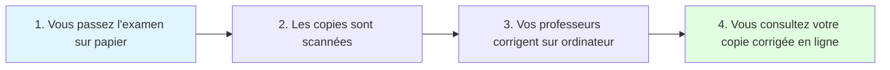

# Guide Utilisateur Élève - Korrigo PMF

> **Version** : 1.0.0  
> **Date** : 30 Janvier 2026  
> **Public** : Élèves (Lycéens)  
> **Type** : Manuel Utilisateur

---

## 📋 Table des Matières

1. [Bienvenue](#bienvenue)
2. [Qu'est-ce que Korrigo ?](#quest-ce-que-korrigo-)
3. [Accès au Portail](#accès-au-portail)
4. [Consulter Mes Copies](#consulter-mes-copies)
5. [Comprendre Ma Copie Corrigée](#comprendre-ma-copie-corrigée)
6. [Télécharger Mes Copies](#télécharger-mes-copies)
7. [Vos Droits et Confidentialité](#vos-droits-et-confidentialité)
8. [Questions Fréquentes](#questions-fréquentes)
9. [Aide et Support](#aide-et-support)

---

## Bienvenue

Bienvenue sur **Korrigo PMF**, le portail de consultation de vos copies d'examens corrigées !

Ce guide vous explique comment :
- ✅ Accéder à vos copies corrigées
- ✅ Comprendre les annotations de vos professeurs
- ✅ Télécharger vos copies en PDF
- ✅ Protéger vos données personnelles

---

## Qu'est-ce que Korrigo ?

### Présentation Simple

**Korrigo PMF** est une plateforme numérique qui permet à vos professeurs de corriger vos copies d'examens sur ordinateur, au lieu d'utiliser un stylo rouge.

### Comment ça Marche ?



### Avantages pour Vous

- 📱 **Accès en ligne** : Consultez vos copies depuis n'importe où
- 🖨️ **Téléchargement** : Sauvegardez vos copies en PDF
- 🔍 **Lisibilité** : Les annotations sont claires et professionnelles
- 🌳 **Écologie** : Moins de papier utilisé

---

## Accès au Portail

### Obtenir Vos Identifiants

Vos identifiants de connexion sont :
- **Identifiant (INE)** : Votre Identifiant National Élève (11 caractères)
  - Exemple : `1234567890A`
  - Vous pouvez le trouver sur votre **bulletin scolaire** ou demander au **secrétariat**

- **Date de naissance** : Votre date de naissance au format AAAA-MM-JJ
  - Exemple : `2005-03-15` pour le 15 mars 2005
  - Format : Année-Mois-Jour (4 chiffres, tiret, 2 chiffres, tiret, 2 chiffres)
  - Utilisez la date enregistrée dans les fichiers administratifs du lycée

### Se Connecter

#### Étape 1 : Accéder au Portail

1. Ouvrez votre navigateur web (Chrome, Firefox, Safari, Edge)
2. Accédez à l'URL du portail élève :
   - **Exemple** : `https://korrigo.votre-lycee.fr/student/login`
   - Cette adresse vous est fournie par votre lycée (affichée en classe, envoyée par email, etc.)

#### Étape 2 : Saisir Vos Identifiants

Sur la page de connexion :

```
┌─────────────────────────────────────────┐
│ 🎓 Portail Élève - Korrigo PMF          │
├─────────────────────────────────────────┤
│                                         │
│  INE (Identifiant National Élève) :    │
│  [1234567890A______________]            │
│                                         │
│  Date de naissance (AAAA-MM-JJ) :      │
│  [2005-03-15_______________]            │
│                                         │
│  [Se connecter]                         │
│                                         │
│  ❓ Identifiants oubliés ?               │
│  → Contactez le secrétariat             │
│                                         │
└─────────────────────────────────────────┘
```

1. **Saisissez votre INE** (11 caractères, chiffres et lettres)
2. **Saisissez votre date de naissance** au format AAAA-MM-JJ
   - Exemple : `2005-03-15` pour le 15 mars 2005
   - ⚠️ **Attention** : Respectez le format exact (tirets obligatoires)
3. Cliquez sur **« Se connecter »**

#### Étape 3 : Accès au Tableau de Bord

Si vos identifiants sont corrects, vous accédez à votre **tableau de bord** :

```
┌─────────────────────────────────────────────────────────────┐
│ 🏠 Mes Copies - Jean DUPONT (TG2)                            │
├─────────────────────────────────────────────────────────────┤
│                                                              │
│  📚 Mes Examens Corrigés                                    │
│  ┌─────────────────────────────────────────────────────┐   │
│  │ 📝 Bac Blanc Mathématiques TG - Janvier 2026        │   │
│  │    Note : 14.5/20                                   │   │
│  │    Corrigé le : 28/01/2026                          │   │
│  │    [Voir la copie] [Télécharger PDF]               │   │
│  └─────────────────────────────────────────────────────┘   │
│                                                              │
│  ┌─────────────────────────────────────────────────────┐   │
│  │ 📝 Contrôle Continu Physique - Janvier 2026         │   │
│  │    Note : 16/20                                     │   │
│  │    Corrigé le : 25/01/2026                          │   │
│  │    [Voir la copie] [Télécharger PDF]               │   │
│  └─────────────────────────────────────────────────────┘   │
│                                                              │
│  [🚪 Déconnexion]                                           │
└──────────────────────────────────────────────────────────────┘
```

> ✅ **Succès** : Vous êtes maintenant connecté à votre espace personnel !

---

## Consulter Mes Copies

### Tableau de Bord

Votre tableau de bord affiche la liste de tous vos **examens corrigés**.

Pour chaque examen, vous voyez :
- 📝 **Nom de l'examen** (ex: Bac Blanc Mathématiques TG)
- 📊 **Votre note** (ex: 14.5/20)
- 📅 **Date de correction** (ex: 28/01/2026)
- 🔗 **Boutons d'action** : « Voir la copie » et « Télécharger PDF »

### Voir une Copie

#### Étape 1 : Cliquer sur « Voir la copie »

1. Sur votre tableau de bord, cliquez sur **« Voir la copie »** pour l'examen souhaité
2. La copie s'affiche dans un **visualiseur PDF**

#### Étape 2 : Interface de Visualisation

```
┌──────────────────────────────────────────────────────────────┐
│ Bac Blanc Mathématiques TG - Janvier 2026                    │
│ Note : 14.5/20                                     [Fermer X] │
├──────────────────────────────────────────────────────────────┤
│                                                              │
│   [Visualiseur PDF]                                         │
│                                                              │
│   Votre copie avec les annotations de votre professeur      │
│                                                              │
│   Page 1/4                                                  │
│                                                              │
│   [Zoom -] [Zoom +] [Plein écran]                          │
│   [◀️ Précédent] [Suivant ▶️]                               │
│                                                              │
└──────────────────────────────────────────────────────────────┘
```

#### Étape 3 : Navigation dans la Copie

| Fonction | Comment faire |
|----------|---------------|
| **Changer de page** | Cliquez sur « ◀️ Précédent » ou « Suivant ▶️ » |
| **Zoomer** | Cliquez sur « Zoom + » ou utilisez `Ctrl + Molette` |
| **Dézoomer** | Cliquez sur « Zoom - » ou utilisez `Ctrl - Molette` |
| **Plein écran** | Cliquez sur « Plein écran » |
| **Quitter** | Appuyez sur `Échap` ou cliquez sur « Fermer X » |

---

## Comprendre Ma Copie Corrigée

### Types d'Annotations

Votre professeur peut ajouter **4 types d'annotations** sur votre copie :

| Type | Symbole | Couleur | Signification |
|------|---------|---------|---------------|
| **Commentaire** | 💬 | Rouge | Remarque, explication, conseil |
| **Surlignage** | 🟨 | Jaune | Passage mis en évidence |
| **Erreur** | ❌ | Rouge | Erreur signalée, points retirés |
| **Bonus** | ⭐ | Vert | Bonus, points ajoutés |

### Lire les Commentaires

#### Commentaires Pédagogiques

Les commentaires en **rouge** 💬 sont des remarques de votre professeur :
- **Explications** : « Bonne méthode, mais erreur de calcul ligne 3 »
- **Encouragements** : « Excellent raisonnement ! »
- **Conseils** : « Attention aux unités »

**Exemple sur votre copie** :
```
┌─────────────────────────────────────┐
│ Votre réponse : ...                 │
│                                     │
│ 💬 "Erreur de signe à la ligne 3"   │
│     -0.5 points                     │
└─────────────────────────────────────┘
```

#### Surlignages

Les passages **surlignés en jaune** 🟨 indiquent :
- Un passage important à relire
- Une zone problématique
- Un point à retenir

#### Erreurs Signalées

Les **croix rouges** ❌ indiquent une erreur :
- Généralement accompagnées d'un commentaire explicatif
- Points retirés indiqués (ex: `-1.0`)

**Exemple** :
```
┌─────────────────────────────────────┐
│ 2 + 2 = 5  ❌                        │
│                                     │
│ 💬 "Erreur de calcul"                │
│     -1.0 point                      │
└─────────────────────────────────────┘
```

#### Bonus

Les **étoiles vertes** ⭐ indiquent un bonus :
- Récompense pour une initiative
- Points bonus ajoutés (ex: `+0.5`)

**Exemple** :
```
┌─────────────────────────────────────┐
│ Votre démarche originale : ...      │
│                                     │
│ ⭐ "Excellente initiative !"         │
│     +0.5 point bonus                │
└─────────────────────────────────────┘
```

### Calcul de la Note

Votre **note finale** est calculée automatiquement :

```
Note = Points Obtenus + Bonus - Erreurs
```

**Exemple** :
- Exercice 1 : 8/10
- Exercice 2 : 6/8
- Bonus : +0.5
- Total : **14.5/20**

> ✅ **Transparence** : Vous voyez exactement comment votre note a été calculée grâce aux annotations.

---

## Télécharger Mes Copies

### Pourquoi Télécharger ?

Télécharger vos copies en PDF vous permet de :
- 💾 **Conserver** vos copies pour vos révisions
- 📧 **Partager** avec vos parents
- 🖨️ **Imprimer** si besoin
- 📚 **Archiver** pour l'année suivante

### Comment Télécharger

#### Méthode 1 : Depuis le Tableau de Bord

1. Sur votre tableau de bord, cliquez sur **« Télécharger PDF »** à côté de l'examen souhaité
2. Le fichier PDF se télécharge automatiquement dans votre dossier **Téléchargements**
3. Nom du fichier : `Copie_[Examen]_[Votre_Nom].pdf`
   - Exemple : `Copie_Bac_Blanc_Maths_DUPONT_Jean.pdf`

#### Méthode 2 : Depuis le Visualiseur

1. Ouvrez la copie avec **« Voir la copie »**
2. Dans le visualiseur, cherchez le bouton **« 📥 Télécharger »**
3. Le PDF se télécharge

### Contenu du PDF Téléchargé

Le PDF téléchargé contient :
- ✅ Votre copie d'examen complète
- ✅ Toutes les annotations de votre professeur (intégrées)
- ✅ Les commentaires, erreurs, bonus
- ✅ Votre nom et votre note

> 💡 **Astuce** : Le PDF est **identique** à ce que vous voyez dans le visualiseur.

---

## Vos Droits et Confidentialité

### Protection de Vos Données

Korrigo PMF respecte vos droits en matière de **protection des données personnelles** (RGPD).

#### Quelles Données sont Stockées ?

La plateforme stocke uniquement :
- 📋 **Votre nom et prénom**
- 🆔 **Votre INE** (Identifiant National Élève)
- 🎓 **Votre classe**
- 📧 **Votre email** (si fourni)
- 📝 **Vos copies d'examens** et **notes**

#### Qui Peut Voir Vos Copies ?

| Personne | Accès | Détails |
|----------|-------|---------|
| **Vous** | ✅ Oui | Vous voyez **uniquement** vos propres copies |
| **Vos professeurs** | ✅ Oui | Pour corriger vos copies |
| **Administrateurs** | ✅ Oui | Pour gérer la plateforme |
| **Autres élèves** | ❌ Non | Chaque élève ne voit **que ses copies** |
| **Parents** | ⚠️ Via vous | Si vous leur partagez le PDF |

> 🔒 **Confidentialité** : Vos copies sont **strictement personnelles**. Aucun autre élève ne peut les consulter.

### Vos Droits (RGPD)

En tant qu'élève, vous avez des **droits sur vos données** :

#### 1. Droit d'Accès

Vous pouvez demander :
- Quelles données personnelles sont stockées à votre sujet
- Comment elles sont utilisées

**Comment** : Contactez l'administrateur du lycée ou le DPO (Délégué à la Protection des Données)

#### 2. Droit de Rectification

Si vos informations sont incorrectes (ex: nom mal orthographié), vous pouvez demander leur correction.

**Comment** : Contactez le secrétariat du lycée

#### 3. Droit à l'Effacement (Droit à l'Oubli)

Sous certaines conditions, vous pouvez demander la suppression de vos données.

**⚠️ Limitation** : Les copies d'examens doivent être conservées pendant une **durée légale** (généralement 1 an).

#### 4. Droit de Portabilité

Vous pouvez demander une **copie de toutes vos données** dans un format lisible (PDF, CSV).

**Comment** : Contactez l'administrateur du lycée

### Durée de Conservation

Vos données sont conservées pendant :
- **Copies d'examens** : 1 an après l'examen (durée légale)
- **Notes** : Jusqu'à la fin de votre scolarité + 1 an
- **Données personnelles** : Supprimées après votre départ du lycée

> ℹ️ **Information** : Ces durées respectent les obligations légales françaises.

### Contact pour Questions RGPD

**Délégué à la Protection des Données (DPO)** :
- 📧 Email : `dpo@votre-lycee.fr` (exemple)
- 📞 Téléphone : [Numéro fourni par le lycée]

**Autorité de Contrôle** :
- **CNIL** (Commission Nationale de l'Informatique et des Libertés)
- Site web : https://www.cnil.fr
- Pour déposer une plainte si vos droits ne sont pas respectés

---

## Questions Fréquentes

### Connexion et Accès

#### Q1 : J'ai oublié mon INE ou ma date de naissance, que faire ?

**Réponse** : 

**Pour votre INE** (Identifiant National Élève) :
- Consultez votre **bulletin scolaire** (en haut à droite généralement)
- Consultez votre **relevé de notes**
- Demandez au **secrétariat** du lycée

**Pour votre date de naissance** :
- Utilisez le format AAAA-MM-JJ (exemple : `2005-03-15`)
- Si vous avez un doute sur la date enregistrée, contactez le **secrétariat**

#### Q2 : « Identifiants incorrects », que faire ?

**Réponse** : Vérifiez que :
- Votre INE est correct (11 caractères, chiffres et lettres)
- Votre date de naissance est au **bon format** : AAAA-MM-JJ
  - ✅ Correct : `2005-03-15`
  - ❌ Incorrect : `15/03/2005`, `15-03-2005`, `2005/03/15`
- Vous n'avez pas ajouté d'espaces avant/après
- Votre date de naissance correspond à celle dans les fichiers administratifs du lycée

Si le problème persiste, contactez le **secrétariat**.

#### Q3 : Je n'ai pas encore de copies corrigées, est-ce normal ?

**Réponse** : Oui, c'est normal si :
- Vos professeurs n'ont pas encore finalisé les corrections
- L'examen vient d'avoir lieu

Les copies apparaissent **uniquement quand elles sont corrigées et finalisées**.

### Consultation des Copies

#### Q4 : Le PDF ne s'affiche pas, que faire ?

**Réponse** : Essayez :
1. Actualisez la page (`F5` ou `Ctrl + R`)
2. Videz le cache du navigateur
3. Essayez un autre navigateur (Chrome recommandé)
4. Vérifiez votre connexion internet

Si le problème persiste, contactez le support.

#### Q5 : Puis-je voir mes copies avant qu'elles soient finalisées ?

**Réponse** : Non. Les copies sont visibles **uniquement après finalisation** par le professeur. Cela garantit que la note est définitive.

#### Q6 : Pourquoi certaines annotations n'ont pas de commentaire ?

**Réponse** : C'est normal. Les annotations de type **Surlignage** 🟨 n'ont généralement pas de commentaire. Les autres annotations peuvent avoir un commentaire ou non, selon le choix du professeur.

### Téléchargement

#### Q7 : Le téléchargement ne fonctionne pas, que faire ?

**Réponse** : Vérifiez que :
- Votre navigateur **autorise les téléchargements** (paramètres du navigateur)
- Vous avez de l'**espace disque** disponible
- Votre connexion internet est stable

Essayez avec un autre navigateur si le problème persiste.

#### Q8 : Puis-je télécharger plusieurs fois la même copie ?

**Réponse** : Oui, vous pouvez télécharger vos copies **autant de fois que vous le souhaitez**.

### Notes et Calculs

#### Q9 : Ma note affichée est différente de celle sur Pronote, pourquoi ?

**Réponse** : C'est possible si :
- La note sur Pronote a été **arrondie**
- Un **coefficient** a été appliqué dans Pronote
- Une **note bonus/malus** a été ajoutée manuellement après export

En cas de doute, demandez à votre professeur.

#### Q10 : Comment contester ma note ?

**Réponse** : Korrigo est un **outil de consultation**. Si vous souhaitez contester votre note :
1. **Parlez d'abord à votre professeur** (pendant les heures de cours ou en permanence)
2. Expliquez vos arguments avec respect
3. Si nécessaire, demandez un **rendez-vous officiel** avec le professeur et le CPE

> ⚠️ **Important** : Ne contactez **pas** le support technique pour contester une note. Le support ne peut pas modifier les notes.

### Confidentialité

#### Q11 : Mes parents peuvent-ils voir mes copies ?

**Réponse** : Vos parents n'ont **pas d'accès direct** au portail élève. Si vous souhaitez leur montrer vos copies :
- **Téléchargez** le PDF
- **Partagez-le** avec eux par email ou en personne

#### Q12 : Les autres élèves peuvent-ils voir mes notes ?

**Réponse** : **Non**, absolument pas. Chaque élève ne voit **que ses propres copies**. La plateforme garantit cette confidentialité.

---

## Aide et Support

### Problèmes Techniques

#### Contact Support Technique

Si vous rencontrez un problème technique (connexion, affichage, téléchargement) :

**Administrateur Système** :
- 📧 Email : `support.korrigo@votre-lycee.fr` (exemple)
- 🏢 Bureau : Salle informatique du lycée

**Quand contacter** :
- Du lundi au vendredi : 8h00 - 18h00
- En dehors de ces horaires, envoyez un email

#### Informations à Fournir

Lors de votre demande d'aide, indiquez :
- Votre **nom et prénom**
- Votre **classe**
- Le **problème rencontré** (décrivez précisément)
- Le **navigateur utilisé** (Chrome, Firefox, Safari, etc.)
- Une **capture d'écran** si possible

**Exemple de message** :
```
Objet : [AIDE] Impossible de télécharger ma copie

Bonjour,

Je suis Jean DUPONT, élève en TG2.

Je n'arrive pas à télécharger ma copie de Bac Blanc Maths.
Quand je clique sur "Télécharger PDF", rien ne se passe.

J'utilise Google Chrome sur Windows.

Merci de votre aide.
```

### Autres Questions

#### Questions sur les Notes

Pour toute question sur :
- La **note attribuée**
- Les **commentaires du professeur**
- Le **barème de notation**

→ Contactez directement votre **professeur** (pas le support technique).

#### Questions sur les Données Personnelles

Pour toute question sur :
- Vos **droits RGPD**
- La **confidentialité de vos données**
- La **suppression de vos données**

→ Contactez le **Délégué à la Protection des Données (DPO)** du lycée.

### Ressources Complémentaires

- 📄 **[Politique de Confidentialité](../legal/POLITIQUE_CONFIDENTIALITE.md)** : Détails sur la protection de vos données
- 📄 **[FAQ Complète](../support/FAQ.md)** : Questions fréquentes (section Élèves)
- 📄 **[Guide de Dépannage](../support/DEPANNAGE.md)** : Résolution des problèmes techniques

---

## Conseils d'Utilisation

### Meilleures Pratiques

#### 1. Consultez Régulièrement

- 📅 Connectez-vous **régulièrement** pour voir vos nouvelles copies corrigées
- 🔔 Demandez à votre lycée s'il existe un système de **notification par email** quand une copie est disponible

#### 2. Téléchargez Vos Copies

- 💾 **Téléchargez** toutes vos copies importantes (Bac Blanc, contrôles trimestriels)
- 📁 **Organisez** vos PDF dans des dossiers (par matière, par trimestre)

#### 3. Révisez avec Vos Copies

- 🔍 **Relisez** les commentaires de vos professeurs pour comprendre vos erreurs
- 📝 **Notez** les points à améliorer pour les prochains examens
- 💡 **Utilisez** vos copies pour réviser les notions mal comprises

#### 4. Sécurité

- 🔒 **Ne partagez jamais** vos identifiants avec d'autres élèves
- 🚪 **Déconnectez-vous** après chaque session (surtout sur un ordinateur partagé)
- 💻 **Évitez** d'utiliser des ordinateurs publics pour vous connecter

### Raccourcis Clavier

| Raccourci | Action |
|-----------|--------|
| `←` | Page précédente (dans le visualiseur) |
| `→` | Page suivante (dans le visualiseur) |
| `Ctrl + +` | Zoomer |
| `Ctrl + -` | Dézoomer |
| `F11` | Plein écran |
| `Échap` | Fermer le visualiseur |

---

## Glossary (Termes Techniques)

| Terme | Explication Simple |
|-------|-------------------|
| **INE** | Ton numéro d'identification unique en tant qu'élève (11 caractères) |
| **PDF** | Format de fichier pour lire des documents (comme tes copies) |
| **Télécharger** | Copier un fichier depuis internet sur ton ordinateur |
| **Annotation** | Commentaire ou marque ajoutée par ton professeur sur ta copie |
| **Visualiseur** | Fenêtre qui affiche ta copie à l'écran |
| **RGPD** | Règles qui protègent tes données personnelles |
| **Finalisation** | Moment où le professeur termine la correction et rend la copie visible |

---

## Changelog

| Version | Date | Changements |
|---------|------|-------------|
| **1.1.0** | 01/02/2026 | 🔒 **Sécurité** : Connexion avec INE + Date de naissance (au lieu de nom de famille) |
| **1.0.0** | 30/01/2026 | Version initiale du guide élève |

---

**© 2026 Korrigo PMF - Plateforme de Correction Numérique pour Lycées**

> 📧 **Contact** : Pour toute question, contactez le support de votre lycée ou consultez la [FAQ](../support/FAQ.md).

---

**Bonne consultation de vos copies ! 📚✨**
