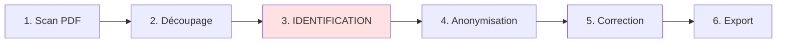

# Guide Utilisateur Secrétariat - Korrigo PMF

> **Version** : 1.0.0  
> **Date** : 30 Janvier 2026  
> **Public** : Personnel de Secrétariat (Bureau d'Identification)  
> **Type** : Manuel Utilisateur

---

## 📋 Table des Matières

1. [Introduction](#introduction)
2. [Votre Rôle dans le Processus](#votre-rôle-dans-le-processus)
3. [Accès à la Plateforme](#accès-à-la-plateforme)
4. [L'Interface d'Identification](#linterface-didentification)
5. [Identification des Copies](#identification-des-copies)
6. [Gestion de la Base Élèves](#gestion-de-la-base-élèves)
7. [Gestion des Fascicules](#gestion-des-fascicules)
8. [Contrôle Qualité](#contrôle-qualité)
9. [Cas Particuliers](#cas-particuliers)
10. [Bonnes Pratiques](#bonnes-pratiques)
11. [Résolution des Problèmes](#résolution-des-problèmes)
12. [Support et Assistance](#support-et-assistance)

---

## Introduction

### Qu'est-ce que Korrigo PMF ?

**Korrigo PMF** est une plateforme de correction numérique d'examens. Votre rôle en tant que personnel de secrétariat est **crucial** dans le processus de traitement des copies.

### Votre Mission

Vous êtes responsable de **l'identification des copies** d'examens :
- 🔍 **Identifier** chaque copie scannée
- 🔗 **Associer** chaque copie à un élève
- ✅ **Valider** l'identification pour permettre la correction
- 🔧 **Gérer** les cas particuliers (noms illisibles, fascicules manquants)

### Importance de Votre Travail

L'identification est une **étape critique** :
- ❌ **Sans identification** : Les enseignants ne peuvent pas corriger
- ⚠️ **Erreur d'identification** : La note sera attribuée au mauvais élève
- ✅ **Identification correcte** : Garantit la fiabilité du système

> 💡 **Objectif Qualité** : 100% des copies correctement identifiées

---

## Votre Rôle dans le Processus

### Workflow Complet de Correction

Voici où se situe votre intervention :



### Étapes de Votre Workflow

| Étape | Description | Durée Moyenne |
|-------|-------------|---------------|
| **1. Réception** | L'administrateur upload le PDF scanné | 5 min |
| **2. Découpage** | Le système découpe le PDF en fascicules | Automatique |
| **3. Identification** | **VOUS** identifiez chaque copie | 2h (100 copies) |
| **4. Validation** | **VOUS** validez les identifications | 10 min |
| **5. Transfert** | Le système prépare les copies pour correction | Automatique |

### Acteurs Impliqués

| Acteur | Rôle | Interaction avec Vous |
|--------|------|----------------------|
| **Administrateur** | Upload le PDF d'examen | Vous prévient quand les copies sont prêtes |
| **Vous (Secrétariat)** | Identification des copies | - |
| **Enseignants** | Correction des copies | Attendent votre validation |
| **Élèves** | Consultation des résultats | N'interagissent pas avec vous |

---

## Accès à la Plateforme

### Connexion

#### Étape 1 : Accéder à la Plateforme

1. Ouvrez votre navigateur web (Chrome ou Firefox recommandé)
2. Accédez à l'URL de la plateforme :
   - **Exemple local** : `http://localhost:8088`
   - **Exemple production** : `https://korrigo.votre-lycee.fr`

#### Étape 2 : S'Identifier

1. Sur la page de connexion, entrez vos identifiants :
   - **Nom d'utilisateur** : fourni par l'administrateur (ex: `secretariat`)
   - **Mot de passe** : défini lors de la création de votre compte

2. Cliquez sur **« Se connecter »**

> 🔒 **Sécurité** : Ne partagez jamais vos identifiants. Déconnectez-vous après chaque session.

### Tableau de Bord

Une fois connecté, vous accédez à votre tableau de bord :

```
┌─────────────────────────────────────────────────────────────┐
│ 🏠 Tableau de Bord - Secrétariat                             │
├─────────────────────────────────────────────────────────────┤
│                                                              │
│  📋 Examens en Attente d'Identification                     │
│  ┌─────────────────────────────────────────────────────┐   │
│  │ 📝 Bac Blanc Mathématiques TG - Janvier 2026        │   │
│  │    Copies à identifier : 25                         │   │
│  │    Copies identifiées : 0                           │   │
│  │    [Commencer l'identification]                     │   │
│  └─────────────────────────────────────────────────────┘   │
│                                                              │
│  📋 Examens en Cours d'Identification                       │
│  ┌─────────────────────────────────────────────────────┐   │
│  │ 📝 Contrôle Continu Physique 1ère - Janvier 2026    │   │
│  │    Copies à identifier : 12                         │   │
│  │    Copies identifiées : 18                          │   │
│  │    [Reprendre l'identification]                     │   │
│  └─────────────────────────────────────────────────────┘   │
│                                                              │
└──────────────────────────────────────────────────────────────┘
```

---

## L'Interface d'Identification

### Vue d'Ensemble

L'interface d'identification est appelée **"Video-Coding"** (terme technique signifiant "identification assistée par vidéo/image").

### Composants de l'Interface

```
┌──────────────────────────────────────────────────────────────┐
│ Identification - Bac Blanc Mathématiques TG                  │
│ Copie 1/25                                            [Quitter]│
├──────────────────────────────────────────────────────────────┤
│                                                              │
│  ┌─────────────────────────────────────────────┐           │
│  │                                             │           │
│  │   [Image de l'en-tête de la copie]         │           │
│  │   Affichage du nom manuscrit de l'élève    │           │
│  │                                             │           │
│  └─────────────────────────────────────────────┘           │
│                                                              │
│  🤖 OCR détecté : "DUPONT"                   Confiance: 85% │
│                                                              │
│  📚 Suggestions d'élèves :                                  │
│  ┌────────────────────────────────────────────────────┐    │
│  │ ○ Jean DUPONT - Classe TG2 - INE: 1234567890AB    │    │
│  │ ○ Marie DUPONT - Classe TG4 - INE: 0987654321CD   │    │
│  │ ○ Pierre DUPOND - Classe TG2 - INE: 1122334455EF  │    │
│  └────────────────────────────────────────────────────┘    │
│                                                              │
│  🔍 Recherche manuelle :                                    │
│  [Saisissez le nom ou l'INE...]              [Rechercher]  │
│                                                              │
│  ┌────────────────────────────────────────────────────┐    │
│  │ Résultats : (vide si pas de recherche)             │    │
│  └────────────────────────────────────────────────────┘    │
│                                                              │
│  [⏩ Passer]  [✅ Valider l'identification]                 │
│                                                              │
└──────────────────────────────────────────────────────────────┘
```

### Éléments Clés

| Élément | Description |
|---------|-------------|
| **Image de l'en-tête** | Affiche la partie haute de la copie avec le nom manuscrit |
| **OCR détecté** | Résultat de la reconnaissance automatique du nom |
| **Confiance OCR** | Fiabilité de la détection (0-100%) |
| **Suggestions** | Liste des élèves correspondant au nom détecté |
| **Recherche manuelle** | Barre de recherche pour trouver un élève |
| **Boutons d'action** | Valider, Passer, ou revenir en arrière |

---

## Identification des Copies

### Processus Standard

Le processus d'identification suit ces étapes :

#### Étape 1 : Observation de l'En-tête

1. **Examinez l'image** de l'en-tête de la copie
2. **Lisez le nom** manuscrit de l'élève
3. **Vérifiez la classe** si elle est indiquée

#### Étape 2 : Analyse de la Suggestion OCR

1. Le système affiche le résultat de l'**OCR** (reconnaissance automatique)
2. Regardez le **pourcentage de confiance** :
   - **> 80%** : Généralement fiable
   - **50-80%** : Vérification recommandée
   - **< 50%** : Peu fiable, vérifiez manuellement

#### Étape 3 : Sélection de l'Élève

##### Cas 1 : Suggestion Correcte (OCR Fiable)

Si l'OCR a détecté le bon nom et qu'un élève correspondant apparaît dans les suggestions :

1. **Vérifiez** que le nom correspond à l'en-tête
2. **Vérifiez la classe** (si indiquée sur la copie)
3. **Cliquez** sur le bouton radio ○ devant le nom de l'élève
4. Le bouton devient ● (sélectionné)
5. Cliquez sur **« ✅ Valider l'identification »**

**Exemple** :
```
Image : "Jean DUPONT - TG2"
OCR : "DUPONT" (Confiance: 85%)
Suggestions :
  ● Jean DUPONT - Classe TG2 - INE: 1234567890AB  ← Sélectionné
  ○ Marie DUPONT - Classe TG4 - INE: 0987654321CD
```

##### Cas 2 : Plusieurs Suggestions (Homonymes)

Si plusieurs élèves portent le même nom :

1. **Vérifiez la classe** sur la copie
2. **Vérifiez le prénom** (s'il est lisible)
3. **Sélectionnez** l'élève correspondant
4. Si vous n'êtes pas sûr :
   - Notez le numéro d'anonymat de la copie (ex: `A3F7B2E1`)
   - Contactez l'enseignant concerné pour confirmation
   - Cliquez sur **« ⏩ Passer »** pour traiter la copie plus tard

##### Cas 3 : Aucune Suggestion ou Nom Illisible

Si l'OCR n'a rien détecté ou si le nom est illisible :

1. **Essayez de lire le nom** sur l'image
2. Utilisez la **Recherche manuelle** :
   - Saisissez les premières lettres du nom
   - Ou saisissez la classe (ex: `TG2`)
   - Ou saisissez l'INE si connu
3. Cliquez sur **« Rechercher »**
4. Sélectionnez l'élève dans les résultats
5. Cliquez sur **« ✅ Valider l'identification »**

**Exemple de recherche** :
```
🔍 Recherche manuelle : "DUPA"  [Rechercher]

Résultats :
  ○ Pierre DUPARC - Classe TG1 - INE: 5566778899GH
  ○ Sophie DUPAS - Classe TG3 - INE: 9988776655IJ
```

#### Étape 4 : Validation

Une fois l'élève sélectionné :
1. Cliquez sur **« ✅ Valider l'identification »**
2. Le système enregistre l'association copie ↔ élève
3. La copie suivante s'affiche automatiquement

> ✅ **Succès** : Un message de confirmation apparaît : « ✅ Copie identifiée avec succès »

#### Étape 5 : Passage à la Copie Suivante

L'interface charge automatiquement la **copie suivante** :
```
Copie 2/25
```

Répétez le processus jusqu'à ce que toutes les copies soient identifiées.

### Fonctions Avancées

#### Fonction « Passer »

Le bouton **« ⏩ Passer »** permet de :
- **Reporter** l'identification d'une copie difficile
- **Traiter d'abord** les copies faciles
- **Revenir plus tard** aux copies problématiques

**Comment l'utiliser** :
1. Cliquez sur **« ⏩ Passer »**
2. La copie est marquée comme **« À traiter »**
3. Vous passez à la copie suivante

**Revenir aux copies passées** :
- En fin de session, un récapitulatif s'affiche :
```
✅ 20 copies identifiées
⏩ 5 copies passées

[Reprendre les copies passées]
```
- Cliquez sur **« Reprendre »** pour traiter les copies passées

#### Fonction « Retour »

Le bouton **« ← Retour »** permet de :
- Revenir à la **copie précédente**
- Corriger une erreur d'identification

> ⚠️ **Attention** : Utilisez cette fonction avec précaution pour éviter les confusions.

---

## Gestion de la Base Élèves

### Consultation de la Base Élèves

La base élèves contient les informations de tous les élèves du lycée.

#### Accès à la Base

1. Depuis le menu principal, cliquez sur **« 👥 Élèves »**
2. La liste des élèves s'affiche :

```
┌──────────────────────────────────────────────────────────────┐
│ Liste des Élèves                                             │
├──────────────────────────────────────────────────────────────┤
│  Recherche : [_________________]  [Rechercher]               │
│                                                              │
│  Filtre classe : [Toutes ▼]  [TG1] [TG2] [TG3] [TG4]        │
│                                                              │
│  ┌────────────────────────────────────────────────────┐     │
│  │ Nom : DUPONT Jean                                  │     │
│  │ Classe : TG2                                       │     │
│  │ INE : 1234567890AB                                 │     │
│  │ Email : jean.dupont@example.com                    │     │
│  └────────────────────────────────────────────────────┘     │
│                                                              │
│  [Page 1/10]  [Suivant ▶]                                   │
└──────────────────────────────────────────────────────────────┘
```

#### Informations Disponibles

Pour chaque élève :
- **Nom complet** : Nom et prénom
- **Classe** : Niveau et section (ex: TG2)
- **INE** : Identifiant National Élève (unique)
- **Email** : Adresse email (si renseignée)

### Recherche d'Élèves

#### Recherche par Nom

1. Saisissez le nom dans la barre de recherche
2. Cliquez sur **« Rechercher »**
3. Les résultats s'affichent en temps réel

**Exemples** :
- `DUPONT` : Trouve tous les DUPONT
- `DUPONT J` : Trouve Jean DUPONT, Julie DUPONT, etc.
- `DUPA` : Trouve DUPONT, DUPARC, DUPAS, etc.

#### Recherche par Classe

1. Cliquez sur un **filtre de classe** (ex: `[TG2]`)
2. Seuls les élèves de cette classe s'affichent

#### Recherche par INE

1. Saisissez l'INE dans la barre de recherche
2. Cliquez sur **« Rechercher »**
3. L'élève correspondant s'affiche (INE est unique)

### Import d'Élèves (Pronote)

Si la base élèves doit être mise à jour (nouveaux élèves, changements de classe), l'**administrateur** peut importer un fichier CSV depuis **Pronote**.

> ℹ️ **Information** : Vous n'effectuez pas cette opération vous-même, mais vous pouvez signaler à l'administrateur si des élèves sont manquants.

#### Signaler un Élève Manquant

Si vous ne trouvez pas un élève dans la base :

1. **Notez les informations** :
   - Nom et prénom (si lisibles)
   - Classe (si indiquée)
   - Numéro d'anonymat de la copie

2. **Contactez l'administrateur** :
   - Par email ou téléphone
   - Fournissez les informations notées

3. **Marquez la copie comme « Passée »** en attendant

---

## Gestion des Fascicules

### Qu'est-ce qu'un Fascicule ?

Un **fascicule** (booklet) est un **morceau de copie** issu du découpage automatique du PDF scanné.

**Concept** :
- Un examen est scanné en **un seul PDF** (ex: 100 pages A3)
- Le système découpe ce PDF en **fascicules** de 4 pages A4
- Chaque fascicule correspond (normalement) à **une copie d'élève**

### Pourquoi Gérer les Fascicules ?

Parfois, le découpage automatique n'est pas parfait :
- 📄 **Fascicules incomplets** : Copie de 3 pages au lieu de 4
- 📄 **Fascicules multiples** : Élève a utilisé 2 fascicules (8 pages)
- 📄 **Fascicules mélangés** : Pages dans le désordre

Votre rôle : **Fusionner** les fascicules pour reconstituer les copies complètes.

### Accès à l'Agrafeuse (Stapler)

#### Étape 1 : Accéder à l'Interface

1. Depuis le tableau de bord, sélectionnez un examen
2. Cliquez sur **« 🔗 Gérer les fascicules »**
3. L'interface **Agrafeuse** s'ouvre

#### Étape 2 : Interface Agrafeuse

```
┌──────────────────────────────────────────────────────────────┐
│ Agrafeuse - Bac Blanc Mathématiques TG                       │
├──────────────────────────────────────────────────────────────┤
│                                                              │
│  Fascicules Disponibles :                                   │
│  ┌────────────────────────────────────────────────────┐     │
│  │ ☐ Fascicule 1 (Pages 1-4)   [Aperçu]              │     │
│  │ ☐ Fascicule 2 (Pages 5-8)   [Aperçu]              │     │
│  │ ☐ Fascicule 3 (Pages 9-12)  [Aperçu]              │     │
│  │ ☐ Fascicule 4 (Pages 13-16) [Aperçu]              │     │
│  └────────────────────────────────────────────────────┘     │
│                                                              │
│  Sélection actuelle : 0 fascicule(s)                        │
│                                                              │
│  [Fusionner les fascicules sélectionnés]                    │
│                                                              │
└──────────────────────────────────────────────────────────────┘
```

### Fusion de Fascicules

#### Cas d'Usage 1 : Copie Incomplète (3 pages au lieu de 4)

**Problème** : Un fascicule ne contient que 3 pages car la page 4 était vierge et n'a pas été scannée.

**Solution** :
1. **Identifiez le fascicule** concerné
2. **Ne faites rien** : Procédez à l'identification normalement
3. Le système accepte les fascicules incomplets

> ℹ️ **Note** : Les fascicules incomplets sont acceptés. Seule l'identification est importante.

#### Cas d'Usage 2 : Copie sur 2 Fascicules (8 pages)

**Problème** : Un élève a utilisé 2 fascicules (8 pages) car il a beaucoup écrit.

**Solution - Fusion** :
1. Dans l'interface **Agrafeuse**, cochez les **2 fascicules** concernés :
   ```
   ☑ Fascicule 5 (Pages 17-20)
   ☑ Fascicule 6 (Pages 21-24)
   ```
2. Cliquez sur **« Fusionner les fascicules sélectionnés »**
3. Le système crée une **copie fusionnée** de 8 pages
4. Les 2 fascicules originaux sont marqués comme **utilisés**

5. Vous pouvez maintenant **identifier** cette copie fusionnée

#### Cas d'Usage 3 : Pages dans le Désordre

**Problème** : Les pages d'une copie sont dans plusieurs fascicules non consécutifs.

**Solution** :
1. Identifiez les **fascicules concernés** (vérifiez visuellement avec **Aperçu**)
2. **Cochez** tous les fascicules appartenant à la même copie
3. **Fusionnez** les fascicules
4. Le système reconstitue la copie dans l'ordre

> ⚠️ **Attention** : Assurez-vous de ne fusionner que les fascicules appartenant à **la même copie** !

### Aperçu des Fascicules

Pour vérifier le contenu d'un fascicule avant de le fusionner :

1. Cliquez sur **« [Aperçu] »** à côté du fascicule
2. Une fenêtre s'ouvre avec les images des pages
3. Vérifiez le nom de l'élève sur l'en-tête
4. Fermez l'aperçu

---

## Contrôle Qualité

### Importance du Contrôle Qualité

Le contrôle qualité garantit que :
- ✅ **Aucune copie** n'est oubliée
- ✅ **Aucune erreur** d'identification
- ✅ **Toutes les copies** sont prêtes pour correction

### Vérifications à Effectuer

#### 1. Vérification du Nombre de Copies

**Avant de commencer** :
- L'administrateur vous indique le **nombre total de copies** attendues (ex: 25 élèves = 25 copies)

**Pendant l'identification** :
- L'interface affiche : `Copie 1/25`, `Copie 2/25`, etc.

**Après l'identification** :
- Vérifiez que le nombre de copies identifiées correspond au nombre attendu
- Si différence : vérifiez les fascicules non identifiés

#### 2. Vérification des Homonymes

Si plusieurs élèves portent le même nom :
- Vérifiez soigneusement la **classe** et le **prénom**
- En cas de doute, contactez l'enseignant

#### 3. Vérification des Copies Passées

Si vous avez utilisé la fonction **« Passer »** :
- En fin de session, reprenez **toutes les copies passées**
- Ne laissez **aucune copie** non identifiée

### Rapport de Fin de Session

À la fin de votre session d'identification, un récapitulatif s'affiche :

```
┌──────────────────────────────────────────────────────────────┐
│ Rapport d'Identification                                      │
├──────────────────────────────────────────────────────────────┤
│                                                              │
│  Examen : Bac Blanc Mathématiques TG - Janvier 2026         │
│  Date : 30/01/2026 14h35                                    │
│  Opérateur : Secrétariat (compte: secretariat)              │
│                                                              │
│  ✅ Copies identifiées : 23/25                               │
│  ⏩ Copies passées : 2/25                                    │
│  ❌ Copies non identifiées : 0/25                            │
│                                                              │
│  ⚠️ Action requise : Reprendre les 2 copies passées          │
│                                                              │
│  [Reprendre]  [Valider la session]                          │
│                                                              │
└──────────────────────────────────────────────────────────────┘
```

**Actions** :
- Si copies passées : Cliquez sur **« Reprendre »**
- Si toutes les copies sont identifiées : Cliquez sur **« Valider la session »**

---

## Cas Particuliers

### Cas 1 : Nom Totalement Illisible

**Problème** : Le nom manuscrit est complètement illisible.

**Solutions** :

#### Solution 1 : Recherche par Classe

Si la classe est indiquée sur la copie :
1. Utilisez la **recherche manuelle**
2. Saisissez la classe (ex: `TG2`)
3. Parcourez la liste des élèves de cette classe
4. Comparez l'écriture avec d'autres indices (numéro de place, etc.)

#### Solution 2 : Comparaison avec Liste de Présence

Si disponible :
1. Demandez à l'enseignant la **liste de présence** de l'examen
2. Identifiez les élèves absents
3. Par élimination, trouvez l'élève correspondant

#### Solution 3 : Marquer pour Investigation

Si aucune solution :
1. Cliquez sur **« ⏩ Passer »**
2. Notez le **numéro d'anonymat** de la copie (ex: `A3F7B2E1`)
3. Contactez l'enseignant concerné
4. L'enseignant pourra identifier l'élève par l'écriture ou le contenu de la copie

### Cas 2 : Élève Absent de la Base

**Problème** : L'élève n'apparaît pas dans la base élèves.

**Causes possibles** :
- Nouvel élève non enregistré
- Erreur de saisie du nom
- Élève transféré d'un autre lycée

**Solutions** :

1. **Vérifiez l'orthographe** :
   - Essayez différentes variantes (ex: `DUPONT`, `DUPOND`, `DU PONT`)
   - Cherchez avec le prénom seul

2. **Contactez l'administrateur** :
   - Par email ou téléphone
   - Fournissez les informations de l'élève (nom, classe)
   - L'administrateur ajoutera l'élève à la base

3. **Marquez la copie comme « Passée »** en attendant

### Cas 3 : Copie Sans En-tête

**Problème** : La copie n'a pas d'en-tête (page blanche, découpage incorrect).

**Solution** :
1. Vérifiez si l'en-tête est sur une **autre page** du fascicule
2. Si oui, notez mentalement le nom
3. Identifiez la copie normalement

4. Si l'en-tête est vraiment absent :
   - Marquez la copie comme **« Passée »**
   - Contactez l'administrateur pour vérification du découpage

### Cas 4 : Doublon (Même Élève, 2 Copies)

**Problème** : Un élève a rendu 2 copies (copie de remplacement, brouillon, etc.).

**Solution** :
1. Identifiez la **première copie** normalement
2. Pour la **deuxième copie** :
   - Identifiez-la également (le système accepte les doublons)
   - **Notez** : « Copie de remplacement pour [Nom Élève] »
   - Informez l'**enseignant** concerné
   - L'enseignant décidera quelle copie corriger

### Cas 5 : Copie Anonyme (Examen Blanc)

**Problème** : L'examen est **volontairement anonyme** (pas de nom sur la copie).

**Solution** :
- Ce cas ne devrait **pas se produire** avec Korrigo PMF
- Le système génère automatiquement des **numéros d'anonymat** après identification
- Si l'examen est anonyme **dès le départ**, contactez l'administrateur

---

## Bonnes Pratiques

### Organisation du Travail

#### Planification

- ⏱️ **Estimez la durée** : Environ 1 minute par copie (100 copies = 1h40)
- 📅 **Planifiez une session dédiée** : Évitez les interruptions
- ☕ **Prévoyez des pauses** : Toutes les 30 minutes pour garder votre concentration

#### Environnement de Travail

- 🖥️ **Écran suffisamment grand** : Pour voir clairement les en-têtes
- 🖱️ **Souris** : Plus pratique que le trackpad
- 📶 **Connexion stable** : Vérifiez avant de commencer

### Méthodologie

#### Stratégie « Facile d'Abord »

1. **Premier passage** : Identifiez toutes les copies **faciles** (nom clair, OCR fiable)
2. **Deuxième passage** : Traitez les copies **passées** (noms difficiles, homonymes)
3. **Dernier passage** : Résolvez les **cas particuliers** (avec aide administrative)

> ✅ **Avantage** : Progression rapide, motivation maintenue

#### Vérification Systématique

Avant de valider chaque identification :
1. ✅ Le nom correspond à l'en-tête
2. ✅ La classe correspond (si indiquée)
3. ✅ L'INE est unique (le système empêche les doublons par défaut)

### Communication

#### Avec l'Administrateur

- 📧 **Email** : Pour les questions non urgentes
- 📞 **Téléphone** : Pour les urgences (élève manquant, problème technique)
- 📝 **Note écrite** : Pour les cas particuliers à investiguer

#### Avec les Enseignants

- 📋 **Liste de présence** : Demandez-la avant de commencer
- 🔍 **Identification difficile** : Demandez leur aide pour l'écriture

---

## Résolution des Problèmes

### Problèmes Techniques

#### « L'image de l'en-tête ne s'affiche pas »

**Causes possibles** :
- Problème de connexion
- Erreur lors du découpage du PDF

**Solutions** :
1. Actualisez la page (`F5` ou `Ctrl + R`)
2. Vérifiez votre connexion internet
3. Si le problème persiste, contactez l'administrateur

#### « Le bouton Valider ne fonctionne pas »

**Causes possibles** :
- Aucun élève sélectionné
- Bug temporaire

**Solutions** :
1. Vérifiez qu'un élève est bien **sélectionné** (bouton radio ●)
2. Actualisez la page
3. Si le problème persiste, contactez l'administrateur

#### « Erreur lors de la validation »

**Message d'erreur** : « ❌ Erreur : Impossible d'enregistrer l'identification »

**Causes possibles** :
- Perte de connexion
- Erreur serveur

**Solutions** :
1. Vérifiez votre connexion internet
2. Réessayez la validation
3. Si l'erreur persiste, notez le numéro de la copie et contactez l'administrateur

### Problèmes de Données

#### « Élève déjà assigné à une autre copie »

**Message d'erreur** : « ⚠️ Cet élève est déjà assigné à la copie A3F7B2E1 »

**Causes possibles** :
- Erreur d'identification précédente
- Véritable doublon (copie de remplacement)

**Solutions** :
1. Vérifiez l'identification de la **copie précédente** (A3F7B2E1)
2. Si erreur : Contactez l'administrateur pour **annuler** la première identification
3. Si doublon légitime : Informez l'enseignant

#### « Suggestions vides malgré un nom détecté »

**Problème** : L'OCR a détecté « DUPONT » mais aucun élève ne s'affiche dans les suggestions.

**Causes possibles** :
- Aucun élève avec ce nom dans la base
- Erreur OCR (nom incorrect)

**Solutions** :
1. Vérifiez visuellement le **nom manuscrit** sur l'en-tête
2. Essayez une **recherche manuelle** avec différentes variantes
3. Si l'élève est vraiment absent de la base, contactez l'administrateur

### Problèmes de Workflow

#### « Je ne peux plus revenir en arrière »

**Problème** : Vous avez identifié plusieurs copies et réalisé une erreur 5 copies en arrière.

**Solution** :
- Contactez l'**administrateur**
- L'administrateur peut **annuler** une identification et vous permettre de la refaire

#### « J'ai validé la session par erreur »

**Problème** : Vous avez cliqué sur « Valider la session » alors qu'il reste des copies passées.

**Solution** :
- Contactez l'**administrateur** immédiatement
- L'administrateur peut **rouvrir** la session d'identification

---

## Support et Assistance

### Ressources Disponibles

#### Documentation Complémentaire

- 📄 **[Navigation UI](NAVIGATION_UI.md)** : Guide complet de l'interface
- 📄 **[FAQ](../support/FAQ.md)** : Questions fréquentes
- 📄 **[Dépannage](../support/DEPANNAGE.md)** : Guide de résolution des problèmes

#### Contact Support

**Administrateur Système du Lycée** :
- 📧 Email : `support.korrigo@votre-lycee.fr` (exemple)
- 📞 Téléphone : Extension interne (ex: 1234)
- 🏢 Bureau : Salle informatique

**Horaires d'Assistance** :
- Du lundi au vendredi : 8h00 - 18h00
- Samedi : 9h00 - 12h00 (si applicable)

### Signalement de Bugs

Si vous rencontrez un bug :

1. **Notez les détails** :
   - Date et heure
   - Action effectuée avant le bug
   - Message d'erreur (capture d'écran si possible)
   - Numéro de copie concernée

2. **Signalez le bug** :
   - Par email à l'administrateur
   - Indiquez « [BUG] » dans l'objet du mail

3. **Exemple de rapport** :
```
Objet : [BUG] Erreur lors de la validation d'identification

Bonjour,

Date : 30/01/2026 à 10h15
Copie : Copie 12/25 (Bac Blanc Maths)

Description :
Lors de la validation de l'identification de Jean DUPONT,
j'ai cliqué sur "Valider l'identification" mais un message
d'erreur est apparu : "Erreur serveur 500".

J'ai actualisé la page et réessayé, mais le problème persiste.

Merci de votre aide.
```

---

## Annexes

### Glossaire

| Terme | Définition |
|-------|------------|
| **Agrafeuse (Stapler)** | Interface de fusion de fascicules |
| **Fascicule (Booklet)** | Morceau de copie issu du découpage du PDF (généralement 4 pages) |
| **INE** | Identifiant National Élève (unique, 11 caractères) |
| **OCR** | Reconnaissance Optique de Caractères (détection automatique du nom) |
| **Video-Coding** | Processus d'identification assistée par image |
| **Numéro d'Anonymat** | Identifiant unique de la copie (ex: A3F7B2E1) |
| **Copie Fusionnée** | Copie créée en fusionnant plusieurs fascicules |
| **Homonyme** | Élèves portant le même nom de famille |

### Raccourcis Clavier

| Raccourci | Action |
|-----------|--------|
| `Entrée` | Valider l'identification |
| `Échap` | Annuler / Retour |
| `→` | Passer à la copie suivante (après validation) |
| `←` | Retour à la copie précédente |

### Changelog

| Version | Date | Changements |
|---------|------|-------------|
| **1.0.0** | 30/01/2026 | Version initiale du guide secrétariat |

---

**© 2026 Korrigo PMF - Plateforme de Correction Numérique pour Lycées**

> 📧 **Contact** : Pour toute question, contactez l'administrateur système de votre lycée.
